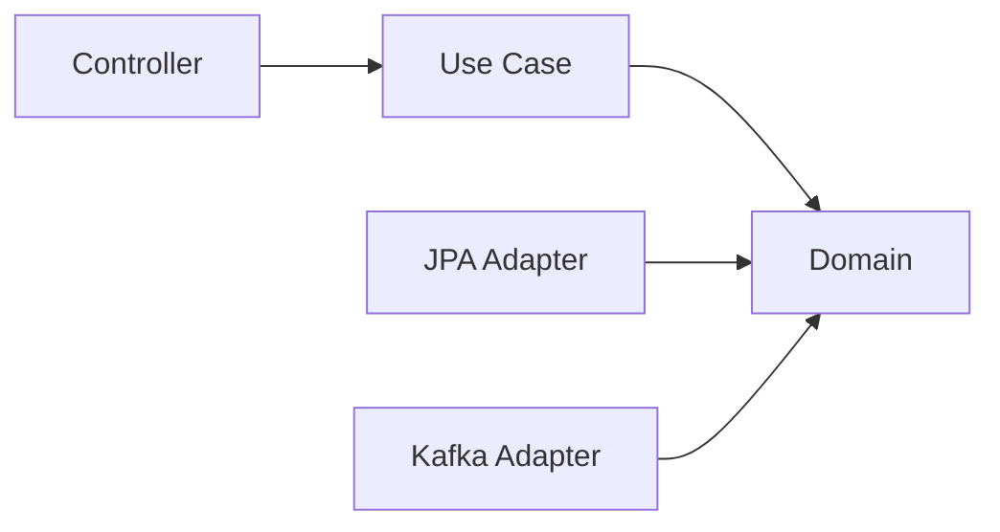

# 클린 아키텍처
---
> 클린 아키텍처(Clean Architecture)의 핵심은 바깥 기술보다 안쪽 정책이 더 오래 살아야 한다는 전제다.
>
> - domain 중심
> - 의존성 역전
> - 프레임워크 독립성
> - 테스트 용이성

## 1. 왜 클린 아키텍처가 필요한가

Spring Boot 프로젝트는 프레임워크 생산성이 높아서 도메인 규칙까지 Spring Bean에 묶이기 쉽다. 하지만 카드게임처럼 규칙이 자주 변하고 테스트가 중요한 도메인에서는 프레임워크 의존이 곧 변경 비용이 된다.

클린 아키텍처는 이 문제를 해결하기 위해 “안쪽은 정책, 바깥은 세부 구현”이라는 원칙을 둔다. DB, 웹, 메시징은 교체 가능한 바깥 요소이고, 전투 규칙과 런 진행은 오래 살아남아야 하는 안쪽 정책이다.

## 2. 의존성 규칙

클린 아키텍처의 핵심 규칙은 단순하다. 의존성은 항상 안쪽을 향해야 한다. 즉 도메인은 application이나 infrastructure를 몰라야 하고, infrastructure가 domain을 참조해야 한다.

이를 런 관리 서비스에 대입하면 다음과 같다:



## 3. 예시 구조

런 관리 서비스에서 `Run`과 `Battle`은 안쪽 원에 있다. `PlayCardUseCase`, `StartRunUseCase`는 그 바깥에서 도메인 규칙을 조합한다. Controller, Repository Adapter, Event Publisher Adapter는 가장 바깥에서 입출력을 담당한다.

이 구조의 장점은 전투 규칙 테스트에 Spring 컨텍스트가 필요 없다는 점이다. 카드 한 장의 효과 검증은 순수 Java 테스트로 충분하다.

## 4. port와 adapter를 어떻게 읽어야 하는가

클린 아키텍처에서는 안쪽 계층이 필요한 외부 기능을 인터페이스로 표현한다. 이 인터페이스가 port이고, 실제 DB나 메시지 브로커 구현이 adapter다.

예를 들면 다음과 같다:

```java
public interface SaveRunPort {
    void save(Run run);
}

public final class JpaRunAdapter implements SaveRunPort {
    @Override
    public void save(Run run) {
        // JPA 매핑 및 저장
    }
}
```

## 5. 장점과 비용

클린 아키텍처의 장점은 분명하다. 도메인 테스트가 쉬워지고, 기술 교체가 쉬워지고, 경계가 문서 없이도 코드에 드러난다.

반면 비용도 있다. 인터페이스와 매핑 코드가 늘어나고, 작은 CRUD 화면에도 구조가 무거워 보일 수 있다. 그래서 모든 기능에 같은 강도로 적용하기보다 규칙이 중요한 영역에 먼저 적용하는 것이 현실적이다.

## 6. 카드게임 도메인에 특히 잘 맞는 이유

카드게임 서버는 “카드 효과 계산”, “턴 종료 처리”, “적 의도 적용” 같은 순수 규칙이 많다. 이런 규칙은 DB나 웹 프레임워크와 직접 연결할 이유가 거의 없다.

따라서 전투 엔진을 도메인 중심으로 두고, 저장과 입출력을 바깥으로 밀어내는 클린 아키텍처가 잘 맞는다. 리플레이 시뮬레이션이나 밸런스 테스트도 같은 도메인 모델을 재사용하기 쉬워진다.

## 7. 실무 적용 결론

이 시리즈에서는 클린 아키텍처를 기본 권장안으로 본다. 다만 모든 패키지를 과도하게 추상화하기보다, `run`, `battle`, `reward`처럼 규칙이 두꺼운 모듈에 우선 적용하는 편이 좋다.

결국 중요한 것은 이름이 아니라 의존성 방향이다. Spring Boot를 쓰더라도 도메인이 프레임워크에 잡아먹히지 않게 만드는 것이 핵심이다.
