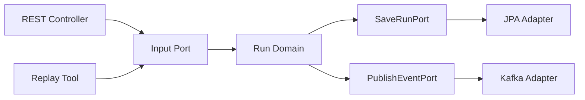

# 헥사고날 아키텍처
---
> 헥사고날 아키텍처(Hexagonal Architecture)는 애플리케이션을 “중심 로직”과 “외부와 연결되는 포트”로 나눠 생각하게 만든다.
>
> - 입력 포트
> - 출력 포트
> - 어댑터
> - 테스트 가능한 중심부

## 1. 클린 아키텍처와 무엇이 다른가

헥사고날 아키텍처와 클린 아키텍처는 같은 방향을 본다. 둘 다 도메인 중심과 의존성 역전을 강조한다. 차이는 설명의 초점이다.

클린 아키텍처가 원형 계층과 정책 중심을 강조한다면, 헥사고날 아키텍처는 “애플리케이션은 다양한 입력과 출력 포트로 둘러싸여 있다”는 관점을 더 강하게 드러낸다. Spring Boot에서는 이 표현이 특히 실용적이다.

## 2. 포트 중심으로 보면 구조가 선명해진다

런 관리 서비스에서 입력은 다양할 수 있다. REST API로 카드 사용 요청이 들어올 수도 있고, 배치나 리플레이 도구가 같은 유스케이스를 실행할 수도 있다.

이때 입력 포트는 “무엇을 할 수 있는가”를 정의한다. 출력 포트는 “외부에서 무엇이 필요한가”를 정의한다.



## 3. 입력 포트와 출력 포트 예시

다음처럼 분리하면 구조가 잘 드러난다:

```java
public interface PlayCardUseCase {
    PlayCardResult handle(PlayCardCommand command);
}

public interface PublishBattleEventPort {
    void publish(BattleEvent event);
}
```

이 구조에서는 Controller가 구체 구현이 아니라 `PlayCardUseCase`에 의존한다. Use case 구현은 저장소나 메시지 브로커 구현이 아니라 port에 의존한다.

## 4. 헥사고날 구조의 실무 장점

이 구조의 가장 큰 장점은 입출력 방식이 늘어나도 코어가 흔들리지 않는다는 점이다. 같은 전투 유스케이스를 HTTP, CLI, 리플레이, 테스트에서 공통으로 사용할 수 있다.

또한 외부 시스템이 바뀌어도 포트 계약만 유지되면 중심부는 거의 손대지 않는다. JPA를 jOOQ로 바꾸거나, Kafka를 다른 브로커로 바꿀 때 효과가 크다.

## 5. 과용하면 생기는 문제

포트를 너무 세밀하게 쪼개면 오히려 읽기 어려운 구조가 된다. 단순 조회까지 모든 것을 개별 인터페이스로 만들면 파일 수만 늘어나고 의미는 흐려진다.

그래서 다음 원칙이 유용하다:

- 유스케이스 단위 입력 포트는 명확히 둔다.
- 인프라 교체 가능성이 낮은 단순 구현은 과도하게 쪼개지 않는다.
- 도메인 규칙이 없는 단순 mapper는 포장만 하지 않는다.

## 6. 카드게임 도메인에 적용한 판단

이 도메인에서 가장 중요한 코어는 `Run`과 `Battle`이다. Controller와 DB를 바꾸더라도 카드 효과 계산은 바뀌면 안 된다. 따라서 헥사고날 아키텍처는 전투 규칙 엔진을 보호하는 구조로 읽으면 된다.

특히 리플레이 도구를 만들고 싶다면 입력 포트 분리가 큰 장점이 된다. 실제 운영 HTTP 요청 없이도 같은 유스케이스를 호출해 특정 런을 재현할 수 있기 때문이다.

## 7. Spring Boot에서의 결론

Spring Boot 프로젝트에서는 헥사고날 아키텍처를 “포트와 어댑터가 드러나는 모듈러 구조”로 구현하면 충분하다. 용어보다 중요한 것은 Controller, Repository, Message Publisher가 모두 코어 바깥에 있다는 사실이다.

클린 아키텍처와 헥사고날 아키텍처를 둘 중 하나만 선택해야 하는 것은 아니다. 실무에서는 둘을 함께 섞어 읽어도 무방하며, 포트 관점이 더 또렷할 때 헥사고날이라는 표현이 유용하다.
