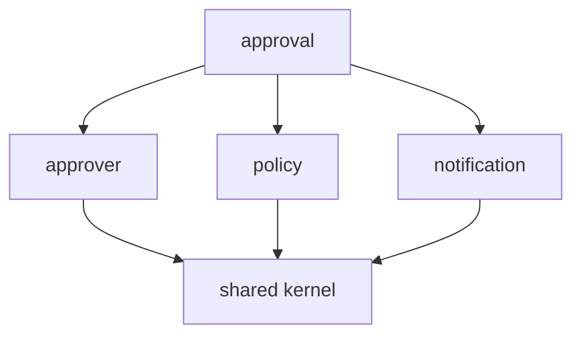

# 계층 내부 의존성 룰 — 사이클 방지를 위한 sub-layer DAG
---
> 클린·헥사고날의 의존성 규칙은 계층 사이는 잘 막아주지만, **같은 계층 안**의 모듈 간 사이클은 거의 자동으로 잡히지 않는다. application/domain 안에 사이클이 생기면 그 시점부터 모듈 분할은 무의미해진다.

## 1. 계층 간 룰만으로는 부족하다

> "presentation → application → domain ← infrastructure" 같은 화살표는 거시 의존성만 통제한다.

레이어드·클린·헥사고날 모두 계층 간 의존성 방향을 정의한다. 그러나 한 계층 안에서 모듈 A가 모듈 B를 호출하고, B가 다시 A의 다른 클래스를 호출하는 사이클은 별도 룰이 없으면 막히지 않는다. 코드는 컴파일되고 테스트도 통과하지만, 한 모듈을 떼어내려고 하면 의존성 그래프가 엉켜 있어 분리가 불가능해진다.

## 2. sub-layer DAG의 정의

해법은 단순하다. **같은 계층 안의 모듈을 또 한 번 위상 정렬해 DAG(Directed Acyclic Graph)로 만든다.** 어떤 모듈도 자신보다 위 또는 옆의 모듈을 호출할 수 없다. 다음은 결재 도메인 예시다.



`approval`이 `approver`, `policy`, `notification`을 부르는 것은 허용되지만 그 반대는 금지다. `shared`는 가장 아래에 위치하므로 모두가 의존할 수 있지만 `shared`는 누구도 의존하지 않는다.

## 3. 강제하는 도구

> 룰을 그림으로만 가지고 있으면 6개월 뒤 누군가가 반드시 깬다. 빌드 단계에서 깨지게 만들어야 한다.

세 가지 방법이 있다.

| 도구 | 강제 방식 | 비용 |
|------|----------|------|
| Java `package-private` | 모듈 진입점만 `public`, 나머지는 패키지 가시성 | 무료, 같은 모듈 안에서만 동작 |
| **ArchUnit** | 테스트 코드로 의존성 규칙 선언 | 테스트 의존성 추가, CI에서 실행 |
| **Spring Modulith** | `@ApplicationModule`로 모듈 경계 선언, 부팅 시 검증 | Spring 4.x 이상, 02-05 참조 |

ArchUnit 예시는 다음과 같다.

```java
@AnalyzeClasses(packages = "com.example.approval")
class ApprovalDependencyTest {

    @ArchTest
    static final ArchRule approval_does_not_depend_on_approver_internals =
        noClasses().that().resideInAPackage("..approver..")
                   .should().dependOnClassesThat().resideInAPackage("..approval..");
}
```

테스트 한 줄로 "approver는 approval을 호출할 수 없다"가 빌드 시 검증된다.

## 4. 흔한 사이클 발생 경로

실전에서 사이클은 보통 다음 세 경로로 들어온다.

- **공통 헬퍼 클래스**: `ApprovalHelper`를 `shared`에 두려다 결재 도메인 지식이 묻어 들어와 결국 `shared → approval` 화살표를 만든다.
- **이벤트 핸들러**: `approver`가 `ApprovalCreatedEvent`를 들으면서 정상이지만, 핸들러 안에서 `ApprovalService`를 직접 호출하면 사이클이 된다.
- **DTO 공유**: 두 모듈이 같은 DTO를 쓰려고 한 모듈에 두면 다른 모듈이 해당 모듈에 의존한다. DTO는 호출하는 쪽이 자기 패키지에 둔다.

이벤트 핸들러의 사이클은 특히 잡기 어렵다. 정적 분석으로 보면 `approver → approval` 한 방향만 보이지만, 실행 시 이벤트 발행으로 역방향 호출이 일어난다. **이벤트 핸들러는 항상 자신의 모듈 안에서 완결되어야 한다**는 규칙으로 막는다.

## 5. 한계와 트레이드오프

sub-layer DAG는 모듈 수가 늘어날수록 효과가 크다. 모듈이 셋 이하면 그림으로 통제 가능하고, ArchUnit이 오버엔지니어링이다. 모듈이 다섯을 넘기면서부터 도구 없이는 사이클 발생을 막을 수 없다.

도구를 도입하면 새 모듈 추가 시 ArchUnit 룰 갱신, Modulith 모듈 선언 갱신 같은 추가 작업이 생긴다. 비용은 모듈 하나당 1~2분이지만 깜빡하면 빌드가 깨지므로 팀 모두가 룰을 안다는 전제가 필요하다.

## 6. 적용 체크리스트

새 모듈을 만들 때 다음 다섯 가지를 확인한다.

1. 모듈의 DAG 상 위치를 정한다 (어떤 모듈에 의존하고, 누가 나를 의존할 수 있는가).
2. 모듈의 `public` 진입점만 노출하고 나머지는 `package-private`로 둔다.
3. ArchUnit 또는 Modulith에 새 모듈을 등록한다.
4. 이벤트 핸들러가 다른 모듈을 직접 호출하지 않는지 확인한다.
5. 모듈 간 DTO 공유가 생기면 한쪽으로 옮기지 말고 양쪽에 각자 두는 것을 우선 검토한다.

이 다섯 가지가 지켜지면 같은 계층 안의 사이클 발생 확률은 거의 0이 된다.
