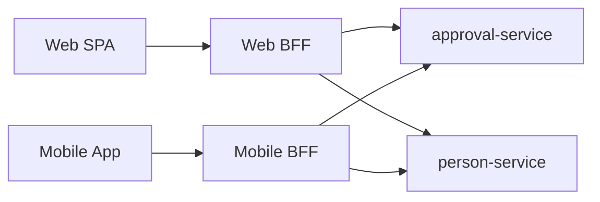

# 다중 엔티티 조회 API 설계
---
> 한 화면에 8개 테이블이 필요한 상황을 REST 하나로 풀면 N+1과 응답 비대화로 끝난다. 해법은 세 가지뿐이다. API Composition, BFF, GraphQL. 어느 것도 만능이 아니므로 화면 수·변경 빈도·팀 구조로 선택한다.

## 1. 문제의 재정의

> "다중 엔티티 조회"는 한 화면이 두 개 이상의 bounded context 데이터를 동시에 필요로 하는 상황이다.

전형적인 시나리오는 결재함이다. 한 줄에 신청자(인사), 결재 상태(결재), 첨부 파일 수(파일), 부재 정보(휴가) 네 가지가 동시에 보여야 한다. 모놀리스에서는 join 한 번이지만 모듈 분리·서비스 분리 후에는 네 번의 호출이 필요하다.

REST 한 엔드포인트로 풀려고 하면 두 가지 안티패턴 중 하나로 빠진다.

- **"슈퍼 컨트롤러"**: 한 컨트롤러가 네 모듈의 서비스를 직접 호출해 DTO를 빚는다. 02-09의 책임 분리가 무너진다.
- **"분산 N+1"**: 클라이언트가 결재 목록을 받고, 각 행마다 신청자·첨부·부재를 별도 호출한다. 네트워크 호출이 폭증한다.

세 가지 표준 해법은 위 두 안티패턴을 모두 피하면서 한 화면에 필요한 데이터를 한 번에 전달하는 것이 목표다.

## 2. 해법 1 — API Composition (Aggregator Service)

서버 측에 조회 전용 컴포지션 서비스를 둔다. 클라이언트 한 번 호출, 서버 안에서 병렬 호출 후 합쳐서 응답한다.

```java
@RestController
class ApprovalInboxController {
    private final ApprovalQueryService approvalQuery;
    private final PersonQueryService personQuery;
    private final AttachmentQueryService attachmentQuery;
    private final AbsenceQueryService absenceQuery;

    @GetMapping("/inbox")
    Mono<InboxResponse> inbox(@AuthenticationPrincipal User user) {
        var approvals = approvalQuery.pendingFor(user.id());
        return approvals.flatMap(list -> Mono.zip(
            personQuery.findAll(personIds(list)),
            attachmentQuery.countByApprovalIds(approvalIds(list)),
            absenceQuery.findAll(personIds(list))
        ).map(t -> InboxResponse.of(list, t.getT1(), t.getT2(), t.getT3())));
    }
}
```

**장점**: 클라이언트는 한 번 호출하면 끝. 모듈 책임은 그대로 유지된다.
**단점**: 화면마다 컴포지션 서비스가 늘어난다. 30개 화면이면 30개 endpoint와 30개 DTO가 생긴다.

## 3. 해법 2 — Backend for Frontend (BFF)

화면을 가진 클라이언트(웹·모바일·태블릿)마다 전용 백엔드 레이어를 둔다. BFF는 도메인 서비스를 호출해 자기 클라이언트에 맞는 형태로 응답을 빚는다.



**장점**: 화면 팀이 BFF를 소유하므로 도메인 팀과 결합도가 낮다. 클라이언트별 응답 최적화가 자유롭다.
**단점**: 도메인 한 곳을 바꾸면 BFF 여러 곳을 같이 갱신해야 한다. 인증·인가가 BFF 경계에서 다시 정의되어야 한다.

Microsoft Azure 아키텍처 센터와 Sam Newman의 정의에 따르면, **BFF는 "비즈니스 로직이 아니라 aggregation·transformation·protocol translation만 다룬다"**. 이 경계가 무너지면 BFF에 도메인 규칙이 누수되어 결국 두 곳에 같은 규칙이 산다.

## 4. 해법 3 — GraphQL

서버에 단일 GraphQL endpoint를 두고 클라이언트가 필요한 필드를 선언한다. 각 필드의 resolver가 해당 도메인 서비스를 호출한다.

```graphql
query Inbox {
  pendingApprovals {
    id
    title
    requester { name department }
    attachmentCount
    requesterAbsence { from to }
  }
}
```

**장점**: 클라이언트가 필요한 필드만 선언. over-fetching·under-fetching 모두 해소. 단일 endpoint.
**단점**: schema·resolver 운영 비용. N+1 방지를 위해 DataLoader 같은 별도 메커니즘 필요. 캐싱·인가가 REST보다 복잡.

GraphQL은 도메인이 안정되고 클라이언트 종류가 많을수록 유리하다. 단일 클라이언트라면 GraphQL의 운영 비용이 이익을 초과한다.

## 5. 선택 기준

세 해법은 배타적이지 않다. 한 시스템 안에서 화면 묶음별로 다르게 쓸 수 있다.

| 신호 | 권장 해법 |
|------|----------|
| 화면 수 < 10, 클라이언트 1종 | API Composition |
| 클라이언트 2종 이상 + 팀이 화면 단위로 나뉜다 | BFF |
| 클라이언트 종류 다양 + 도메인 안정 + 임의 필드 조합 빈번 | GraphQL |
| 화면 한두 개만 복잡, 나머지는 단순 | 단순한 곳은 REST + API Composition, 복잡한 곳만 GraphQL |

가장 흔한 실수는 "트렌드라서 GraphQL"이다. GraphQL 도입 비용은 schema·DataLoader·인가 정책 재작성으로 작지 않다. API Composition으로 6개월 더 버틸 수 있다면 그 시간이 도메인을 안정화하는 시간이 된다.

## 6. 공통 원칙

어느 해법을 쓰든 다음 세 가지는 공통이다.

- **조회 모델은 도메인 모델과 분리**: 응답 DTO에 도메인 객체를 그대로 직렬화하지 않는다. 도메인 변경이 API 계약을 깨지 않도록 한다.
- **인가는 도메인 서비스에서**: BFF·Composition·GraphQL 어디서 호출해도 같은 규칙이 적용되어야 한다. 인가를 API 레이어로 내리면 우회 경로가 생긴다.
- **응답 페이로드 제한**: 한 화면에 필요한 데이터만 보낸다. "혹시 쓸까봐" 추가한 필드가 그대로 N년 살아남는다.

선택은 한 번이지만 위 세 원칙은 모든 선택지에 같이 박힌다. 03-05(프론트엔드와 백엔드의 책임 경계)에서 같은 주제를 클라이언트 책임 관점으로 다시 본다.
