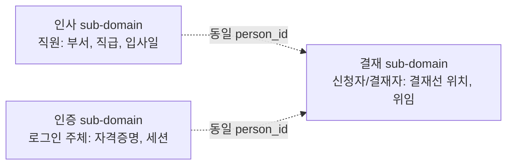

# 도메인 책임 분리와 세부 도메인 식별
---
> 큰 도메인을 한 덩어리로 두면 어디서부터 손대야 할지 알 수 없다. DDD는 도메인을 sub-domain으로 쪼개고, 그것을 다시 bounded context로 매핑한다. 분리의 기준은 패키지명이 아니라 **언어가 달라지는 지점**이다.

## 1. Sub-domain과 Bounded Context의 차이

> sub-domain은 문제 공간(problem space)의 구분이고, bounded context는 해결 공간(solution space)의 구분이다.

Eric Evans와 Vaughn Vernon의 정리에 따르면, sub-domain은 "비즈니스가 인식하는 책임 영역"이며 bounded context는 "그 책임에 맞춰 우리가 그리는 모델의 경계"다. 둘이 1:1로 매핑될 수도 있고, 하나의 sub-domain이 두 bounded context로 쪼개질 수도 있다.

| 구분 | sub-domain | bounded context |
|------|-----------|-----------------|
| 위치 | 문제 공간 | 해결 공간 |
| 결정 주체 | 비즈니스 | 개발 팀 |
| 변경 동인 | 사업 전략 | 모델 일관성 |
| 식별 단서 | 조직도, R&R | 유비쿼터스 언어의 변화 |

실전에서는 비즈니스가 그리는 sub-domain 지도와 개발이 그리는 bounded context 지도가 어긋난다. 어긋남을 인지하고 협상하는 것이 strategic design의 첫 단계다.

## 2. Sub-domain의 세 종류

DDD는 sub-domain을 셋으로 나눈다. 분류는 그 sub-domain에 얼마나 투자해야 하는지를 결정한다.

- **Core domain**: 회사의 경쟁 우위를 만드는 영역. 직접 만든다. 결재 시스템에서는 결재선 라우팅 규칙이 여기에 속한다.
- **Supporting sub-domain**: 핵심은 아니지만 자체 작성이 필요한 영역. 사용자 권한, 알림 채널 같은 것.
- **Generic sub-domain**: 어디서나 똑같이 풀리는 문제. 인증, 결제, 이메일 발송. 가능하면 사오거나 SaaS를 쓴다.

이 분류가 중요한 이유는 **모든 sub-domain에 같은 노력을 쏟지 말라**는 신호이기 때문이다. Generic을 직접 만들고 거기에 베스트 코드 리뷰를 쏟으면 Core에 쓸 시간이 사라진다.

## 3. 언어가 달라지는 지점을 찾는다

> sub-domain 식별의 실무 단서는 같은 단어가 다른 뜻을 가지는 순간이다.

결재 도메인 예시를 보면 명확하다. "사용자"라는 단어가 결재 sub-domain에서는 신청자 또는 결재자를, 인사 sub-domain에서는 직원을, 인증 sub-domain에서는 로그인 주체를 가리킨다. 같은 ID로 식별되지만 모델이 알아야 할 속성이 다르다.

세 sub-domain은 같은 사람을 본다. 그러나 각자의 모델에는 자기에게 필요한 속성만 둔다. 결재 모델에 직급을 넣으면 인사 정보 변경이 결재 모델을 흔든다.

## 4. 책임 분리의 실무 신호

새 기능이 생겼을 때 다음 신호가 보이면 sub-domain을 새로 그리거나 bounded context를 분리할 시점이다.

- **요청 시 같은 정보를 다르게 부른다** (인사: 직원번호, 결재: 신청자ID)
- **동일 엔티티에 변경 빈도가 크게 다른 필드가 섞인다** (자주 바뀌는 결재선 위치 vs 잘 안 바뀌는 부서)
- **한 팀의 변경이 다른 팀의 배포를 자주 깨뜨린다**
- **데이터베이스 테이블이 한 화면을 그리기 위해 8개 이상 조인된다**

처음 셋은 모델 경계 신호이고, 마지막은 다중 엔티티 조회 패턴(02-10)으로 풀어야 할 신호다. 모델 경계 신호를 조회 패턴으로 풀려고 하면 BFF/GraphQL을 도입해도 근본 문제가 풀리지 않는다.

## 5. Context Map으로 관계 그리기

sub-domain을 식별했으면 bounded context 사이의 관계를 명시한다. Evans가 정의한 관계 패턴 중 결재 도메인에서 자주 쓰이는 셋은 다음과 같다.

| 패턴 | 의미 | 결재 도메인 예 |
|------|------|---------------|
| Customer/Supplier | 하위 컨텍스트가 상위에 요구사항을 낼 수 있다 | 결재 → 인사 (위임자 정보) |
| Anti-Corruption Layer | 외부 모델을 내부 모델로 번역한다 | 결재 → 외부 ERP 결재 시스템 |
| Shared Kernel | 두 컨텍스트가 공유하는 작은 핵심 | 결재 ∩ 인사 (person_id 만) |

Context Map은 그 자체로 결정이 아니라 **결정의 근거를 그림으로 남기는 도구**다. 새 컨텍스트가 추가될 때마다 Map을 갱신하고, ADR(01-05)로 결정 사유를 남긴다.

## 6. 분리하지 말아야 할 때

DDD를 처음 도입할 때 흔한 실수는 모든 모듈을 sub-domain으로 승격하는 것이다. 다음 경우는 분리하지 않는다.

- 변경 동인이 같다 (같은 팀이 같은 일정으로 같이 바꾼다)
- 유비쿼터스 언어가 같다 (같은 단어를 같은 뜻으로 쓴다)
- 데이터 일관성이 절대적으로 필요하다 (한 트랜잭션 안에 묶여야 한다)

이 셋이 모두 만족하면 한 bounded context 안에 두는 것이 옳다. 분리 비용(트랜잭션 분할, 통신 비용, 운영 복잡도)이 분리 이익보다 크기 때문이다. **분리는 책임이 갈라질 때만 한다.**
