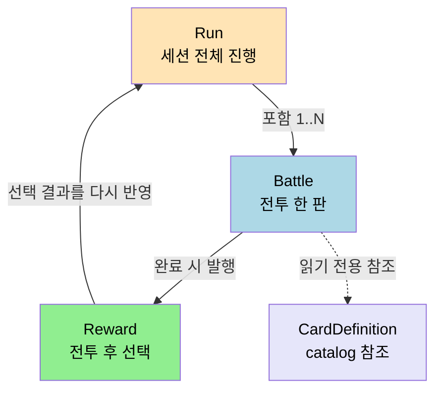
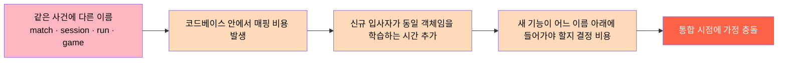

# 유비쿼터스 언어와 도메인 모델
---
> 이 문서를 읽고 나면 도메인 용어가 코드·테스트·API·회의 어디에 어떻게 박혀야 하는지를 설명할 수 있고, 같은 단어가 두 의미를 갖는 순간을 탐지할 수 있습니다.

> 유비쿼터스 언어(Ubiquitous Language)는 문서용 용어집이 아니라 코드, 테스트, API, 회의에서 같은 단어를 같은 의미로 쓰기 위한 계약입니다.
>
> - Run
> - Battle
> - Reward
> - Exhaust

## 1. 왜 용어를 먼저 맞춰야 하는가

> 같은 단어를 다른 뜻으로 쓰는 순간 모델이 흐려지고, 그 비용은 통합 시점에 폭증합니다.

도메인이 복잡해질수록 같은 단어를 다르게 쓰는 순간 설계가 흔들립니다. 카드게임에서는 "턴 종료", "전투 종료", "런 종료"가 모두 다른 사건인데, 이를 모두 `complete`라고 부르면 경계가 흐려집니다.

유비쿼터스 언어의 목표는 기획 문서와 코드 사이의 번역 비용을 줄이는 것입니다. 개발자와 도메인 전문가가 같은 단어를 반복해서 쓰면 모델이 자연스럽게 정제됩니다.

여기서 질문 하나 — 단어를 통일하기만 하면 끝일까요? 그렇지 않습니다. *단어 사용 범위* 를 통일해야 합니다. 다른 맥락에서 같은 단어가 다른 의미를 가지면 그건 다른 모델입니다. 이 결정은 `01-04 Bounded Context` 가 다룹니다.

## 2. 예시 프로젝트의 핵심 용어

> 용어 표는 사전이 아니라 *코드 구조의 기준점* 입니다. API, 이벤트, 클래스 이름이 모두 이 표를 따라가야 합니다.

예시 프로젝트에서는 다음 용어를 기본 어휘로 고정합니다.

| 용어 | 의미 | 코드 표현 | 주의점 |
|------|------|----------|--------|
| Run | 플레이어의 단일 세션 | `Run` aggregate | 계정 전체 진행도와 혼동하지 않음 |
| Battle | 전투 한 판 | `Battle` entity | 런 전체와 같은 범위로 취급하지 않음 |
| Reward | 전투 후 선택 보상 | `RewardOption` | 상점 구매와 구분 |
| Exhaust | 카드를 영구적으로 턴 덱에서 제거 | `ExhaustPile` 또는 이벤트 | 단순 discard와 다름 |

이 표는 단순 용어 사전이 아니라 코드 구조의 기준점입니다. API 이름, 이벤트 이름, 클래스 이름도 이 언어를 따라야 합니다.

## 3. 도메인 모델은 용어의 관계를 드러낸다

> 단어를 정하는 것이 유비쿼터스 언어라면, *단어들의 관계* 를 정하는 것이 도메인 모델입니다. 관계가 곧 트랜잭션 경계의 후보입니다.

유비쿼터스 언어가 단어를 정한다면, 도메인 모델은 그 단어들의 관계를 정합니다. 예를 들어 `Run`이 `Battle`을 포함하는지, 아니면 `Battle`이 별도 Aggregate인지에 따라 트랜잭션 경계가 달라집니다.

이 시리즈에서는 다음처럼 읽습니다.

- `Run`은 세션 전체의 진행 상태를 관리합니다.
- `Battle`은 현재 전투 규칙과 턴 흐름을 관리합니다.
- `Reward`는 전투 완료 후 발생하는 선택 결과입니다.

용어 사이 관계를 한 번에 보려면 다음 도식이 빠릅니다.



세 Entity 의 관계가 표 한 줄로는 보이지 않지만, 위 도식은 *Battle 완료가 Reward 발행을 거쳐 Run 상태에 반영* 된다는 흐름을 한 자리에 박습니다. 클래스 이름이 흐름 안에서 등장하는 순서가 곧 도메인 이벤트의 순서입니다.

## 4. 잘못된 언어가 만드는 문제

> 같은 의미의 다른 이름이 코드베이스에 공존하면, 어떤 객체가 무엇을 대표하는지가 사라집니다.

유비쿼터스 언어가 없으면 코드베이스에 같은 의미의 다른 이름이 동시에 생깁니다. `match`, `session`, `run`, `game`이 섞이면 어떤 객체가 무엇을 대표하는지 파악하기 어려워집니다.

다음 세 가지는 특히 피해야 합니다.

- UI 용어를 그대로 도메인 용어로 가져오는 것
- DB 테이블명을 도메인 이름으로 착각하는 것
- 팀마다 다른 별칭을 허용하는 것

어휘가 표류하면 비용은 다음 흐름으로 누적됩니다.



비용은 *한 자리에서 한 번에* 나타나지 않고, 위 다섯 자리에 *조금씩 분산되어* 누적됩니다. 그래서 어휘 표류는 단일 PR 리뷰로는 잡기 어렵습니다. 어휘 통일을 한 번에 강제하는 정책이 필요한 이유입니다 — 다음 §5 가 그 방법입니다.

## 5. Spring Boot 프로젝트에서 언어를 고정하는 방법

> 말로만 합의한 언어는 오래가지 않습니다. 패키지·DTO·테스트 시나리오가 같은 어휘를 *강제* 해야 합니다.

유비쿼터스 언어는 말로만 합의하면 오래가지 않습니다. 코드와 테스트 구조로 고정해야 합니다.

실무에서는 다음 방식이 효과적입니다.

- 패키지명과 클래스명을 도메인 용어에 맞춥니다.
- API 요청/응답 DTO도 같은 어휘를 사용합니다.
- 테스트 시나리오 이름을 도메인 이벤트 문장으로 작성합니다.

다음 패키지 예시는 용어를 구조에 반영한 형태입니다.

```text
com.example.spire.run
com.example.spire.battle
com.example.spire.reward
com.example.spire.catalog.card
```

## 6. Bounded Context의 초안

> 같은 단어가 다른 context 에서 다른 의미를 가지는 순간, 우리는 두 모델을 봐야 합니다. 본 절은 그 분기점을 미리 박아 둡니다.

같은 단어라도 context가 달라지면 의미가 달라질 수 있습니다. 예를 들어 `Reward`는 런 도메인에서는 전투 후 선택지지만, 메타 진행 도메인에서는 해금 보상일 수 있습니다.

그래서 이 시리즈는 다음 context 초안을 사용합니다.

- `run`: 세션 시작, 종료, 맵 진행
- `battle`: 턴, 카드 사용, 적 행동
- `catalog`: 카드, 유물, 적 정의
- `progression`: 계정 해금과 메타 진행

## 7. 런 관리 서비스에 적용한 결론

> 시리즈 전체가 같은 용어를 유지해야, 문서를 여러 편으로 나누어도 한 모델이 됩니다.

이 시리즈의 모든 문서는 같은 용어를 유지합니다. 특히 `Run`, `Battle`, `Reward`, `ActProgress`, `CardPlayed` 같은 이름은 문서와 코드 예시 전반에 반복해서 사용합니다.

아키텍처 문서를 여러 편으로 나눌수록 용어 일관성이 더 중요해집니다. 유비쿼터스 언어는 DDD 문서에서만 필요한 개념이 아니라, 전체 시리즈를 엮는 접착제입니다.

## 8. 실제 사례 — 세 가지 출처

> 추상 규칙은 사례 없이 박히지 않습니다. 본 절은 *책 원전·본인 코드·오픈소스* 세 자리에서 같은 규칙이 다르게 박힌 모습을 봅니다.

### 8-1. Vernon SaaSOvation 의 Tenant 용어 통일

Vaughn Vernon 의 *Implementing Domain-Driven Design* (Addison-Wesley, 2013) 은 SaaSOvation 가상 회사의 협업 SaaS 사례에서 `Tenant`, `User`, `Role`, `Group` 네 단어의 의미를 챕터 2~5 에 걸쳐 못 박습니다. 같은 책의 챕터 7 에서는 `User` 가 *Identity & Access Context* 에서는 자격증명을 가진 주체이지만, *Collaboration Context* 에서는 `Author`, `Moderator`, `Owner` 로 *번역되어* 등장합니다. 같은 person_id 를 가리켜도 두 Context 가 본인 모델에 필요한 측면만 박는다는 점이 핵심이며, 이는 본 문서 §6 의 Bounded Context 초안과 정확히 같은 발상입니다.

### 8-2. 본인 TPS 의 `결재` 단어 통일 과정

`~/okestro/tps-gitlab2/operator-api/` 의 결재 도메인은 초기에 `결재`, `승인`, `approval`, `confirm` 네 단어가 혼재했습니다. 같은 한 동작을 컨트롤러에서는 `approveTicket`, 서비스에서는 `confirmApproval`, DB 컬럼에서는 `CONFIRM_STATUS`, 이벤트에서는 `TicketApprovalRequestEvent` 로 부르던 결과, 신규 입사자가 코드를 읽을 때 *같은 사건의 네 이름* 을 머릿속에서 합쳐야 했습니다. 2026-05 의 정합화로 사용자 face: `결재`, 시스템 내부: `approval`, 동작: `request / decide / cancel` 셋으로 어휘를 줄이고, 컨트롤러·서비스·이벤트·DB 컬럼이 그 어휘만 사용하도록 굳혔습니다. 이름이 줄어든 만큼 신규 입사자의 첫 PR 회수 비용이 체감상 절반으로 떨어졌습니다.

### 8-3. eShopOnContainers 의 `Order` 어휘 분리

Microsoft 의 학습용 오픈소스 [eShopOnContainers](https://github.com/dotnet-architecture/eShopOnContainers) 는 `Order` 라는 단어를 두 Bounded Context 가 다른 의미로 박습니다. *Ordering* Context 에서는 `Order` 가 결제·배송 상태를 모두 들고 있는 Aggregate Root 이지만, *Basket* Context 에서는 `Order` 단어 자체를 쓰지 않고 `BasketItem` 만 사용합니다. 두 Context 의 통합은 `OrderCreated` 도메인 이벤트로만 이뤄지며, 한쪽 모델이 다른 쪽의 어휘를 침범하지 않습니다. 같은 repo 의 `src/Services/Ordering/Ordering.Domain/AggregatesModel/OrderAggregate/Order.cs` 파일이 이 어휘 경계의 코드 증거입니다.

### 8-4. 카카오페이 여신코어의 `Recovery` — 의도를 드러내는 명명

카카오페이 여신(대출) 시스템은 대출금 *납부* 를 `Payment` 나 `납부` 가 아니라 [`Recovery`](https://tech.kakaopay.com/post/backend-domain-driven-design/) 로 명명합니다. 같은 동작이라도 단어가 도메인 의도를 다르게 드러내기 때문입니다 — 여신 도메인에서 납부의 본질은 "고객이 쓴 한도를 다시 되돌려 받는 것" 이고, `Recovery` 라는 단어가 그 의도를 그대로 표면화합니다. 표면 동작(`돈을 받는다`) 이 아니라 도메인이 그 동작을 *무엇으로 보는가*(`한도를 복원한다`) 를 박는 것이 핵심입니다. 이렇게 고른 용어는 여신 전문가·기획자·개발자가 회의에서 같은 단어로 같은 의도를 가리키게 만들어, 위 §2 용어표의 "의미" 열이 단순 사전 정의가 아니라 *왜 이 단어인가* 를 담게 됩니다. 같은 사례에서 한 걸음 더 나아가, 카카오페이는 각 Bounded Context 를 Gradle module 단위로 묶어 기술 구조가 도메인 경계를 강제하게 했는데, 이는 `01-04 Bounded Context` 의 경계 식별과 이어지는 실무 적용입니다.

## 9. 면접에서 받을 만한 질문

1. 유비쿼터스 언어와 도메인 모델은 어떤 관계입니까? 둘 중 하나만 있어도 됩니까?
2. 같은 단어가 두 Context 에서 다른 뜻을 갖는 사례를 본인 경험에서 하나 들고, 왜 그 단어를 통일하지 않았는지 설명하십시오.
3. UI 용어를 그대로 도메인 용어로 가져오면 무엇이 깨집니까? 구체적인 시나리오를 드십시오.
4. 유비쿼터스 언어를 *코드 구조* 로 강제하는 세 가지 방법은 무엇입니까?

> 위 질문에 *먼저 자답한 뒤* 아래 §10. 정답 (자답 후 펼치기) 으로 내려갑니다.

## 10. 정답 (자답 후 펼치기)

> 위 §9. 면접에서 받을 만한 질문 의 4개에 *먼저 자답한 뒤* 아래를 읽으세요. 자답 없이 먼저 읽으면 학습 효과가 0입니다.

### 정답 1 — 유비쿼터스 언어와 도메인 모델의 관계

유비쿼터스 언어는 *단어* 의 합의이고 도메인 모델은 *단어들의 관계* 의 합의입니다. 둘은 분리할 수 없습니다. 단어만 합의하고 관계를 정하지 않으면 같은 이름의 두 객체가 코드 안에서 충돌하고, 관계만 그리고 단어를 합의하지 않으면 같은 도식이 매 회의마다 다른 이름으로 다시 그려집니다. Evans 의 표현으로는 모델이 *언어의 기둥(backbone)* 이고, 언어가 *모델의 표상(expression)* 입니다.

### 정답 2 — 같은 단어 두 의미 사례

본 문서 §6 의 `Reward` 가 좋은 예입니다. `run` Context 에서는 전투 후 선택 보상이고, `progression` Context 에서는 계정 해금 보상입니다. 두 의미를 한 단어로 묶지 않은 이유는 *변경 동인이 다르기 때문* 입니다. 전투 보상은 매 전투마다 새로 발생하고 짧은 라이프사이클을 가지지만, 해금 보상은 영구 데이터로 한 번 발생하면 계정이 사라질 때까지 유지됩니다. 두 라이프사이클을 한 모델에 묶으면 영구 저장 요구와 메모리 처리 요구가 충돌해 둘 다 만족하지 못하는 설계가 나옵니다.

### 정답 3 — UI 용어를 도메인 용어로 가져오는 비용

UI 용어는 *화면이 바뀔 때마다 바뀝니다*. 예를 들어 결재 화면의 버튼 라벨이 "승인하기" 에서 "결재 진행" 으로 바뀌었다고, 그 이벤트 이름이 `ApproveButtonClicked` 였다가 `ApprovalProceedTriggered` 가 되면 안 됩니다. 도메인은 *사용자가 한 행동* 을 박아야지 *눌린 버튼의 라벨* 을 박으면 안 됩니다. 본인 TPS 사례(§8-2) 에서 `approveTicket` 메서드가 화면 라벨 변경에 끌려 다닌 경험이 이 정답의 근거입니다.

### 정답 4 — 코드 구조로 언어를 강제하는 세 방법

§5 가 정답입니다. (1) 패키지명과 클래스명을 도메인 용어로 — 잘못 부른 이름은 import 문에서 즉시 보입니다. (2) API 요청/응답 DTO 도 같은 어휘 — 외부 통합 지점에서 어휘가 깨지면 그 자리에서 잡힙니다. (3) 테스트 시나리오 이름을 도메인 이벤트 문장으로 — `@DisplayName("결재 요청이 들어오면 차상위 결재자에게 알림이 발사된다")` 같은 형태로, 테스트 실패 출력이 도메인 문장으로 읽힙니다. 셋 모두가 *컴파일러·정적 분석·테스트 러너* 가 강제하는 자리라, 사람의 의지에 의존하지 않습니다.

## 관련 문서

- [전략적 설계와 전술적 패턴](./01-02.전략적%20설계와%20전술적%20패턴.md) — 본 언어 합의가 코드 경계로 옮겨지는 다음 단계
- [Bounded Context 와 Context Map](./01-04.Bounded%20Context%20와%20Context%20Map.md) — 같은 단어가 두 의미를 갖는 순간을 모델 안에서 인정하는 도구
