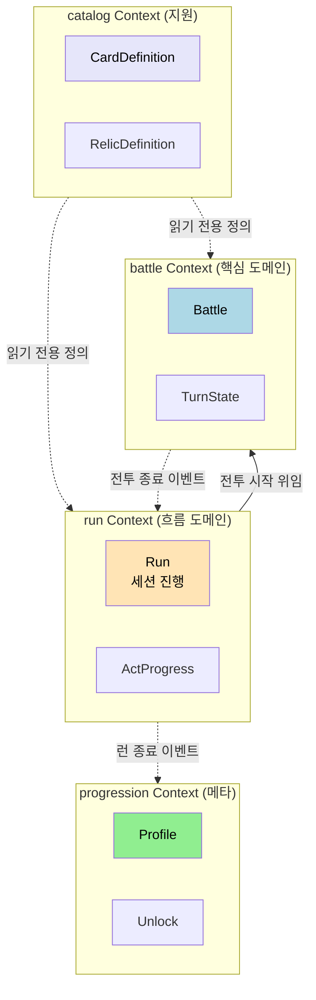
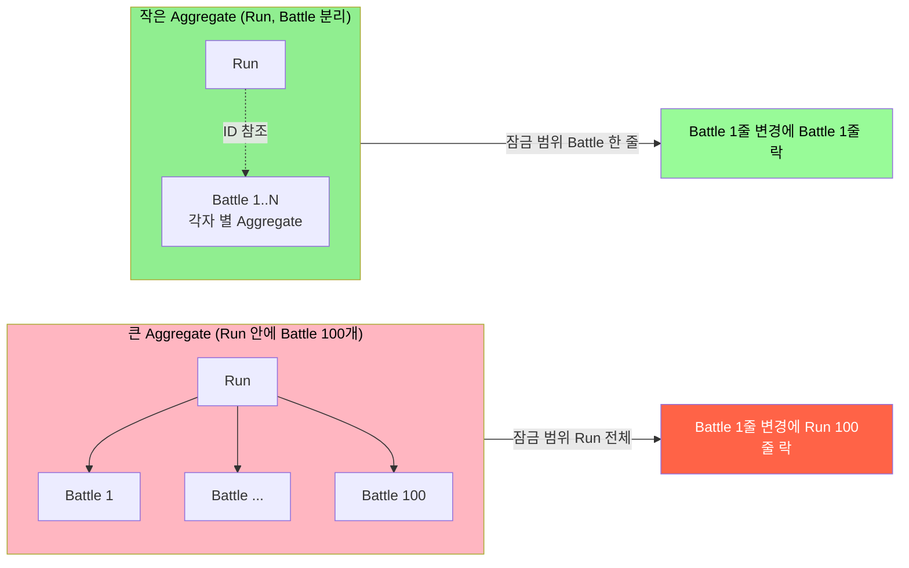

# DDD 전략적 설계와 전술적 패턴
---
> 이 문서를 읽고 나면 Bounded Context 와 Aggregate 결정 기준을 그림 없이 말로 설명할 수 있고, *언제 핵심 도메인이고 언제 지원 도메인인지* 구분할 수 있습니다.

> 도메인 주도 설계(DDD)는 객체 몇 개를 예쁘게 만드는 방법이 아니라, 복잡한 도메인을 팀과 코드 구조에 맞게 분해하는 접근입니다.
>
> - Bounded Context
> - Aggregate
> - Entity
> - Value Object

## 1. DDD가 필요한 이유

> 복잡한 도메인에서는 *클래스 설계보다 경계 설계* 가 먼저입니다. 핵심을 잘못 잡으면 나중에 모든 클래스가 흔들립니다.

복잡한 도메인에서는 클래스 설계보다 경계 설계가 먼저 중요합니다. 카드게임 서버에서 런 진행, 전투 규칙, 카드 정의, 계정 해금은 모두 관련이 있지만 같은 속도로 바뀌지 않습니다.

DDD는 "무엇이 핵심 도메인이고, 무엇이 지원 도메인인가", "어디까지를 같은 모델로 볼 것인가"를 정하게 해 줍니다. 이 질문에 답하지 않으면 팀은 계속 같은 단어를 다르게 씁니다.

여기서 질문 하나 — 처음부터 완벽한 경계를 그릴 수 있을까요? 그렇지 않습니다. 경계는 *발견되는 것* 이지 *설계되는 것* 이 아닙니다. 도메인 전문가와 합의를 거듭하며 경계가 *움직이는 자리* 가 보일 때, 그 자리가 진짜 경계입니다.

## 2. 전략적 설계: Bounded Context 나누기

> 같은 단어가 다른 의미를 가지는 지점·변경 속도가 다른 지점·트랜잭션 요구가 다른 지점이 만나면 Bounded Context 후보입니다.

예시 프로젝트에서는 다음 context 구분이 자연스럽습니다.

| Context | 핵심 책임 | 대표 모델 | 비고 |
|---------|----------|----------|------|
| `run` | 런 시작, 종료, 노드 진행 | `Run`, `ActProgress` | 세션 전체 |
| `battle` | 턴, 카드 사용, 적 행동 | `Battle`, `TurnState` | 규칙 복잡도 가장 높음 |
| `catalog` | 카드, 유물, 적 정의 | `CardDefinition`, `RelicDefinition` | 참조 데이터 |
| `progression` | 메타 해금과 업적 | `Profile`, `Unlock` | 핵심 런과 분리 가능 |

이 구분은 나중에 모듈 분리나 서비스 분리의 기준점이 됩니다. 처음부터 물리적으로 분리하지 않더라도 개념적 경계를 먼저 세워야 합니다.

네 Context 가 코드 구조와 데이터 흐름에서 어떻게 만나는지 다음 도식이 한 자리에 박습니다.

읽기 전용 참조(점선) 와 흐름 위임(실선) 이 다른 선으로 그려진 자리에 *결합도의 차이* 가 박힙니다. catalog 는 양방향 통신이 없어 *어디서나 읽힌다* 의 의미를 갖고, battle ↔ run 은 *흐름과 결과* 라는 양방향 통신을 갖습니다.

## 3. 전술적 패턴: Aggregate를 어디까지 둘 것인가

> Aggregate 는 *한 트랜잭션 안에서 어떤 불변식을 함께 지킬 것인가* 의 결정입니다. 이 결정이 잠금 범위·로딩 비용·동시성 충돌을 한꺼번에 결정합니다.

Aggregate는 하나의 트랜잭션 경계입니다. 모든 것을 `Run` 하나에 넣으면 단순해 보이지만, 전투가 두꺼워질수록 하나의 거대 aggregate가 됩니다.

이 시리즈에서는 기본적으로 `Run`을 상위 aggregate로 보되, 현재 전투 상태는 `Battle` 하위 구성요소로 모델링하는 방향을 예시로 사용합니다. 다만 동시성 요구나 저장 전략이 달라지면 `Battle`을 별도 aggregate로 분리할 수 있습니다.

상세 규칙은 `02-01 Aggregate 설계 규칙` 에서 다룹니다. 본 절은 *Bounded Context 안에 Aggregate 를 어떻게 배치하는가* 의 결정 사례에 한정합니다.

다음 도식은 같은 도메인에서 큰 Aggregate 와 작은 Aggregate 가 *잠금·로딩·동시성* 세 자리에 어떤 차이를 만드는지 한 자리에 박습니다.

큰 Aggregate 는 *단일 트랜잭션 일관성* 을 쉽게 제공하지만 잠금·로딩·동시성 비용을 함께 키웁니다. 작은 Aggregate 는 셋 다 가벼워지지만 *Aggregate 사이는 결과적 일관성으로 다뤄야 한다* 는 새 비용이 생깁니다. 어느 쪽이 정답인지는 도메인 특성에 따라 다르며, `02-01 §4` 의 비용 표가 결정 근거를 줍니다.

## 4. Entity와 Value Object

> 식별성이 살아 있어야 하면 Entity, 값 그 자체가 의미면 Value Object 입니다. 이 한 줄이 record/sealed 같은 언어 기능 선택까지 갑니다.

DDD에서 Entity는 식별성을 가집니다. Value Object는 값 자체가 의미입니다. 이 구분은 카드게임 도메인에서 꽤 유용합니다.

예를 들어 다음처럼 볼 수 있습니다.

- `Run`, `Battle`, `PlayerProfile`은 Entity
- `Hp`, `Gold`, `Energy`, `CardCost`, `ActNumber`는 Value Object
- `CardDefinition`은 catalog context에서는 Entity지만, battle context에서는 읽기 전용 참조 데이터에 가깝습니다

## 5. Domain Service와 Policy

> 객체 한 개에 묶기 어려운 *여러 객체 사이의 규칙* 이 Domain Service, *전략 교체 가능한 정책* 이 Policy 입니다.

모든 로직이 Entity 내부에 들어가야 하는 것은 아닙니다. 여러 객체를 엮는 규칙이나, 순수 계산 로직, 선택 전략은 Domain Service나 Policy로 두는 편이 더 깔끔할 수 있습니다.

예를 들면 다음이 그렇습니다.

- 보상 후보군을 뽑는 `RewardPolicy`
- 적 의도 선택을 계산하는 `EnemyIntentPolicy`
- 카드 풀에서 랜덤 선택을 담당하는 `CardDraftPolicy`

## 6. Repository를 어떻게 읽어야 하는가

> Repository 는 Aggregate 진입점이지, JPA Entity DAO 가 아닙니다. application 코드가 *저장 기술* 을 모르도록 만드는 자리입니다.

DDD의 Repository는 단순 DAO와 다릅니다. Aggregate를 로드하고 저장하는 도메인 진입점입니다. 따라서 JPA Entity 자체보다 도메인 aggregate 관점으로 인터페이스를 설계하는 편이 낫습니다.

이때 중요한 것은 저장 기술보다 계약입니다. application은 `RunRepository`가 JPA인지 Redis인지 몰라도 됩니다.

## 7. 예시 프로젝트에 적용한 결론

> 핵심 / 지원 / Generic 분류는 *클래스를 늘리려는 결정* 이 아니라 *어디에 투자할지 결정* 입니다.

이 시리즈에서는 `battle`을 핵심 도메인, `run`을 핵심을 감싸는 흐름 도메인으로 봅니다. `catalog`는 지원 도메인이고, `progression`은 별도 확장 context로 둡니다.

즉 DDD의 목적은 클래스를 늘리는 데 있지 않습니다. 런 관리 서비스에서 어디까지 같은 모델로 보고, 어디서부터 다른 팀과 다른 저장 전략을 허용할지 정하는 데 있습니다.

## 8. 실제 사례 — Vernon Cargo 시스템

> 추상 패턴은 사례 없이는 박히지 않습니다. Vernon 이 *Implementing DDD* 에서 다룬 Cargo 운송 도메인이 본 절의 텍스트북 사례입니다.

### 8-1. Cargo 도메인의 네 Bounded Context

Vaughn Vernon 의 *Implementing Domain-Driven Design* (Addison-Wesley, 2013) 챕터 3 은 DHL/FedEx 류 화물 운송 시스템을 예시로 네 Bounded Context 를 박습니다 — *Booking* (예약), *Routing* (경로 계산), *Tracking* (현재 위치 추적), *Billing* (정산). 같은 `Cargo` 라는 단어가 네 Context 에서 다른 측면만 본다는 점이 핵심입니다. Booking 에서는 `Cargo` 가 출발지·도착지·고객 정보를 가진 *예약 상태* 이지만, Routing 에서는 *경유지 후보의 그래프* 이고, Tracking 에서는 *현재 위치·예상 도착 시간* 이며, Billing 에서는 *청구 항목과 가격* 입니다. 네 Context 가 한 `Cargo` 를 공유하지 않고, 각자가 필요한 측면만 본인 모델에 박습니다.

### 8-2. 네 Context 의 관계

Vernon 의 책 챕터 3 §"Strategic Design with Bounded Contexts" 가 그리는 Context Map 은 다음 네 관계로 정리됩니다. *Booking → Routing* 은 Customer-Supplier (Booking 이 경로 계산을 요구), *Routing → Tracking* 은 도메인 이벤트 (계산된 경로를 통지), *Tracking → Billing* 은 도메인 이벤트 (실제 운송 완료 시 정산 트리거), *Billing → 외부 결제* 는 Anticorruption Layer (외부 모델을 자기 모델로 번역). 같은 책의 챕터 13~14 에서 이 관계 패턴들의 코드 구현이 자세히 펼쳐집니다. 본 시리즈의 `01-04 Bounded Context 와 Context Map` 이 이 관계 패턴 7가지를 표로 정리합니다.

### 8-3. 본인 프로젝트로의 옮김

본인 TPS 프로젝트의 결재 도메인을 Cargo 4 Context 와 매핑하면 다음과 같습니다 — *결재 요청* = Booking, *결재선 계산* = Routing, *진행 상태 추적* = Tracking, *완료 후 후속 처리(알림·이력)* = Billing 의 *알림 발사* 부분. 네 책임이 같은 한 클래스 (`ApprovalService`) 안에 박혀 있을 때 모든 변경이 그 한 자리로 모입니다. 책임을 4 Context 로 가르면 한 책임의 변경이 다른 셋을 흔들지 않습니다. 단, 옮김이 *기계적* 이면 안 됩니다 — Cargo 의 Billing 은 *돈* 을 다루지만 결재의 Billing 자리는 *알림* 을 다루는 식으로, 도메인 특성에 맞춰 책임을 다시 그려야 합니다.

## 9. 면접에서 받을 만한 질문

1. Bounded Context 와 Sub-domain 의 차이는 무엇이고, 둘이 1:1 로 매핑되지 않을 수 있는 이유는 무엇입니까?
2. Aggregate 경계 결정이 *잠금 범위·로딩 비용·동시성 충돌* 세 가지를 동시에 결정하는 이유를 한 시나리오로 설명하십시오.
3. Entity 인지 Value Object 인지 판단할 때 첫 질문은 무엇입니까? 그 질문이 record/sealed 같은 언어 기능 선택과 어떻게 연결됩니까?
4. 핵심 도메인·지원 도메인·Generic 도메인 분류가 *팀 시간 투자* 의 방향을 어떻게 바꿉니까?

> 위 질문에 *먼저 자답한 뒤* 아래 §10. 정답 (자답 후 펼치기) 으로 내려갑니다.

## 10. 정답 (자답 후 펼치기)

> 위 §9. 면접에서 받을 만한 질문 의 4개에 *먼저 자답한 뒤* 아래를 읽으세요. 자답 없이 먼저 읽으면 학습 효과가 0입니다.

### 정답 1 — Bounded Context vs Sub-domain

Sub-domain 은 *문제 공간(problem space)* 의 구분이고, Bounded Context 는 *해결 공간(solution space)* 의 구분입니다. Sub-domain 은 비즈니스가 인식하는 책임 영역으로 조직도·R&R 에서 단서가 나오고, Bounded Context 는 그 책임에 맞춰 우리가 그리는 모델의 경계입니다. 1:1 매핑이 깨지는 이유는 *모델 일관성* 과 *비즈니스 책임* 이 항상 같은 자리에서 갈라지지 않기 때문입니다. 한 sub-domain 이 너무 커서 모델 하나로 담기 어려우면 두 Bounded Context 로 쪼개고, 반대로 두 sub-domain 이 같은 모델로 표현 가능하면 한 Bounded Context 로 묶을 수 있습니다. 상세는 `01-03 §1`.

### 정답 2 — Aggregate 경계가 결정하는 세 가지

`Run` 하나에 `Battle` 100 개를 묶었다고 가정합시다. 잠금 범위 — `Battle` 하나의 상태를 바꾸려고 `Run` 전체 행에 락이 걸립니다. 로딩 비용 — `Run` 을 메모리에 올릴 때 `Battle` 100 개가 함께 올라옵니다. 동시성 충돌 — 두 사용자가 다른 `Battle` 을 동시에 갱신하면 같은 `Run` 의 낙관적 잠금에서 한쪽이 실패합니다. 셋이 같은 결정에 묶이는 이유는 *Aggregate 가 트랜잭션 단위* 이기 때문입니다. 분리하면 셋 다 가벼워지지만, *Aggregate 사이는 결과적 일관성으로 다뤄야 한다* 는 새 비용이 생깁니다. 상세는 `02-01 §4`.

### 정답 3 — Entity vs Value Object

첫 질문은 *식별성이 살아 있어야 합니까?* 입니다. `Money(1000, "KRW")` 두 개가 같은지를 묻는 것은 무의미합니다 — 같은 값이면 같은 객체입니다. 반면 `User(id=42)` 두 개는 *같은 user* 인지를 ID 로만 판단합니다. 식별성이 *없어도 되면* Value Object 이고, *있어야 하면* Entity 입니다. record/sealed 와의 연결 — Value Object 는 *불변* 이 핵심이라 Java 의 `record` 가 정확히 맞고, *허용된 값만 갖도록 강제* 하려면 sealed interface 로 닫습니다. Entity 는 라이프사이클 동안 상태가 바뀌므로 record 가 어색합니다. 상세는 `02-02`.

### 정답 4 — 도메인 분류와 팀 시간 투자

핵심 도메인은 *경쟁 우위* 의 자리라 직접 만들고 가장 좋은 코드 리뷰·테스트·리팩터링 시간을 씁니다. 지원 도메인은 *자체 작성이 필요하지만 차별화가 아닌* 자리라 적당히 빠른 구현을 받아들입니다. Generic 도메인은 *어디서나 똑같이 풀리는* 자리라 직접 만들지 않고 SaaS·라이브러리로 채웁니다. 이 분류가 중요한 이유는 *모든 자리에 같은 노력을 쏟지 말라* 는 신호이기 때문입니다. Generic 인 인증을 직접 만들고 거기에 베스트 리뷰를 쏟으면 핵심 도메인에 쓸 시간이 사라집니다. 본인 TPS 의 결재선 라우팅이 핵심이라면, 이메일 발송은 SaaS 로 빼고 그 시간을 라우팅 규칙 진화에 씁니다.

## 관련 문서

- [유비쿼터스 언어와 도메인 모델](./01-01.유비쿼터스%20언어와%20도메인%20모델.md) — 본 전략적 설계의 *어휘 합의* 단계
- [도메인 책임 분리와 세부 도메인 식별](./01-03.도메인%20책임%20분리와%20세부%20도메인%20식별.md) — Sub-domain 식별 신호
- [Bounded Context 와 Context Map](./01-04.Bounded%20Context%20와%20Context%20Map.md) — Context 사이 7가지 통신 패턴
- [Aggregate 설계 규칙](./02-01.Aggregate%20설계%20규칙.md) — 전술적 패턴의 핵심 규칙
