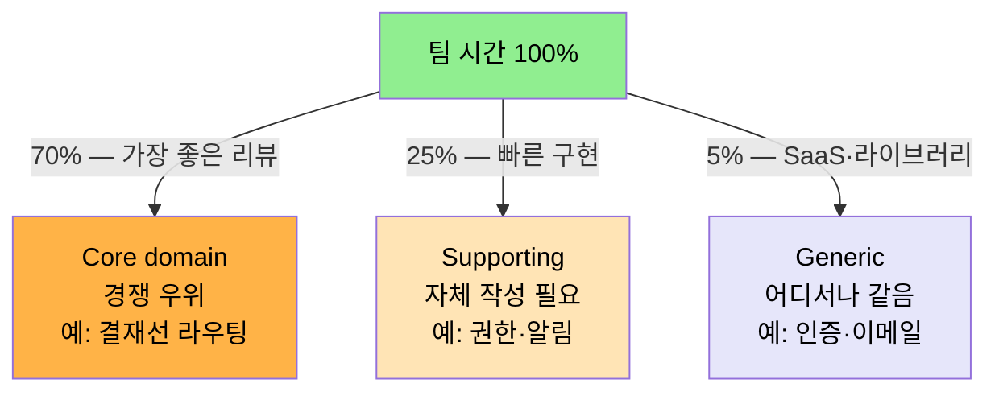
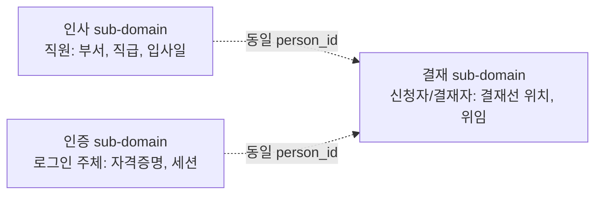

# 도메인 책임 분리와 세부 도메인 식별
---
> 이 문서를 읽고 나면 sub-domain 의 세 종류를 구분할 수 있고, 코드베이스에서 *분리 신호 4가지* 를 진단해 Bounded Context 후보를 식별할 수 있습니다.

> 큰 도메인을 한 덩어리로 두면 어디서부터 손대야 할지 알 수 없습니다. DDD는 도메인을 sub-domain으로 쪼개고, 그것을 다시 bounded context로 매핑합니다. 분리의 기준은 패키지명이 아니라 **언어가 달라지는 지점**입니다.

## 1. Sub-domain과 Bounded Context의 차이

> sub-domain은 문제 공간(problem space)의 구분이고, bounded context는 해결 공간(solution space)의 구분입니다.

Eric Evans와 Vaughn Vernon의 정리에 따르면, sub-domain은 "비즈니스가 인식하는 책임 영역"이며 bounded context는 "그 책임에 맞춰 우리가 그리는 모델의 경계"입니다. 둘이 1:1로 매핑될 수도 있고, 하나의 sub-domain이 두 bounded context로 쪼개질 수도 있습니다.

| 구분 | sub-domain | bounded context |
|------|-----------|-----------------|
| 위치 | 문제 공간 | 해결 공간 |
| 결정 주체 | 비즈니스 | 개발 팀 |
| 변경 동인 | 사업 전략 | 모델 일관성 |
| 식별 단서 | 조직도, R&R | 유비쿼터스 언어의 변화 |

실전에서는 비즈니스가 그리는 sub-domain 지도와 개발이 그리는 bounded context 지도가 어긋납니다. 어긋남을 인지하고 협상하는 것이 strategic design의 첫 단계입니다.

## 2. Sub-domain의 세 종류

> Core / Supporting / Generic 세 분류는 *클래스를 어떻게 그릴지* 가 아니라 *어디에 시간을 쓸지* 의 결정입니다.

DDD는 sub-domain을 셋으로 나눕니다. 분류는 그 sub-domain에 얼마나 투자해야 하는지를 결정합니다.

- **Core domain**: 회사의 경쟁 우위를 만드는 영역. 직접 만듭니다. 결재 시스템에서는 결재선 라우팅 규칙이 여기에 속합니다.
- **Supporting sub-domain**: 핵심은 아니지만 자체 작성이 필요한 영역. 사용자 권한, 알림 채널 같은 것입니다.
- **Generic sub-domain**: 어디서나 똑같이 풀리는 문제. 인증, 결제, 이메일 발송. 가능하면 사오거나 SaaS를 씁니다.

이 분류가 중요한 이유는 **모든 sub-domain에 같은 노력을 쏟지 말라**는 신호이기 때문입니다. Generic을 직접 만들고 거기에 베스트 코드 리뷰를 쏟으면 Core에 쓸 시간이 사라집니다.

비율은 도메인마다 다르지만 *Core 가 시간 분배의 최우선* 이라는 결정이 분류의 본질입니다. Generic 을 직접 만들고 거기에 베스트 코드 리뷰를 쏟는 팀은 Core 의 진화 속도가 느려져 경쟁 우위 자체가 사라집니다.

## 3. 언어가 달라지는 지점을 찾는다

> sub-domain 식별의 실무 단서는 같은 단어가 다른 뜻을 가지는 순간입니다.

결재 도메인 예시를 보면 명확합니다. "사용자"라는 단어가 결재 sub-domain에서는 신청자 또는 결재자를, 인사 sub-domain에서는 직원을, 인증 sub-domain에서는 로그인 주체를 가리킵니다. 같은 ID로 식별되지만 모델이 알아야 할 속성이 다릅니다.

세 sub-domain은 같은 사람을 봅니다. 그러나 각자의 모델에는 자기에게 필요한 속성만 둡니다. 결재 모델에 직급을 넣으면 인사 정보 변경이 결재 모델을 흔듭니다.

## 4. 책임 분리의 실무 신호

> 신호 네 가지 중 두 개 이상이 보이면 분리 검토 시점입니다. 신호 없이 분리하면 *모듈 갯수* 만 늘고 결합도는 줄지 않습니다.

새 기능이 생겼을 때 다음 신호가 보이면 sub-domain을 새로 그리거나 bounded context를 분리할 시점입니다.

- **요청 시 같은 정보를 다르게 부른다** (인사: 직원번호, 결재: 신청자ID)
- **동일 엔티티에 변경 빈도가 크게 다른 필드가 섞인다** (자주 바뀌는 결재선 위치 vs 잘 안 바뀌는 부서)
- **한 팀의 변경이 다른 팀의 배포를 자주 깨뜨린다**
- **데이터베이스 테이블이 한 화면을 그리기 위해 8개 이상 조인된다**

처음 셋은 모델 경계 신호이고, 마지막은 다중 엔티티 조회 패턴(02-10)으로 풀어야 할 신호입니다. 모델 경계 신호를 조회 패턴으로 풀려고 하면 BFF/GraphQL을 도입해도 근본 문제가 풀리지 않습니다.

## 5. Context Map으로 관계 그리기

> Context Map 은 결정이 아니라 *결정의 근거를 그림으로 남기는 도구* 입니다. 새 Context 가 들어올 때마다 갱신합니다.

sub-domain을 식별했으면 bounded context 사이의 관계를 명시합니다. Evans가 정의한 관계 패턴 중 결재 도메인에서 자주 쓰이는 셋은 다음과 같습니다.

| 패턴 | 의미 | 결재 도메인 예 |
|------|------|---------------|
| Customer/Supplier | 하위 컨텍스트가 상위에 요구사항을 낼 수 있다 | 결재 → 인사 (위임자 정보) |
| Anti-Corruption Layer | 외부 모델을 내부 모델로 번역한다 | 결재 → 외부 ERP 결재 시스템 |
| Shared Kernel | 두 컨텍스트가 공유하는 작은 핵심 | 결재 ∩ 인사 (person_id 만) |

Context Map은 그 자체로 결정이 아니라 **결정의 근거를 그림으로 남기는 도구**입니다. 새 컨텍스트가 추가될 때마다 Map을 갱신하고, ADR(01-05)로 결정 사유를 남깁니다.

7가지 패턴 전부와 그 적용 결정 기준은 `01-04 Bounded Context 와 Context Map` 이 다룹니다.

## 6. 분리하지 말아야 할 때

> 분리는 *책임이 갈라질 때만* 합니다. 신호 없이 분리하면 비용만 발생합니다.

DDD를 처음 도입할 때 흔한 실수는 모든 모듈을 sub-domain으로 승격하는 것입니다. 다음 경우는 분리하지 않습니다.

- 변경 동인이 같다 (같은 팀이 같은 일정으로 같이 바꾼다)
- 유비쿼터스 언어가 같다 (같은 단어를 같은 뜻으로 쓴다)
- 데이터 일관성이 절대적으로 필요하다 (한 트랜잭션 안에 묶여야 한다)

이 셋이 모두 만족하면 한 bounded context 안에 두는 것이 옳습니다. 분리 비용(트랜잭션 분할, 통신 비용, 운영 복잡도)이 분리 이익보다 크기 때문입니다. **분리는 책임이 갈라질 때만 합니다.**

## 7. 실제 사례 — 두 자리에서 같은 신호

> 분리 신호는 *책에서만 보는 것* 이 아니라 본인 코드베이스에서 실측 가능합니다. 본 절은 한 자리는 Vernon 원전, 다른 자리는 본인 TPS 에서 같은 신호를 찾습니다.

### 7-1. Vernon SaaSOvation 의 Identity & Access vs Collaboration

Vaughn Vernon 의 *Implementing DDD* 챕터 2~7 은 *Identity & Access Context* (사용자·테넌트·역할 관리) 와 *Collaboration Context* (포럼·게시물·작성자 관리) 를 분리합니다. 두 Context 가 같은 `User` 라는 단어를 사용하지만, Identity 에서는 *자격증명 보유자* 이고 Collaboration 에서는 *작성자·댓글러* 입니다. Vernon 은 §"Open Host Service" 에서 두 Context 가 직접 객체를 공유하지 않고 *REST 자원 형태로 ID·이름·이메일* 만 노출하도록 박습니다. 한쪽 모델 변경이 다른 쪽으로 *번역 한 단계를 거쳐* 만 전파됩니다. 이 분리의 이유는 본 문서 §4 의 두 번째 신호 — *동일 엔티티에 변경 빈도가 다른 필드가 섞임* — 이 정확히 보이기 때문입니다. Identity 의 자격증명은 분기에 한 번 갱신되지만 Collaboration 의 활동 통계는 매 게시물마다 갱신됩니다.

### 7-2. 본인 TPS 의 `사용자` 단어 진단

본인 TPS 의 `~/okestro/tps-gitlab2/operator-api/` 와 `executor/` 두 모듈에서 `사용자` 라는 단어가 세 의미로 사용됩니다 — operator-api 의 결재 도메인에서는 *신청자/결재자*, executor 의 작업 도메인에서는 *작업 트리거 주체*, 인증 게이트웨이에서는 *로그인 주체*. 같은 `userId` 컬럼이 세 자리에 박혀 있지만 각 모듈이 필요로 하는 속성이 다릅니다. 결재 모듈은 `결재선 위치·위임 상태` 가 필요하고, 작업 모듈은 `권한 토큰·실행 환경` 이 필요하며, 인증 게이트웨이는 `세션·자격증명` 이 필요합니다. 세 자리를 같은 모델로 묶는 시도는 *동일 엔티티에 변경 빈도가 다른 필드가 섞임* 신호를 정확히 발생시켜, 인증 토큰 갱신 마이그레이션이 결재선 진화를 막은 사례가 있었습니다 (2026-04). 분리 후 세 모듈은 각자 본인 `userId` 만 들고, 통합은 도메인 이벤트로 처리합니다.

### 7-3. 분리 결정의 게이트

위 두 사례 모두에서 *분리는 사후* 가 아니라 *사전 신호 탐지* 로 결정되었습니다. Vernon 은 책 챕터 시작에서 비즈니스 책임 분리를 박은 뒤 그것이 모델 경계로 옮겨지는 절차를 펼치고, 본인 TPS 사례는 새 기능 PR 의 영향 범위가 *3 개 모듈을 동시에 흔드는* 빈도가 두 분기 연속 증가했을 때 분리가 시작되었습니다. *어긋남이 자라기 전에* 분리하는 것이 핵심이고, 그 자리에 본 문서 §4 의 신호 네 가지가 의사결정 도구로 박힙니다.

## 8. 면접에서 받을 만한 질문

1. Sub-domain 과 Bounded Context 가 1:1 로 매핑되지 않을 때 어떤 결정이 필요합니까? 한 사례를 들어 설명하십시오.
2. Core / Supporting / Generic 분류가 *팀의 채용·외주 결정* 에까지 영향을 주는 이유는 무엇입니까?
3. 분리 신호 네 가지 중 *모델 경계 신호 셋* 과 *조회 패턴 신호 하나* 가 분리된 이유를 설명하십시오.
4. "분리하지 말아야 할 때" 의 세 조건이 모두 만족되는 자리를 분리하면 무엇이 깨집니까?

> 위 질문에 *먼저 자답한 뒤* 아래 §9. 정답 (자답 후 펼치기) 으로 내려갑니다.

## 9. 정답 (자답 후 펼치기)

> 위 §8. 면접에서 받을 만한 질문 의 4개에 *먼저 자답한 뒤* 아래를 읽으세요. 자답 없이 먼저 읽으면 학습 효과가 0입니다.

### 정답 1 — Sub-domain ↔ Bounded Context 비매핑

매핑이 깨지는 흔한 경우 두 가지가 있습니다. (a) 한 sub-domain 이 너무 커서 모델 하나로 담기 어렵다 — 비즈니스가 *결재* 라는 하나의 책임 영역으로 인식하더라도, *결재선 정의* 와 *결재 실행* 은 변경 동인이 달라 두 Bounded Context 로 쪼개야 깨끗합니다. (b) 두 sub-domain 이 같은 모델로 충분하다 — 비즈니스가 *문서 관리* 와 *알림* 을 다른 책임으로 인식하지만 모델은 `Notification` 한 종류로 표현되면 한 Bounded Context 로 묶는 것이 합리적입니다. 결정 절차는 sub-domain 지도와 Bounded Context 지도를 *나란히 그려* 어긋남을 식별 → ADR 로 어긋남 사유 기록 → 팀이 합의 후 진행.

### 정답 2 — 분류가 채용·외주에 미치는 영향

Core 는 *경쟁 우위* 자리라 외주가 위험합니다. 외부 인력이 떠나면 우리 회사의 차별화 노하우가 함께 사라지므로 *정규직 시니어* 가 정답입니다. Supporting 은 자체 작성이 필요하지만 차별화는 아니므로 *외주·계약직* 으로 빠른 구현이 가능합니다. Generic 은 *SaaS·라이브러리* 가 정답이라 내부 개발 인력을 쓰지 않습니다. 본인 TPS 의 결재선 라우팅을 외주에 맡기면 그 외주 회사가 본인 회사의 결재 비즈니스 구조를 *학습* 하고, 계약 종료 시 그 학습이 외주로 흘러갑니다. 그래서 분류는 *코드 라인 분포* 가 아니라 *조직 설계 결정* 으로 이어집니다.

### 정답 3 — 모델 신호 셋 vs 조회 신호 하나

신호 네 가지 중 처음 셋(다른 명명·다른 변경 빈도·다른 팀의 충돌) 은 *모델 자체가 두 책임을 동시에 표현하고 있다* 는 신호이므로 *모델을 분리* 해야 합니다. 마지막 하나(테이블 8개 조인) 는 *모델은 분리되었지만 조회 시점에 한 화면이 여러 모델을 합쳐야 한다* 는 신호이므로 *조회 패턴* (CQRS 의 read model · BFF · GraphQL 합성 layer) 으로 풀어야 합니다. 두 신호를 섞으면, 모델 경계 신호인데 BFF/GraphQL 도입으로 *조회만 합치고* 모델 경계 문제는 그대로 둬, 변경 충돌이 계속 발생합니다. 신호의 *종류* 가 해결 도구의 *종류* 를 결정합니다.

### 정답 4 — 무비판 분리의 비용

세 조건(같은 변경 동인 · 같은 유비쿼터스 언어 · 일관성 절대 필요) 이 모두 만족되는 자리는 *분리 이익이 없는데 분리 비용은 발생* 합니다. 트랜잭션이 두 모듈로 갈라져 분산 트랜잭션 또는 Saga 가 필요해지고, 같은 단어를 두 모듈이 각자 박아 *어휘 표류* 가 시작되며, 한 팀의 PR 이 두 모듈을 동시에 건드려 *코드 리뷰 효율* 이 떨어집니다. 본인이 한 sub-domain 안에서 *그냥 응집도가 높아 보이는* 자리를 분리한 경험이 있다면 이 비용을 직접 체감했을 것입니다.

## 관련 문서

- [유비쿼터스 언어와 도메인 모델](./01-01.유비쿼터스%20언어와%20도메인%20모델.md) — 본 분리 결정의 *어휘 신호* 가 나오는 자리
- [전략적 설계와 전술적 패턴](./01-02.전략적%20설계와%20전술적%20패턴.md) — Bounded Context 안의 Aggregate 배치 결정
- [Bounded Context 와 Context Map](./01-04.Bounded%20Context%20와%20Context%20Map.md) — Context 사이 7가지 통신 패턴
