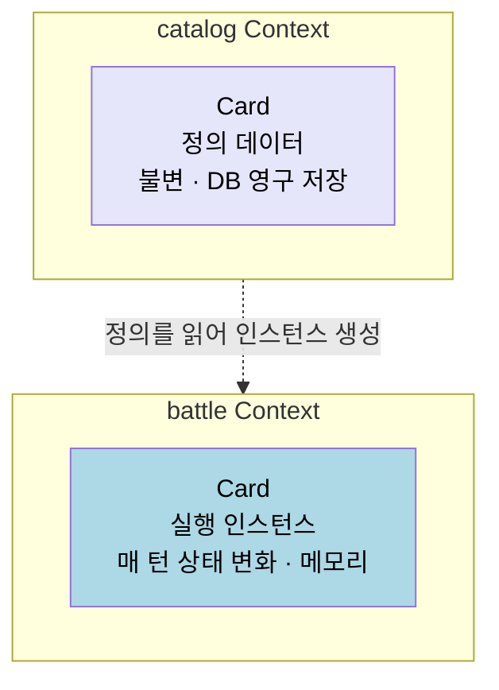
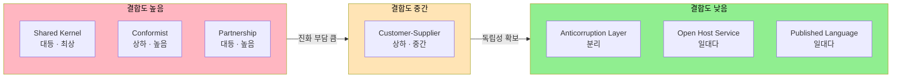

# Bounded Context 와 Context Map
---
> 이 문서를 읽고 나면 Context Map 의 7가지 통신 패턴을 권력 관계와 모델 결합도 두 축으로 정렬할 수 있고, 본인 코드베이스의 통합 자리에 어느 패턴이 박혀 있는지 진단할 수 있습니다.

> 같은 단어가 두 팀에서 다른 의미일 때, 그 차이를 모델 안에서 인정하고 경계와 관계를 그려 두지 않으면 통합 시점에 모든 가정이 깨집니다. Bounded Context 는 "여기서 이 단어는 이 뜻입니다" 의 선언이고, Context Map 은 그 선언들 사이의 정치적 관계를 가시화합니다.

`01-02 §2` 에서 런 관리 예시의 4 개 Context(run·battle·catalog·progression)를 나눴습니다. 본 문서는 그 분할을 가능하게 만드는 두 가지 도구 — Bounded Context 의 정의와 Context Map 의 7 가지 통신 패턴 — 을 정리합니다.

## 1. Bounded Context 가 푸는 문제

> 하나의 거대 모델 대신 비즈니스 의도에 맞춰 여러 작은 모델을 두는 결정의 근거.

DDD 가 "거대한 Customer 객체에 청구 데이터·개인 데이터·배송 주소·본사 주소를 모두 넣지 마라" 고 말하는 이유는 단순합니다. 물류 영역을 수정할 때 판매와 구매 영역도 함께 흔들리기 때문입니다. 같은 단어가 여러 의미를 동시에 가지면 변경 비용이 그래프의 차수만큼 증가합니다.

Bounded Context 는 "이 경계 안에서 Customer 는 이 뜻입니다" 를 명시합니다. 다른 Context 에서 같은 이름이 다른 뜻이면 그건 다른 객체입니다. 단어를 통일하는 것이 아니라 단어의 사용 범위를 통일합니다.

여기서 질문 하나 — 그렇다면 경계는 어떻게 정합니까? 비즈니스 능력(business capability)·팀 구성·언어 변화의 지점 세 가지를 함께 봅니다. 자세한 분류 기준은 `01-03 §2~3` 의 sub-domain 신호와 같습니다.

## 2. Bounded Context 의 경계 식별

> 언어 차이·팀 경계·트랜잭션 요구의 세 신호가 한 자리에 모이는 지점이 자연스러운 경계입니다.

`01-03` 이 sub-domain 분류 신호를 다뤘다면, 본 절은 그 분류를 Context 경계로 옮기는 절차입니다. 다음 네 단계로 진행합니다.

1. 같은 단어가 여러 의미로 쓰이는 지점을 도메인 전문가와 함께 식별합니다.
2. 각 의미별로 책임이 분명한 모델을 그립니다. 같은 이름이라도 모델이 다르면 다른 Context 입니다.
3. 트랜잭션 요구·변경 빈도·저장 전략이 함께 갈리면 경계 후보를 확정합니다.
4. Context Map(`§3`) 에서 다른 Context 와의 관계를 정의합니다.

런 관리 예시에서 `Card` 는 catalog Context 에서는 정의 데이터(불변 카탈로그)고, battle Context 에서는 매 턴 상태가 바뀌는 인스턴스입니다. 두 의미를 한 모델에 담으면 catalog 의 영구 저장 요구와 battle 의 메모리 처리 요구가 충돌합니다. 경계를 가르는 것이 두 책임을 자유롭게 만듭니다.

같은 `Card` 단어를 두 Context 가 *각자의 측면만* 박는다는 점이 핵심입니다. 한쪽 모델이 다른 쪽 측면을 갖지 않기 때문에 *변경 동인이 분리됩니다* — 정의 변경은 catalog 에서만, 실행 변경은 battle 에서만 발생합니다.

## 3. Context Map 의 7 가지 통신 패턴

> 두 Context 가 만나는 방식은 "누가 누구의 모델을 따르는가" 에 따라 일곱 가지로 갈립니다.

Evans 가 제시한 통신 패턴은 권력 관계와 모델 결합도의 두 축으로 정리됩니다. 같은 통합이라도 어느 패턴을 선택하느냐에 따라 향후 변경 비용이 결정됩니다.

| 패턴 | 권력 관계 | 모델 결합도 | 적용 상황 |
|------|-----------|------------|-----------|
| Partnership | 대등 | 높음 | 두 팀이 함께 진화시키는 공동 책임 영역 |
| Shared Kernel | 대등 | 최상 | 두 Context 가 공유하는 작은 공통 모델 |
| Customer-Supplier | 상하 | 중간 | Upstream 이 Downstream 요구를 받아들임 |
| Conformist | 상하 | 높음 | Downstream 이 Upstream 모델을 그대로 따름 |
| Anticorruption Layer | 분리 | 낮음 | Downstream 이 자기 모델로 번역하는 방어층 |
| Open Host Service | 일대다 | 낮음 | Upstream 이 공개 프로토콜로 다수 Downstream 지원 |
| Published Language | 일대다 | 낮음 | OHS 위에서 표준화된 데이터 형식 합의 |

다음 도식은 7 가지 패턴을 권력 관계 × 결합도 두 축으로 펼친 결정 격자입니다.

격자에서 위로 갈수록 *함께 진화* 가 쉬워지지만 *변경의 파급* 도 커집니다. 아래로 갈수록 *독립성* 이 살아나지만 *번역 비용·합의 비용* 이 생깁니다. 패턴 선택은 두 비용의 트레이드오프 결정입니다.

여기서 질문 하나 — 외부 결제 시스템과 통합할 때 어느 패턴이 맞을까요? Anticorruption Layer 입니다. 그쪽 모델을 그대로 따라가면(Conformist) 결제 시스템의 도메인 어휘가 우리 도메인을 오염시킵니다. 번역층을 둬서 외부 모델의 변경이 우리 도메인까지 닿지 않게 막습니다.

## 4. 런 관리 예시에 적용

> 4 개 Context 가 어떤 관계로 만나는지 표로 박제해 두면, 새 기능이 어느 경계를 침범하는지 즉시 보입니다.

`01-02 §2` 의 4 개 Context 를 `§3` 의 패턴으로 매핑하면 다음 관계가 됩니다.

| Upstream → Downstream | 관계 | 패턴 | 이유 |
|------------------------|------|------|------|
| catalog → battle | 데이터 공급 | Open Host Service | catalog 가 카드·유물 정의를 공개 형식으로 노출, battle 은 읽기 전용 |
| catalog → run | 데이터 공급 | Open Host Service | 동일. 런 보상 후보 선택용 |
| run → battle | 흐름 조정 | Customer-Supplier | run 이 battle 시작·종료의 요구를 결정 |
| battle → run | 결과 통지 | Domain Event | battle 결과를 run 이 비동기로 수신 |
| run → progression | 결과 통지 | Domain Event | run 종료가 progression 의 해금 트리거 |
| 외부 결제 → progression | 통합 | Anticorruption Layer | 결제 시스템 모델을 progression 모델로 번역 |

이 표가 박제되면 새 기능이 들어올 때마다 "이 통합은 어느 행에 해당하는가" 만 답하면 됩니다. 답이 없으면 새 행을 추가하고 패턴을 정합니다. 패턴 없이 통합부터 시작하면 결합도가 자라납니다.

표를 두는 자리는 보통 `docs/` 의 ADR 또는 README 입니다. 코드 안 주석에 박으면 *통합이 추가될 때마다 모든 코드 주석이 흔들립니다*. 한 자리에 박혀 있어야 *결정의 단일 진실원* 으로 기능합니다. 본인 TPS 의 경우 `~/okestro/tps-gitlab2/docs/architecture/context-map.md` 가 이 자리이며, 새 통합이 추가되면 ADR 부록으로 행을 늘립니다.

표의 *행 단위* 가 결정의 단위입니다. 한 통합 관계를 *두 패턴으로 동시에* 박으면 안 됩니다. 패턴이 하나로 박혀야 *변경 책임의 주체* 가 명확해집니다. 예를 들어 catalog → battle 자리를 "OHS 이면서 Shared Kernel" 로 박으면 양쪽 모듈이 서로의 진화 정책을 동시에 따라야 해 진화 속도가 둘 다 떨어집니다. 한 행은 *하나의 패턴* 으로 결정되고, 그 패턴이 바뀌어야 한다면 그것은 *결정 변경* 으로 ADR 에 기록됩니다.

## 5. 실제 사례 — 본인 TPS 의 operator-api ↔ executor

> 책에서 본 패턴이 본인 코드베이스의 어느 자리에 어떻게 박혀 있는지를 확인하면 패턴이 기억으로 굳습니다.

### 5-1. 두 모듈의 책임과 어휘 차이

`~/okestro/tps-gitlab2/operator-api/` 와 `executor/` 는 TPS 시스템의 두 핵심 Bounded Context 입니다. operator-api 는 *결재·승인·티켓 수명 주기* 를 다루고, executor 는 *Jenkins 작업 실행·결과 수집·재시도* 를 다룹니다. 두 모듈은 `티켓` 이라는 단어를 공유하지만 측면이 다릅니다 — operator-api 의 `Ticket` 은 *결재 단위* (신청자·결재선·승인 상태) 이고, executor 의 `Ticket` 은 *실행 단위* (Jenkins job id·queue id·실행 환경) 입니다. 두 측면을 한 모델에 묶지 않고 각자의 본인 `Ticket` 을 들도록 분리되어 있습니다.

### 5-2. Customer-Supplier 관계의 코드 증거

operator-api → executor 는 Customer-Supplier 관계입니다. operator-api 가 *결재 완료된 티켓의 실행을 요구* 하면 executor 가 그 요구를 받아들여 Jenkins 큐에 적재합니다. 코드 증거 — operator-api 의 결재 완료 이벤트 `TicketApprovalCompletedEvent` 가 executor 의 Kafka consumer 어댑터에서 수신되어 `executor/.../JobDispatchService.dispatch()` 를 호출하는 흐름입니다. operator-api 가 *무엇을 실행할지* 를 결정하고, executor 가 *어떻게 실행할지* 를 결정합니다. 두 책임이 한 모듈에 묶이면 결재 정책 변경이 Jenkins 큐 정책 변경을 함께 흔들고, 그 반대도 마찬가지입니다.

### 5-3. 통합 형식 — Avro published language

두 모듈 사이의 메시지 형식은 Avro 스키마로 박혀 있고, 스키마는 양쪽 모듈이 *공유하는 별도 저장소* (`message-lib` 모듈) 에 둡니다. 이는 Context Map 의 *Published Language* 패턴과 정확히 일치합니다. 양쪽 모듈은 같은 Avro 스키마를 통해 통신하되, 본인 모듈 내부 도메인 모델은 자유롭게 진화합니다. Avro 스키마 변경은 양쪽 모듈의 빌드 시점에 *호환성 검사* 가 강제되어, 한쪽이 다른 쪽 모르게 형식을 깨는 일이 막힙니다. `~/okestro/tps-gitlab2/message-lib/src/main/avro/` 가 이 합의의 SSOT 입니다.

### 5-4. 같은 `고객` 이 Context 마다 다른 측면이 되는 이유

SK C&C 의 [DDD 전략적 설계](https://engineering-skcc.github.io/microservice%20modeling/ddd-Srategic-design/) 글은 같은 `고객` 이라는 단어가 Context 에 따라 다른 모델이 되는 이유를 설명합니다. 결제 Context 에서 `고객` 은 *지불자* 의 속성(카드·잔액·결제 수단) 이 중요하고, 배송 Context 에서는 *수취자* 의 정보(주소·연락처·부재 시 처리) 가 우선입니다. 두 측면을 한 `고객` 모델에 다 담으면 결제가 배송 속성 변경에, 배송이 결제 속성 변경에 함께 흔들려 의존관계가 늘어납니다. 그래서 한 단어가 *모든 맥락을 포괄하려는 순간* 이 곧 Bounded Context 분리 신호입니다 — 본 문서 §2 의 경계 식별과 정확히 같은 판단입니다. 유비쿼터스 언어가 맥락 안에서만 의미를 갖는다는 점은 방언의 "거시기" 가 상황에 따라 다른 대상을 가리키는 것과 같습니다(`01-01 §6` Bounded Context 초안과 이어집니다).

같은 글은 Context Map 이 *고정된 그림이 아니라 진화한다* 는 점도 보여줍니다. 초기에는 사용자·계정·장바구니·주문·재고 사이의 *개념적 관계* 만 그리다가, 구현 기술이 정해지면 그 화살표에 HTTP/JSON 동기 호출인지 비동기 이벤트 메시지인지를 명시합니다. 통합 기술은 관계 성격이 정해진 *뒤* 고릅니다 — 강결합을 피해야 하는 경계는 이벤트로, 즉시 일관성이 필요한 경계는 동기 호출로. 이렇게 식별된 Bounded Context 는 그대로 마이크로서비스 분리 후보 경계가 되며, 이것이 §3 Context Map 패턴이 MSA 도출 기법으로 쓰이는 이유입니다.

## 6. 면접에서 받을 만한 질문

1. Context Map 의 7가지 패턴을 *권력 관계 × 결합도* 두 축으로 정렬하라면 어느 자리에 무엇이 옵니까?
2. 외부 시스템과 통합할 때 Conformist 와 Anticorruption Layer 중 어느 쪽을 선택해야 하며, 그 기준은 무엇입니까?
3. Open Host Service 와 Published Language 는 어떤 관계입니까? 한쪽 없이 다른 쪽만 둘 수 있습니까?
4. 본인 코드베이스에서 *암묵적으로 Shared Kernel* 이 박혀 있는데 명시되지 않은 자리가 있다면 어떤 비용이 발생하고 있을 가능성이 큽니까?

> 위 질문에 *먼저 자답한 뒤* 아래 §7. 정답 (자답 후 펼치기) 으로 내려갑니다.

## 7. 정답 (자답 후 펼치기)

> 위 §6. 면접에서 받을 만한 질문 의 4개에 *먼저 자답한 뒤* 아래를 읽으세요. 자답 없이 먼저 읽으면 학습 효과가 0입니다.

### 정답 1 — 7가지 패턴의 정렬

본 문서 §3 의 격자가 정답입니다. 권력 관계 축으로 — 대등(Partnership, Shared Kernel), 상하(Customer-Supplier, Conformist), 분리(ACL), 일대다(OHS, Published Language). 결합도 축으로 — 최상(Shared Kernel), 높음(Partnership, Conformist), 중간(Customer-Supplier), 낮음(ACL, OHS, Published Language). 격자에서 *결합도가 높을수록 함께 진화는 쉽지만 변경 파급도 크다* 는 트레이드오프가 박혀 있어, 패턴 선택은 *팀의 진화 속도 차이* 가 결정 요소가 됩니다.

### 정답 2 — Conformist vs ACL

기준은 *외부 모델의 안정성과 본인 도메인의 보호 가치* 입니다. 외부 모델이 안정적이고 우리가 직접 통제할 수 없으며, 본인 도메인이 외부 어휘를 차용해도 무해하면 Conformist 가 빠르고 단순합니다. 외부 모델이 자주 바뀌거나, 본인 도메인 어휘가 외부와 *충돌* 하거나, 외부 변경이 본인 코어로 전파되면 안 되는 자리라면 ACL 이 정답입니다. 결재 도메인이 외부 ERP 결재 시스템을 *Conformist 로 따라가면* ERP 의 코드 정의가 바뀔 때마다 본인 코드를 따라가야 하지만, ACL 을 두면 본인 모델은 안정적이고 ACL 만 갱신하면 됩니다.

### 정답 3 — OHS와 Published Language

Open Host Service (OHS) 는 *Upstream 이 공개 프로토콜로 다수 Downstream 을 지원* 하는 패턴이고, Published Language (PL) 은 *그 프로토콜 위에서 표준화된 데이터 형식 합의* 입니다. 둘은 *층위가 다른 합의* 입니다 — OHS 는 "어떻게 부를 것인가" (REST 자원, Kafka topic 등) 이고, PL 은 "어떤 형식으로 부를 것인가" (JSON 스키마, Avro 스키마 등). OHS 없이 PL 만 두는 것은 어색합니다 — 호출 방식이 없는 형식 합의는 의미가 없습니다. 역으로 OHS 만 두고 PL 을 안 두면 각 Downstream 이 본인 마음대로 형식을 해석해 *통합이 깨집니다*. 둘은 항상 *짝* 으로 결정됩니다.

### 정답 4 — 암묵적 Shared Kernel 의 비용

Shared Kernel 은 *명시된 공유* 이고, 양쪽 팀이 합의해 진화시킵니다. *암묵적* Shared Kernel — 즉 두 모듈이 같은 공통 객체(예: `UserDto`, `CommonException`) 를 모르게 공유하고 있다면, 한쪽 변경이 다른 쪽을 *예고 없이 깨는* 비용이 발생합니다. 본인 코드베이스에서 가장 흔한 자리는 *공통 유틸 모듈* 입니다. 한 회사의 `common-core` 모듈이 *수십 개의 다른 모듈* 에서 공유되면, 그 모듈의 한 줄 변경이 모든 모듈 빌드를 깨뜨릴 수 있고, 모든 팀의 합의 없이는 한 자리를 손볼 수 없게 됩니다. 해결은 *암묵을 명시로* 바꾸는 것입니다 — Shared Kernel 임을 선언하고, 진화 정책 (어느 팀이 책임지는가·언제 합의하는가) 을 ADR 에 박습니다.

## 관련 문서

- [유비쿼터스 언어와 도메인 모델](./01-01.유비쿼터스%20언어와%20도메인%20모델.md) — Context 안의 언어를 어떻게 박을 것인가
- [도메인 책임 분리와 세부 도메인 식별](./01-03.도메인%20책임%20분리와%20세부%20도메인%20식별.md) — Sub-domain 신호가 Context 경계의 1차 후보
- [모놀리스에서 마이크로서비스로](./03-04.모놀리스에서%20마이크로서비스로%20—%20언제%2C%20왜.md) — Context 가 안정되어야 물리적 분리가 의미를 갖습니다
