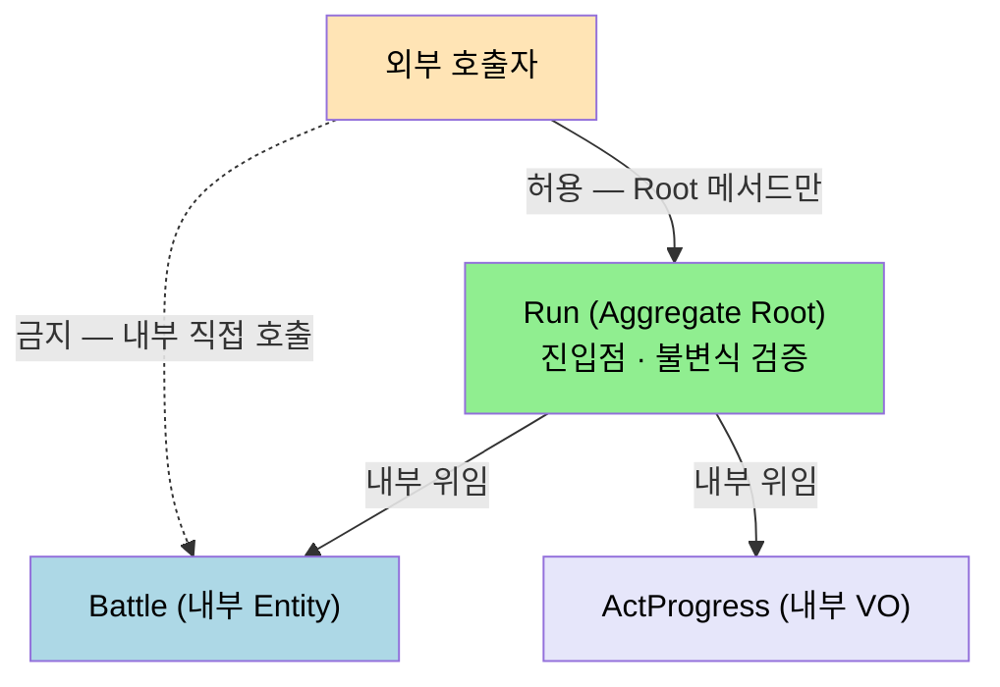
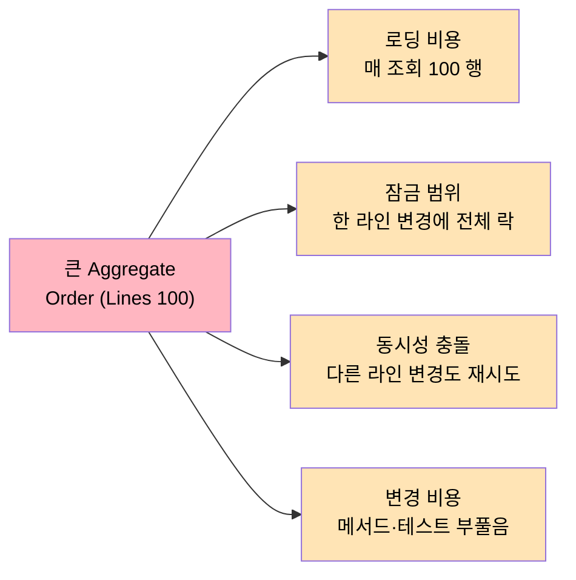

# Aggregate 설계 규칙
---
> 이 문서를 읽고 나면 Aggregate 경계가 *잠금 범위·로딩 비용·동시성 충돌* 세 자리를 동시에 결정하는 메커니즘을 설명할 수 있고, 큰 Aggregate 의 비용을 측정 가능한 신호로 진단할 수 있습니다.

> Aggregate 는 객체 묶음이 아니라 "한 번의 트랜잭션 안에서 어떤 불변식을 함께 지킬 것인가" 의 결정입니다. 이 결정이 어긋나면 동시성 비용이 폭발하거나, 반대로 일관성이 새는 구멍이 생깁니다.

`01-02 §3` 에서 "런 관리 예시에서 Run 을 상위 Aggregate 로 보되, Battle 을 하위 또는 별도 Aggregate 로 둘 수 있다" 는 결정 사례를 다뤘습니다. 본 문서는 그 결정을 가능하게 만드는 규칙 자체만 다룹니다.

## 1. Aggregate Root 가 책임지는 것

> Root 는 진입점·불변식·변경 묶음의 세 책임을 한 객체로 통합합니다.

Aggregate 는 Entity 와 Value Object 의 그래프지만 외부로 노출되는 진입점은 단 하나 — Aggregate Root 입니다. 외부 코드가 내부 Entity 에 직접 손을 뻗으면 Root 의 불변식 검증 지점이 사라집니다. Root 가 책임지는 것은 다음 세 가지입니다.

1. 유일한 진입점 — 외부 코드는 Root 의 메서드만 호출하며, 내부 Entity 의 참조를 외부로 흘려 보내지 않습니다.
2. 불변식 강제 — "주문 라인 합계 ≤ 신용 한도" 같은 비즈니스 규칙을 Root 메서드 안에서 검증합니다.
3. 변경의 묶음 — 내부 Entity 가 바뀌었다면, 그것은 Root 가 그 변경을 받아들였다는 뜻입니다.

여기서 질문 하나 — 그렇다면 캡슐화는 문법적 `private` 의 문제일까요? 그렇지 않습니다. 캡슐화는 호출 경로의 정책입니다. 패키지 가시성으로 노출된 Entity 라도, 호출 흐름이 항상 Root 를 통과한다면 캡슐화는 살아 있습니다.

런 관리 예시로 옮기면 `Run` 이 Root 일 때 외부는 `run.completeBattle(battleId, result)` 만 호출합니다. `Battle` 인스턴스를 직접 들고 와 `battle.applyDamage(...)` 를 부르면, `Run` 의 "전투 횟수 ≤ 3" 같은 불변식을 검증할 자리가 사라집니다.



도식에서 점선이 *금지된 호출 경로* 입니다. 외부가 Battle 을 직접 잡으면 Run 의 불변식 검증이 우회됩니다. 도구가 강제할 수 없는 부분이라 *팀 합의* 와 *코드 리뷰 게이트* 가 필요한 자리이기도 합니다.

## 2. 트랜잭션 경계와 일관성

> 하나의 트랜잭션은 하나의 Aggregate — 이 휴리스틱이 강한 일관성과 결과적 일관성의 분기점입니다.

DDD 가 제시하는 가장 강한 휴리스틱은 "하나의 트랜잭션은 하나의 Aggregate" 입니다. 이 규칙은 두 가지를 동시에 말합니다. Aggregate 내부는 강한 일관성으로, Aggregate 사이는 결과적 일관성으로 다룬다는 뜻입니다.

내부 강한 일관성의 예시는 다음과 같습니다. `Run.completeBattle()` 안에서 `battle.markFinished()` 와 `run.advanceNode()` 가 함께 일어난다면 둘은 같은 트랜잭션에서 커밋되거나 같이 롤백됩니다. 부분 갱신은 허용하지 않습니다.

Aggregate 사이는 다릅니다. `Run` 이 끝났다는 사실로 `Progression.unlock(...)` 을 해야 한다면, 그건 두 번째 트랜잭션입니다. Domain Event + Outbox + 비동기 핸들러로 처리합니다. 구현 패턴은 `../05_edd/03-01.Saga, Outbox, Request-Response Bridge.md` 와 `../../04_messaging/05_ConsistencyPattern/01-03.Outbox.md` 가 다룹니다.

이 휴리스틱이 절대 법이 아닌 이유는 분명합니다. 한 트랜잭션에 두 Aggregate 를 묶어야 풀리는 사례도 있습니다. 그렇게 결정했다면 왜 휴리스틱을 깼는지를 코드 주석이 아니라 ADR(`../01-05.ADR과 Spring Boot 아키텍처 의사결정.md`) 에 남깁니다. 다음 사람이 다시 풀려고 시간 쓰지 않게.

### 2-1. 동시성과 잠금

같은 Aggregate 인스턴스에 두 요청이 동시에 들어오면 일관성이 깨질 수 있습니다. 흔한 대응은 두 가지입니다.

| 방식 | 동작 | 적합 도메인 |
|------|------|-------------|
| 낙관적 잠금 | Root 에 `@Version` 컬럼을 두고 커밋 시점에 버전 충돌이면 재시도 | 충돌 빈도가 낮은 일반 도메인 |
| 비관적 잠금 | `SELECT ... FOR UPDATE` 로 행 잠금 | 결제·재고처럼 충돌이 잦거나 재시도 비용이 큰 도메인 |

Aggregate 가 크면 클수록 잠금 범위도 함께 커집니다. 이 부담이 `§4` 의 비용 논의로 이어집니다.

## 3. ID 참조 vs 객체 참조

> Aggregate 끼리는 ID 로 잇고, 같은 Aggregate 내부에서만 객체 참조를 씁니다.

Aggregate 끼리는 객체 참조가 아니라 ID 참조로 잇습니다. 이유는 두 가지입니다.

1. 로딩 범위가 명확해집니다 — `Run` 을 메모리에 올릴 때 연결된 모든 `Profile` 까지 끌고 오지 않습니다.
2. 트랜잭션 경계가 보호됩니다 — 객체 참조가 있으면 한 메서드 안에서 두 Aggregate 의 상태를 동시에 변경하기 쉬워집니다.

`Run` 의 필드 구성은 다음 형태가 됩니다.

```java
// Run.java
public final class Run {
    private final RunId id;
    private final ProfileId profileId;        // 다른 Aggregate 는 ID 로
    private final List<BattleId> battleIds;   // 다른 Aggregate 는 ID 로
    private ActProgress actProgress;          // 같은 Aggregate 내부 VO 는 객체 참조
    // ...
}
```

`ProfileId` 는 Value Object 입니다. 단순 `Long` 보다 의미가 명확하고 다른 ID 와 혼동될 일이 없습니다. record · sealed 로 강제하는 방식은 `02-02.Entity 와 Value Object.md` 가 다룹니다.

같은 Aggregate 내부에서는 객체 참조가 자연스럽습니다. `Run` 이 자기 안의 `ActProgress` 를 직접 들고 있는 것은 문제가 없습니다. 어차피 같은 트랜잭션에서 같이 로드되고 같이 저장됩니다.

### 3-1. 외부 Aggregate 가 필요할 때

`Run.completeBattle()` 안에서 `Profile.unlockReward(...)` 를 호출해야 한다고 느꼈다면, 두 가지 중 하나로 풀어야 합니다.

1. 두 트랜잭션 + Domain Event — `Run` 이 `BattleCompleted` 이벤트를 발행하고 `Profile` 측 핸들러가 별도 트랜잭션에서 처리합니다.
2. Domain Service — 두 Aggregate 를 함께 다뤄야 하는 비즈니스 규칙이라면 `RewardGrantService` 같은 Domain Service 가 두 Root 를 받아 조율합니다. 다만 그 안에서도 트랜잭션은 분리합니다.

`Run` 메서드가 `Profile` 인스턴스를 직접 잡고 변형하기 시작하면 둘은 사실상 한 Aggregate 입니다. 합치든가, 합칠 수 없다면 위 두 방식 중 하나를 골라야 합니다.

## 4. 큰 Aggregate 의 비용

> "관련 있어 보이니 다 묶자" 는 결정은 로딩·잠금·동시성·변경 비용을 동시에 부풀립니다.

초보 설계는 한 Aggregate 가 너무 큽니다. "관련 있어 보이니 다 묶자" 의 결과입니다. 비용은 다음 네 지점에서 누적됩니다.

1. 로딩 비용 — Root 를 불러올 때 그래프 전체가 따라옵니다. 100 개의 라인이 달린 주문은 매 조회마다 100 개를 가져옵니다.
2. 잠금 범위 — 비관적이든 낙관적이든 잠금 단위는 Aggregate 입니다. 한 라인을 바꾸려고 주문 전체를 잠급니다.
3. 동시 변경 충돌 — 동일 Aggregate 의 다른 부분을 두 사용자가 동시에 변경할 때 낙관적 잠금에서는 한쪽이 무조건 재시도입니다.
4. 변경 비용 — Aggregate 가 크면 한 메서드의 책임이 부풀고 테스트도 따라 부풉니다.



네 비용이 *하나의 결정* 에서 동시에 발생한다는 점이 중요합니다. 큰 Aggregate 는 한 자리에서 손해를 보지 않고 네 자리에 분산되어 누적되어, 측정이 어렵고 진단이 늦어집니다.

### 4-1. 분리의 신호

다음 신호 중 둘 이상이 보이면 Aggregate 를 쪼개는 것을 검토합니다.

| 신호 | 해석 |
|------|------|
| 서로 다른 라이프사이클 | `Run` 은 세션 단위, `Profile` 은 영구. 같이 묶을 이유가 약함 |
| 서로 다른 변경 빈도 | 카탈로그 `CardDefinition` 은 거의 안 바뀌고 `Run` 은 매 턴 바뀜 |
| 서로 다른 트랜잭션 요구 | `Battle` 은 매 턴 강한 일관성이 필요하지만 `Progression` 은 결과적 일관성이면 충분 |
| 서로 다른 저장 전략 | 한쪽은 JPA, 한쪽은 Redis, 한쪽은 Event Sourcing |

### 4-2. 분리의 안전망

쪼개기로 결정했다면 다음 네 단계를 준비합니다.

1. 새 Aggregate Root 의 식별자(Value Object) 를 정의합니다.
2. 기존 객체 참조를 ID 참조로 교체합니다. 호출자에서 `findById` 한 단계가 늘어납니다.
3. 두 Aggregate 가 함께 변해야 하는 규칙은 Domain Event 로 전환합니다 (`../05_edd/03-01.Saga, Outbox, Request-Response Bridge.md`).
4. 분리 전후의 불변식을 테스트로 박제합니다. 분리 과정에서 가장 깨지기 쉬운 지점입니다.

런 관리 예시에서 `Battle` 을 별도 Aggregate 로 빼는 결정은 `§2-1` 의 동시성 요구 차이에서 출발합니다. 전투는 매 턴 강한 일관성이 필요하지만 런 전체는 그렇지 않습니다. 분리 비용은 위 네 단계이고, 얻는 것은 잠금 범위 축소와 저장 전략 자유도입니다.

## 5. 실제 사례 — 세 자리에서 본 Aggregate 결정

> 책에서 본 규칙이 본인 코드와 오픈소스 어디에 어떻게 박혀 있는지를 확인하면 *큰 Aggregate 와 작은 Aggregate* 의 비용 차이가 기억으로 굳습니다.

### 5-1. eShopOnContainers Ordering 의 Order Aggregate

Microsoft 의 학습용 오픈소스 [eShopOnContainers](https://github.com/dotnet-architecture/eShopOnContainers) 의 `Ordering` 마이크로서비스는 `Order` 를 Aggregate Root 로 두고 `OrderItem` 을 내부 Entity 로 둡니다. 코드 증거 — `src/Services/Ordering/Ordering.Domain/AggregatesModel/OrderAggregate/Order.cs` 의 `Order` 클래스가 `AddOrderItem(...)` 메서드를 통해서만 OrderItem 을 추가하도록 강제합니다. `OrderItem` 의 생성자는 `internal` 접근 제한이라 외부에서 직접 만들 수 없고, *반드시 `Order.AddOrderItem` 을 통과* 해야 합니다. 이 구조가 본 문서 §1 의 *유일한 진입점* 규칙의 정확한 코드 실현입니다. 같은 repo 의 `Buyer` 는 *별도 Aggregate Root* 로 분리되어 있는데, 이유는 본 문서 §4-1 의 *서로 다른 라이프사이클* 신호 — Buyer 는 영구, Order 는 주문 단위 — 가 정확히 들어맞기 때문입니다.

### 5-2. 본인 TPS Executor 의 JobExecution Aggregate

본인 redpanda-playground 의 executor 모듈 (`~/Library/CloudStorage/GoogleDrive-tscofet@gmail.com/내 드라이브/study/redpanda-playground/executor/`) 은 `JobExecution` 을 Aggregate Root 로 두고 `RetryAttempt` 를 내부 Entity 로 둡니다. 초기 설계는 `JobExecution` 안에 모든 단계 (`Queued`, `Running`, `Retried`, `Completed`) 의 이력을 통째로 묶었는데, 한 실행이 *수십 번 재시도* 되는 경우 로딩 비용이 누적되었습니다. POL-002 식별 그룹화 (`project_executor_pol002_identity.md`) 작업에서 `JenkinsIdentity` 를 별도 VO 로 빼고, 재시도 카운트 누적 갱신은 `incrementRetryIfPending` 같은 native SQL 로 우회하면서 *Aggregate 경계 안에서 부분 갱신* 의 부담을 줄였습니다. 이 사례의 교훈 — *Aggregate 가 크면 부분 갱신마저도 비용이 된다*, 그리고 *@Version 영역에 native SQL 침범* 같은 사고를 일으킬 수 있다 (MEMORY `feedback_jpa_version_native_sql_self_race.md`).

### 5-3. Vernon Cargo 의 작은 Aggregate 권고

Vaughn Vernon 의 *Implementing DDD* (Addison-Wesley, 2013) 챕터 10 "Aggregates" 은 *작은 Aggregate 가 기본* 임을 강하게 권고합니다. 같은 챕터의 "Rule: Design Small Aggregates" 절은 큰 Aggregate 가 트랜잭션 실패율을 높이는 *실제 측정 데이터* 를 제시합니다 — 한 Aggregate 안에 평균 10 개 Entity 가 있는 시스템에서 동시 갱신 충돌이 발생할 확률이 작은 Aggregate 대비 10 배 가까이 높았다는 사례입니다. Vernon 은 같은 챕터 §"Rule: Reference Other Aggregates by Identity" 에서 본 문서 §3 의 ID 참조 규칙을 같은 어휘로 박습니다. 두 규칙이 *한 자리에 묶여* 나오는 이유는 *Aggregate 분리* 와 *ID 참조 도입* 이 같은 결정의 두 면이기 때문입니다.

## 6. 면접에서 받을 만한 질문

1. "하나의 트랜잭션은 하나의 Aggregate" 휴리스틱을 깨야 하는 사례가 있다면 어떤 자리이며, 깬 결정은 어디에 기록합니까?
2. Aggregate Root 의 *유일한 진입점* 규칙을 *문법적 private* 만으로 강제할 수 없는 이유를 한 시나리오로 설명하십시오.
3. 큰 Aggregate 가 발생시키는 네 비용 중 *측정이 가장 늦게 발견되는* 것은 무엇입니까? 왜 그렇습니까?
4. ID 참조와 객체 참조의 선택이 *마이크로서비스 분리 시점* 과 어떻게 연결됩니까?

> 위 질문에 *먼저 자답한 뒤* 아래 §7. 정답 (자답 후 펼치기) 으로 내려갑니다.

## 7. 정답 (자답 후 펼치기)

> 위 §6. 면접에서 받을 만한 질문 의 4개에 *먼저 자답한 뒤* 아래를 읽으세요. 자답 없이 먼저 읽으면 학습 효과가 0입니다.

### 정답 1 — 휴리스틱을 깨는 자리

깨야 하는 자리는 *두 Aggregate 가 한 트랜잭션 안에서 함께 변하지 않으면 비즈니스 규칙이 깨지는* 경우입니다. 흔한 예 — *재고 차감 + 주문 생성* 을 동시에 해야 하는 자리, *계좌 이체* 처럼 두 계좌의 합이 보존되어야 하는 자리. 결과적 일관성으로 풀면 *중간 상태* 에서 비즈니스가 깨집니다 (재고는 차감되었는데 주문은 실패, 계좌 A 는 인출되었는데 B 는 입금 안 됨). 결정을 깼다면 *왜* 를 ADR 에 기록합니다 — 다음 사람이 *다시 결정* 하려고 시간을 쓰지 않게. 본인 TPS 의 결재 완료 + 후속 작업 트리거 자리는 깨지 않고 Outbox 로 결과적 일관성을 받아들였습니다 — 알림 발사 지연이 비즈니스 규칙을 깨지 않기 때문입니다.

### 정답 2 — private 만으로 부족한 이유

`private` 은 *문법적* 캡슐화이지 *호출 경로* 의 캡슐화가 아닙니다. 같은 패키지 안의 다른 클래스가 패키지 가시성으로 노출된 Entity 를 직접 잡거나, 리플렉션·테스트 코드가 우회할 수 있습니다. 본 문서 §1 의 "캡슐화는 호출 경로의 정책" 이 핵심입니다. 진짜 강제는 *코드 리뷰* 와 *ArchUnit 같은 정적 분석 도구* 가 합니다. 예 — `Battle.applyDamage(...)` 가 *오직 Run.completeBattle 안에서만* 호출되어야 한다는 규칙을 ArchUnit 룰로 박으면 호출 경로 우회가 빌드 실패로 잡힙니다.

### 정답 3 — 가장 늦게 발견되는 비용

*동시 변경 충돌* 입니다. 로딩 비용은 *매 조회의 응답 시간* 으로 즉시 보이고, 잠금 범위는 *데드락·타임아웃* 으로 빠르게 잡히지만, 동시성 충돌은 *간헐적 OptimisticLockingFailureException* 으로 나타나 사용자가 *재시도* 로 우회해 버립니다. 운영 메트릭에서 *재시도율* 을 보지 않으면 비용이 *기능 회귀* 가 보이지 않는 곳에서 누적됩니다. 본인 TPS 의 `incrementRetryIfPending` 사고가 이 경로의 사례로, native SQL 이 `@Version` 을 자기 자신에 대해 stale 시키며 *재시도 폭주* 가 일어나서야 진단되었습니다 (MEMORY `feedback_jpa_version_native_sql_self_race.md`).

### 정답 4 — ID 참조와 MSA 분리 시점

ID 참조가 박혀 있는 코드는 *Aggregate 사이 의존이 데이터 의존* 으로 한정됩니다. 이 상태에서는 한 Aggregate 를 별도 마이크로서비스로 분리할 때 *코드 변경이 거의 없습니다* — `findById` 호출이 *HTTP/gRPC 호출* 로 바뀌는 정도입니다. 객체 참조가 박혀 있으면 한 메서드 안에서 두 Aggregate 의 상태를 동시에 변경하는 코드가 *모든 호출 자리* 에 흩어져 있어, 분리하려면 그 모든 자리를 다시 그려야 합니다. ID 참조는 *MSA 분리의 사전 작업* 으로도 작동합니다 — 분리할 계획이 없어도 ID 참조로 박아 두면 *분리 옵션이 열려 있습니다*. 상세는 `03-04 모놀리스에서 마이크로서비스로` 가 다룹니다.

## 관련 문서

- [전략적 설계와 전술적 패턴](./01-02.전략적%20설계와%20전술적%20패턴.md) — 본 문서가 다루는 "규칙" 의 적용 결정 사례
- [Entity 와 Value Object](./02-02.Entity%20와%20Value%20Object.md) — Aggregate 의 재료가 되는 두 객체 종류
- [Domain Service, Factory, Repository](./02-03.Domain%20Service%2C%20Factory%2C%20Repository.md) — Aggregate 의 생성·조회·외부 조율 책임
- [Saga, Outbox, Request-Response Bridge](../05_edd/03-01.Saga%2C%20Outbox%2C%20Request-Response%20Bridge.md) — Aggregate 사이의 결과적 일관성 구현 패턴
