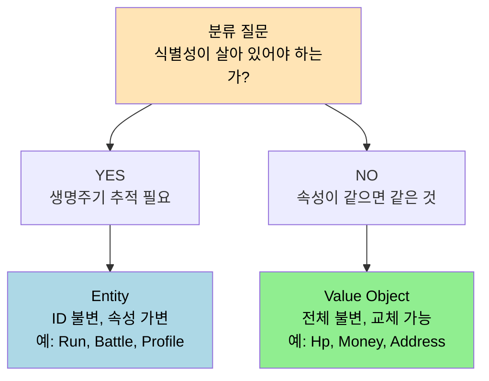
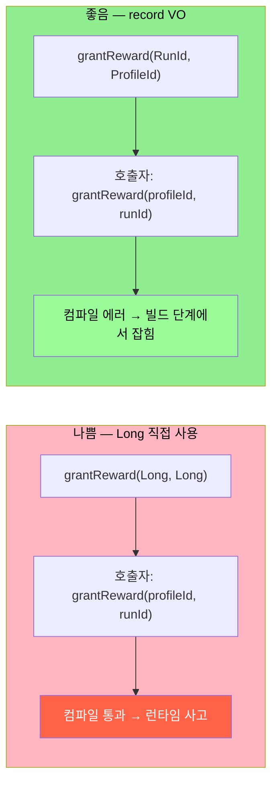

# Entity 와 Value Object
---
> 이 문서를 읽고 나면 Entity 인지 Value Object 인지 판단할 때 첫 질문이 무엇인지 그림 없이 말로 설명할 수 있고, record/sealed 같은 언어 기능 선택까지 그 판단을 옮길 수 있습니다.

> 객체를 식별자로 구분할 것인가, 값 자체로 구분할 것인가 — 이 한 가지 결정이 동등성·변경 가능성·생명주기를 동시에 정합니다.

`02-01 §3` 에서 Aggregate 내부에는 객체 참조를 쓰고 외부 Aggregate 는 ID 참조로 잇는다고 했습니다. 본 문서는 그 "객체" 의 두 종류를 다룹니다.

## 1. Entity — 식별자가 본질

> Entity 는 속성이 같아도 ID 가 다르면 다른 것 — 이 단순한 규칙이 생명주기를 정의합니다.

Entity 는 고유 식별자로 정의됩니다. 두 `Run` 인스턴스의 모든 속성이 동일하더라도 `RunId` 가 다르면 다른 런입니다. 반대로 `RunId` 가 같으면 속성이 다르더라도 같은 런의 다른 시점입니다.

이 규칙이 의미하는 것은 다음 세 가지입니다.

1. 생명주기를 가집니다 — 생성·변경·삭제의 흐름이 ID 단위로 추적됩니다.
2. 속성은 가변 — ID 는 불변이지만 다른 속성은 메서드를 통해 바뀝니다.
3. 영속성이 자연스럽습니다 — DB 행 하나가 하나의 Entity 에 대응되는 모델이 흔합니다.

여기서 질문 하나 — `Card` 는 Entity 일까요 Value Object 일까요? `01-04 §2` 에서 봤듯 답은 Context 에 따라 다릅니다. catalog Context 의 `CardDefinition` 은 Entity(고유한 카드 정의) 이지만, battle Context 의 손에 들린 한 장의 카드는 Value Object 에 가깝습니다. 같은 이름의 객체라도 Context 가 다르면 분류도 다릅니다.



분류는 *질문 하나* 에서 출발하지만 그 결과가 *언어 기능 선택* 까지 따라옵니다. Entity 는 가변 상태를 가진 일반 class, VO 는 record (Java 14+) 또는 immutable data class (Kotlin) 가 자연스러운 선택입니다.

## 2. Value Object — 값 자체가 정체성

> Value Object 는 속성이 같으면 같은 것 — 그래서 불변이고, 교체 가능하고, ID 가 필요 없습니다.

Value Object 는 식별자 없이 속성의 조합으로 동등성을 판단합니다. 같은 화폐와 같은 금액의 두 `Price` 는 같은 객체로 간주합니다. 이 특성에서 네 가지 성질이 따라옵니다.

1. 속성으로 식별 — `equals()` 와 `hashCode()` 가 모든 속성을 기준으로 동작합니다.
2. 불변(immutable) — 변경이 필요하면 새 객체를 만듭니다. `price.addTax()` 는 새 `Price` 를 반환합니다.
3. 단명(short-lived) 가능 — 생명주기 추적 부담이 없습니다.
4. 교체 가능 — 주문의 배송지가 바뀌면 기존 `Address` 를 폐기하고 새 `Address` 를 끼웁니다.

런 관리 예시에서 `Hp(int current, int max)`, `Energy(int amount)`, `CardCost(int value)`, `ActNumber(int value)` 가 모두 VO 입니다. 단순 `int` 보다 의미가 명확하고, 다른 정수 값과 혼동될 일이 없습니다.

### 2-1. Java record 와 sealed 로 강제하기

Java 17+ 에서 VO 는 record 로 자연스럽게 표현됩니다. record 는 자동으로 `equals` · `hashCode` · `toString` 을 생성하고, 모든 필드가 `final` 이라 불변이 강제됩니다.

```java
// Hp.java
public record Hp(int current, int max) {
    public Hp {
        if (current < 0 || current > max) {
            throw new IllegalArgumentException("invalid hp: " + current + "/" + max);
        }
    }

    public Hp reduce(int damage) {
        return new Hp(Math.max(0, current - damage), max);
    }
}
```

sealed interface 는 VO 의 변형이 닫힌 집합임을 컴파일 타임에 보장합니다. 예를 들어 카드 효과의 종류가 `Damage` · `Block` · `Draw` 세 가지로 한정된다면 다음처럼 잠급니다.

```java
// CardEffect.java
public sealed interface CardEffect permits Damage, Block, Draw {}
public record Damage(int amount) implements CardEffect {}
public record Block(int amount) implements CardEffect {}
public record Draw(int count) implements CardEffect {}
```

새 효과 종류가 추가되면 컴파일러가 `switch` 의 패턴 매칭에서 누락된 분기를 잡아 줍니다. 이 안정성이 VO 를 단순 데이터 묶음이 아닌 도메인 어휘로 끌어올립니다.

## 3. Entity 와 VO 의 선택 기준

> "이것의 정체는 ID 인가, 값인가?" — 이 한 질문이 분류를 결정합니다.

분류가 헷갈릴 때는 다음 표를 봅니다.

| 질문 | Entity | Value Object |
|------|--------|--------------|
| 같은 속성의 두 인스턴스가 같은가? | 아니다, ID 가 같아야 같음 | 그렇다, 속성이 같으면 같음 |
| 시간에 따라 속성이 바뀌나? | 그렇다 | 아니다, 바뀌면 새 객체 |
| 생성·삭제를 추적해야 하나? | 그렇다 | 아니다 |
| DB 행으로 저장되어야 하나? | 보통 그렇다 | 부모 Entity 의 컬럼이나 임베디드로 충분 |

잘못 분류된 사례를 봅시다. `EmailAddress` 를 Entity 로 만들면 같은 이메일 두 번 등록 시 두 행이 생기고, 동등성 비교가 ID 로만 가능해집니다. VO 로 두면 문자열만 같으면 같은 객체로 인식합니다. 반대로 `Order` 를 VO 로 두면 같은 상품·수량의 두 주문이 하나로 합쳐져 버립니다.

## 4. ID 자체도 Value Object 다

> `RunId`, `ProfileId` 같은 식별자도 VO 의 한 종류 — 단순 `Long` 이 아닌 의미 있는 타입이어야 합니다.

`02-01 §3` 의 ID 참조 규칙은 ID 가 VO 임을 전제합니다. 단순 `Long` 을 ID 로 쓰면 `RunId`, `ProfileId`, `BattleId` 가 모두 `Long` 으로 보이고, 메서드 시그니처에서 혼동됩니다.

```java
// 나쁨
void grantReward(Long runId, Long profileId);  // 순서를 바꿔도 컴파일 통과

// 좋음
void grantReward(RunId runId, ProfileId profileId);  // 순서가 틀리면 컴파일 에러
```

record 로 정의된 ID 는 자동으로 동등성을 갖고, 추가 검증(예: UUID 포맷) 을 생성자 컴팩트 구문에 박을 수 있습니다. 도메인 어휘를 타입 시스템에 박는 첫 단추가 ID 의 VO 화입니다.

두 방식이 컴파일러에 어떤 다른 신호를 주는지 다음 도식이 한 자리에 박습니다.



같은 잘못된 호출이 *어느 단계에서 잡히는가* 가 차이입니다. record VO 는 사고가 *빌드 단계* 에서 잡히고, Long 직접 사용은 *운영 단계* 에 도달합니다. 비용 차이가 두 자릿수 이상 벌어지는 자리입니다.

## 5. 실제 사례 — Vernon Money + 본인 TPS ID 타입화

> 책에서 본 규칙이 본인 코드와 책 원전 어디에 어떻게 박혀 있는지를 확인하면 *식별자도 VO* 라는 결정이 기억으로 굳습니다.

### 5-1. Vernon Money / Currency VO

Vaughn Vernon 의 *Implementing DDD* (Addison-Wesley, 2013) 챕터 6 "Value Objects" 는 `Money(Currency currency, BigDecimal amount)` 를 VO 의 정전(正典) 사례로 다룹니다. 같은 책 §"Characterizing the Value" 절은 `Money.add(Money other)` 가 *새 Money 를 반환* 하고 *기존 인스턴스를 변경하지 않는* 형태로 박혀 있어, 통화가 다른 두 Money 를 더하려고 시도하면 `IllegalArgumentException` 으로 잡힙니다. Vernon 은 같은 챕터에서 `Money` 를 record 가 아닌 *완전 불변 class* 로 박았는데, 책 출간 시점(2013) 의 Java 가 record 를 지원하지 않았기 때문입니다. 현대의 Java 17+ 환경에서는 같은 의미를 `record Money(Currency currency, BigDecimal amount)` 로 정확히 한 줄에 박을 수 있어 *언어 기능 진화* 가 *DDD 패턴 코드량* 을 직접 줄인 좋은 사례입니다.

### 5-2. 본인 TPS 의 `TicketNo` 와 `ApprovalId` 타입화

본인 TPS 의 `~/okestro/tps-gitlab2/operator-api/` 는 초기에 티켓 번호를 `String` 으로, 결재 ID 를 `Long` 으로 박았습니다. 두 ID 가 같은 메서드 시그니처에 함께 등장할 때 *순서를 바꿔도 컴파일이 통과* 하는 사고가 두 번 발생했습니다 (`approveTicket(approvalId, ticketNo)` 가 `approveTicket(ticketNo 로 박힌 String, approvalId 로 박힌 Long)` 형태로 잘못 호출되어 운영 시간 30 분 장애). 2026-04 의 정합화로 `record TicketNo(String value)`, `record ApprovalId(Long value)` 형태로 ID 를 *record VO* 로 강제했습니다. 컴파일러가 *순서가 틀린 호출* 을 빌드 시점에 잡아 같은 사고가 재발하지 않게 되었습니다. 이 변경의 비용은 *최초 마이그레이션 시 약 200 자리의 시그니처 갱신* 이었지만, *재발 비용 0* 이 그 비용을 즉시 상쇄했습니다.

### 5-3. sealed interface 로 닫힌 정책 집합

본인 redpanda-playground 의 executor 모듈은 `JobOutcome` 을 sealed interface 로 박아 *성공·실패·재시도 대기* 세 가지 결과만 허용합니다. 코드 — `sealed interface JobOutcome permits Success, Failure, RetryPending {}` 와 세 record 가 한 자리에 모여 있습니다. 새 결과 종류가 추가되어야 한다면 *컴파일러가 모든 switch 의 누락된 case 를 잡아* 빌드를 깨뜨립니다. 이 안정성이 *결과 종류 추가* 가 *놓친 처리 자리* 를 만들지 않도록 보장합니다. Vernon 의 책에는 sealed 가 없지만 (Java 17 에서 등장), Vernon 이 챕터 6 §"Characteristic: Strategic Design" 에서 권고한 *닫힌 정책 집합* 의 정확한 현대적 구현입니다.

## 6. 면접에서 받을 만한 질문

1. Entity 와 Value Object 를 가르는 *첫 질문* 은 무엇이고, 그 답이 *언어 기능 선택* 까지 어떻게 옮겨갑니까?
2. 같은 이름의 객체가 Context 에 따라 Entity 일 수도 VO 일 수도 있는 사례를 하나 들고, 분류가 다른 이유를 설명하십시오.
3. ID 를 단순 `Long` 으로 두는 것 대신 record VO 로 타입화하는 비용과 이익은 무엇입니까?
4. sealed interface + record 조합이 *닫힌 정책 집합* 을 표현할 때 컴파일러가 잡아 주는 자리는 어디입니까?

> 위 질문에 *먼저 자답한 뒤* 아래 §7. 정답 (자답 후 펼치기) 으로 내려갑니다.

## 7. 정답 (자답 후 펼치기)

> 위 §6. 면접에서 받을 만한 질문 의 4개에 *먼저 자답한 뒤* 아래를 읽으세요. 자답 없이 먼저 읽으면 학습 효과가 0입니다.

### 정답 1 — 첫 질문과 언어 기능 선택

첫 질문은 *식별성이 살아 있어야 합니까?* 입니다. `Money(1000, "KRW")` 두 개가 같은지 묻는 것은 무의미합니다 — 같은 값이면 같은 객체입니다. 반면 `User(id=42)` 두 개는 *같은 user 인지를 ID 로만 판단* 합니다. 식별성이 *없어도 되면* VO 이고, *있어야 하면* Entity 입니다. 언어 기능과의 연결 — VO 는 *불변* 이 핵심이라 Java 의 `record` 가 정확히 맞고, *허용된 값만 갖도록 강제* 하려면 sealed interface 로 닫습니다. Entity 는 라이프사이클 동안 상태가 바뀌므로 record 가 어색하고, 일반 class 가 자연스럽습니다. 첫 질문 하나가 *코드의 모양* 까지 결정합니다.

### 정답 2 — Context 에 따른 분류 차이

`Card` 가 좋은 예입니다. catalog Context 의 `CardDefinition` 은 *고유한 카드 정의* 라 Entity 입니다 (같은 이름의 두 카드 정의는 *다른 카드* 입니다 — 효과·비용이 다를 수 있고, 시간에 따라 밸런스 패치로 속성이 바뀝니다). 같은 `Card` 가 battle Context 에서 *손에 들린 한 장* 으로 등장할 때는 VO 에 가깝습니다 (같은 정의에서 나온 두 장은 *같은 카드* 로 봐도 되고, 사용 후 *교체* 됩니다). 분류가 다른 이유는 *Context 가 보는 측면* 이 다르기 때문입니다 — catalog 는 *정의의 영속성*, battle 은 *실행의 일회성* 을 봅니다. `01-04 §2` 의 Bounded Context 분리가 이 분류 차이의 근거입니다.

### 정답 3 — ID 타입화 비용과 이익

비용 — *최초 마이그레이션* 시 모든 메서드 시그니처·DTO·DB 매핑이 갱신되어야 합니다. 본인 TPS 사례에서는 약 200 자리. *boxing/unboxing* 의 미세 성능 비용도 있지만 record 는 JIT 가 거의 zero-cost 로 최적화합니다. 이익 — *순서가 바뀐 호출* 을 컴파일러가 잡습니다 (`approveTicket(approvalId, ticketNo)` 와 `approveTicket(ticketNo, approvalId)` 가 시그니처 단계에서 갈라집니다). *추가 검증* 을 record 의 컴팩트 생성자에 박을 수 있어 *유효하지 않은 ID 가 생성 자체를 못 합니다*. *디버깅 시간* 단축 — 로그에 `TicketNo[value=TCKT-A]` 가 찍히면 *어느 종류의 ID 인지* 즉시 보입니다. 이익이 비용을 초과하는 임계는 보통 *프로젝트가 두 종류 이상의 ID 를 한 메서드에 같이 받는 자리가 생긴 시점* 입니다.

### 정답 4 — sealed + record 가 잡아 주는 자리

sealed interface 가 닫힌 집합임을 컴파일러에 알리면, 그 interface 를 `switch` 로 분기할 때 컴파일러가 *누락된 case 가 있는지* 검사합니다 (Java 17 + 패턴 매칭). 예 — `JobOutcome` 이 `Success | Failure | RetryPending` 세 가지 record 로 닫혀 있을 때, 새 결과 `Cancelled` 를 추가하면 *모든 switch 자리* 가 빌드 시점에 깨집니다. 컴파일러가 *놓친 처리 자리* 를 한 자리도 빠뜨리지 않고 표시해 줍니다. enum 으로 같은 효과를 흉내낼 수 있지만, enum 은 *각 값이 다른 필드를 가질 때* 어색합니다 — `Success(jobId)`, `Failure(reason, errorCode)`, `RetryPending(nextAttemptAt)` 처럼 *값마다 다른 데이터* 가 필요하면 sealed + record 가 정답입니다.

## 관련 문서

- [Aggregate 설계 규칙](./02-01.Aggregate%20설계%20규칙.md) — Entity 와 VO 가 모여 만드는 그래프의 경계
- [Domain Service, Factory, Repository](./02-03.Domain%20Service%2C%20Factory%2C%20Repository.md) — VO 생성·Entity 조회의 책임 분리
