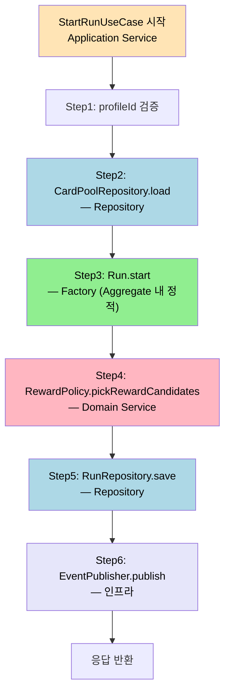
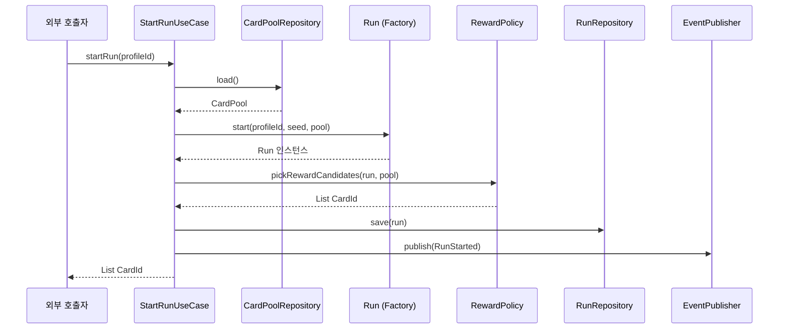

# Domain Service, Factory, Repository
---
> 이 문서를 읽고 나면 세 패턴의 책임을 그림 없이 말로 구분할 수 있고, Application Service 가 셋을 어떤 순서로 조율하는지 한 유스케이스로 풀어낼 수 있습니다.

> Aggregate 가 혼자 할 수 없는 일들 — 여러 Aggregate 를 엮는 로직, 복잡한 생성, 영속성 매개 — 을 세 패턴이 책임 나눠 맡습니다.

`02-01` 이 Aggregate 의 책임을, `02-02` 가 그 재료인 Entity·VO 를 다뤘습니다. 본 문서는 Aggregate 밖에서 Aggregate 를 돕는 세 패턴을 정리합니다.

## 1. Domain Service — Entity 에 들어가지 못하는 로직

> "이 로직은 어느 Entity 의 메서드가 되어야 합니까?" 의 답이 명확하지 않을 때 Domain Service 가 등장합니다.

모든 비즈니스 로직이 Entity 안으로 들어가지는 않습니다. 다음 세 신호 중 하나라도 보이면 Domain Service 후보입니다.

1. 여러 Aggregate 의 정보를 모아야 결과가 나오는 계산 — 예: `RewardPolicy` 가 `Run` 의 진행도와 `Catalog` 의 카드 풀을 함께 봅니다.
2. 어느 Entity 의 자연스러운 책임도 아닌 순수 계산 — 예: `EnemyIntentPolicy` 가 적의 다음 행동을 결정합니다.
3. 외부 시스템 의존이 없는 순수 함수형 로직 — 부작용이 없어 테스트가 쉽습니다.

여기서 질문 하나 — Application Service 와 무엇이 다릅니까? Domain Service 는 비즈니스 규칙 자체이고, Application Service 는 그 규칙을 호출하는 흐름 조정자입니다. Domain Service 는 DB·메시지 브로커·HTTP 클라이언트를 알면 안 됩니다. 그건 Application 의 책임입니다.

```java
// 도메인 계층
public final class RewardPolicy {
    public List<CardId> pickRewardCandidates(Run run, CardPool pool) {
        // 순수 계산 — DB 접근 없음
        return pool.filterByAct(run.currentAct()).pickRandom(3);
    }
}

// 애플리케이션 계층
@Service
public class CompleteBattleUseCase {
    private final RunRepository runRepo;
    private final CardPoolRepository poolRepo;
    private final RewardPolicy rewardPolicy;

    @Transactional
    public List<CardId> complete(RunId runId, BattleId battleId) {
        Run run = runRepo.findById(runId);
        CardPool pool = poolRepo.load();
        return rewardPolicy.pickRewardCandidates(run, pool);  // 위임
    }
}
```

## 2. Factory — 유효한 상태를 보장하는 생성 책임

> 객체가 "생성 직후에 이미 불변식을 만족한다" 를 보장하는 책임은 생성자 하나로 풀 수 없을 때 Factory 로 옮깁니다.

단순 객체는 생성자로 충분합니다. Factory 가 필요한 시점은 다음 두 가지입니다.

1. 생성 자체가 복잡한 비즈니스 결정을 포함할 때 — 예: `Run.start()` 가 카드 풀·초기 덱·시작 유물을 함께 결정.
2. 생성 결과가 외부 입력에 따라 분기될 때 — 예: 새 게임이냐, 이어서 하기냐에 따라 다른 객체 그래프.

Factory 는 두 형태로 나타납니다. 정적 팩토리 메서드(Aggregate Root 안의 `Run.start(...)`) 와 별도 Factory 클래스(`RunFactory`) 입니다. 첫 번째가 가독성·결합도 면에서 우선입니다. 두 번째는 생성에 외부 의존성(예: ID 발급기·랜덤 시드) 이 필요할 때 도입합니다.

```java
public final class Run {
    private Run(RunId id, ProfileId profileId, Deck initialDeck) { /* ... */ }

    public static Run start(ProfileId profileId, RunSeed seed, CardPool pool) {
        RunId id = RunId.generate();
        Deck initialDeck = pool.startingDeck(seed);
        Run run = new Run(id, profileId, initialDeck);
        run.registerEvent(new RunStarted(id, profileId));
        return run;
    }
}
```

`private` 생성자 + 의도가 드러나는 정적 메서드 이름(`start`, `resume`, `migrate`) 이 합쳐지면 외부 호출자는 항상 유비쿼터스 언어로 객체를 만듭니다.

## 3. Repository — 도메인 진입점, DAO 가 아니다

> Repository 는 Aggregate 를 로드·저장하는 도메인 어휘입니다. JPA 의 `EntityManager` 를 감싼 얇은 래퍼가 아닙니다.

Repository 패턴이 흔히 오해되는 지점은 "DAO 와 뭐가 다르냐" 입니다. 답은 다음 표에 있습니다.

| 측면 | DAO | Repository |
|------|-----|-----------|
| 단위 | 테이블 또는 row | Aggregate 전체 |
| 인터페이스 위치 | 인프라 계층 | 도메인 계층 |
| 반환 타입 | DB 행 매핑 객체 | Aggregate Root |
| 책임 | CRUD 위임 | 도메인 의도 표현 (`findActiveByProfile`) |

도메인 계층은 `RunRepository` 인터페이스만 압니다. 구현체가 JPA 인지 Redis 인지 Event Store 인지 모릅니다. 이게 `02-01 §4` 의 "저장 전략 자유도" 가 실제로 작동하는 메커니즘입니다.

```java
// 도메인 계층 — 인터페이스
public interface RunRepository {
    Run findById(RunId id);
    List<Run> findActiveByProfile(ProfileId profileId);
    void save(Run run);
}

// 인프라 계층 — JPA 구현
@Repository
class JpaRunRepository implements RunRepository {
    private final JpaRunEntityRepository delegate;
    // ... JpaRunEntity ↔ Run 매핑
}
```

여기서 질문 하나 — 그러면 JPA Entity 와 도메인 Entity 가 같아도 됩니까? 작은 프로젝트는 한 클래스가 둘을 겸하는 게 실용적입니다. Aggregate 가 커지거나 저장 모델이 도메인 모델과 어긋나기 시작하면 분리합니다. 분리 시점의 신호는 "도메인 변경이 JPA 매핑 때문에 막힌다" 가 처음 들릴 때입니다.

### 3-1. Unit of Work 와 트랜잭션 경계

Repository 가 단독으로 트랜잭션을 시작하면 `02-01 §2` 의 "하나의 트랜잭션은 하나의 Aggregate" 가 깨집니다. 트랜잭션은 Application Service 가 시작하고, 그 안에서 Repository 가 동작합니다. Spring 환경에서는 `@Transactional` 이 Application Service 메서드에 붙습니다.

## 4. 세 패턴의 협력

> Domain Service · Factory · Repository 는 Aggregate 의 세 측면(계산·생성·조회) 을 각각 맡으며, Application Service 가 이들을 조율합니다.

런 관리 예시의 한 유스케이스를 봅시다. "런 시작 시 시작 보상 후보를 추첨한다" 는 흐름은 다음과 같습니다.



각 패턴이 한 책임씩만 맡고, Application Service 가 순서를 조율합니다. 이 분담이 깨지면 — 예를 들어 `Run.start()` 안에서 `RunRepository.save()` 를 호출하면 — 도메인 계층이 인프라를 알게 되고 테스트가 어려워집니다.

같은 흐름을 시퀀스 도식으로 보면 책임 분담이 한 자리에 박힙니다.



도식의 *화살표 방향* 이 의존성 방향입니다. Application 만이 Repository 와 Factory 와 Policy 를 알고, 거꾸로 Domain 객체는 Application 을 모릅니다. 이 방향이 깨지면 *도메인이 인프라를 의존* 하는 형태가 되어 단위 테스트가 *DB 연결 없이는 불가능* 한 상태가 됩니다.

## 5. 실제 사례 — Spring Petclinic + 본인 TPS ApprovalPolicy

> 책에서 본 세 패턴이 본인 코드와 오픈소스 샘플 어디에 어떻게 박혀 있는지를 확인하면 *Repository 가 DAO 가 아니다* 라는 결정이 기억으로 굳습니다.

### 5-1. Spring Petclinic 의 Repository 패턴

Spring 공식 학습 샘플 [spring-petclinic](https://github.com/spring-projects/spring-petclinic) 의 `src/main/java/org/springframework/samples/petclinic/owner/OwnerRepository.java` 는 Repository 인터페이스를 *Aggregate Root 단위* 로 박은 좋은 예입니다. `OwnerRepository.findById(Integer id)` 가 반환하는 `Owner` 는 그 안에 `List<Pet>` 을 포함한 *전체 Aggregate 그래프* 입니다. 호출자는 `Owner.getPets()` 를 통해 Pet 에 접근하지 별도 `PetRepository.findByOwnerId` 를 호출하지 않습니다. 이 구조가 본 문서 §3 의 *단위 = Aggregate 전체* 규칙의 정확한 코드 실현입니다. 다만 같은 샘플은 *Visit* 를 별도 Aggregate Root 로 두어 `VisitRepository.findByPetId` 를 분리했는데, 이유는 Visit 의 *서로 다른 변경 빈도* — Visit 는 매일 추가되고 Owner 정보는 거의 안 바뀜 — 가 §4-1 의 분리 신호와 일치하기 때문입니다.

### 5-2. 본인 TPS 의 ApprovalPolicy (Domain Service)

본인 TPS 의 `~/okestro/tps-gitlab2/operator-api/` 의 `ApprovalPolicy` 는 본 문서 §1 의 Domain Service 의 정확한 사례입니다. 코드 — `ApprovalPolicy.nextApprover(Approval approval)` 가 *어느 Entity 의 자연스러운 책임도 아닌 순수 계산* 입니다. `Approval` Entity 안에 박으면 *결재선 정책 규칙* 이 Aggregate 의 변경 책임에 끌려가서 정책 변경이 결재 도메인 모델을 흔듭니다. 별도 Domain Service 로 빼면 *정책 변경* 이 *결재 모델 진화* 와 독립됩니다. 같은 모듈의 `04-01 헥사고날 변형` 문서가 이 `ApprovalPolicy` 를 *outbound port + 도메인 인터페이스 이중 표현* 으로 다루는 사례를 보여 줍니다 — Domain Service 가 *외부 정책 시스템* 의 어댑터를 통과해도 본인 계산 책임은 유지됩니다.

### 5-3. Factory 와 Repository 책임 분리 실패 사례

본인 redpanda-playground 의 executor 모듈 초기 설계에서 `JobExecution.start(...)` 가 *Aggregate 내 정적 팩토리* 인데 그 안에서 `JobExecutionRepository.save(this)` 를 호출했습니다. 결과 — 단위 테스트가 *DB 연결 없이는 불가능* 해졌고, 테스트마다 H2 in-memory DB 를 띄워야 했습니다. 리팩토링으로 `save` 호출을 *Application Service 의 `StartJobUseCase`* 로 옮긴 후, `JobExecution.start(...)` 는 *순수 도메인 객체만 반환* 하고 *저장은 Application 의 결정* 으로 바뀌었습니다. 단위 테스트 실행 시간이 *약 3 분에서 5 초* 로 단축되었습니다. 본 문서 §4 의 *분담이 깨지면 도메인이 인프라를 알게 된다* 의 정확한 사례입니다.

## 6. 면접에서 받을 만한 질문

1. Domain Service 와 Application Service 의 차이를 *호출 가능한 외부 의존* 의 관점에서 설명하십시오.
2. Factory 가 필요한 두 시점은 무엇이고, *Aggregate Root 안의 정적 팩토리* 와 *별도 Factory 클래스* 중 어느 쪽이 기본입니까?
3. Repository 가 DAO 와 다른 *네 측면* 을 모두 말할 수 있습니까? 각각이 *도메인 계층의 자유도* 와 어떻게 연결됩니까?
4. 한 유스케이스에서 Factory · Repository · Domain Service 가 *어떤 순서로 호출되어야* 하는 이유를 설명하십시오.

> 위 질문에 *먼저 자답한 뒤* 아래 §7. 정답 (자답 후 펼치기) 으로 내려갑니다.

## 7. 정답 (자답 후 펼치기)

> 위 §6. 면접에서 받을 만한 질문 의 4개에 *먼저 자답한 뒤* 아래를 읽으세요. 자답 없이 먼저 읽으면 학습 효과가 0입니다.

### 정답 1 — Domain Service vs Application Service

*호출 가능한 외부 의존* 으로 가르면 명확합니다. Domain Service 는 *외부 시스템·DB·메시지 브로커·HTTP 클라이언트를 호출할 수 없습니다*. 순수 비즈니스 규칙만 갖고, 인자로 받은 Aggregate 와 VO 만으로 계산을 끝냅니다. Application Service 는 *그 모든 외부 의존을 호출할 수 있고, 그래야 합니다* — 트랜잭션을 시작하고, Repository 로 Aggregate 를 로드하고, Domain Service 를 호출하고, 결과를 EventPublisher 로 발행합니다. 차이를 박는 가장 빠른 방법은 *Domain Service 의 클래스에 Spring 어노테이션 (`@Component`, `@Transactional` 등) 이 없는지* 확인하는 것입니다. 어노테이션이 있으면 *인프라를 알고 있다* 는 신호이고, Domain Service 의 책임을 깨고 있을 가능성이 높습니다.

### 정답 2 — Factory 의 두 시점과 기본 선택

두 시점은 §2 가 박은 *생성이 복잡한 비즈니스 결정을 포함할 때* 와 *생성 결과가 외부 입력에 따라 분기될 때* 입니다. 기본 선택은 *Aggregate Root 안의 정적 팩토리* 입니다. 이유는 (a) 호출자가 *유비쿼터스 언어로 객체를 만들고* (`Run.start(...)` vs `runFactory.create(...)`), (b) Aggregate 의 *불변식 검증이 같은 클래스 안* 에 있어 결합도가 낮고, (c) 별도 Factory 클래스가 늘리는 *파일 수와 인지 부담* 이 없기 때문입니다. 별도 Factory 클래스로 옮기는 시점은 *생성에 외부 의존성이 필요할 때* — 예: ID 발급기·랜덤 시드·외부 정책 호출. 이 경우 Spring 의 `@Component` 가 필요하므로 정적 메서드로는 부족해집니다.

### 정답 3 — Repository vs DAO 네 측면

본 문서 §3 의 표가 정답입니다. (1) *단위* — DAO 는 테이블/row, Repository 는 Aggregate 전체. (2) *인터페이스 위치* — DAO 는 인프라 계층, Repository 는 도메인 계층. (3) *반환 타입* — DAO 는 DB 행 매핑 객체, Repository 는 Aggregate Root. (4) *책임* — DAO 는 CRUD 위임, Repository 는 도메인 의도 표현 (`findActiveByProfile`). 자유도 연결 — Repository 가 도메인 계층의 *인터페이스* 라는 점이 *구현체 교체 자유* 를 줍니다. 도메인 코드는 `RunRepository` 만 알므로 JPA·Redis·Event Store 어느 구현이 끼워져도 같습니다. 단위 테스트에서는 *in-memory 구현* 으로 교체해 DB 없이 검증할 수 있습니다. 자유도가 (1)~(4) 네 측면이 모두 갖춰져야 *실제로 작동* 합니다 — 한 측면이라도 깨지면 (예: 반환 타입이 DB 행 매핑이라면) 자유도는 형식적 자유에 그칩니다.

### 정답 4 — 세 패턴의 호출 순서

표준 순서는 *Repository (로드) → Factory (생성/Aggregate 메서드) → Domain Service (계산) → Repository (저장) → EventPublisher (발행)* 입니다. 이 순서의 이유는 *데이터 흐름* 입니다. (a) 계산에 필요한 데이터를 *먼저 메모리에 올려야* 합니다 — Repository 가 *입력* 을 제공합니다. (b) 그 데이터로 *새 Aggregate 를 만들거나 변경* 합니다 — Factory 또는 Aggregate 메서드. (c) *순수 계산이 필요하면* Domain Service 를 호출합니다. (d) 변경된 상태를 *영속화* 합니다 — Repository 의 `save`. (e) *외부에 알려야 하면* 이벤트를 발행합니다. 이 순서가 깨지면 — 예: Domain Service 가 *호출 도중에 Repository 를 부르면* — Domain Service 가 *인프라를 의존* 하게 되고, 단위 테스트가 깨집니다. 본인 TPS 의 executor 사례(§5-3) 가 이 순서를 깬 자리의 정확한 비용을 보여 줍니다.

## 관련 문서

- [Aggregate 설계 규칙](./02-01.Aggregate%20설계%20규칙.md) — 세 패턴이 협력해 다루는 객체의 경계
- [Entity 와 Value Object](./02-02.Entity%20와%20Value%20Object.md) — Factory 가 만들고 Repository 가 저장하는 객체의 종류
- [Spring Boot 레이어드 아키텍처와 패키지 구조](../02_application/01-01.Spring%20Boot%20%EB%A0%88%EC%9D%B4%EC%96%B4%EB%93%9C%20%EC%95%84%ED%82%A4%ED%85%8D%EC%B2%98%EC%99%80%20%ED%8C%A8%ED%82%A4%EC%A7%80%20%EA%B5%AC%EC%A1%B0.md) — 세 패턴이 어느 계층에 살아야 하는가
