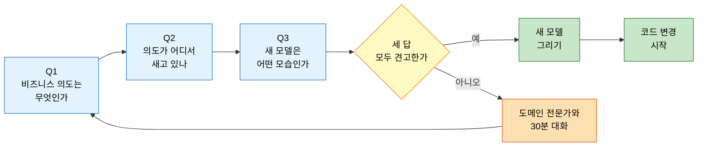
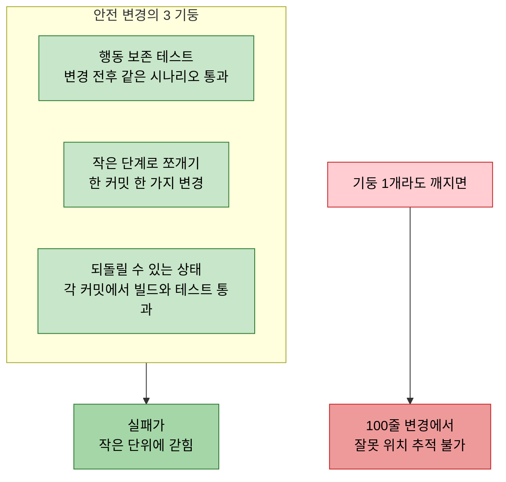

# 리팩토링 원칙 — 행동하기 전에 이해하기
---
> 이 문서를 읽고 나면 도메인 리팩토링의 3 안전 기둥과 SOLID·DDD 원칙의 자리를 그림 없이 설명할 수 있습니다.

> 도메인 리팩토링은 코드 변형이 아니라 모델 재발견입니다. 손을 대기 전에 현재 모델이 무엇을 잘못 표현하고 있는지 정확히 진단하지 못하면, 변경 후의 코드는 새로운 종류의 잘못된 모델이 됩니다.

DDD 가 말하는 리팩토링은 "변수명을 바꾸고 메서드를 추출하는 작업" 이 아닙니다. 도메인의 새로운 이해를 코드에 반영하는 과정입니다. 그래서 절차의 시작이 코드가 아니라 이해입니다.

## 1. 행동하기 전에 이해하기

> 리팩토링의 첫 단계는 항상 "지금 코드는 도메인을 어떻게 표현하고 있는가" 를 정직하게 진단하는 것입니다.

SSOT §5.1 의 핵심 메시지는 "Understanding before Acting" 입니다. 코드를 만지기 전에 다음 세 질문에 답합니다.

1. 이 코드는 어떤 비즈니스 의도를 표현하려 했는가?
2. 그 의도가 지금 어디서 새고 있는가? (이름·구조·결합도 중 무엇이 어긋났는가)
3. 만약 새 모델로 이 의도를 표현한다면, 어떤 모습이 되어야 하는가?

세 번째 질문에 막연한 답("좀 더 명확하게")만 나오면 아직 리팩토링을 시작할 시점이 아닙니다. 이해가 부족하다는 신호입니다. 이때 코드를 만지면 의도 없는 구조 변경이 되어 다음 사람이 다시 풀게 됩니다.

여기서 질문 하나 — 도메인 전문가와 다시 대화해야 할 시점은 언제 알 수 있을까요? 위 세 질문 중 어느 하나라도 답이 흔들리면 그때입니다. 코드만 들여다보는 시간보다 도메인 전문가와의 30 분 대화가 더 가까운 길입니다.

## 2. 안전한 변경의 기둥

> 테스트 안전망·작은 단계·되돌릴 수 있는 커밋 — 세 기둥이 없으면 리팩토링은 도박입니다.

SSOT §5.2 가 제시하는 세 가지 안전 장치는 다음과 같습니다.

1. 행동 보존 테스트 — 변경 전후 동일하게 동작해야 하는 시나리오를 테스트로 박제합니다. 단위 테스트만으로 부족하면 통합·E2E 까지 확장합니다.
2. 작은 단계로 쪼개기 — 한 커밋이 한 가지 변경만 담습니다. 메서드 이름 변경·서명 변경·로직 이동을 같은 커밋에 섞지 않습니다.
3. 언제든 되돌릴 수 있는 상태 유지 — 각 커밋에서 빌드와 테스트가 통과해야 합니다. "리팩토링 중이라 잠깐 깨졌어요" 는 안전망의 파괴입니다.

이 세 기둥의 의미는 변경의 실패를 작은 단위로 가둔다는 것입니다. 한 커밋에서 잘못이 드러나면 그 커밋만 되돌리면 됩니다. 100 줄짜리 변경을 한 커밋에 묶으면 잘못의 위치를 찾는 데 더 많은 시간이 듭니다.

## 3. 더 깨끗한 코드로

> 깨끗함의 기준은 미적 감각이 아니라 도메인을 얼마나 정확히 표현하는가 입니다.

리팩토링의 목적이 "예쁜 코드" 가 아닙니다. 새로 이해한 도메인을 코드가 더 정확히 표현하도록 만드는 것입니다. 다음 신호가 보이면 표현이 어긋나고 있습니다.

| 신호 | 무엇이 어긋났는가 |
|------|------------------|
| 같은 비즈니스 규칙이 여러 곳에 흩어짐 | 책임의 위치가 잘못 잡혔다 |
| 메서드 이름이 코드를 읽어야 알 수 있다 | 이름이 의도를 담지 못한다 |
| 도메인 전문가가 코드를 봐도 못 알아본다 | 유비쿼터스 언어가 코드에 없다 |
| 새 기능 추가 시 여러 클래스를 동시에 수정 | 결합도가 책임 경계를 가로지른다 |

각 신호의 해결은 같은 모양입니다. 도메인을 더 잘 표현하는 모델을 찾고, 작은 단계로 옮깁니다.
신호가 보이는 위치는 다르지만 처방은 한 가지로 수렴합니다.

## 4. 설계 원칙의 자리

> SOLID·DDD 의 원칙들은 리팩토링의 목적지가 아니라 방향계 — 어디로 가는지 알려주지만 도착점을 정의하지 않습니다.

SSOT §5.4 는 SOLID 와 DDD 원칙을 리팩토링의 가이드로 제시합니다. 다만 원칙을 목적으로 삼는 순간 함정에 빠집니다. "이 클래스가 SRP 를 위반하니까 분리한다" 는 분리할 정당성을 만들지만, 분리 후의 모델이 도메인을 더 잘 표현하는지는 별개 문제입니다.

올바른 순서는 다음과 같습니다.

1. 도메인을 더 잘 표현하는 모델을 먼저 그립니다.
2. 그 모델이 어느 원칙들을 자연스럽게 따르는지 확인합니다.
3. 원칙 위반이 보이면 모델을 다시 검토합니다 — 원칙 충족을 위해 모델을 비틀지 않습니다.

원칙은 결과를 검증하는 잣대이지 도착점이 아닙니다. 이 차이를 놓치면 코드는 SOLID 를 만족하면서도 도메인을 표현하지 못하는 상태에 도달합니다.

## 5. 실제 사례

### Vernon — *Implementing Domain-Driven Design* ch.5 의 리팩토링 절차

Vernon 은 ch.5 (Entities) 의 끝부분에서 "행동 없는 setter 가 줄지어 있는 클래스" 를 리팩토링하는 절차를 보여줍니다. 시작점은 코드가 아니라 *도메인 전문가와의 대화* 입니다. SaaSOvation 의 `BacklogItem` 이 `setStatus`, `setBusinessPriority`, `setStoryPoints` 같은 setter 만 가지고 있을 때, Vernon 의 첫 행동은 "비즈니스가 이 객체에 어떤 행동을 시키는가" 를 도메인 전문가에게 묻는 것이었습니다. 그 결과 `commitTo(Sprint)`, `decideStoryPoints(StoryPoints)` 같은 *도메인 의미가 박힌 메서드* 가 나왔고, setter 는 사라졌습니다. 본 §1 의 "행동하기 전에 이해하기" 가 이 절차의 다른 이름입니다.

> 출처: Vaughn Vernon, *Implementing Domain-Driven Design*, Addison-Wesley, 2013, ch.5 "Entities" §"Capturing Critical Behavior".

### Fowler — *Refactoring* (1999) 의 행동 보존 원칙

Martin Fowler 의 *Refactoring: Improving the Design of Existing Code* (1999, Addison-Wesley) 가 모든 리팩토링 책의 출발점입니다. Fowler 의 정의 한 줄은 "외부 동작은 그대로 두면서 내부 구조를 바꾸는 작업" 입니다. §2 의 "행동 보존 테스트" 가 이 정의를 실행 가능한 안전망으로 옮긴 형태입니다. 다만 Fowler 의 책은 *도메인 의미 변화* 를 다루지 않고 *구조 정리* 만 다룬다는 한계가 있습니다. DDD 리팩토링은 Fowler 의 안전망 위에 *모델 재발견* 이라는 또 한 층을 얹은 것입니다.

> 출처: Martin Fowler, *Refactoring: Improving the Design of Existing Code*, Addison-Wesley, 1999, ch.2 "Principles in Refactoring".

## 6. 면접에서 받을 만한 질문

1. DDD 가 말하는 리팩토링은 Fowler 의 일반 리팩토링과 무엇이 다릅니까?
2. 안전 변경의 3 기둥 중 하나라도 깨지면 어떤 비용이 누적됩니까?
3. SOLID 원칙을 리팩토링의 목적으로 삼으면 왜 함정에 빠집니까?
4. 코드를 만지지 말고 도메인 전문가와 다시 대화해야 할 시점은 어떻게 알 수 있습니까?

> 위 4개 질문에 *먼저 자답한 뒤* 아래 §정답 (자답 후 펼치기) 으로 내려갑니다.

## 7. 정답 (자답 후 펼치기)

> 위 §면접에서 받을 만한 질문 의 4개에 *먼저 자답한 뒤* 아래를 읽으세요. 자답 없이 먼저 읽으면 학습 효과가 0 입니다.

### 정답 1 — DDD 리팩토링과 일반 리팩토링의 차이

Fowler 의 리팩토링은 *외부 동작을 보존* 하며 *내부 구조* 만 정리하는 작업입니다. 변수명·메서드 추출·클래스 분리가 대표 예시입니다. DDD 리팩토링은 그 위에 한 층을 더 얹습니다. *도메인의 새로운 이해를 코드에 반영* 하는 것이며, 그래서 변경의 시작이 코드가 아니라 *도메인 전문가와의 대화* 입니다. Vernon 의 `BacklogItem` setter 가 `commitTo(Sprint)` 로 바뀐 사례가 이 차이를 보여줍니다 — 외부 시그니처도 바뀌고, 의미도 바뀝니다. 일반 리팩토링이라면 이건 *behavior-preserving* 이 아니라 *behavior-changing* 으로 분류됩니다.

### 정답 2 — 3 기둥이 깨지면 누적되는 비용

(1) 행동 보존 테스트가 없으면 리팩토링이 *행동 변경* 으로 미끄러진 것을 감지할 수 없습니다. 운영에서 사용자 행동이 깨진 뒤에 발견되며, 발견 시점에는 어느 변경 때문인지 추적 비용이 폭증합니다. (2) 작은 단계로 쪼개지 않으면 *잘못의 위치 추적* 이 불가능해집니다. 100 줄짜리 한 커밋에서 어디서 잘못되었는지 찾으려면 `git bisect` 도 효과가 없습니다. (3) 되돌릴 수 있는 상태를 유지하지 않으면 *팀 다른 사람의 작업이 막힙니다* . "잠깐 깨졌어요" 가 30 분 짜리면 그 시간 동안 main 브랜치를 기다리는 사람의 작업이 누적 손실로 잡힙니다.

### 정답 3 — SOLID 를 목적으로 삼는 함정

SOLID 는 *결과를 검증하는 잣대* 이지 *도착점* 이 아닙니다. "SRP 위반이니까 분리한다" 는 분리할 정당성은 만들지만, 분리된 두 클래스가 도메인 의미상 한 개념을 갈라놓은 것일 수도 있습니다. 결과는 *SOLID 를 만족하면서도 도메인을 표현하지 못하는 상태* 입니다. 도메인 전문가가 코드를 봐도 모르는 형태가 되어 유비쿼터스 언어가 깨지고, 새 기능 추가 시 항상 여러 클래스를 동시에 수정해야 합니다. 올바른 순서는 *도메인을 잘 표현하는 모델을 먼저 그리고, 그 모델이 자연스럽게 따르는 원칙을 확인* 하는 것입니다.

### 정답 4 — 도메인 전문가와 다시 대화할 시점

§1 의 세 질문 중 어느 하나라도 답이 흔들리면 그때입니다. 특히 세 번째 질문 — "새 모델은 어떤 모습이어야 하는가" — 에 *막연한 답* ("좀 더 명확하게", "더 응집도 있게") 만 나오면 *이해가 부족하다는 신호* 입니다. 이 상태에서 코드를 만지면 의도 없는 구조 변경이 되어 다음 사람이 다시 풀게 됩니다. 30 분짜리 대화가 며칠짜리 코드 변경보다 훨씬 빠른 길임을 인정하는 것이 DDD 리팩토링의 출발점입니다.

## 관련 문서

- [혼돈에서 벗어나기 — 핵심 도메인 식별](./03-02.혼돈에서%20벗어나기%20—%20핵심%20도메인%20식별.md) — 무엇을 먼저 리팩토링할지 정하는 절차
- [데이터베이스 리팩토링](./03-03.데이터베이스%20리팩토링.md) — 모델 변경이 스키마까지 닿을 때의 안전망
- [ADR과 Spring Boot 아키텍처 의사결정](../01_foundation/01-04.ADR%EA%B3%BC%20Spring%20Boot%20%EC%95%84%ED%82%A4%ED%85%8D%EC%B2%98%20%EC%9D%98%EC%82%AC%EA%B2%B0%EC%A0%95.md) — 리팩토링 결정의 박제
