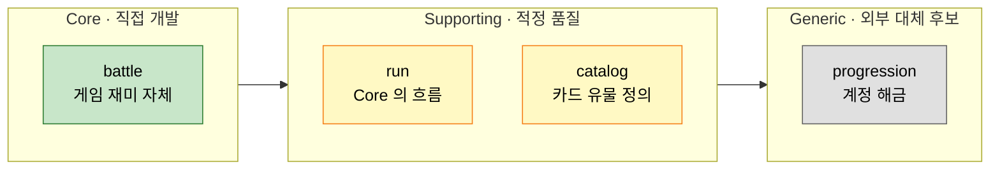
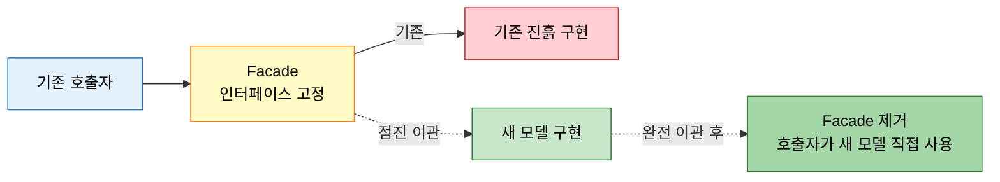

# 혼돈에서 벗어나기 — 핵심 도메인 식별
---
> 이 문서를 읽고 나면 기존 진흙 코드에서 Core 를 골라내는 4 단계 절차와 Facade 의 수명 판단 기준을 진단할 수 있습니다.

> 레거시의 진흙 덩어리에서 무엇이 Core 인지 골라내는 작업은 기술이 아니라 비즈니스 우선순위의 문제입니다. Core 가 정해져야 어디에 자원을 투자할지 결정할 수 있습니다.

`01-03` 이 sub-domain 의 3 종류(Core·Supporting·Generic)를 정의했다면, 본 문서는 그 분류를 *기존* 진흙 코드에 적용하는 절차를 다룹니다.

## 1. 핵심 도메인 식별의 출발점

> "이 시스템이 사라지면 비즈니스가 어디서 가장 아픈가?" 의 답이 Core 다.

핵심 도메인을 가르는 기준은 코드 양이나 복잡도가 아니다. 비즈니스가 그 영역에서 경쟁 우위를 갖는가, 그 영역의 실패가 비즈니스 손실로 직결되는가다. 두 질문 모두 "예" 인 영역이 Core 다.

런 관리 예시에서는 다음과 같이 분류됩니다.

| 영역 | 분류 | 이유 |
|------|------|------|
| `battle` | Core | 게임의 재미 자체를 만드는 영역. 경쟁 게임들과 차별되는 지점 |
| `run` | Core 인접(Supporting) | Core 를 감싸는 흐름. 직접 차별 요소는 아니지만 Core 의 맥락 |
| `catalog` | Supporting | 카드·유물 정의의 데이터. 잘 만든 일반 모델이면 충분 |
| `progression` | Generic | 계정·해금. 라이브러리·SaaS 로 대체 가능한 일반 영역 |

여기서 질문 하나 — Supporting 과 Generic 의 구분이 모호하다면 어떻게 풀까요? 외부 솔루션으로 100% 대체 가능하면 Generic, 비즈니스 룰이 일부라도 섞이면 Supporting 입니다. 결제 게이트웨이는 Generic, 환불 정책은 Supporting 입니다.

## 2. 현재 코드베이스 매핑

> 식별한 분류를 기존 모듈 구조에 겹쳐 보면 "어디가 잘못 묶였는지" 가 한눈에 보인다.

SSOT §6.2 가 제시하는 절차는 다음 네 단계다.

1. 현재 모듈·패키지를 리스트로 뽑는다.
2. 각 모듈이 어느 분류(Core/Supporting/Generic) 에 속하는지 표시합니다.
3. 한 모듈에 여러 분류가 섞여 있는 곳을 표시합니다. 이 자리가 1 차 리팩토링 후보입니다.
4. Core 모듈이 Generic 모듈에 의존하는지 의존 방향을 확인합니다.

이 표가 만들어지면 자원 투자의 우선순위가 분명해집니다. Core 는 직접 개발·강화, Supporting 은 적정 품질 유지, Generic 은 가능하면 외부 솔루션으로 대체합니다.

## 3. 명확한 인터페이스 확립

> Core 와 나머지 사이에 의도된 인터페이스가 없으면, Core 의 변경이 항상 Generic 까지 닿는다.

진흙 덩어리의 흔한 증상은 Core 가 Generic 의 내부 구현에 의존하는 것입니다. 예를 들어 `BattleService` 가 직접 `UserAccountRepository` 의 JPA 쿼리를 호출하면, Generic 의 저장 구조 변경이 Core 의 테스트를 깨뜨립니다.

해결은 두 단계다.

1. Core 에서 필요한 능력을 인터페이스로 정의한다 (예: `BattleOutcomeNotifier`).
2. Generic 측에 그 인터페이스를 구현한 어댑터를 둔다.

이 분리가 §4 의 Facade 패턴으로 이어집니다.

## 4. Facade 로 점진적 분리

> 한 번에 다 뜯어고치지 않습니다 — Facade 를 세워 두고 그 뒤에서 안전하게 교체합니다.

SSOT §6.4 가 제안하는 Facade 패턴은 다음 흐름입니다.

Facade 가 인터페이스를 안정시키는 동안, 그 뒤에서 구현을 한 책임씩 새 모델로 옮깁니다. 호출자는 Facade 가 같은 시그니처를 유지하는 한 영향받지 않습니다.

여기서 질문 하나 — Facade 의 수명은 얼마나 가져가야 할까요? 새 구현이 모든 책임을 흡수하고 호출자가 Facade 가 아닌 새 모델을 직접 사용할 수 있을 때 Facade 를 제거합니다. Facade 가 영구화되면 그 자체가 새로운 진흙 덩어리가 됩니다.

## 5. 식별 후 첫 분리 단계

> "이걸 분리한다" 가 아니라 "이 한 인터페이스를 먼저 박는다" 부터 시작합니다.

Core 가 식별되었다고 해서 즉시 별도 모듈·서비스로 빼지 않습니다. 첫 단계는 다음 셋 중 가장 작은 것입니다.

1. 패키지 분리 — 한 모듈 안에서 Core 와 Generic 의 패키지를 가릅니다.
2. 인터페이스 박기 — Core 가 Generic 을 직접 부르는 곳에 인터페이스를 끼워 넣습니다.
3. 의존성 방향 정리 — Core → Generic 만 허용하고 반대 방향을 차단합니다 (ArchUnit 등의 sensor 로).

이 셋이 안정되면 그 다음에 모듈러 모놀리스(`../02-05.모듈러 모놀리스와 Spring Modulith.md`)로 정식 분리하고, 더 나아가야 한다면 `./03-04` 의 마이크로서비스 전환을 검토합니다.

## 6. 실제 사례 — TPS operator-api 의 결재 도메인 Core 식별

본인 코드 사례로 옮겨 보면, TPS operator-api 의 도메인은 *결재(approval)*, *메뉴(menu)*, *사용자/조직(user/org)*, *공통 코드(common-code)* 네 영역으로 나뉩니다.
이 중 Core 는 *결재* 한 영역입니다.
결재 흐름 — 요청자, 결재자, 결재선, 승인·반려 — 이 비즈니스 차별화의 자리이며, 이 흐름이 깨지면 시스템의 존재 의미가 사라집니다.

반면 *메뉴* 는 Supporting 입니다.
결재 요청 페이지의 메뉴 트리, 권한 매핑은 결재 도메인의 *맥락 정보* 이지 비즈니스 차별 자체는 아닙니다.
*사용자/조직* 도 Supporting — 결재선 구성에 필요한 정보이지만 외부 SSO/HR 시스템과 동기화되는 일반 영역입니다.
*공통 코드* (코드 마스터, 사전, 일련번호 생성) 는 Generic 입니다.
`TB_TPS_CM_008` 시퀀스 테이블과 `FN_CREATE_TPS_NO` 함수는 *어떤 시스템에든 똑같이 박힐 수 있는* 일반 인프라입니다.

이 분류의 결과는 자원 투자 우선순위로 곧장 연결됩니다.
결재 도메인 (`org.okestro.tps.operator.approval`) 은 직접 개발·강화, 메뉴와 사용자는 적정 품질 유지, 공통 코드는 변경 빈도가 낮은 *Stable한 인프라* 로 다룹니다.
진흙 덩어리에서 가장 위험한 신호는 결재 도메인이 메뉴나 공통 코드의 *내부 구현* 에 의존하는 것입니다 — 그 의존 방향이 잡혀 있으면 Generic 의 사소한 변경이 Core 의 테스트를 깨뜨립니다.

> 출처: 본인 코드 — `~/okestro/tps-gitlab2/operator-api/` 의 패키지 구조와 도메인 영역 분류. 305P 신규 테이블 prefix 결정 사례는 MEMORY `project_tps_305p_table_prefix.md` 참조.

## 7. 면접에서 받을 만한 질문

1. Core / Supporting / Generic 의 구분 기준은 코드 양이나 복잡도가 아니라 무엇입니까?
2. Facade 패턴의 수명은 어떻게 결정합니까? 영구화되면 어떤 문제가 생깁니까?
3. Core 가 식별되었을 때 첫 분리 단계로 무엇을 선택해야 합니까? 왜 즉시 별도 서비스로 빼면 안 됩니까?
4. Supporting 과 Generic 의 구분이 모호한 영역(예: 결제 vs 환불 정책)은 어떻게 가립니까?

> 위 4개 질문에 *먼저 자답한 뒤* 아래 §정답 (자답 후 펼치기) 으로 내려갑니다.

## 8. 정답 (자답 후 펼치기)

> 위 §면접에서 받을 만한 질문 의 4개에 *먼저 자답한 뒤* 아래를 읽으세요. 자답 없이 먼저 읽으면 학습 효과가 0 입니다.

### 정답 1 — Core/Supporting/Generic 구분 기준

코드 양·복잡도는 기준이 아닙니다.
두 질문에 모두 *예* 인 영역이 Core 입니다 — (1) 비즈니스가 이 영역에서 *경쟁 우위* 를 갖는가, (2) 이 영역의 실패가 *비즈니스 손실로 직결* 되는가.
게임에서 `battle` 은 재미 자체를 만드는 자리이므로 Core 이고, `progression` (계정·해금) 은 어느 게임에도 똑같이 박힐 수 있는 일반 영역이라 Generic 입니다.
본인 TPS 사례에서는 *결재 흐름* 이 두 질문에 모두 예, *공통 코드* 가 모두 아니오였습니다.

### 정답 2 — Facade 수명 결정

Facade 는 *임시 인터페이스 안정화 도구* 입니다.
새 구현이 모든 책임을 흡수하고 호출자가 Facade 가 아닌 새 모델을 직접 사용할 수 있을 때 Facade 를 제거합니다.
영구화되면 그 자체가 새로운 진흙 덩어리가 됩니다 — *진흙 구현* 도 *새 구현* 도 모두 살아 있는 상태로 굳고, 호출자는 Facade 의 시그니처에 갇혀 새 모델의 표현력을 못 씁니다.
결과는 "두 진흙 덩어리를 한 Facade 가 묶은 상태" 가 되어 처음보다 더 정리하기 어려워집니다.

### 정답 3 — Core 식별 후 첫 분리 단계

Core 가 식별되었다고 즉시 별도 모듈·서비스로 빼면 *모듈 경계가 안정되지 않은 채 네트워크 비용* 만 추가됩니다.
가장 작은 것부터 셋 중 선택합니다 — (1) 패키지 분리, (2) 인터페이스 박기, (3) 의존성 방향 정리.
이 셋이 안정된 뒤에야 모듈러 모놀리스로, 그 다음에 (필요하면) 마이크로서비스로 갑니다.
*분산된 진흙 덩어리* 를 피하려면 분리 전에 경계가 코드에 박혀 있어야 합니다 (`./03-04 §5` 와 같은 결).

### 정답 4 — Supporting/Generic 모호 영역 구분

외부 솔루션으로 *100% 대체 가능* 하면 Generic, *비즈니스 룰이 일부라도 섞이면* Supporting 입니다.
결제 게이트웨이는 PG 사 API 로 100% 대체 가능하므로 Generic, 환불 정책은 *우리 회사의 환불 규정* 이 박혀 있어 SaaS 로 못 대체하므로 Supporting 입니다.
같은 결제 영역이라도 *어디서 비즈니스 의사결정이 일어나는가* 가 분기점입니다.
TPS 사례에서 *사용자/조직 동기화* 자체는 Generic 에 가깝지만, *결재선 구성 규칙* 은 Supporting 입니다 — 후자는 회사 결재 정책이 박혀 있어 외부 SaaS 로 대체 불가능합니다.

## 관련 문서

- [도메인 책임 분리와 세부 도메인 식별](./01-03.도메인%20책임%20분리와%20세부%20도메인%20식별.md) — Core/Supporting/Generic 분류의 정의
- [리팩토링 원칙 — 행동하기 전에 이해하기](./03-01.리팩토링%20원칙%20—%20행동하기%20전에%20이해하기.md) — 분리 작업의 전제 조건
- [모듈러 모놀리스와 Spring Modulith](../02_application/01-04.%EB%AA%A8%EB%93%88%EB%9F%AC%20%EB%AA%A8%EB%86%80%EB%A6%AC%EC%8A%A4%EC%99%80%20Spring%20Modulith.md) — Facade 이후의 정식 분리 단계
