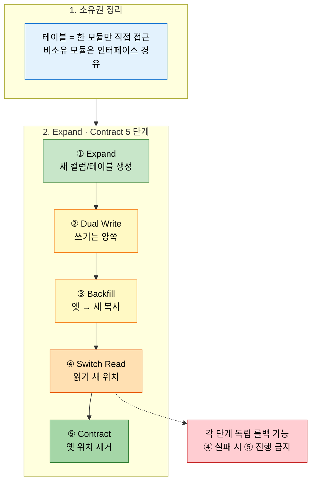
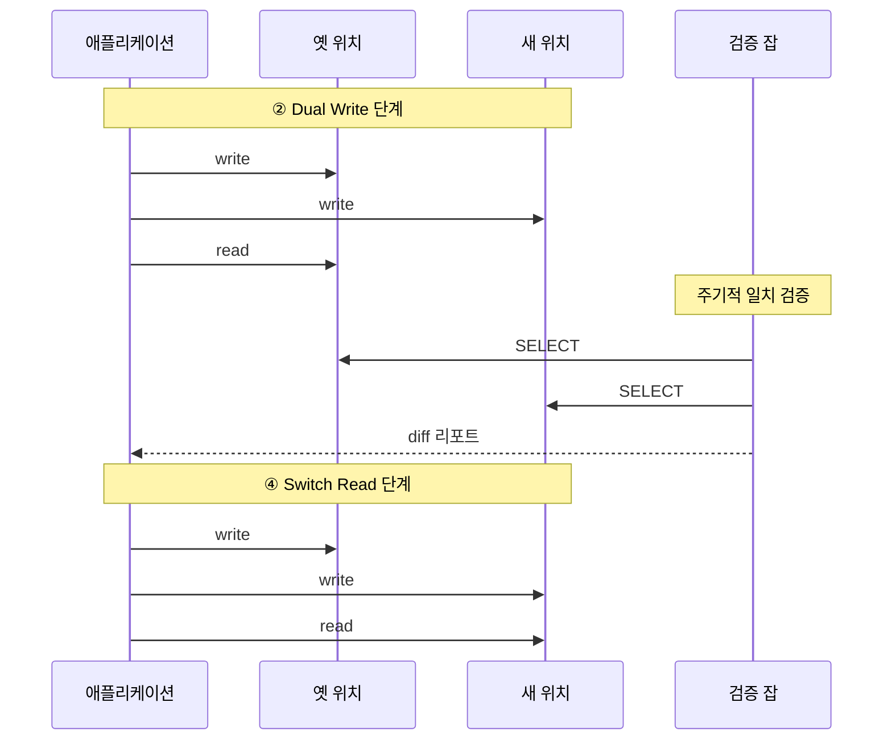

# 데이터베이스 리팩토링
---
> 이 문서를 읽고 나면 Expand/Contract 5 단계와 테이블 소유권 정리 절차를 무중단 마이그레이션에 적용할 수 있습니다.

> 모델은 진화하는데 스키마는 굳어 있습니다 — DB 를 도메인 변화에 맞춰 옮기는 작업은 코드 리팩토링보다 위험합니다. 잘못된 단계는 운영 중단이나 데이터 손실로 직결됩니다.

`03-01` 이 코드 리팩토링의 원칙을 다뤘다면, 본 문서는 그 원칙을 스키마에 적용할 때의 추가 안전망을 다룹니다.

## 1. 왜 DB 리팩토링이 필요한가

> 코드는 매주 바뀌어도 스키마가 고정되면 도메인 모델은 결국 스키마를 따라가게 됩니다 — 꼬리가 개를 흔드는 상황입니다.

DB 리팩토링이 미뤄지는 흔한 이유는 두 가지입니다.

1. 한 번에 큰 마이그레이션을 하려고 합니다 — 위험이 커서 미뤄집니다.
2. 운영 중단 없이 바꿀 방법을 모릅니다 — 시도조차 하지 않습니다.

두 이유 모두 "점진적·무중단 리팩토링" 의 패턴을 알면 풀립니다.
SSOT §8.2 가 제시하는 진화적 데이터베이스 개발(Evolutionary Database Development)이 그것입니다.

## 2. 테이블 소유권

> 한 테이블은 한 모듈만 씁니다 — 이 단순한 규칙이 마이그레이션의 자유도를 결정합니다.

SSOT §8.3 의 핵심은 "테이블에 명시적 소유자를 둡니다" 입니다.
여러 모듈이 같은 테이블을 직접 읽고 쓰면 한쪽의 스키마 변경이 다른 쪽을 깨뜨립니다.
다음 절차로 소유권을 정리합니다.

1. 각 테이블의 현재 사용자를 모두 찾아냅니다 — `grep` · 정적 분석 · 로그 분석을 함께 씁니다.
2. 그 테이블의 자연스러운 소유 모듈을 정합니다 (도메인 의미상).
3. 비소유 모듈은 직접 접근 대신 소유 모듈의 인터페이스를 거치도록 바꿉니다.

소유권이 정해진 뒤에야 §3 의 Expand/Contract 같은 무중단 리팩토링이 가능해집니다.
공유 테이블 위에서 무중단 변경은 거의 불가능합니다.

## 3. Expand/Contract 패턴

> 한 번에 바꾸지 않습니다 — 새 컬럼·새 테이블을 만들어 옆에서 채운 뒤 옛 것을 제거합니다.

SSOT §8.4 의 Expand/Contract 패턴은 무중단 마이그레이션의 표준입니다.
다섯 단계로 진행합니다.

1. Expand — 새 컬럼·테이블을 만듭니다. 기존 것과 공존합니다.
2. Dual Write — 쓰기는 두 곳 모두에 합니다. 읽기는 여전히 옛 것에서 처리합니다.
3. Backfill — 기존 데이터를 새 위치로 복사합니다.
4. Switch Read — 읽기를 새 위치로 옮깁니다. 쓰기는 여전히 양쪽에서 진행합니다.
5. Contract — 옛 위치에 대한 쓰기 중단 후 제거합니다.

각 단계는 독립적으로 롤백 가능합니다.
4 단계에서 문제가 발견되면 읽기를 다시 옛 위치로 돌리고 5 단계로 가지 않습니다.

여기서 질문 하나 — Dual Write 중에 두 위치의 데이터가 어긋나면 어떻게 할까요? 두 가지 방어가 필요합니다.
첫째, 쓰기를 한 트랜잭션 안에서 묶거나 Outbox(`../05_edd/01-04.기존 시스템 통합 — Data Liberation 과 CDC.md`)로 이중 쓰기를 풀어냅니다.
둘째, 검증 쿼리를 주기적으로 돌려 일치 여부를 확인합니다.

## 4. 이벤트 기반 데이터 동기화

> 모듈 간 데이터 공유를 직접 조인이 아닌 이벤트로 풀면, DB 리팩토링의 자유도가 한 차원 올라간다.

SSOT §8.6 이 권하는 방향은 다음과 같습니다.
모듈 A 의 데이터가 모듈 B 에 필요하면 직접 테이블을 읽지 말고 이벤트로 받아 B 가 자기 모델로 복제·캐시합니다.
이 구조의 장점은 셋입니다.

1. A 의 스키마가 바뀌어도 B 는 영향받지 않습니다 — 이벤트 계약만 유지하면 됩니다.
2. B 의 읽기가 A 의 부하에 영향을 주지 않습니다.
3. A 와 B 가 다른 저장 기술을 선택할 수 있습니다.

비용은 결과적 일관성입니다.
B 의 데이터는 A 의 변경 후 약간의 지연을 갖습니다.
이 비용을 받아들일 수 있는 도메인에서는 이 구조가 DB 리팩토링을 훨씬 쉽게 만듭니다.

## 5. 분산 데이터 접근

> 마이크로서비스로 가기 전에, 모놀리스 안에서 이미 분산 접근 패턴을 연습해야 합니다.

SSOT §8.7 의 분산 데이터 접근 패턴은 §4 의 이벤트 동기화를 일반화한 것입니다.
CQRS(`../05_edd/02-01.CQRS.md`)·Materialized View · API Composition 이 모두 같은 줄기입니다.

모놀리스 단계에서 다음 셋을 미리 적용해 두면 마이크로서비스 전환 시점에 데이터 분리가 훨씬 가볍습니다.

1. 모듈 간 직접 조인 금지 — 인터페이스나 이벤트로만 접근합니다.
2. 모듈별 스키마 네임스페이스 분리 — 같은 DB 라도 스키마를 가릅니다.
3. 결과적 일관성에 대한 사용자·운영자 이해 확보 — 일관성 대시보드·복구 절차를 준비합니다.

## 6. 실제 사례

### Sadalage·Ambler — *Refactoring Databases* 의 Expand/Contract 원전

Pramod Sadalage 와 Scott Ambler 의 *Refactoring Databases: Evolutionary Database Design* (Addison-Wesley, 2006) 이 진화적 DB 리팩토링의 원전입니다.
이 책은 60 여 개의 *데이터베이스 리팩토링 카탈로그* 를 정의하는데, 그중 가장 자주 인용되는 것이 *Rename Column*, *Move Column*, *Split Column*, *Replace Column* 같은 컬럼 리팩토링과, 본 §3 의 Expand/Contract 흐름입니다.
저자들의 핵심 메시지는 *transition period* — 옛 스키마와 새 스키마가 *함께 사는 기간* 을 의도적으로 확보하는 것 — 입니다.
이 기간 동안 두 위치에 쓰고 검증하면서 무중단으로 옮깁니다.

> 출처: Pramod J. Sadalage & Scott W. Ambler, *Refactoring Databases: Evolutionary Database Design*, Addison-Wesley, 2006, Part II "The Database Refactoring Catalog".

### 본인 사례 — TPS v2 → v305p prefix 마이그레이션 (`TB_TPS_*` → `TB_TRB_*`)

TPS 의 305P (트롬본 v2) 신규 영역은 기존 v3 (`TB_TPS_*` prefix) 와 *같은 DB 에 공존* 합니다.
신규 305P 테이블은 `TB_TRB_*` prefix 로 분리해 v3 와 v305p 가 같은 DB 안에서 서로의 변경에 영향받지 않도록 했습니다.
이 결정의 의미는 §2 의 *테이블 소유권* 규약을 prefix 로 박은 것입니다 — v305p 모듈은 `TB_TRB_*` 만, v3 모듈은 `TB_TPS_*` 만 직접 접근합니다.

문제 사례 한 컷 — 2026-04-28 시점에 `executor/engine/src/main/resources/db/` 의 `TB_TPS_OX_001`, `TB_TPS_EC_001`, `TB_TPS_EC_002` 가 305P 신규 영역인데도 `TB_TPS_*` 로 박혀 있는 것이 발견되었습니다.
이건 prefix 규약 위반이며 *소유권 경계가 흐려진 상태* 입니다.
정리 절차는 §3 의 Expand/Contract 와 같습니다 — 새 `TB_TRB_*` 테이블을 만들고 (Expand), Dual Write 로 양쪽에 쓰고, Backfill 한 뒤, 읽기를 새 위치로 옮기고, 옛 `TB_TPS_*` 를 제거합니다.
한 번에 rename 으로 끝내려고 하면 운영 중인 v305p 잡 (`SQ_TPS_*`, `FN_CREATE_TPS_NO`) 이 멈춥니다.

> 출처: 본인 코드 + MEMORY `project_tps_305p_table_prefix.md`. `executor/engine/src/main/resources/db/` 의 prefix 위반 파일 목록은 2026-04-28 확인 시점.

## 7. 면접에서 받을 만한 질문

1. Expand/Contract 5 단계 중 가장 위험한 단계는 어디입니까? 왜 그 자리에서 롤백 판단을 해야 합니까?
2. 테이블 소유권이 정리되지 않은 상태에서 Expand/Contract 를 시도하면 어떤 일이 벌어집니까?
3. 모듈 간 데이터 공유를 직접 조인이 아닌 이벤트로 풀면 어떤 자유도가 늘어납니까? 비용은 무엇입니까?
4. Dual Write 단계에서 두 위치의 데이터가 어긋나는 것을 어떻게 방어합니까?

> 위 4개 질문에 *먼저 자답한 뒤* 아래 §정답 (자답 후 펼치기) 으로 내려갑니다.

## 8. 정답 (자답 후 펼치기)

> 위 §면접에서 받을 만한 질문 의 4개에 *먼저 자답한 뒤* 아래를 읽으세요. 자답 없이 먼저 읽으면 학습 효과가 0 입니다.

### 정답 1 — 가장 위험한 단계 (Switch Read)

가장 위험한 단계는 *4. Switch Read* 입니다.
이 단계에서 읽기가 새 위치로 옮겨가는 순간, 사용자가 *새 위치의 잘못된 데이터* 를 보기 시작합니다.
1~3 단계 (Expand, Dual Write, Backfill) 는 *옛 위치만 읽기 때문에* 사용자에게 영향이 없습니다.
4 단계에서 문제가 발견되면 *5 단계로 가기 전에 읽기를 다시 옛 위치로 되돌립니다* — 이 자리가 마지막 안전 게이트입니다.
5 단계 (Contract) 로 가 버리면 옛 위치가 제거되어 되돌아갈 곳이 없어집니다.

### 정답 2 — 소유권 미정리 상태의 위험

테이블 소유권이 정리되지 않은 상태에서 Expand/Contract 를 시도하면 *비소유 모듈이 옛 스키마에 직접 의존* 해 있기 때문에 5 단계 (Contract) 에서 그 모듈이 깨집니다.
사전에 *grep + 정적 분석 + 로그* 로 모든 사용자를 찾아내야 합니다.
공유 테이블 위에서 무중단 변경은 거의 불가능한 이유는 *모든 사용자를 동시에 새 스키마로 옮기지 못하면* 부분적으로 깨진 상태가 누적되기 때문입니다.
소유권 정리가 무중단 마이그레이션의 *전제 조건* 입니다.

### 정답 3 — 이벤트 동기화의 자유도와 비용

자유도는 셋입니다.
(1) 모듈 A 의 스키마가 바뀌어도 모듈 B 는 영향받지 않습니다 — 이벤트 계약만 유지하면 됩니다.
(2) 모듈 B 의 읽기가 모듈 A 의 부하에 영향을 주지 않습니다.
(3) 두 모듈이 다른 저장 기술을 선택할 수 있습니다 — A 는 PostgreSQL, B 는 Elasticsearch 같은 식.
비용은 *결과적 일관성* 입니다.
모듈 B 의 데이터는 모듈 A 의 변경 후 약간의 지연을 갖습니다.
이 지연을 받아들일 수 없는 도메인 (예: 결제 잔액 즉시 일치) 에서는 이 패턴이 부적합합니다.

### 정답 4 — Dual Write 어긋남 방어

두 가지 방어가 필요합니다.
첫째, *쓰기를 한 트랜잭션 안에서 묶거나* Outbox 패턴으로 *이중 쓰기를 풀어냅니다*.
한 트랜잭션이 가능하면 가장 강한 방어이고, 옛 위치와 새 위치가 다른 DB 라 트랜잭션이 못 묶이면 Outbox 가 차선입니다.
둘째, *주기적 검증 쿼리* 를 돌려 두 위치의 일치 여부를 확인합니다.
diff 가 발견되면 즉시 알람 → 4 단계 (Switch Read) 전이면 옛 위치 기준으로 새 위치를 재동기화, 4 단계 후이면 새 위치 기준으로 옛 위치를 재동기화합니다.
이 두 방어 없이 Dual Write 만 하면 *조용히 어긋난 데이터가 누적* 되어 Contract 단계에서 발견됩니다 — 그 시점에는 옛 위치가 사라지므로 복구가 어렵습니다.

## 관련 문서

- [리팩토링 원칙](./03-01.리팩토링%20원칙%20—%20행동하기%20전에%20이해하기.md) — 변경 전 진단의 절차
- [모놀리스에서 마이크로서비스로](./03-04.모놀리스에서%20마이크로서비스로%20—%20언제%2C%20왜.md) — DB 분리의 다음 단계
- [Data Liberation 과 CDC](../05_edd/01-04.기존%20시스템%20통합%20—%20Data%20Liberation%20과%20CDC.md) — 이벤트 기반 동기화의 구현 패턴
