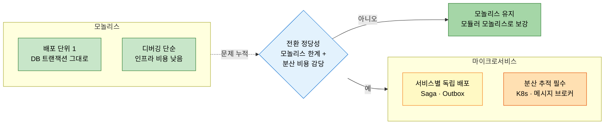
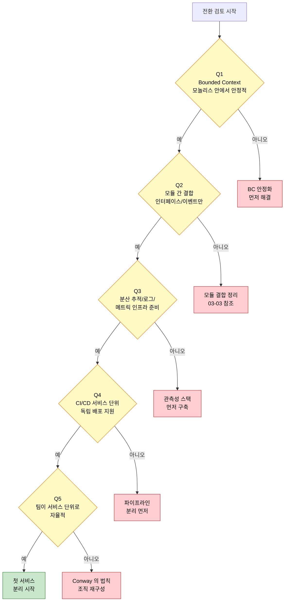

# 모놀리스에서 마이크로서비스로 — 언제, 왜
---
> 이 문서를 읽고 나면 Bounded Context 가 마이크로서비스 경계로서 적합한 이유와 전환 준비 5 질문을 평가할 수 있습니다.

> 분리는 보상이지 도착점이 아닙니다. Bounded Context 가 안정되고 모듈러 모놀리스가 잘 작동하는 상태에서야 물리적 분리가 의미를 갖습니다. 그 전에 분리하면 분산 시스템의 비용만 받고 효용은 못 누립니다.

## 1. 마이크로서비스가 푸는 문제 — 와 만드는 문제

> 마이크로서비스는 독립 배포·기술 다양성·팀 자율성을 줍니다 — 대신 네트워크 신뢰성·데이터 일관성·운영 복잡도를 같이 가져갑니다.

SSOT §10.2 의 비교 표를 단순화하면 다음과 같습니다.

| 측면 | 모놀리스 | 마이크로서비스 |
|------|----------|----------------|
| 배포 | 한 번에 전체 | 서비스 단위 독립 |
| 트랜잭션 | DB 트랜잭션 그대로 | Saga·Outbox 같은 결과적 일관성 |
| 디버깅 | 한 프로세스 | 분산 추적 필수 |
| 팀 자율성 | 같은 코드베이스 협업 | 서비스별 독립 진화 |
| 인프라 비용 | 단순 | K8s·메시지 브로커·관측성 스택 |

여기서 질문 하나 — 위 표만 보면 마이크로서비스가 압도적입니까? 그렇지 않습니다.
오른쪽 열의 "결과적 일관성", "분산 추적", "K8s 스택" 은 모두 비용입니다.
그 비용을 감당할 만큼의 문제가 모놀리스에 있을 때만 전환의 정당성이 생깁니다.

## 2. DDD 와 마이크로서비스의 관계

> 마이크로서비스의 자연스러운 경계는 Bounded Context — 그 외 기준은 모두 의심해야 합니다.

SSOT §10.3 의 핵심은 "Bounded Context 가 마이크로서비스의 후보 경계" 라는 점입니다.
기술적 계층(API · Service · Repository)으로 가르면 거의 항상 실패합니다.
도메인 의미가 같은 코드가 여러 서비스에 흩어지고, 한 비즈니스 변경이 여러 서비스를 동시에 흔듭니다.

`01-04 §3` 의 Context Map 이 마이크로서비스 통신의 청사진입니다.
Open Host Service · Anticorruption Layer · Customer-Supplier 같은 패턴이 그대로 서비스 간 통신 결정의 도구가 됩니다.

## 3. 분산 시스템의 8 가지 오류

> "네트워크는 신뢰할 수 있다" 같은 가정 8 개 — 모두 거짓 — 가 분산 시스템 초보의 함정입니다.

SSOT §10.4 가 인용하는 Peter Deutsch 의 8 가지 오류는 다음과 같습니다.

1. 네트워크는 신뢰할 수 있다 (The network is reliable).
2. 지연 시간은 0 이다 (Latency is zero).
3. 대역폭은 무한하다 (Bandwidth is infinite).
4. 네트워크는 안전하다 (The network is secure).
5. 토폴로지는 변하지 않는다 (Topology doesn't change).
6. 관리자는 한 명이다 (There is one administrator).
7. 전송 비용은 0 이다 (Transport cost is zero).
8. 네트워크는 동질적이다 (The network is homogeneous).

마이크로서비스로 가기 전에 위 8 개가 모두 거짓임을 인정하고, 그에 따른 대응(타임아웃·재시도·서킷 브레이커·idempotency·분산 추적)을 준비할 수 있어야 합니다.
준비 없이 전환하면 모놀리스의 단점에 분산 시스템의 단점이 더해집니다.

## 4. 전환 준비 상태 평가

> "지금 가야 하는가" 의 답은 다음 다섯 질문에 모두 "예" 일 때 비로소 "예" 가 됩니다.

SSOT §10.5 의 평가 체크리스트를 다섯 질문으로 압축하면 다음과 같다.

1. Bounded Context 가 모놀리스 안에서 이미 안정적으로 작동하는가?
2. 모듈 간 결합이 인터페이스·이벤트로만 일어나는가? (`03-03` 의 분산 데이터 접근 패턴 준비)
3. 분산 추적·중앙 로그·메트릭 인프라가 준비되어 있는가?
4. CI/CD 가 서비스 단위 독립 배포를 지원하는가?
5. 팀이 서비스 단위로 자율적인가? (Conway's Law)

다섯 중 하나라도 "아니오" 면 그것을 먼저 해결합니다.
다섯이 모두 "예" 일 때, 그제야 첫 서비스를 떼냅니다.

## 5. Modular Monolith 가 기반인 이유

> 마이크로서비스의 토대는 잘 만든 모놀리스입니다 — 모듈러 모놀리스를 거치지 않고 도달한 마이크로서비스는 분산된 진흙 덩어리가 됩니다.

SSOT §10.6 의 핵심 메시지는 분명합니다.
모놀리스 안에서 모듈 경계가 깨진 상태로 마이크로서비스로 가면, 경계는 그대로 새기지 못한 채 네트워크만 추가됩니다.
결과는 "Distributed Big Ball of Mud" — 분산된 진흙 덩어리입니다.

올바른 순서는 다음과 같다.

1. `01-04` · `01-03` 으로 Bounded Context 와 sub-domain 분류.
2. `../02-05` 의 모듈러 모놀리스로 모듈 경계를 코드에 박는다.
3. `03-03` 으로 DB 접근 패턴을 분산 친화적으로 옮긴다.
4. `04-03 DDD 와 CI/CD` 로 Context 단위 파이프라인을 분리합니다.
5. 그제야 첫 서비스를 떼냅니다.

각 단계가 다음 단계의 안전망입니다.
단계를 건너뛰면 뒤에서 비용이 누적됩니다.

## 6. 실제 사례 — redpanda-playground 의 pipeline → executor/operator-stub 분리

본인 redpanda-playground 의 2026-03-31 이관이 본 문서의 §5 절차를 실제로 거친 사례입니다.
원래 `pipeline` 모듈이 *실행 제어 + 워크플로우 정의 + 이벤트 발행* 세 책임을 동시에 가지고 있었습니다.
이 상태가 진흙 덩어리에 가까운 신호를 보였습니다 — Jenkins 호출 변경이 워크플로우 코드를 깨뜨리고, 이벤트 스키마 변경이 실행 제어를 깨뜨리는 패턴이 누적되었습니다.

§5 의 안전 순서대로 분리를 진행했습니다.
(1) Bounded Context 식별 — *실행 제어* (executor) 와 *외부 시스템 연결* (operator-stub) 두 Context 로 가름.
(2) 모듈 경계 코드에 박기 — `pipeline` 의 실행 제어 코드를 `executor/` 로, 외부 호출을 `operator-stub/` 으로 이동.
(3) DB 접근 분리 — `core-db` 의 테이블 소유권을 모듈별로 정리 (`./03-03 §2` 적용).
(4) CI/CD 파이프라인 분리 — Jenkins K8s Helm 설치 위에 각 모듈의 잡을 분리.
(5) 첫 분리 — executor 가 자체 SSE 엔드포인트와 자체 상태 관리를 가지게 되어 pipeline 과 독립 배포 가능.

분리 후 효과는 측정 가능했습니다 — Jenkins API 변경이 executor 만 건드리고 워크플로우는 안 깨졌고, 이벤트 스키마 변경이 operator-stub 만 흔들었습니다.
다만 비용도 같이 왔습니다 — *결과적 일관성* 이 추가되어 executor 의 WAITING_EXECUTOR 상태와 5 분 타임아웃 (MEMORY `redpanda-playground.md` Phase 5 설계) 같은 분산 패턴을 새로 박아야 했습니다.
이 비용을 받아들일 수 있는 PoC 도메인이었기에 전환의 정당성이 생겼습니다 — 운영 도메인이었다면 모듈러 모놀리스에서 멈췄을 수 있습니다.

> 출처: 본인 코드 + MEMORY `redpanda-playground.md`. 2026-03-31 K8s 전면 이관 + Phase 5 멀티 Jenkins 설계 시점 기준.

## 7. 면접에서 받을 만한 질문

1. Bounded Context 가 마이크로서비스 경계로 적합한 이유는 무엇입니까? 기술적 계층(API/Service/Repository) 으로 가르면 왜 실패합니까?
2. 전환 준비 5 질문 중 하나라도 "아니오" 면 어떻게 대응해야 합니까? 그 질문을 무시하고 진행하면 무엇이 깨집니까?
3. 모듈러 모놀리스를 건너뛰고 마이크로서비스로 가면 어떤 결과가 나옵니까?
4. Peter Deutsch 의 8 가지 오류는 마이크로서비스 설계에서 어떤 대응을 강제합니까?

> 위 4개 질문에 *먼저 자답한 뒤* 아래 §정답 (자답 후 펼치기) 으로 내려갑니다.

## 8. 정답 (자답 후 펼치기)

> 위 §면접에서 받을 만한 질문 의 4개에 *먼저 자답한 뒤* 아래를 읽으세요. 자답 없이 먼저 읽으면 학습 효과가 0 입니다.

### 정답 1 — Bounded Context 경계의 적합성

Bounded Context 는 *도메인 의미의 일관성 단위* 입니다.
한 Context 안에서는 같은 용어가 같은 의미를 가지고, Context 경계를 넘으면 의미가 달라질 수 있다는 명시적 약속이 있습니다.
이 경계를 따라 서비스를 가르면 *한 비즈니스 변경이 한 서비스 안에서 끝납니다*.
기술적 계층 (API · Service · Repository) 으로 가르면 *같은 도메인 의미가 여러 계층에 흩어져* 있기 때문에 한 비즈니스 변경이 모든 계층 = 모든 서비스를 동시에 흔듭니다.
결과는 "서비스가 많아졌는데 결합도는 그대로" — 분산 비용만 추가됩니다.

### 정답 2 — 5 질문 중 하나라도 아니오일 때

다섯 질문은 *전환의 전제 조건* 이지 *목표 체크리스트* 가 아닙니다.
하나라도 "아니오" 면 *그것을 먼저 해결* 한 뒤에 전환을 다시 검토합니다.
무시하고 진행하면 각각 다음이 깨집니다.
(Q1 BC 불안정 무시) 서비스 경계가 자주 흔들리며 매번 여러 서비스를 동시 수정.
(Q2 결합 미정리 무시) 분산 트랜잭션이 필요해져 Saga · Outbox 가 폭증.
(Q3 관측성 미준비 무시) 장애가 어디서 시작됐는지 추적 불가.
(Q4 CI/CD 단위 미지원 무시) 서비스가 독립이라는 약속이 깨짐.
(Q5 팀 자율성 미확보 무시) Conway 의 법칙대로 *팀 경계와 서비스 경계가 어긋나* 모든 변경이 팀 간 조정 비용을 요구.

### 정답 3 — 모듈러 모놀리스 건너뛰기의 결과

"Distributed Big Ball of Mud" — *분산된 진흙 덩어리* 가 됩니다.
모놀리스 안에서 모듈 경계가 깨진 상태로 마이크로서비스로 가면, 경계는 그대로 새기지 못한 채 *네트워크만 추가* 됩니다.
처음에는 "잘게 쪼개졌으니 좋겠지" 라고 보이지만, 실제로는 *결합도는 모놀리스와 같고 분산 비용만 더해진* 상태입니다.
복구 경로는 두 가지인데 둘 다 비쌉니다 — (a) 분산 상태에서 경계를 다시 그리거나, (b) 다시 모놀리스로 합친 뒤 모듈러 모놀리스를 거쳐 재분리.
이 위험을 피하는 가장 싼 방법이 *모듈러 모놀리스를 거쳐 가는 것* 입니다.

### 정답 4 — 8 가지 오류와 대응

Peter Deutsch 의 8 가지 오류는 모두 *분산 시스템 초보가 무의식적으로 가정* 하는 것들입니다.
각 오류는 구체적 대응을 강제합니다.
"네트워크는 신뢰할 수 있다" → 타임아웃·재시도·서킷 브레이커.
"지연 시간은 0" → 비동기 호출·캐싱·결과적 일관성.
"대역폭 무한" → 페이로드 압축·페이지네이션.
"네트워크는 안전" → mTLS · 인증·인가.
"토폴로지 불변" → 서비스 디스커버리·헬스 체크.
"관리자 한 명" → 권한 분리·감사 로그.
"전송 비용 0" → 호출 횟수 제한·배치.
"동질적 네트워크" → 멱등성 (idempotency) · 분산 추적.
이 대응 셋이 *준비되지 않은 상태* 에서 마이크로서비스로 가면 *모놀리스의 단점 + 분산 시스템의 단점* 이 모두 누적됩니다.

## 관련 문서

- [모듈러 모놀리스와 Spring Modulith](../02_application/01-04.%EB%AA%A8%EB%93%88%EB%9F%AC%20%EB%AA%A8%EB%86%80%EB%A6%AC%EC%8A%A4%EC%99%80%20Spring%20Modulith.md) — 분리 전의 마지막 안정 지점
- [분산 아키텍처 기초](../03_distributed/01-01.%EB%B6%84%EC%82%B0%20%EC%95%84%ED%82%A4%ED%85%8D%EC%B2%98%20%EA%B8%B0%EC%B4%88.md) — 분산의 일반 원칙
- [도메인 책임 분리와 세부 도메인 식별](./01-03.도메인%20책임%20분리와%20세부%20도메인%20식별.md) — 분리 후보의 1 차 식별
