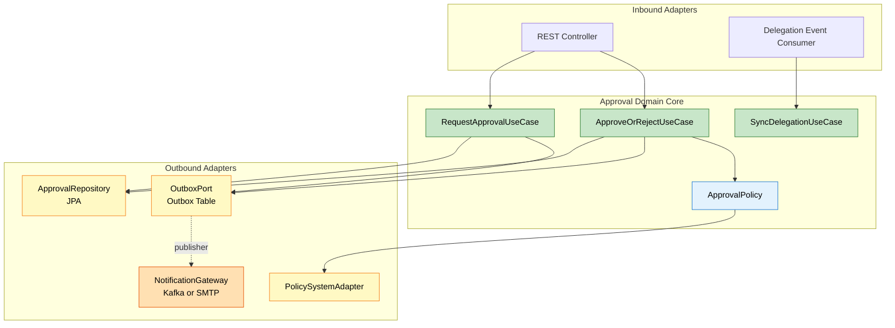
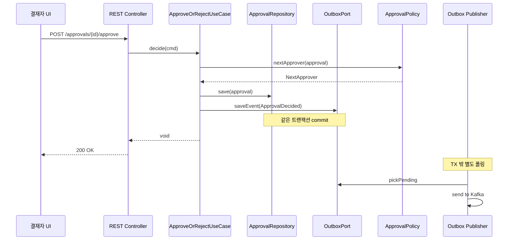

# 헥사고날 변형 — TPS 결재 도메인 적용 사례
---
> 이 문서를 읽고 나면 교과서 헥사고날의 어떤 전제가 실전에서 깨지는지 진단하고, inbound/outbound 변형 3가지를 판단 기준으로 선택할 수 있습니다.

> 교과서 헥사고날 아키텍처를 실전 결재 도메인에 적용하면 그대로는 작동하지 않습니다. 외부 결재선 시스템, 위임/대결 규칙, 비동기 알림 같은 요구가 어댑터 구조를 바꾸도록 강제하기 때문입니다.

## 1. 왜 교과서 그대로는 안 되는가

> 결재 도메인은 단일 입력·단일 저장소를 가정한 헥사고날 다이어그램의 전제를 깹니다.

전형적인 헥사고날 그림은 도메인 코어가 inbound port를 하나 갖고, outbound port로 DB와 외부 시스템에 접근하는 모습입니다. 결재 도메인에서는 다음 세 가지가 동시에 들어옵니다:

- 신청자가 결재 요청을 올리는 동기 호출
- 결재선의 다음 결재자에게 알림을 보내는 비동기 outbound
- 외부 인사 시스템에서 위임·대결 사실이 변경되는 inbound 이벤트

세 흐름을 같은 inbound port 하나로 받으면 도메인이 "이 호출이 누구의 어떤 의도냐"를 매번 분기해야 합니다. 결국 도메인 코드가 어댑터 사정에 오염됩니다.

## 2. 변형 1 — inbound port를 의도별로 분리

결재 도메인의 inbound port를 한 덩어리로 두지 않고 의도(intent) 단위로 쪼갭니다. `RequestApprovalUseCase`, `ApproveOrRejectUseCase`, `SyncDelegationUseCase` 세 개입니다.

```java
public interface RequestApprovalUseCase {
    ApprovalId request(RequestApproval cmd);
}

public interface ApproveOrRejectUseCase {
    void decide(ApprovalDecision cmd);
}

public interface SyncDelegationUseCase {
    void apply(DelegationEvent event);
}
```

REST 어댑터는 앞의 두 port를 호출하고, Kafka Consumer 어댑터는 세 번째 port를 호출합니다. **port가 도메인의 의도를 직접 드러내므로** 어댑터를 추가해도 도메인이 흔들리지 않습니다. Vernon이 `Implementing DDD`에서 강조한 "application service는 use case의 표현"과 일치합니다.

## 3. 변형 2 — outbound port의 트랜잭션 경계 분리

> 결재 승인은 한 트랜잭션 안에서 끝나지만, 다음 결재자 알림은 별도 트랜잭션에서 발생해야 합니다.

교과서는 outbound port를 `ApprovalRepository`, `NotificationGateway` 두 개로 단순화하지만, 실전에서는 두 어댑터가 같은 트랜잭션에 묶이면 안 됩니다. 알림 시스템이 일시 장애를 일으키면 결재가 같이 롤백돼 사용자가 "버튼만 눌렸지 결재가 안 됐다"는 상태를 보게 됩니다.

| outbound port | 트랜잭션 정책 | 어댑터 |
|---------------|--------------|--------|
| `ApprovalRepository` | 결재 결정과 같은 TX 안에서 commit | JPA |
| `OutboxPort` | 같은 TX 안에서 저장만 (전송은 별도) | Outbox 테이블 |
| `NotificationGateway` | TX 밖, Outbox publisher가 호출 | Kafka 또는 SMTP |

Outbox를 끼우면 도메인 코어는 "알림이 발사됐다"고 가정하지 않고 "발사가 예약됐다"만 보장합니다. 03-09의 Outbox 패턴이 이 자리에서 그대로 들어맞습니다.

## 4. 변형 3 — 정책(Policy)을 도메인 안으로 끌어오기

결재선 규칙(승인자가 휴가 중이면 차상위 결재, 금액 임계값 초과 시 추가 결재선)은 외부 정책 시스템이 제공합니다. 어댑터에 두면 도메인이 자기 규칙을 모르게 되므로, 정책을 **outbound port + 도메인 인터페이스 이중 표현**으로 다룹니다.

```java
public interface ApprovalPolicy {                 // 도메인 인터페이스
    NextApprover nextApprover(Approval approval);
}

@Component
public class PolicySystemApprovalPolicy
        implements ApprovalPolicy {               // outbound adapter
    private final PolicyApiClient client;
    ...
}
```

도메인은 `ApprovalPolicy`에만 의존합니다. 어댑터가 외부 시스템을 호출해 결과를 반환하든, in-memory 정책으로 결과를 만들든 도메인은 동일하게 동작합니다. 통합 테스트에서 in-memory 구현으로 대체할 수 있어 외부 시스템 의존을 격리할 수 있습니다.

## 5. 결과 다이어그램

위 세 변형을 모두 적용한 결재 도메인의 어댑터 구조는 다음과 같습니다.



핵심은 **inbound가 의도별로 갈라지고, outbound는 트랜잭션 경계별로 갈라집니다**. 도메인 코어는 어댑터 개수가 늘어도 같은 모양을 유지합니다.

## 6. 결재 승인 호출 시퀀스

세 변형이 실제 호출 흐름에서 어떻게 보이는지는 다음 시퀀스로 확인할 수 있습니다.



승인 요청은 한 트랜잭션 안에서 끝나고, 알림 발사는 별도 폴러가 처리합니다. 사용자에게 200을 돌려준 시점에 *결재 결정과 이벤트 예약*은 같이 영속화돼 있고, *알림 도달*은 비동기 보장입니다.

## 7. 트레이드오프

변형은 공짜가 아닙니다. inbound port 분리는 use case 클래스 수를 늘리고, outbound 트랜잭션 분리는 Outbox 인프라를 강제합니다.
결재 도메인처럼 외부 통합이 많고 트랜잭션 경계가 복잡한 경우에는 보상이 크지만, 단순 CRUD에 가까운 도메인에서는 과한 설계입니다.

판단 기준은 단순합니다. **외부 시스템 어댑터가 둘 이상이고 그중 하나라도 다른 트랜잭션 정책을 요구하면** 변형을 적용합니다. 그 외에는 02-03의 교과서 헥사고날로 충분합니다.

## 8. 실제 사례 — TPS operator-api 의 `ApprovalPolicy` 구현

본인 코드에서 §4 의 정책 이중 표현이 실제로 어떻게 박혀 있는지 옮기면 다음과 같습니다.
`org.okestro.tps.operator.approval` 패키지에 `ApprovalPolicy` 도메인 인터페이스를 두고, 외부 인사 시스템·내부 정책 시스템 두 어댑터가 같은 인터페이스를 구현합니다.
인사 시스템은 위임/대결 정보를, 정책 시스템은 금액 임계값별 결재선을 제공합니다.

도메인 코드는 두 어댑터의 존재를 모릅니다.
도메인이 `nextApprover(approval)` 을 호출하면 Spring이 `@Primary` 또는 프로필 기반으로 골라 주입한 구현체가 실행됩니다.
통합 테스트에서는 두 어댑터 자리에 `InMemoryApprovalPolicy` 를 끼워 외부 의존을 격리합니다 — 이 격리가 없으면 결재 도메인 테스트가 매번 인사 시스템 mock 서버를 띄워야 하는 비용으로 번집니다.

> 출처: 본인 코드 — `~/okestro/tps-gitlab2/operator-api/` 의 `approval` 패키지 구조. MEMORY `project_tps_ticket_sbh_test.md` 의 `ApprovalFlowSbhTestIT` 패턴도 같은 격리 원칙을 따릅니다.

## 9. 면접에서 받을 만한 질문

1. 교과서 헥사고날 다이어그램의 어떤 전제가 결재 도메인에서 깨집니까? 깨진 채로 그대로 적용하면 어떤 비용이 누적됩니까?
2. inbound port 를 의도(intent) 단위로 쪼개는 이유는 무엇입니까? 한 port 로 모든 호출을 받으면 도메인 코드가 어떻게 오염됩니까?
3. outbound 트랜잭션 분리에서 Outbox 가 차지하는 역할은 무엇입니까? Outbox 없이 알림 게이트웨이를 같은 TX에 묶으면 어떤 사용자 경험이 만들어집니까?
4. 정책을 도메인 인터페이스 + 외부 어댑터로 이중 표현하면 통합 테스트가 어떻게 가벼워집니까?

> 위 4개 질문에 *먼저 자답한 뒤* 아래 §정답 (자답 후 펼치기) 으로 내려갑니다.

## 10. 정답 (자답 후 펼치기)

> 위 §면접에서 받을 만한 질문 의 4개에 *먼저 자답한 뒤* 아래를 읽으세요. 자답 없이 먼저 읽으면 학습 효과가 0 입니다.

### 정답 1 — 깨지는 전제

교과서 헥사고날은 *단일 inbound port + 단일 트랜잭션 + 단일 저장소* 를 가정합니다.
결재 도메인은 세 가정이 모두 깨집니다 — (1) 신청자의 동기 요청, 결재자의 결정, 외부 인사 시스템의 위임 이벤트가 *세 가지 의도* 로 들어옵니다.
(2) 결재 결정과 알림 발사가 *다른 트랜잭션 정책* 을 요구합니다.
(3) 결재선 규칙은 *외부 정책 시스템* 이 제공하고, 위임은 *외부 인사 시스템* 이 제공하며, 둘 다 도메인 결정의 입력입니다.
그대로 적용하면 도메인 코드가 "이 호출이 누구의 어떤 의도냐" 를 분기하고, "이 outbound 가 성공해야 하는가 실패해도 되는가" 를 매번 판단하게 됩니다.
도메인 코어가 어댑터 사정에 오염된 진흙 상태입니다.

### 정답 2 — intent 단위 분리의 이유

한 port 로 모든 호출을 받으면 도메인이 매번 *호출자 식별 + 의도 분기* 를 수행해야 합니다.
`if (caller == REST) ... else if (caller == Kafka) ...` 같은 분기가 도메인 메서드에 박히는 순간 *어댑터를 추가할 때마다 도메인이 흔들립니다*.
intent 별로 port 를 쪼개면 — `RequestApprovalUseCase`, `ApproveOrRejectUseCase`, `SyncDelegationUseCase` — 각 어댑터가 자기 의도에 맞는 port 만 호출하므로 *도메인 코드는 어댑터 추가/제거를 모릅니다*.
Vernon 의 "application service 는 use case 의 표현" 이 이 형태를 가리킵니다.

### 정답 3 — Outbox 의 역할과 직접 호출의 사용자 경험

Outbox 는 *알림 발사를 결재 결정과 같은 TX 안에 영속화하되, 실제 전송은 TX 밖으로 미루는* 도구입니다.
Outbox 없이 `NotificationGateway` 를 같은 TX 에 묶으면 — 알림 시스템 일시 장애가 결재 트랜잭션을 롤백시킵니다.
사용자는 "승인 버튼을 눌렀는데 결재가 안 됐다" 는 상태를 보고, 재시도하면 *이미 처리된 결재가 또 처리되는* 중복 사고가 누적됩니다.
Outbox 를 끼우면 결재 결정은 항상 commit 되고, 알림은 polling publisher 가 *최소 한 번* 전송을 보장합니다.
사용자에게 보이는 정합성이 깨지지 않습니다.

### 정답 4 — 정책 이중 표현과 통합 테스트

정책을 *외부 어댑터 직접 호출* 로 두면 통합 테스트가 매번 외부 정책 시스템 mock 서버를 띄워야 합니다.
도메인 인터페이스 `ApprovalPolicy` + 외부 어댑터 `PolicySystemApprovalPolicy` 로 이중 표현하면, 통합 테스트는 같은 인터페이스에 `InMemoryApprovalPolicy` 를 주입해 외부 의존을 격리합니다.
테스트 속도가 *분 단위에서 초 단위* 로 떨어지고, 외부 시스템 장애가 빌드를 깨뜨리지 않습니다.
도메인 코어는 두 구현체의 존재를 모르므로 *프로덕션과 테스트의 도메인 코드가 동일* 합니다 — 이게 헥사고날의 본래 약속입니다.

## 관련 문서

- [헥사고날 아키텍처](../02_application/01-03.%ED%97%A5%EC%82%AC%EA%B3%A0%EB%82%A0%20%EC%95%84%ED%82%A4%ED%85%8D%EC%B2%98.md) — 교과서 헥사고날의 기본 구조
- [전략적 설계와 전술적 패턴](./01-02.%EC%A0%84%EB%9E%B5%EC%A0%81%20%EC%84%A4%EA%B3%84%EC%99%80%20%EC%A0%84%EC%88%A0%EC%A0%81%20%ED%8C%A8%ED%84%B4.md) — 변형의 도메인 근거
- [ADR과 Spring Boot 아키텍처 의사결정](../01_foundation/01-04.ADR%EA%B3%BC%20Spring%20Boot%20%EC%95%84%ED%82%A4%ED%85%8D%EC%B2%98%20%EC%9D%98%EC%82%AC%EA%B2%B0%EC%A0%95.md) — 변형 결정의 박제
