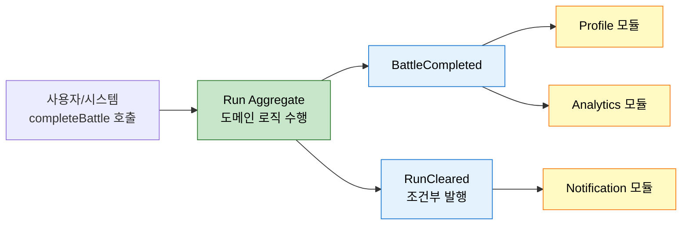
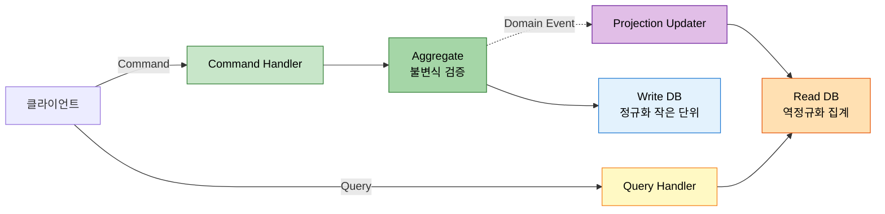

# 이벤트와 CQRS 통합 — DDD 시점에서
---
> 이 문서를 읽고 나면 Aggregate 가 이벤트를 발행하는 이유와 Domain Event / Integration Event 분리, CQRS·Event Sourcing 의 트레이드오프를 설명할 수 있습니다.

> CQRS · Event Sourcing 의 구현 디테일은 `../05_edd/` 가 다룹니다. 본 문서는 한 단계 위 — "왜 DDD 가 이 둘을 자연스럽게 요구하는가" 의 모델적 근거만 다룹니다.

`02-01 §2` 에서 Aggregate 사이는 결과적 일관성으로 다룬다고 했습니다. 그 결과적 일관성을 표현하는 도구가 Domain Event 이고, 그 위에서 읽기·쓰기 모델을 분리하는 패턴이 CQRS 입니다.

## 1. Aggregate 가 이벤트를 만드는 이유

> "이 Aggregate 에 어떤 일이 일어났는가" 의 사실을 외부와 공유할 때, 이벤트는 그 사실의 표준 표현입니다.

DDD 의 Aggregate 는 외부에 자기 내부 상태를 노출하지 않습니다 (`02-01 §1`). 대신 Aggregate 의 메서드가 호출된 결과 "무슨 일이 일어났는가" 를 Domain Event 로 발행합니다.

```java
// Run.java
public final class Run {
    private final List<DomainEvent> events = new ArrayList<>();

    public List<CardId> completeBattle(BattleId battleId, BattleResult result) {
        // ... 도메인 로직 ...
        events.add(new BattleCompleted(this.id, battleId, result));
        if (result.isVictory() && actProgress.isBossDefeated()) {
            events.add(new RunCleared(this.id, actProgress));
        }
        return rewardCandidates;
    }
}
```

이 구조의 효과는 셋입니다.

1. Aggregate 내부 상태가 새지 않습니다 — 외부는 이벤트의 페이로드만 봅니다.
2. 한 메서드 호출이 여러 사실을 발생시킬 수 있습니다 — 위 코드처럼 전투 완료와 런 클리어가 함께.
3. 이벤트가 외부 모듈·서비스의 진입점이 됩니다 — `Profile`, `Analytics`, `Notification` 모듈이 같은 이벤트를 구독합니다.



## 2. Domain Event vs Integration Event

> 같은 "이벤트" 라는 단어지만, Bounded Context 안을 도는 이벤트와 Context 를 넘는 이벤트는 다른 종류입니다.

SSOT §7.4 의 구분은 다음과 같습니다.

| 측면 | Domain Event | Integration Event |
|------|--------------|---------------------|
| 범위 | 같은 Bounded Context 내 | Context 또는 서비스 간 |
| 페이로드 | 도메인 내부 어휘 그대로 | 안정적 공개 계약(`../05_edd/01-03`) |
| 진화 자유도 | 높음 (내부) | 낮음 (호환성 유지 필수) |
| 전달 매체 | 인메모리 publisher | 메시지 브로커(Kafka 등) |

흔한 실수는 둘을 같은 객체로 만드는 것입니다. Domain Event 를 그대로 Kafka 로 흘려보내면, 내부 모델 변경이 외부 계약을 깨뜨립니다. Domain Event 를 받아 Integration Event 로 *변환* 하는 어댑터(`../05_edd/03-01.Saga, Outbox, Request-Response Bridge.md` 의 Outbox 패턴)가 그래서 필요합니다.

여기서 질문 하나 — 둘 다 만들면 코드 양이 늘어나는데 그만한 가치가 있을까요? Context 의 진화 속도를 외부 계약 변경 비용으로부터 분리한다는 가치입니다. 내부는 매일 바뀌어도 외부 계약은 분기 단위로만 바뀝니다.

## 3. CQRS — 명령과 질의의 모델 분리

> 쓰기 모델은 불변식을 지키고, 읽기 모델은 화면을 만듭니다 — 두 책임이 같은 모델 안에서 충돌할 때 분리의 정당성이 생깁니다.

SSOT §7.5 의 CQRS 는 다음 두 모델을 분리합니다.

| 모델 | 책임 | 형태 |
|------|------|------|
| Command Model | 불변식 검증·상태 변경 | Aggregate (정규화·작은 단위) |
| Query Model | 화면·집계·검색 | View · Projection (역정규화·집계) |

같은 Aggregate 가 두 책임을 모두 지면 다음 충돌이 생깁니다. 쓰기는 Aggregate 의 작은 경계가 좋지만, 읽기는 여러 Aggregate 의 정보를 한 화면에 모아 보여야 합니다. 한 모델로 둘을 만족시키려면 Aggregate 가 부풀거나 N+1 쿼리가 폭증합니다.

CQRS 의 핵심은 두 모델이 *다른 저장 구조* 를 가질 수 있다는 점입니다. Command 는 JPA Aggregate, Query 는 별도 read DB 의 역정규화된 뷰 — 둘 사이는 이벤트로 동기화합니다.



## 4. 읽기·쓰기 동기화의 비용

> CQRS 를 도입하는 순간 일관성은 결과적 일관성이 됩니다 — 이 비용을 받아들일 수 있는 도메인에서만 의미가 있습니다.

SSOT §7.6 이 다루는 동기화 전략은 다음 세 가지입니다.

1. 동기 갱신 — 쓰기 트랜잭션 안에서 read view 도 함께 갱신. 트랜잭션 비용이 커지지만 일관성 강함.
2. 비동기 갱신 (이벤트) — 쓰기 후 이벤트 발행, 비동기 핸들러가 view 갱신. 일관성 약하지만 확장성 높음.
3. 주문형 재구성 — view 를 미리 만들지 않고 조회 시점에 이벤트를 재생해 만듭니다. Event Sourcing 과 결합.

런 관리 예시에서 "전투 결과 화면" 은 1 번이 자연스럽습니다 (즉시 보여야 함). "월간 통계" 는 2 번이 자연스럽습니다 (몇 분 지연 허용). "전체 리플레이" 는 3 번이 맞습니다 (모든 이벤트를 시간순으로 재생).

## 5. Event Sourcing 으로 확장

> 상태가 아닌 이벤트의 시퀀스를 진실로 삼는 결정 — DDD 의 자연스러운 종착지지만 모든 도메인에 필요하지는 않다.

SSOT §7.7 의 Event Sourcing 은 §1 의 "Aggregate 가 이벤트를 발행한다" 를 끝까지 밀어붙인 형태입니다. Aggregate 의 현재 상태를 저장하지 않고, 그 Aggregate 에 일어난 모든 이벤트를 저장합니다. 현재 상태는 이벤트들을 재생해 복원합니다.

장점은 셋입니다.

1. 완전한 감사 로그 — 모든 변경의 이유가 이벤트로 남습니다.
2. 시간 여행 — 과거 임의 시점의 상태를 복원할 수 있습니다.
3. 새 read view 생성이 자유롭습니다 — 이벤트를 재생해 만듭니다.

비용은 셋입니다.

1. 이벤트 스키마 진화의 부담 — 과거 이벤트와의 호환을 평생 유지해야 합니다.
2. 현재 상태 조회의 추가 비용 — 스냅샷 전략이 필요해집니다.
3. 학습 곡선 — 팀이 익숙해지는 데 시간이 듭니다.

런 관리 예시에서 Event Sourcing 이 자연스러운 영역은 `battle` 입니다. 매 턴이 곧 이벤트이고, 리플레이가 자연스러운 도메인 요구입니다. 반대로 `progression` 같은 상태 중심 영역에는 과한 선택입니다. 모든 영역에 Event Sourcing 을 도입하는 것이 아니라, 도메인별로 가치-비용을 따져 부분 적용합니다.

## 6. 실제 사례

### Vernon — *Implementing DDD* ch.8 의 Domain Event 발행 패턴

Vernon ch.8 "Domain Events" 의 핵심 메시지는 *Aggregate 의 메서드는 상태 변경 + 이벤트 발행을 함께* 수행한다는 것입니다.
SaaSOvation 의 `BacklogItem.commitTo(Sprint)` 메서드가 호출되면 (1) backlog item 의 상태가 변하고 (2) `BacklogItemCommitted` 이벤트가 발행됩니다.
이 두 작업이 *같은 트랜잭션 안* 에서 영속화되어야 한다는 점이 Vernon 의 강한 권고입니다 — 이벤트만 영속되고 상태가 안 변하거나 그 반대가 일어나면 외부 모듈이 본 사실과 내부 상태가 어긋납니다.
이게 §1 의 "이벤트는 사실의 표준 표현" 의 구체적 의미입니다.

> 출처: Vaughn Vernon, *Implementing Domain-Driven Design*, Addison-Wesley, 2013, ch.8 "Domain Events".

### 본인 사례 — redpanda-playground executor 의 Outbox 패턴

본인 redpanda-playground 의 executor 모듈은 §2 의 Domain Event → Integration Event 변환을 Outbox 로 실제 구현합니다.
executor 가 pipeline 실행 결정을 내리면 (1) `pipeline_execution` 테이블의 상태를 변경하고 (2) 같은 트랜잭션 안에서 `outbox` 테이블에 Integration Event 를 INSERT 합니다.
이 두 작업이 한 트랜잭션이라 결재 결정과 이벤트 예약이 *원자적으로* 영속화됩니다.

별도 Outbox publisher 가 outbox 테이블을 polling 해 Kafka 로 전송합니다 — 이 단계가 *최소 한 번* 전달을 보장합니다.
중복 전송은 consumer 측 idempotency (Avro 스키마의 `executionId` 키) 로 흡수합니다.
MEMORY `project_executor_pol002_identity.md` 의 *JenkinsIdentity VO + 동시성 락 계층* 도 이 흐름의 일부 — Outbox INSERT 가 트랜잭션 안에 들어가야 동시성 락이 유효합니다.

> 출처: 본인 코드 — `~/Library/CloudStorage/GoogleDrive-tscofet@gmail.com/내 드라이브/study/runners-high/project/redpanda-playground/` 의 executor 모듈. MEMORY `redpanda-playground.md` 의 SAGA 실패 시뮬레이션과 `project_executor_pol002_identity.md` 참조.

## 7. 면접에서 받을 만한 질문

1. Aggregate 가 이벤트를 발행하는 이유는 무엇입니까? 외부에 내부 상태를 직접 노출하지 않는 것이 왜 중요합니까?
2. Domain Event 와 Integration Event 를 구분하는 이유는 무엇입니까? 같은 객체로 만들면 어떤 비용이 누적됩니까?
3. CQRS 가 *왜* 필요한 도메인의 신호는 무엇입니까? 단순 도메인에 CQRS 를 도입하면 어떤 손해가 생깁니까?
4. Event Sourcing 을 모든 영역에 도입하지 않고 *부분 적용* 해야 하는 이유는 무엇입니까?

> 위 4개 질문에 *먼저 자답한 뒤* 아래 §정답 (자답 후 펼치기) 으로 내려갑니다.

## 8. 정답 (자답 후 펼치기)

> 위 §면접에서 받을 만한 질문 의 4개에 *먼저 자답한 뒤* 아래를 읽으세요. 자답 없이 먼저 읽으면 학습 효과가 0 입니다.

### 정답 1 — Aggregate 이벤트 발행의 이유

세 가지 효과가 한꺼번에 옵니다.
(1) Aggregate 내부 상태가 새지 않습니다 — 외부는 이벤트의 페이로드만 보므로, Aggregate 의 내부 표현을 자유롭게 바꿀 수 있습니다.
(2) 한 메서드 호출이 여러 사실을 발생시킬 수 있습니다 — `completeBattle` 한 번이 `BattleCompleted` 와 `RunCleared` 두 이벤트를 만들어 *원인-결과 관계* 가 명시적으로 드러납니다.
(3) 이벤트가 외부 모듈의 진입점이 됩니다 — `Profile`, `Analytics`, `Notification` 모듈이 같은 이벤트를 구독하므로 *새 구독자 추가에 Aggregate 가 흔들리지 않습니다*.
내부 상태를 직접 노출하면 외부 모듈이 *Aggregate 의 내부 표현에 결합* 되어 진화가 막힙니다.

### 정답 2 — Domain/Integration 분리

두 이벤트는 *진화 자유도* 가 다릅니다.
Domain Event 는 한 Bounded Context 안에서 내부 어휘로 도는 사실로, 매일 바뀌어도 영향이 그 Context 안에 갇힙니다.
Integration Event 는 Context 를 넘어 외부에 약속한 *안정적 공개 계약* 으로, 호환성을 평생 유지해야 합니다.
같은 객체로 만들면 *내부 모델 변경이 외부 계약을 깨뜨립니다* — 내부 필드 하나를 rename 했더니 다른 팀의 consumer 가 모두 깨지는 상황이 누적됩니다.
변환 어댑터(Outbox 패턴) 의 코드 비용은 *진화 속도 분리의 가치* 로 충분히 갚아집니다.

### 정답 3 — CQRS 필요 신호와 단순 도메인 손해

CQRS 가 필요한 신호는 *쓰기와 읽기가 같은 모델에서 충돌* 하는 자리입니다.
쓰기는 Aggregate 의 작은 경계가 좋지만 읽기는 여러 Aggregate 의 정보를 한 화면에 모아야 할 때, 한 모델로 둘을 만족시키려면 Aggregate 가 부풀거나 N+1 쿼리가 폭증합니다.
이 충돌이 *실측 가능한 비용* 으로 잡힐 때 CQRS 의 정당성이 생깁니다.
단순 도메인 — 화면이 단일 Aggregate 의 정보만 보여주는 — 에 CQRS 를 도입하면 *동기화 인프라 비용 + 결과적 일관성 + 학습 곡선* 만 추가되고 충돌은 처음부터 없었으므로 보상이 0 입니다.
판단 기준은 *실제 쿼리 패턴* 이지 *멋진 아키텍처* 가 아닙니다.

### 정답 4 — Event Sourcing 부분 적용

도메인마다 *이벤트 친화도* 가 다릅니다.
`battle` 처럼 매 턴이 곧 이벤트이고 리플레이가 자연스러운 도메인은 Event Sourcing 이 잘 맞습니다.
반면 `progression` (계정·해금) 같은 *상태 중심* 도메인은 이벤트 시퀀스보다 *현재 상태* 자체가 진실이라 Event Sourcing 의 비용이 가치를 압도합니다.
모든 영역에 도입하면 *스냅샷·이벤트 스키마 진화·학습 곡선* 비용이 도메인 가치와 무관하게 누적됩니다.
도메인별로 *완전한 감사 로그가 필요한가, 시간 여행이 필요한가, 리플레이가 도메인 요구인가* 를 따져 부분 적용하는 것이 정답입니다.
Vernon 의 ch.8 도 *Event Sourcing 은 모든 Aggregate 의 기본값이 아니다* 라고 명확히 박습니다.

## 관련 문서

- [Aggregate 설계 규칙](./02-01.Aggregate%20설계%20규칙.md) — 이벤트 발행의 주체
- [CQRS](../05_edd/02-01.CQRS.md) — 명령·질의 분리의 구현
- [이벤트 소싱](../05_edd/02-02.이벤트%20소싱.md) — Event Sourcing 의 구현 디테일
- [Saga, Outbox, Request-Response Bridge](../05_edd/03-01.Saga%2C%20Outbox%2C%20Request-Response%20Bridge.md) — Domain Event 를 Integration Event 로 옮기는 패턴
