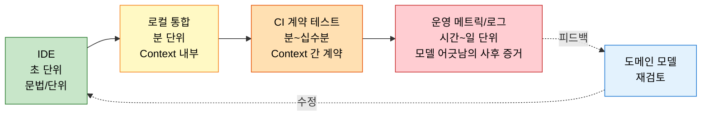
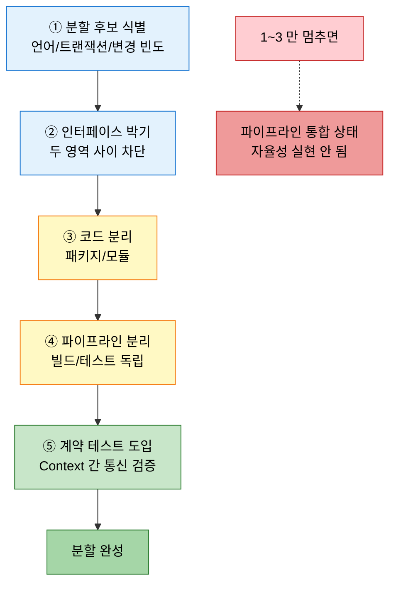

# DDD 와 CI/CD
---
> 이 문서를 읽고 나면 Bounded Context 가 빌드·테스트·배포 파이프라인의 경계로 어떻게 옮겨가는지, 분할 5단계와 병합 절차를 적용할 수 있습니다.

> Bounded Context 의 경계는 코드뿐 아니라 빌드·테스트·배포 파이프라인의 경계가 되어야 합니다. 도메인이 분리되어 있는데 파이프라인이 통합되어 있으면 분리의 효용을 잃습니다.

`01-04` 가 Context Map 으로 Context 사이의 *통신* 관계를 다뤘다면, 본 문서는 같은 Context 분할을 *배포·검증* 관점으로 옮깁니다.

## 1. DDD 와 CI/CD 의 통합 지점

> Context 가 자기 코드의 변경을 자기 파이프라인에서 검증할 수 있어야, 그 Context 의 자율성이 실재합니다.

SSOT §9.1 의 메시지는 단순합니다. Context 가 도메인적으로 분리되었더라도 한 파이프라인이 모든 Context 를 함께 빌드·테스트·배포한다면, Context 의 변경은 항상 다른 Context 와 일정을 맞춰야 합니다. 자율성이 이름뿐입니다.

CI/CD 와 DDD 가 만나는 핵심 결정은 다음 세 가지입니다.

1. 빌드 단위를 Context 에 맞춥니다 — 한 Context 의 변경이 한 모듈의 빌드만 트리거합니다.
2. 테스트 피라미드도 Context 별로 — 단위·통합 테스트는 Context 내부, 계약 테스트가 Context 사이를 잇습니다.
3. 배포 아티팩트도 Context 별로 — 모놀리스 안에서는 모듈 jar, 마이크로서비스에서는 컨테이너 이미지.

## 2. 피드백 루프 구축

> 피드백 루프가 빠를수록 도메인 모델의 잘못된 가정이 빨리 드러납니다.

SSOT §9.2 가 강조하는 것은 피드백 속도입니다. 다음 네 루프를 분리해 각각을 최적화합니다.

| 루프 | 시간 | 목적 |
|------|------|------|
| IDE 컴파일·테스트 | 초 | 문법·단위 로직 오류 |
| 로컬 통합 테스트 | 분 | Context 내부 결합 검증 |
| CI 계약 테스트 | 분~십수 분 | Context 간 계약 위반 감지 |
| 운영 메트릭·로그 | 시간~일 | 모델이 도메인을 잘못 표현했음의 사후 증거 |

각 루프가 다음 루프의 안전망입니다. 빠른 루프에서 잡혔어야 할 문제가 느린 루프에서 드러나면, 그건 빠른 루프의 커버리지를 늘려야 한다는 신호입니다.

## 3. Bounded Context 분할

> Context 가 너무 크면 분할합니다 — 분할은 코드 분할이 아니라 파이프라인 분할이 끝나야 완성됩니다.

SSOT §9.3 의 분할 절차는 다음 다섯 단계입니다.

1. 분할 후보 식별 — `01-04` 의 신호(언어 차이·트랜잭션 요구·변경 빈도)로.
2. 인터페이스 박기 — 두 영역 사이를 인터페이스로 차단.
3. 코드 분리 — 패키지·모듈 단위로 가릅니다.
4. 파이프라인 분리 — 빌드·테스트가 독립 실행되도록.
5. 계약 테스트 도입 — 두 영역 사이의 통신을 별도 검증.

5 단계까지 도달해야 분할이 완성됩니다. 1~3 만 하고 멈추면 파이프라인이 여전히 두 영역을 묶어 검증하므로 자율성이 실현되지 않습니다.

## 4. Bounded Context 병합

> 분할이 잘못되었다고 판단되면 되돌릴 수 있어야 합니다 — 분할만큼 병합도 절차로 둡니다.

SSOT §9.4 의 병합 절차도 분할의 역순으로 진행됩니다. 두 Context 의 통신이 너무 잦거나, 변경이 항상 함께 일어난다면 분할이 잘못이었다는 신호입니다.

여기서 질문 하나 — 분할은 했는데 병합 절차를 안 만들면 무엇이 위험할까요? 분할이 영구화됩니다. 잘못된 경계가 보여도 되돌리는 방법을 모르니 우회로 살게 되고, 우회가 누적되면 시스템이 더 복잡해집니다. 분할은 가설이고, 가설은 검증과 폐기를 함께 가져가야 합니다.

## 5. 지속적 리팩토링

> 한 번 분할로 끝나지 않습니다 — 도메인이 진화하면 Context 도 진화합니다.

SSOT §9.5 의 지속적 리팩토링은 다음 흐름입니다.

1. 운영 메트릭·도메인 전문가 피드백으로 모델의 어긋남을 감지.
2. 작은 단위로 모델 수정 (`03-01` 의 원칙 준수).
3. 필요하면 Context 재분할·재병합.
4. 파이프라인·계약 테스트를 함께 갱신.

이 흐름이 유지되려면 §2 의 빠른 피드백 루프가 살아 있어야 합니다. 루프가 느리면 작은 단위 변경이 위험해 보이고, 결국 큰 빅뱅 리팩토링으로 미뤄집니다.

## 6. 실제 사례 — redpanda-playground 의 멀티모듈 + Jenkins 파이프라인 분리

본인 redpanda-playground 는 §1 의 "Context 별 빌드·테스트·배포" 를 멀티모듈 + Jenkins 잡 분리로 실제 구현합니다.
모듈 구조는 `common` → `common-kafka` → `pipeline` → `app` 4 단계로 정렬되어 있고, 2026-03-21 K8s 전면 이관 이후 각 모듈이 *독립 jar 빌드 + 독립 Jenkins 잡* 을 갖습니다.
Jenkins K8s Helm 설치 위에 `build/playground-job-{N}` 형태로 잡을 분리해, 한 모듈의 변경이 그 모듈의 잡만 트리거합니다.

분리의 효과는 측정 가능했습니다 — `common-kafka` 의 Avro 스키마 변경이 `pipeline` 의 빌드를 깨뜨리지 않게 되어 *모듈별 독립 진화* 가 가능해졌습니다.
다만 비용도 같이 왔습니다 — `common-kafka` → `pipeline` 통신을 *계약 테스트* 로 별도 검증해야 했고, Reconciler 가 60 초 주기로 DB ↔ Jenkins 동기화하는 추가 인프라가 필요했습니다.
이 비용을 받아들일 수 있는 PoC 도메인이었기에 분리의 정당성이 생겼습니다 — 단일 팀 단일 모듈이었다면 모듈러 모놀리스에서 멈췄을 수 있습니다.

> 출처: 본인 코드 + MEMORY `redpanda-playground.md` 의 K8s 이관 + Jenkins 멀티 잡 설계. Phase 5 의 *멀티 Jenkins + 파이프라인 병렬 실행* (`.claude/plans/kind-nibbling-sunset.md`) 도 같은 흐름의 연장.

## 7. 면접에서 받을 만한 질문

1. Context 가 도메인적으로 분리되었더라도 *파이프라인이 통합* 되어 있으면 어떤 비용이 누적됩니까?
2. 분할 5 단계 중 1~3 만 하고 멈추면 무엇이 실현되지 않습니까? 왜 4~5 단계까지 가야 합니까?
3. 분할만 절차로 두고 *병합 절차* 를 안 만들면 어떤 위험이 누적됩니까?
4. 피드백 4 루프가 다음 루프의 안전망이라는 의미는 무엇입니까? 빠른 루프에서 못 잡힌 문제가 느린 루프에서 나오면 어떻게 대응합니까?

> 위 4개 질문에 *먼저 자답한 뒤* 아래 §정답 (자답 후 펼치기) 으로 내려갑니다.

## 8. 정답 (자답 후 펼치기)

> 위 §면접에서 받을 만한 질문 의 4개에 *먼저 자답한 뒤* 아래를 읽으세요. 자답 없이 먼저 읽으면 학습 효과가 0 입니다.

### 정답 1 — 통합 파이프라인의 비용

자율성이 *이름뿐* 이 됩니다.
Context 가 도메인적으로 분리되었더라도 한 파이프라인이 모든 Context 를 함께 빌드·테스트·배포하면, 한 Context 의 변경은 항상 다른 Context 와 일정을 맞춰야 합니다.
구체적 비용은 셋입니다 — (1) 빌드 시간이 모든 Context 의 합으로 늘어나 *피드백 루프가 느려집니다*.
(2) 한 Context 의 테스트 실패가 무관한 Context 의 배포를 막아 *배포 빈도가 떨어집니다*.
(3) 변경 일정이 항상 협상 대상이라 *팀 자율성이 사라집니다*.
도메인이 분리되어 있는데 파이프라인이 통합되어 있으면 *분리의 효용을 잃습니다*.

### 정답 2 — 분할 5단계 중 1~3만 멈추면

*파이프라인이 여전히 두 영역을 묶어 검증* 하므로 자율성이 실현되지 않습니다.
1~3 (분할 후보 식별·인터페이스 박기·코드 분리) 까지만 가면 코드는 분리되어 보이지만 빌드·테스트는 *한 파이프라인이 모든 영역을 함께 돌립니다*.
한 영역의 변경이 다른 영역의 테스트를 깨뜨릴 수 있고, 한 영역의 배포가 다른 영역의 일정에 묶입니다.
4 (파이프라인 분리) 와 5 (계약 테스트 도입) 까지 도달해야 *각 Context 가 자기 변경을 자기 파이프라인에서 검증* 할 수 있고, *Context 간 통신은 계약으로 별도 검증* 됩니다.
이 두 단계가 빠지면 분할은 가시적 코드 구조일 뿐 *운영 자율성* 으로 옮겨가지 않습니다.

### 정답 3 — 병합 절차 부재의 위험

분할이 영구화됩니다.
분할은 *가설* 이고, 가설은 *검증과 폐기* 를 함께 가져가야 합니다.
잘못된 경계가 보여도 되돌리는 절차가 없으면 *우회로 살게 됩니다* — 두 Context 사이에 비정상적으로 잦은 통신, 공유 라이브러리 비대화, 계약 테스트가 사실상 통합 테스트가 되는 현상이 누적됩니다.
우회가 누적되면 시스템이 *처음 모놀리스보다 더 복잡* 해집니다.
병합 절차를 분할 절차와 짝으로 두는 것이 도메인 진화의 안전망입니다.

### 정답 4 — 피드백 루프 안전망의 의미

빠른 루프 (IDE, 로컬 통합) 가 못 잡은 문제가 느린 루프 (CI, 운영 메트릭) 에서 드러나면, *그건 빠른 루프의 커버리지가 부족하다는 신호* 입니다.
대응은 두 단계입니다.
(1) 운영에서 발견된 문제의 *재현 테스트* 를 단위 또는 통합 레벨로 끌어내려 박습니다 — 같은 문제가 다음에는 IDE 또는 로컬에서 잡힙니다.
(2) 그 문제 유형이 반복되면 *체크 자체를 자동화* 합니다 — 정적 분석 룰, ArchUnit 룰, 계약 테스트 추가.
빠른 루프의 커버리지가 올라갈수록 *느린 루프가 진짜로 새로운 문제만* 보게 됩니다.
이 흐름이 깨지면 운영에서 매번 같은 종류의 사고가 반복되는 *학습이 안 되는 시스템* 이 됩니다.

## 관련 문서

- [Bounded Context 와 Context Map](./01-04.Bounded%20Context%20와%20Context%20Map.md) — 분할의 1 차 식별 기준
- [모놀리스에서 마이크로서비스로](./03-04.모놀리스에서%20마이크로서비스로%20—%20언제%2C%20왜.md) — 파이프라인 분리의 다음 단계
- [ADR과 Spring Boot 아키텍처 의사결정](../01_foundation/01-04.ADR%EA%B3%BC%20Spring%20Boot%20%EC%95%84%ED%82%A4%ED%85%8D%EC%B2%98%20%EC%9D%98%EC%82%AC%EA%B2%B0%EC%A0%95.md) — 분할·병합 결정의 박제
