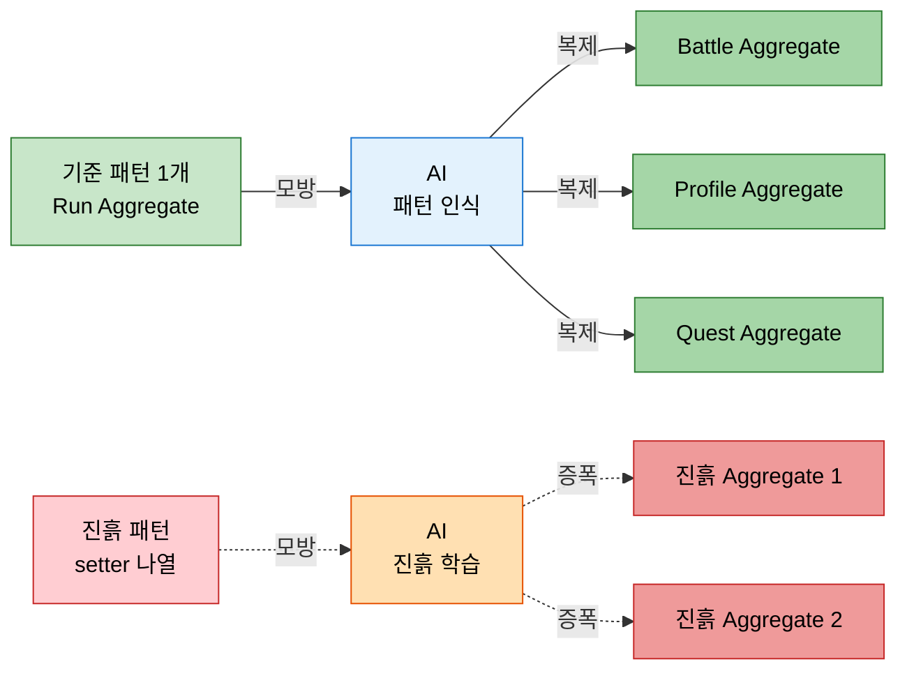
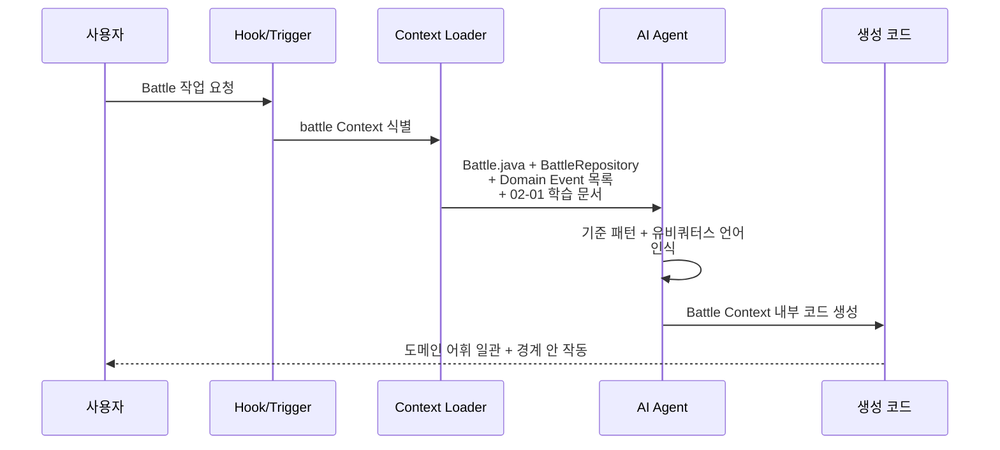

# AI 코딩 시대의 DDD
---
> 이 문서를 읽고 나면 AI 가 컨텍스트 패턴을 어떻게 증폭하는지, DDD 의 네 도구 (기준 패턴·Bounded Context·유비쿼터스 언어·Hook) 가 AI 워크플로우에 어떻게 옮겨가는지 설명할 수 있습니다.

> 생성형 코딩 환경에서 DDD 의 가치는 더 커집니다. AI 는 컨텍스트 안의 패턴을 모방해 코드를 만듭니다 — 그 패턴이 도메인을 잘 표현하면 AI 의 출력도 도메인을 잘 표현하고, 패턴이 어긋나 있으면 AI 가 그 어긋남을 증폭합니다.

SSOT 13장이 제시하는 네 원칙은 다음과 같습니다. 각 원칙이 DDD 의 기존 도구를 AI 워크플로우에 어떻게 옮기는지 정리합니다.

## 1. 구조가 패턴이 된다

> AI 는 "지금 보고 있는 코드와 비슷한 코드" 를 만듭니다 — 기준 패턴 하나가 그 카테고리 전체의 품질을 결정합니다.

AI 에게 "Order 도메인을 만들어줘" 라고 부탁하면, AI 는 자기 학습 데이터의 평균적인 Order 코드를 만듭니다. 평균은 보통 진흙 덩어리에 가깝습니다. 반면 AI 에게 "이 프로젝트의 Run Aggregate 를 참고해서 Battle Aggregate 를 만들어줘" 라고 하면, AI 는 Run 의 구조를 모방해 Battle 을 만듭니다.

이게 의미하는 것은 "잘 만든 Aggregate 하나" 가 그 프로젝트 전체의 Aggregate 품질의 천장이 된다는 점입니다. 첫 한 개를 SKILL · DDD 원칙대로 만들어 두면, 나머지는 AI 가 그 패턴을 복제합니다.

런 관리 예시에서 기준 패턴이 되는 파일은 다음과 같습니다.

| 카테고리 | 기준 파일 | 다음 추가 시 참조 |
|----------|----------|-------------------|
| Aggregate Root | `Run.java` | `Battle`, `Profile` |
| Value Object (record) | `Hp.java` | `Energy`, `Gold`, `CardCost` |
| Domain Service | `RewardPolicy.java` | `EnemyIntentPolicy`, `CardDraftPolicy` |
| Repository 인터페이스 | `RunRepository.java` | `BattleRepository`, `ProfileRepository` |

## 2. 도메인 단위로 나누면 AI 품질이 올라간다

> AI 의 컨텍스트 윈도우는 유한합니다 — 한 번에 전체 코드베이스를 못 봅니다. 그래서 잘 나뉜 Bounded Context 가 AI 의 작업 단위가 됩니다.

`01-04` 의 Bounded Context 가 AI 시대에 갖는 추가 가치는 컨텍스트 윈도우의 자연스러운 단위가 된다는 점입니다. AI 에게 "battle 모듈에서 새 카드 효과를 추가해줘" 라고 하면, AI 는 battle 디렉토리만 보면 됩니다. catalog 의 사소한 변경이 AI 의 추론에 노이즈로 끼지 않습니다.

여기서 질문 하나 — 그러면 모놀리스에서도 디렉토리 분리만으로 충분할까요? 그렇습니다. 마이크로서비스 단위까지 갈 필요는 없습니다. 디렉토리·패키지 경계만으로 AI 의 작업 단위를 만들 수 있습니다. 다만 그 경계가 도메인 의미를 정확히 따라야 합니다.

## 3. 코드 이름 = 비즈니스 언어

> 유비쿼터스 언어가 코드에 박혀 있을수록 AI 가 도메인 어휘로 일합니다.

`01-01` 의 유비쿼터스 언어가 AI 시대에 더 중요해지는 이유는 단순합니다. AI 가 코드를 만들 때 변수명·메서드명을 기준 패턴에서 모방합니다. 기존 코드가 `data1`, `proc`, `handleStuff` 같은 추상적 이름을 쓰면, AI 도 비슷한 추상적 이름을 만듭니다. `Run`, `BattleResult`, `RewardCandidates` 같은 도메인 이름을 쓰면 AI 의 출력도 도메인 이름을 갖습니다.

검증 방법도 간단합니다. AI 가 만든 코드를 도메인 전문가에게 보여줬을 때 그가 단어를 알아보면 합격입니다. 모르면 유비쿼터스 언어가 코드에 박히지 않았다는 신호입니다.

## 4. Hook · Trigger + 도메인 = 자동 컨텍스트 로딩

> AI 에이전트가 도메인 작업을 시작할 때 자동으로 관련 도메인 문서·코드를 로드하게 만듭니다.

SSOT §13 의 4 번째 원칙은 도구 차원입니다. AI 에이전트가 "Battle 관련 작업" 을 시작하면 자동으로 다음을 로드하게 합니다.

1. `Battle.java` Aggregate 와 그 안의 메서드 시그니처.
2. `BattleRepository` 인터페이스.
3. 그 Context 의 Domain Event 목록.
4. 관련 학습 문서 (`02-01.Aggregate 설계 규칙.md`).

Claude Code · GitHub Copilot 같은 도구에서 이 자동 로딩은 hook · settings · skill 정의로 구현됩니다. 도메인 단위로 hook 을 묶으면, AI 가 그 도메인의 어휘·패턴·제약을 매번 처음부터 추론할 필요가 없어집니다.

## 5. 네 원칙의 통합 효과

> 잘 만든 기준 패턴 하나 + 명확한 Context 경계 + 유비쿼터스 언어 + 자동 컨텍스트 로딩 = AI 가 도메인 일관성을 유지하며 일합니다.

네 원칙이 따로 적용되면 효과가 약합니다. 함께 적용될 때 다음과 같은 흐름이 만들어집니다.

1. AI 가 새 기능을 받습니다.
2. Hook 이 해당 Context 의 기준 파일·문서를 자동 로드합니다.
3. AI 가 기준 패턴을 모방해 새 코드를 만듭니다.
4. 새 코드는 유비쿼터스 언어를 그대로 사용합니다.
5. Context 경계 안에서만 작동 — 다른 Context 를 깨지 않습니다.

이 흐름이 안정화되면 도메인 일관성이 사람의 코드 리뷰에 의존하지 않게 됩니다. AI 의 출력이 처음부터 일관성을 갖습니다.

## 6. 실제 사례 — OMC + Claude Code 의 도메인 hook 운영 경험

본인이 운영하는 oh-my-claudecode (OMC) + Claude Code 환경이 §4 의 *도메인 단위 hook + 자동 컨텍스트 로딩* 을 실측 가능하게 보여줍니다.
TPS 프로젝트에서 *결재* 관련 작업이 트리거되면 (`.claude/rules/ddd-routing.md` 의 키워드 매칭), Hook 이 자동으로 (1) `org.okestro.tps.operator.approval` 패키지의 기준 패턴 파일, (2) `04-01.헥사고날 변형` 학습 문서, (3) `ddd-expert` 에이전트를 로드합니다.

이 자동 로딩이 없었을 때의 비용은 측정 가능했습니다.
*결재* 키워드 작업마다 사용자가 "이 프로젝트의 결재 도메인 컨벤션은 v305p 의 `TB_TRB_*` prefix 야" 같은 컨텍스트를 수동으로 박아 줘야 했습니다.
누락되면 AI 가 v3 의 `TB_TPS_*` 패턴을 따라 *305P prefix 규약을 위반한 코드* 를 만들었습니다 (MEMORY `project_tps_305p_table_prefix.md` 의 prefix 위반 사고가 같은 결).
Hook 이 박힌 뒤로는 AI 가 *처음부터 v305p 컨벤션* 으로 작업합니다.

다만 비용도 같이 옵니다.
Hook 이 늘어날수록 *각 도메인 작업 진입 시 컨텍스트 로딩 비용* 이 커집니다.
모든 작업에 모든 hook 을 박지 않고 *도메인별로 키워드 트리거를 좁혀* 필요할 때만 로드하는 것이 정답입니다.
이 균형이 깨지면 hook 시스템 자체가 새로운 진흙 덩어리가 됩니다.

> 출처: 본인 OMC 운영 경험 + TPS 프로젝트 `.claude/rules/ddd-routing.md`, `.claude/rules/tps-infra-routing.md`. MEMORY `project_tps_305p_table_prefix.md` 의 prefix 위반 사고 박제 참조.

## 7. 면접에서 받을 만한 질문

1. AI 코딩 환경에서 DDD 의 가치가 *더 커지는* 이유는 무엇입니까? 진흙 패턴이 있으면 어떤 일이 벌어집니까?
2. Bounded Context 가 AI 시대에 갖는 *추가 가치* 는 무엇입니까? 마이크로서비스 단위까지 갈 필요가 없는 이유는?
3. 유비쿼터스 언어가 코드에 박혀 있는지 *검증* 하는 방법은 무엇입니까?
4. 네 원칙 중 *하나만 적용* 하면 왜 효과가 약합니까? 네 가지가 함께 적용될 때 어떤 흐름이 만들어집니까?

> 위 4개 질문에 *먼저 자답한 뒤* 아래 §정답 (자답 후 펼치기) 으로 내려갑니다.

## 8. 정답 (자답 후 펼치기)

> 위 §면접에서 받을 만한 질문 의 4개에 *먼저 자답한 뒤* 아래를 읽으세요. 자답 없이 먼저 읽으면 학습 효과가 0 입니다.

### 정답 1 — AI 시대 DDD 가치 증가와 진흙 증폭

AI 는 *컨텍스트 안의 패턴을 모방* 해 코드를 만듭니다.
좋은 패턴이 있으면 AI 가 그 품질을 복제하고, 나쁜 패턴이 있으면 AI 가 그 어긋남을 *증폭* 합니다.
사람이 손으로 코드를 쓰던 시절에는 진흙 패턴이 *한 번에 한 위치* 에서만 자랐지만, AI 가 쓰는 시절에는 진흙 패턴이 *전체 카테고리* 로 빠르게 복제됩니다.
그래서 "잘 만든 기준 패턴 하나" 가 그 프로젝트 전체의 *천장* 이 됩니다.
DDD 의 Aggregate, Value Object, Domain Service 같은 도구가 *AI 에게 모방 대상을 제공하는 일관된 어휘* 로 작동하기 때문에 가치가 더 커집니다.

### 정답 2 — Bounded Context 의 AI 시대 추가 가치

AI 의 *컨텍스트 윈도우* 는 유한합니다.
한 번에 전체 코드베이스를 볼 수 없으므로, 작업 단위가 *작고 응집도 높을수록* AI 의 추론 품질이 올라갑니다.
Bounded Context 가 *도메인 의미가 응집된 단위* 이므로 자연스러운 AI 작업 단위가 됩니다.
마이크로서비스 단위까지 갈 필요는 없습니다 — *디렉토리·패키지 경계* 만으로 AI 의 작업 단위를 만들 수 있고, 분산 시스템 비용은 안 들어옵니다.
다만 그 경계가 *도메인 의미를 정확히 따라야* 합니다 — 기술 계층으로 가른 경계는 AI 가 한 비즈니스 변경을 위해 여러 디렉토리를 동시에 봐야 해서 효과가 사라집니다.

### 정답 3 — 유비쿼터스 언어 검증

가장 간단한 검증은 *도메인 전문가에게 코드를 보여주는 것* 입니다.
변수명·메서드명·클래스명을 도메인 전문가가 *단어 단위로 알아보면* 합격입니다 — `Run`, `BattleResult`, `commitTo` 같은 어휘는 도메인 전문가가 회의에서 쓰는 단어 그대로입니다.
모르면 유비쿼터스 언어가 코드에 박히지 않았다는 신호입니다.
`data1`, `proc`, `handleStuff` 같은 추상적 이름이 보이면 AI 가 만들 코드도 *비슷한 추상* 으로 회귀합니다.
2 차 검증은 AI 가 만든 코드를 *역으로 도메인 전문가에게 보여 주는 것* — 도메인 전문가가 AI 코드의 의도를 단어로 설명할 수 있어야 유비쿼터스 언어 회로가 살아 있다는 증명입니다.

### 정답 4 — 네 원칙 단일 적용의 약함과 통합 효과

각 원칙이 *서로의 안전망* 입니다.
(1) 기준 패턴만 있고 Bounded Context 가 없으면 AI 가 그 패턴을 *무관한 도메인까지 끌고 옵니다*.
(2) Context 만 있고 유비쿼터스 언어가 없으면 AI 가 *영역 안에서는 일관되지만 어휘는 추상적인* 코드를 만듭니다.
(3) 언어만 있고 Hook 이 없으면 *사용자가 매번 컨텍스트를 수동 로딩* 해야 하므로 누락이 누적됩니다.
(4) Hook 만 있고 기준 패턴이 없으면 *AI 가 로딩된 컨텍스트에서 진흙을 학습* 합니다.
함께 적용될 때만 *AI 가 자기 작업 단위(Context) 안에서 → 기준 패턴을 모방하며 → 도메인 어휘로 → 자동 로딩된 제약 안에서* 일관성을 유지합니다.
사람의 코드 리뷰가 *처음부터 일관된 출력* 위에 얹어지므로 리뷰 비용이 누적되지 않습니다.

## 관련 문서

- [유비쿼터스 언어와 도메인 모델](./01-01.유비쿼터스%20언어와%20도메인%20모델.md) — 원칙 3 의 기반
- [Bounded Context 와 Context Map](./01-04.Bounded%20Context%20와%20Context%20Map.md) — 원칙 2 의 기반
- [Aggregate 설계 규칙](./02-01.Aggregate%20설계%20규칙.md) — 원칙 1 의 기준 패턴
