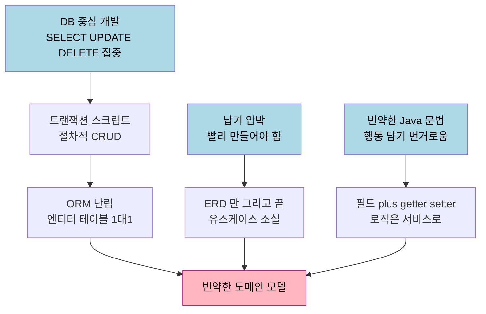
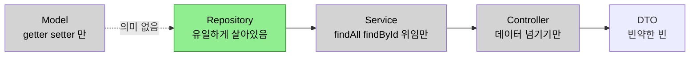
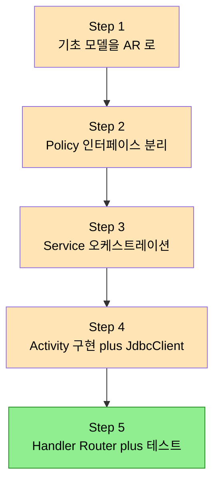

# 빈약한 도메인 모델 — 엔티티는 왜 DB 테이블과 같은가
---
> 이 문서를 읽고 나면 빈약한 도메인 모델이 왜 절차지향 안티패턴인지, 그리고 화자가 제안하는 5-Step 아키텍처로 빈약한 모델을 리치 도메인 모델로 바꾸는 과정을 설명할 수 있습니다.

> 엔티티가 DB 테이블과 똑같이 생긴 이유는 우연이 아닙니다. DB 중심 개발과 납기 압박이 30년 동안 "객체는 데이터 그릇, 로직은 서비스에" 라는 관행을 굳혔고, ORM이 그 관행을 강화했습니다. 이 노트는 한 실무자가 그 관행을 어떻게 진단하고 깨는지를 정리합니다.

> 이 노트는 외부 유튜브 실무 강의(SI 20년 경력 화자)를 정리한 것입니다. 교과서 정의(Entity·VO·유비쿼터스 언어)는 기존 편으로 링크하고, 여기서는 영상 고유의 진단과 5-Step 아키텍처 실연만 다룹니다. 화자의 주장과 Evans/Vernon 원전의 정의는 구분해 읽어 주세요.

## 1. 빈약한 도메인 모델이란 무엇인가

> 필드와 getter/setter 만 있고 비즈니스 로직이 없는 객체 — Martin Fowler 가 2003년에 절차지향 안티패턴으로 규정한 모델입니다.

빈약한 도메인 모델(Anemic Domain Model)의 정의 자체는 새롭지 않습니다. Martin Fowler 가 2003년 블로그에서 이름 붙인 개념으로, 객체에 필드와 getter/setter 만 가득하고 정작 비즈니스 로직은 들어 있지 않은 상태를 가리킵니다. Lombok 으로 getter/setter 조차 자동 생성해 버리면 객체는 더욱 데이터 운반 그릇에 가까워집니다.

화자가 강조하는 지점은 Fowler 의 규정이 단순한 스타일 비판이 아니라는 것입니다. Fowler 는 이를 "객체지향 설계가 아닌 절차지향 설계의 안티패턴" 이라고 못박았습니다. 객체가 데이터만 들고 있고 그 데이터를 다루는 절차(로직)는 서비스 계층에 흩어져 있으면, 겉모습만 객체지향일 뿐 실제 구조는 절차지향이기 때문입니다.

화자는 여기서 한 걸음 더 나갑니다. Hibernate·JPA 같은 ORM 도 결국 절차지향 구현을 유도하는 프레임워크라고 봅니다. 이것은 화자 개인의 강한 주장이며 Fowler 의 원래 글에는 없는 확장입니다. ORM 이 엔티티를 테이블과 1:1로 묶도록 자연스럽게 유도하기 때문에, 개발자가 객체에 행동을 부여할 동기를 잃는다는 논리입니다.

> Entity 와 Value Object 의 교과서적 정의·식별자 동등성 규칙은 [02-02 Entity 와 Value Object](../02-02.Entity%20와%20Value%20Object.md) 에 정리되어 있습니다. 이 노트는 그 정의를 반복하지 않고, 빈약한 모델이 왜 생기는지에 집중합니다.

## 2. 왜 엔티티가 테이블과 똑같아졌는가

> DB 중심 개발 + 납기 압박 + 빈약했던 Java 문법 — 세 가지가 겹쳐 "객체 = 테이블" 관행을 만들었습니다.

화자는 이 현상의 원인을 세 갈래로 진단합니다. 모두 화자의 SI 20년 경험에 기반한 해석입니다.

첫째, 개발 환경이 처음부터 DB 중심이었습니다. SELECT·UPDATE·DELETE 를 어떻게 날리느냐에 관심이 쏠리면서, 트랜잭션 스크립트(CRUD 처리를 위한 절차적 코드)가 프레임워크의 중심이 되었고 그 끝판왕으로 ORM 이 자리잡았습니다.

둘째, 납기 압박입니다. 무조건 빨리 만들어야 하니 DB 에 다이렉트로 붙어 데이터를 주고받는 데만 집중하게 됩니다. 설계자는 ERD 만 그려 놓고 끝내 버리고, 그 결과 비즈니스 프로세스와 유스케이스가 코드에서 사라집니다. 화자는 이렇게 사라진 검증 로직이 결국 UI 쪽으로 떠넘겨졌다고 지적합니다.

셋째, 화자가 원인의 90% 이상이라고 보는 요인 — Java 문법 자체가 빈약했다는 점입니다. 리치 도메인 모델을 표현할 record·sealed·패턴 매칭 같은 문법이 없던 시절에는, 객체에 행동을 담는 코드가 번거로웠습니다. 그래서 화자는 JDK 25 이상으로 개발 환경을 올리라고 권합니다(이는 화자의 권고이며, 프로젝트 제약에 따라 다를 수 있습니다).

## 3. 빈약한 모델의 전형적 구조

> 모델·컨트롤러·서비스가 모두 의미를 잃고, 오직 Repository 만 살아남는 구조입니다.

화자는 게시판(Post) 예제로 빈약한 모델의 실제 코드 흐름을 보여 줍니다. Post 모델은 postId·title·content 같은 필드와 created/modified 메타, 그리고 getter/setter 만 가집니다. 댓글(replies) 같은 컬렉션조차 필드에서 빠지고, 서비스에서 따로 불러와 DTO 로 합쳐 넘깁니다.

개발 순서도 DB 를 따라갑니다. 화자는 "옛날 개발자라서 DB 에 맞춰 Repository 부터 만든다" 고 말합니다. Repository → Service → Controller 순으로 올라가지만, Service 는 Repository 를 주입받아 `findAll`·`findById` 를 호출해 그대로 넘기는 일만 하고, Controller 도 Service 를 호출해 데이터를 넘기기만 합니다. DTO 역시 빈약한 빈(bean) 형태로 만듭니다.

결론적으로 이 구조에서는 모델도, 컨트롤러도, 서비스도 의미가 없고, 데이터베이스를 불러오는 Repository 에만 모든 무게가 실립니다. 화자는 이것이 ORM 의 N+1 문제나 MyBatis 의 XML 쿼리 작성 같은 불편을 감수하면서도 생산성 이득은 분명하지 않은, 그러나 관행으로 굳어버린 개발 방식이라고 정리합니다.

## 4. 5-Step 아키텍처로 리치 모델 만들기

> 화자가 만든 5단계 방법론으로, AI 에게 단계별 프롬프트를 주어 유스케이스가 살아 있는 리치 도메인 모델을 생성합니다.

화자는 자신이 만든 5-Step 아키텍처(파이브스텝 아키텍처)를 1년간 실제 프로젝트에 적용해 왔다고 밝힙니다. 영상에서는 AI(Gemini)에게 단계별 프롬프트를 주어 Post 도메인의 리치 모델을 생성하는 과정을 시연합니다. 이는 화자 고유의 방법론이며 표준 DDD 절차가 아닙니다.

단계는 다음과 같이 진행됩니다.

- **Step 1 — 기초 도메인 모델을 Aggregate Root 로**: 요구사항(제목·내용 필수, 수정은 작성자만, 쓰기·읽기·수정·삭제 유스케이스)을 주면, AI 가 Content·Author·PostMeta·Comment·Reply 를 갖춘 Aggregate Root 를 만듭니다. DB 정보를 복원하는 메서드, 업데이트 규칙, 댓글 추가·삭제 메서드가 AR 안쪽에 들어갑니다. 필드는 원자적 `Long`·`String` 이 아니라 `EntityId` 같은 의미 있는 타입으로 표현됩니다.
- **Step 2 — 정책(Policy)을 인터페이스로 추상화**: AR 의 규칙·정책을 Policy 인터페이스로 분리해 메서드에 주입합니다. 업데이트 정책·댓글 정책처럼 분리하면, 테스트마다 다른 Policy 구현을 넣어 자유롭게 검증할 수 있습니다. 화자는 이를 "확장에 열려 있고 수정에 닫혀 있는" 구조라고 부릅니다.
- **Step 3 — 서비스 오케스트레이션**: 서비스는 Activity(유스케이스)를 이용해 AR 을 복원하고, 그 AR 을 조작(업데이트·삭제)한 뒤 저장합니다. 화자는 이 저장 방식을 카테고리 이론의 Functor 개념으로 설명하지만, 이론적 깊이는 별도 영상으로 미룹니다.
- **Step 4 — Activity 구현**: Activity 는 유스케이스의 액션(read·save 등)을 구현하며, 최종적으로 Repository 데이터를 불러오는 로직이 여기 들어갑니다. 화자는 ORM 대신 `JdbcClient`·`JdbcTemplate` 으로 다이렉트 쿼리하는 편이 낫다는 1차 판단을 밝힙니다.
- **Step 5 — 엔드포인트 + 테스트**: 일반 Controller 대신 함수형 Handler/Router(`RouterFunction`)를 씁니다. AI 가 모델 테스트와 엔드포인트 테스트를 분리해 자동 생성합니다.

화자는 리치 버전에서 Service 에 Repository 를 직접 주입한 것은 예제 단순화를 위해 원칙을 일부러 깬 것이고, 정석은 Activity 가 Repository 를 호출하는 구조라고 분명히 밝힙니다. 또 Activity 와 Service 가 중복돼 보이지만, Activity 는 도메인 계층에서 액션을 구현하고 Service 는 애플리케이션 계층에서 여러 Activity 의 액션을 끄집어내 오케스트레이션한다는 점에서 책임이 다르다고 구분합니다.

## 5. 실제 사례 — 화자의 데모 리포지토리와 AI 협업

> 화자는 모든 코드를 직접 손으로 짜지 않고 AI 와의 단계별 대화로 생성했으며, 그 채팅 기록 자체를 공유합니다.

화자의 핵심 사례는 자신의 `demo` 리포지토리입니다. `anemic` 패키지와 `rich` 패키지를 나란히 두고, JPA 어노테이션을 흉내 낸(실제 DB 연결은 없는) 코드로 두 모델을 대비시킵니다. 같은 Post 도메인을 빈약하게도, 리치하게도 구현해 차이를 직접 보여 주는 방식입니다.

특히 인상적인 지점은 리치 모델을 화자가 직접 타이핑한 것이 아니라 Gemini 와의 단계별 대화로 생성했다는 것입니다. 화자는 "AI 로 코딩한다는 게 이런 게 아닌가" 라고 말하며, 자신이 만든 5-Step 아키텍처를 컨텍스트로 학습시킨 뒤 Step 1~5 프롬프트를 순서대로 던져 모델·정책·서비스·Activity·테스트를 차례로 뽑아냈습니다. 이 AI 협업 설계 과정은 [03.AI 에이전트로 DDD 설계하기 — 그릴미 실전](./03.AI%20에이전트로%20DDD%20설계하기%20—%20그릴미%20실전.md) 으로 이어집니다.

> 출처: 외부 유튜브 실무 강의(SI 20년 화자)의 자막 [_src/01-anemic-domain-model.srt](./_src/01-anemic-domain-model.srt). 화자의 5-Step 아키텍처·ORM 비판은 화자 개인 방법론이며, Anemic Domain Model 의 원 정의는 Martin Fowler, "AnemicDomainModel" (2003) 입니다.

## 6. 면접에서 받을 만한 질문

> 위 4개 질문에 *먼저 자답한 뒤* 아래 §7 정답 (자답 후 펼치기) 으로 내려갑니다.

1. 빈약한 도메인 모델이 단순한 코드 스타일 문제가 아니라 "절차지향 안티패턴" 으로 불리는 이유는 무엇입니까?
2. 엔티티가 DB 테이블과 1:1로 닮게 된 구조적 원인을 세 가지로 설명할 수 있습니까?
3. 빈약한 모델에서 모델·컨트롤러·서비스가 "의미가 없다" 고 말할 때, 실제로 살아남는 계층은 무엇이고 그것이 왜 문제입니까?
4. 정책(Policy)을 도메인 메서드에 인터페이스로 주입하면 어떤 설계 이점이 생깁니까?

## 7. 정답 (자답 후 펼치기)

> 위 §6 면접에서 받을 만한 질문 의 4개에 *먼저 자답한 뒤* 아래를 읽으세요. 자답 없이 먼저 읽으면 학습 효과가 0입니다.

### 정답 1 — 절차지향 안티패턴인 이유

객체가 데이터(필드)만 들고 있고 그 데이터를 다루는 로직은 서비스 계층에 절차적으로 흩어져 있기 때문입니다. 객체와 그 객체에 대한 행동이 분리되어 있으면 캡슐화가 깨지고, 겉모습만 클래스일 뿐 실제 제어 흐름은 절차지향입니다. Fowler 가 2003년에 이를 안티패턴으로 규정한 핵심도 "행동 없는 데이터 객체는 객체지향이 아니다" 라는 점입니다.

### 정답 2 — 테이블과 닮게 된 세 원인

DB 중심 개발(SELECT·UPDATE·DELETE 에 집중 → 트랜잭션 스크립트 → ORM), 납기 압박(ERD 만 그리고 유스케이스가 코드에서 사라짐), 그리고 빈약했던 Java 문법(행동을 담을 record·sealed·패턴 매칭이 없어 번거로움)입니다. 화자는 세 번째를 90% 이상의 원인으로 봅니다.

### 정답 3 — 살아남는 계층과 그 문제

Repository 만 살아남습니다. 모델·서비스·컨트롤러가 모두 데이터를 통과시키는 파이프 역할만 하므로, 비즈니스 로직이 어디에도 응집되지 못합니다. 결과적으로 컬럼 하나만 바뀌어도 연결된 모든 계층을 추적해야 하고, 유스케이스가 코드에 표현되지 않아 검증 로직이 UI 로 떠넘겨집니다.

### 정답 4 — Policy 주입의 이점

규칙(정책)을 인터페이스로 분리해 메서드에 주입하면, 도메인 모델 본체는 변경하지 않고 정책 구현만 갈아끼워 동작을 바꿀 수 있습니다(개방-폐쇄). 테스트에서는 상황별 Policy 구현을 주입해 다양한 시나리오를 격리 검증할 수 있고, 규칙이 자주 바뀌는 부분(고객 요구로 변하는 부분)을 모델의 안정된 핵심에서 떼어낼 수 있습니다.

## 관련 문서

- [02-02 Entity 와 Value Object](../02-02.Entity%20와%20Value%20Object.md) — 빈약/리치를 가르는 식별자·값 동등성의 교과서 정의
- [01-01 유비쿼터스 언어와 도메인 모델](../01-01.유비쿼터스%20언어와%20도메인%20모델.md) — 도메인 언어가 코드에 박히는 원리
- [02.상태 전이 모델](./02.상태%20전이%20모델%20—%20비즈니스%20룰을%20State%20Machine으로.md) — 본 노트의 Policy 를 State Machine 으로 구현
- [03.AI 에이전트로 DDD 설계하기](./03.AI%20에이전트로%20DDD%20설계하기%20—%20그릴미%20실전.md) — 5-Step 의 설계 단계를 AI 로 자동화
