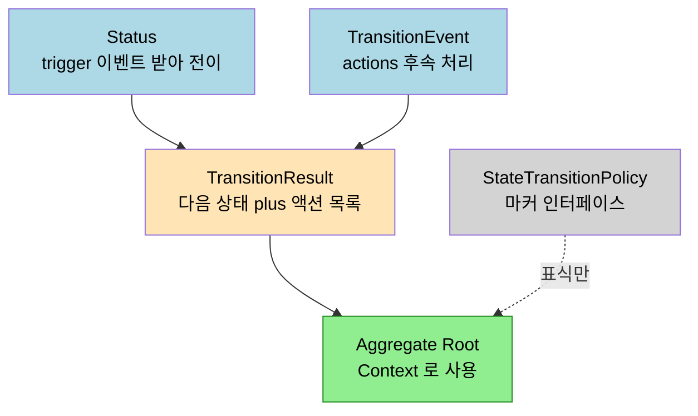
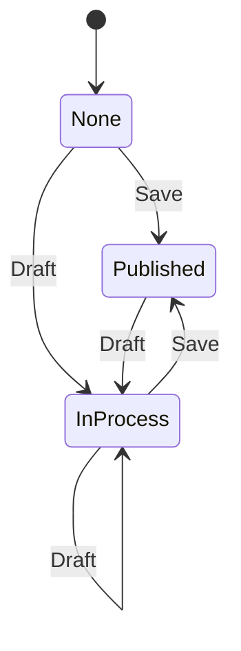

# 상태 전이 모델 — 비즈니스 룰을 State Machine으로
---
> 이 문서를 읽고 나면 비즈니스 규칙을 상태 전이로 모델링하는 4개 인터페이스(Status·TransitionEvent·TransitionResult·Policy)의 역할과, 그것을 Aggregate Root 안에서 sealed·record·패턴 매칭으로 구현하는 방법을 설명할 수 있습니다.

> 비즈니스 규칙은 대개 "어떤 상태에서 어떤 이벤트를 받으면 어떤 상태로 바뀐다" 는 형태입니다. 화자는 이 전이 규칙을 흩어진 if 문이 아니라 상태 모델 인터페이스로 강제해, 규칙이 코드 구조 자체로 드러나게 만듭니다.

> 이 노트는 외부 유튜브 실무 강의(SI 20년 화자)를 정리한 것입니다. Aggregate Root 의 교과서 정의는 기존 편으로 링크하고, 여기서는 화자가 직접 만든 상태 전이 모델의 구성과 게시판 구현 사례만 다룹니다.

## 1. 상태 전이란 무엇인가

> 상태(A)가 이벤트를 받아 다른 상태(B)로 바뀌는 것 — 화자는 이 전이를 모델로 강제해 비즈니스 규칙을 표현합니다.

상태 전이(State Transition)는 상태도(state diagram)로 표현되는 익숙한 개념입니다. 게시판 글을 예로 들면, 시작점에서 저장 버튼을 누르면 게시(Published) 상태가 되고, 임시저장 버튼을 누르면 나만 보이는 초안(InProcess) 상태가 됩니다. 이렇게 상태가 이벤트에 의해 A 에서 B 로 바뀌는 것이 전이입니다.

화자가 이 모델을 직접 만든 배경에는 실무적 이유가 있습니다. Spring 진영에 상태 머신 프레임워크(Spring StateMachine)가 있었지만 오픈소스 지원이 막혔기 때문에, 화자는 자신만의 상태 전이 모델을 별도로 구성했다고 밝힙니다. 핵심 의도는 몇 개의 인터페이스를 제공해 "이 모델을 이용해 상태 전이를 구현하라" 고 강제하는 것입니다. 규칙을 자유 형식 코드로 짜게 두지 않고, 정해진 틀 안에서 표현하도록 만드는 셈입니다.

이 모델은 [01.빈약한 도메인 모델](./01.빈약한%20도메인%20모델%20—%20엔티티는%20왜%20DB%20테이블과%20같은가.md) 에서 예고된 Policy(정책) 부분의 구체적 구현입니다. 앞 노트가 "정책을 인터페이스로 주입한다" 까지 말했다면, 이 노트는 그 정책이 상태 전이일 때 어떻게 생겼는지를 보여 줍니다.

## 2. 모델의 네 구성 요소

> Status·TransitionEvent·TransitionResult 세 개가 일하고, Policy 는 마커로 묶습니다. Context 는 Aggregate Root 입니다.

화자의 상태 전이 모델은 제네릭 인터페이스로 구성됩니다. Context 라는 타입 파라미터는 도메인 모델의 Aggregate Root 를 가리키며, 화자는 이를 AR 이라 부릅니다(게시판 예제에서는 Post). 네 구성 요소는 다음과 같습니다.

- **Status(상태, S)**: 현재 상태를 표현하는 인터페이스. `trigger(TransitionEvent)` 메서드를 가지며, 이벤트를 받아 다음 상태로 전이하는 책임을 집니다. DB 저장·복원을 위해 나중에 `valueOf` 같은 default 메서드가 추가되었습니다.
- **TransitionEvent(전이 이벤트, T)**: 상태를 바꾸는 사건. `actions()` 메서드를 가져, 전이가 일어난 뒤 수행해야 할 후속 처리 목록을 관리합니다. 다음 상태를 무엇으로 정할지는 Status 의 `trigger` 가 판단하고, 전이 후 부수 작업은 이 이벤트가 들고 있습니다.
- **TransitionResult(전이 결과)**: `trigger` 가 반환하는 값. 다음 상태(next status)와 실행할 액션 목록(actions, `Follow-up` 펑셔널 인터페이스)을 담습니다.
- **StateTransitionPolicy(전이 정책)**: 별도 구현 없이 마커 인터페이스로만 쓰입니다. AR 이 "나는 이 Status 와 TransitionEvent 를 쓰겠다" 고 선언하는 표식입니다.

> Aggregate Root 의 트랜잭션 경계·Root 를 통한 접근 같은 교과서 규칙은 [02-01 Aggregate 설계 규칙](../02-01.Aggregate%20설계%20규칙.md) 에 정리되어 있습니다. 이 노트는 그 규칙 위에서 상태 전이를 어떻게 얹는지에 집중합니다.

## 3. 마커 인터페이스로 AR 과 묶기

> AR 이 `extends PostTransitionPolicy` 한 줄로 "이 상태·이벤트 타입을 쓴다" 고 선언합니다. JPA 의 제네릭 타입 지정과 같은 발상입니다.

화자는 AR 과 상태 모델을 연결하는 방식을 JPA 에 비유합니다. JPA 에서 엔티티와 ID 필드의 타입을 제네릭으로 지정하듯, 여기서도 AR 이 어떤 Status 와 TransitionEvent 를 쓸지 마커 인터페이스로 지정합니다.

구체적으로, AR(Post)은 `StateTransitionPolicy` 를 확장한 `PostTransitionPolicy` 를 `extends` 합니다. 이 정책 인터페이스는 따로 구현할 내용이 거의 없는 마커이며, 세 번째 파라미터로 Context(AR 자신)를 받습니다. 이 한 줄의 선언이 "Post 는 PostStatus 와 PostTransitionEvent 를 사용한다" 는 계약을 코드에 박는 역할을 합니다.

따라서 새 AR 을 만들 때 해야 할 일은 명확합니다. 상태 모델이 정의한 인터페이스 중 Status 와 TransitionEvent 두 개를 그 AR 에 맞춰 구현하면 됩니다. 나머지(TransitionResult·Policy)는 마커 수준이라 구현 부담이 작습니다.

## 4. 게시판 구현 — sealed와 패턴 매칭

> sealed interface 로 가능한 상태 집합을 닫고, record 로 각 상태를 표현하고, switch 패턴 매칭으로 전이를 구현합니다.

화자는 PostStatus 를 sealed interface 로 만들어 상태 집합을 제한합니다. None(아무것도 없는 초기), Published(게시), InProcess(초안) 세 상태를 record 로 정의합니다. sealed 키워드로 이 셋 외의 상태가 생기지 못하게 닫는 것이 핵심입니다. DB 에는 대문자 문자열로 저장하고 AR 복원 시 record 로 되돌리기 위해 `valueOf` default 메서드를 둡니다.

`trigger` 메서드는 switch 패턴 매칭으로 구현됩니다. 예를 들어 None 상태에서는 Save 이벤트면 Published 로, Draft 이벤트면 InProcess 로 갑니다. Published 상태에서는 Draft(임시저장)만 받아 InProcess 로 가고, 그 외 이벤트는 처리할 수 없는 상태 정보라며 예외를 던집니다. InProcess 상태에서는 다시 Draft 로 머물거나 Save 로 Published 가 될 수 있습니다.

TransitionEvent 역시 sealed + record 입니다. PostTransitionEvent 는 화살표가 많아 보이지만 중복을 제거하면 Save 와 Draft 두 종류뿐입니다.

화자가 강조하는 실무 팁은 `actions()` 의 두 가지 사용법입니다. 이벤트의 후속 처리가 AR 내부에서만 끝나면 `actions()` 를 오버라이드해 내부 로직만 담습니다. 반면 후속 처리가 외부 인프라(예: 임시저장 시 외부 저장소 호출)를 써야 하면, 오버라이드 대신 actions 를 필드로 선언해 외부에서 주입받습니다. 즉 이벤트가 AR 내부에서만 동작하는지 외부와 엮이는지에 따라 오버라이드냐 필드냐를 결정합니다.

화자는 "그러면 내부와 외부를 동시에 해야 하는 이벤트는 어떻게 하느냐" 는 질문에 대해, 그런 경우는 대개 이벤트 분석이 덜 된 신호라고 답합니다. 하나로 묶인 이벤트를 더 잘게 나눠야 하는 건 아닌지 결합도를 점검하라는 것입니다.

## 5. AR의 transition 메서드 — 모든 것을 잇기

> AR 의 `transition` 메서드가 Policy 의 default 전이를 호출하고, 결과로 다음 상태를 set 하고 액션을 실행합니다.

마지막으로 AR 이 구현하는 것은 `transition` 메서드입니다. 화자는 처음 모델을 설명할 때 보여 준 이 메서드를 이제 완성합니다. 구현 내용은 대부분 Policy 의 default `transition` 을 호출하는 것이고, AR 마다 달라지는 부분은 확장된 인터페이스(PostStatus·PostTransitionEvent)를 구성해 주는 것뿐입니다.

흐름은 이렇습니다. Policy 의 default `transition` 을 호출해 TransitionResult 를 받고, 그 결과에서 다음 상태값을 꺼내 AR 의 `setStatus` 로 반영합니다. 그다음 결과의 actions(Follow-up 리스트)를 반복하며 실행합니다. 이때 AR 자신을 액션에 넘기기 위해 `this` 키워드를 사용합니다.

화자는 이 모델을 "비즈니스 도메인에 적용 가능한 상태 모델 스킬" 이라 부르며, 규칙이 고객 요구로 자주 바뀌는 부분이기 때문에 AR 에 `transition` 메서드를 두어 외부에서 Policy 가 주입되게 만든 것이 핵심이라고 정리합니다. 다음 영상에서는 동적 컬럼 생성을 위한 Factory 모델을 다룰 예정이라고 예고합니다.

> 출처: 외부 유튜브 실무 강의(SI 20년 화자)의 자막 [_src/02-state-transition.srt](./_src/02-state-transition.srt). 상태 전이 모델의 인터페이스 구성·게시판 구현은 화자 개인 방법론입니다. sealed/record/패턴 매칭의 언어 기능 자체는 Java 17~21 표준 기능입니다.

## 6. 면접에서 받을 만한 질문

> 위 4개 질문에 *먼저 자답한 뒤* 아래 §7 정답 (자답 후 펼치기) 으로 내려갑니다.

1. 비즈니스 규칙을 흩어진 if 문 대신 상태 전이 모델로 강제하면 어떤 이점이 있습니까?
2. 상태 전이 모델의 네 구성 요소(Status·TransitionEvent·TransitionResult·Policy) 중 실제로 "일하는" 것과 "마커" 인 것을 구분할 수 있습니까?
3. 전이 후 후속 처리를 `actions()` 오버라이드로 둘지 필드 주입으로 둘지의 판단 기준은 무엇입니까?
4. "내부와 외부 일을 동시에 하는 이벤트" 가 설계 냄새인 이유는 무엇입니까?

## 7. 정답 (자답 후 펼치기)

> 위 §6 면접에서 받을 만한 질문 의 4개에 *먼저 자답한 뒤* 아래를 읽으세요. 자답 없이 먼저 읽으면 학습 효과가 0입니다.

### 정답 1 — 상태 전이 모델의 이점

전이 규칙이 코드 구조 자체로 드러납니다. sealed interface 로 가능한 상태를 닫고 switch 패턴 매칭으로 전이를 표현하면, 허용되지 않은 전이는 컴파일 시점이나 명시적 예외로 막힙니다. 규칙이 여러 서비스에 if 문으로 흩어지지 않고 한 곳(Status 의 trigger)에 응집되므로, 규칙 변경 시 수정 지점이 명확합니다.

### 정답 2 — 일하는 것과 마커

Status(trigger 로 전이 판단)·TransitionEvent(actions 로 후속 처리)·TransitionResult(다음 상태와 액션을 담아 반환) 셋이 실제로 일합니다. StateTransitionPolicy 는 별도 구현 없이 AR 이 "이 상태·이벤트 타입을 쓴다" 고 선언하는 마커 인터페이스입니다. JPA 가 엔티티와 ID 타입을 제네릭으로 지정하는 것과 같은 발상입니다.

### 정답 3 — 오버라이드 vs 필드 주입

후속 처리가 AR 내부에서만 끝나면 `actions()` 를 오버라이드해 내부 로직을 담습니다. 후속 처리가 외부 인프라를 호출해야 하면 actions 를 필드로 선언해 외부에서 주입받습니다. 기준은 "이벤트의 후속 작업이 AR 경계 안에서 완결되는가, 외부와 엮이는가" 입니다.

### 정답 4 — 내부·외부 동시 이벤트가 냄새인 이유

화자는 그런 이벤트를 이벤트 분석이 덜 된 신호로 봅니다. 하나로 묶인 이벤트가 사실은 둘로 나뉘어야 할 책임을 한꺼번에 지고 있을 가능성이 크고, 이는 결합도가 높다는 뜻입니다. 이벤트를 더 잘게 나누면 각 이벤트가 내부 또는 외부 한쪽으로 깔끔하게 분류됩니다.

## 관련 문서

- [02-01 Aggregate 설계 규칙](../02-01.Aggregate%20설계%20규칙.md) — Context 로 쓰이는 Aggregate Root 의 경계 규칙
- [02-03 Domain Service, Factory, Repository](../02-03.Domain%20Service%2C%20Factory%2C%20Repository.md) — 화자가 예고한 Factory 모델의 교과서 위치
- [01.빈약한 도메인 모델](./01.빈약한%20도메인%20모델%20—%20엔티티는%20왜%20DB%20테이블과%20같은가.md) — 본 노트가 구체화하는 Policy 의 출처
- [03.AI 에이전트로 DDD 설계하기](./03.AI%20에이전트로%20DDD%20설계하기%20—%20그릴미%20실전.md) — Policy/규칙을 설계 단계에서 도출하는 AI 워크플로우
