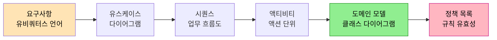

# AI 에이전트로 DDD 설계하기 — 그릴미 실전
---
> 이 문서를 읽고 나면 개발자가 분석·설계에 약한 이유, 그리고 AI 에이전트에게 역할을 부여하고 다이어그램을 단계별로 도출하게 해 리치 도메인 모델 설계 문서를 만드는 워크플로우를 설명할 수 있습니다.

> 개발자는 코딩은 잘해도 분석·설계 문서를 거의 만들지 않습니다. 화자는 AI 에게 "코딩 모를 마케터" 역할을 씌워 유비쿼터스 언어로 요구사항을 끌어내고, 유스케이스부터 도메인 모델·정책까지 다이어그램을 단계별로 뽑아 검증하는 과정을 실연합니다.

> 이 노트는 외부 유튜브 실무 강의(SI 20년 화자)를 정리한 것입니다. AI 시대 DDD 의 원칙(구조가 패턴이 된다 등)은 [04-04 AI 코딩 시대의 DDD](../04-04.AI%20코딩%20시대의%20DDD.md) 가 다루고, 이 노트는 화자가 실제 채팅으로 설계 문서를 도출한 *실전 워크플로우* 만 다룹니다. 두 편은 원칙과 실전으로 짝을 이룹니다.

## 1. 개발자는 왜 설계를 안 하는가

> 분석은 PM·기획자가 목록을 주고, 시간은 없고, 레이어드 아키텍처에 익숙해 설계서를 쓸 동기가 없기 때문입니다.

화자는 도발적인 진단으로 시작합니다. 경력이 꽤 되고 코딩을 잘하는 개발자도 공통으로 안 되는 한 가지가 분석·설계라는 것입니다. 특정 도메인만 오래 쫓아다닌 SI 개발자가 아니라면, 요구사항을 분석해 설계로 옮기는 일이 잘 안 됩니다.

이유는 환경에 있습니다. 분석은 PM·기획자가 목록을 적어 주고, SI 개발자는 시간이 없어 예전 프로젝트 방식대로 개발합니다. 설계서를 굳이 만든다면 화면 설계서 정도이고, 그마저 PM 이 PPT 로 그려 주면 그걸 보고 분석합니다. 따로 설계할 게 없으니 설계를 안 합니다.

화자는 더 근본 원인을 레이어드 아키텍처와 납기 압박의 결합으로 봅니다. 기간 내에 빨리 만들려면 도메인 모델을 빈약하게 만들고 DB 테이블에 딱 맞추는 게 가장 빠릅니다. 이 관행이 오래되면서 "DB 는 DB 다, DDL 작성할 줄 모른다" 는 식의 분업까지 굳어졌습니다. 이 진단은 [01.빈약한 도메인 모델](./01.빈약한%20도메인%20모델%20—%20엔티티는%20왜%20DB%20테이블과%20같은가.md) 의 원인 분석과 이어집니다.

화자의 제안은 생성형 AI 를 이 빈자리에 넣는 것입니다. 설계 문서를 AI 로 만들어, 개발자에게 익숙한 형태(다이어그램)로 분석하면 훨씬 낫겠다는 판단입니다.

## 2. 그릴미(GrillMe)란 무엇인가

> AI 코딩 에이전트가 코드를 작성하기 전에 집요하게 질문을 던져 요구사항을 검증하게 만드는 프롬프트 스킬입니다.

그릴미(GrillMe)는 화자가 영상 썸네일에 내건 핵심 개념입니다. 화자의 설명에 따르면, AI 코딩 에이전트가 코드를 작성하기 전에 집요하게 질문을 던져 요구사항을 검증(grill)하도록 설계된 프롬프트 스킬입니다. "grill" 은 캐묻는다는 뜻으로, 곧장 코드로 달려가지 않고 먼저 요구사항을 따져 묻게 만드는 장치입니다.

화자가 이 발상에 끌린 이유는 회의의 고통 때문입니다. 요구사항으로부터 개발자가 이해할 수 있는 문서를 만들려면 고객과 질문을 주고받아야 하는데, 회의는 서로 귀찮고 종종 다툼으로 끝납니다. 그릴미는 그 질의응답을 AI 와의 대화로 대체합니다.

화자가 이 영상에서 도달한 결과물은 유스케이스·시퀀스 다이어그램을 도출하고, 그것으로 도메인 모델 클래스 다이어그램까지 그리는 것입니다. 액티비티 다이어그램은 옵션으로 둡니다. 영상에서는 쇼핑몰 장바구니 도메인을 Gemini 로 설계합니다.

> AI 가 컨텍스트의 패턴을 증폭한다는 원칙, 유비쿼터스 언어가 코드에 박힐수록 AI 가 도메인 어휘로 일한다는 원칙은 [04-04 AI 코딩 시대의 DDD](../04-04.AI%20코딩%20시대의%20DDD.md) 가 다룹니다. 이 노트는 그 원칙이 실제 채팅에서 어떻게 작동하는지를 보여 줍니다.

## 3. 역할 부여로 유비쿼터스 언어 끌어내기

> CRUD 식 답변이 나오면 "코딩 모르는 마케터가 작성한다고 가정하라" 는 역할을 부여해, 유비쿼터스 언어로 된 요구사항을 끌어냅니다.

화자의 첫 단계는 "쇼핑몰에서 장바구니 기능을 구현하려는데 요구사항을 정리하자" 는 간단한 프롬프트입니다. 처음부터 많이 요구하지 않고 조금씩 쌓아 나가는 것이 요령입니다.

그런데 AI 는 "생성·조회·삭제·합계 계산" 같은 답을 내놓습니다. 화자는 이것이 자신이 지금까지 해 온 레이어드 아키텍처식 답변, 즉 구현 위주의 CRUD 일 뿐 진짜 요구사항이 아니라고 지적합니다. 그래서 다음 프롬프트를 던집니다 — "요구사항이 구현 위주로 되어 있다. 코딩할 줄 모르는 마케터가 요구사항을 작성한다고 가정하고 목록을 작성해 줘."

그 결과 "담기·확인·변경·할인·배송비" 같은 단어가 나옵니다. 화자는 이것이 바로 유비쿼터스 언어라고 강조합니다. 핵심 교훈은 명확합니다. AI 가 CRUD 위주로 답하면, "구현 위주로 작성하지 마라" 고 막고 코딩을 모르는 역할(role)을 부여하라는 것입니다. 에이전트 AI 학습에서 흔히 듣는 "역할을 부여하라" 가 여기서 구체적 효과를 냅니다.

화자는 여기에 도메인 배경지식으로 추가 질문을 더합니다. AI 가 장바구니를 고객 관점에서만 분석했으므로, 마케터 관점에서 쌓일 데이터에 대한 요구사항도 작성하게 한 뒤 두 관점을 합칩니다. 유비쿼터스 언어의 교과서적 정의는 [01-01 유비쿼터스 언어와 도메인 모델](../01-01.유비쿼터스%20언어와%20도메인%20모델.md) 에 있습니다.

## 4. 다이어그램 단계별 도출과 검증

> 유스케이스 → 시퀀스 → 액티비티 → 도메인 모델 클래스 다이어그램 순으로 Mermaid 로 뽑고, 각 단계마다 사람이 직접 검증합니다.

요구사항이 유비쿼터스 언어로 정리되면, 화자는 다이어그램을 단계별로 도출합니다. 모든 단계에서 "AI 가 작성했다고 그냥 두지 말고 직접 검증하라" 는 원칙이 반복됩니다.

- **유스케이스 다이어그램**: 합친 요구사항을 주며 Mermaid 로 작성을 요청합니다. AI 가 과거 프롬프트 이력 탓에 PlantUML 로 그리면, 첫 줄 형식(`graph` 으로 시작하면 Mermaid)으로 구별해 다시 Mermaid 로 그리게 교정합니다. 각 항목이 맞는지 하나하나 검증합니다.
- **시퀀스 다이어그램**: 코드 클래스를 만드는 시퀀스가 아니라, 유스케이스를 업무 흐름도 수준으로 이해하기 위한 시퀀스입니다. 목적은 "애플리케이션 개발에 어떤 흐름이 필요한가" 를 보는 것입니다.
- **액티비티 다이어그램**: 시퀀스에서 AI 가 액티비티(수량 변경 등)를 구분해 주는 것을 보고, 화자는 액티비티 다이어그램까지 그리기로 합니다. 실제 코딩 단위가 기능별로 진행되기 때문이고, 액션 단위로 그려지면 조건·흐름이 눈에 보이기 때문입니다. 시퀀스의 다섯 액티비티가 각각 그려집니다.
- **도메인 모델 클래스 다이어그램**: 액티비티까지 완성되면 도메인 모델을 Mermaid 클래스 다이어그램으로 도출합니다.

## 5. 긴 채팅의 컨텍스트 망각 다루기

> 채팅이 길어지면 AI 가 앞 내용을 잊으므로, 유스케이스·시퀀스를 복사해 프롬프트에 다시 붙이고, 흐름 밖 질문은 서브 에이전트로 격리합니다.

화자가 도메인 모델 도출 단계에서 강조하는 실무 주의점이 두 가지입니다.

첫째, 컨텍스트 망각입니다. 채팅이 길어지면 경험상 AI 가 앞 내용을 많이 잊습니다. 그래서 도메인 모델을 그릴 때 앞서 만든 유스케이스와 시퀀스 다이어그램을 복사해 프롬프트에 함께 붙입니다. 또 그냥 붙이면 답을 잘 못 하는 경향이 있어, "이 문서는 마크다운 형식이다" 라고 먼저 알려 준 뒤 "장바구니 도메인 모델을 Mermaid 클래스 다이어그램으로, 에너믹 도메인 모델이 되지 않도록 리치 도메인 모델로 만들어 줘" 라고 요청합니다. 빈약한 모델을 피하라는 지시를 설계 단계에서 명시하는 것이 핵심입니다.

도출된 모델을 보면 마케터용·사용자용 클래스가 나뉘어 있어 향후 바운디드 컨텍스트 분리의 단서가 되고, Cart 가 상품 모듈을 references 하는 관계, Money 클래스의 필요성 등이 눈에 들어옵니다. 화자는 앞서 머릿속에 넣어 둔 요구사항·유스케이스를 기준으로 모델이 잘 도출됐는지 검토합니다.

둘째, 흐름 밖 질문의 격리입니다. 메인 채팅 흐름과 관계없는 질문(예: Mermaid 유스케이스의 사람 모양 아이콘 문제)이 생기면, 메인 채팅에 묻지 말고 별도 채팅(서브 에이전트)을 열어 거기서 묻고 다시 메인으로 돌아옵니다. 화자는 이를 Claude 의 서브 에이전트와 발상이 비슷하다고 언급합니다.

## 6. 정책으로 마무리하고 크로스 체크

> 도메인 모델이 처리할 규칙·유효성을 목록으로 뽑아, 앞서 만든 액티비티·유비쿼터스 언어와 교차 검증합니다.

설계의 마지막 단계는 정책(Policy)입니다. 클래스 다이어그램까지 나왔다고 끝내지 않고, 도메인 모델이 처리해야 할 규칙·유효성 검사 항목을 다이어그램이 아닌 목록으로 뽑아 달라고 요청합니다.

이 목록의 가치는 교차 검증에 있습니다. 정책 목록을 앞서 만든 액티비티와 비교하면 크로스 체크가 되고, 최소 담기 수량 제한·옵션 매칭·최대 담기·음수 가격·상품 총액 계산 같은 항목이 맨 앞에서 도출한 유스케이스·유비쿼터스 언어와 맞는지도 확인합니다. 여러 단계의 산출물이 서로를 검증하는 구조입니다. 이 정책이 곧 구현 단계의 규칙이 되며, [02.상태 전이 모델](./02.상태%20전이%20모델%20—%20비즈니스%20룰을%20State%20Machine으로.md) 에서 본 것처럼 상태 전이로 구체화될 수 있습니다.

또 AI 는 상품 총액 같은 계산 공식까지 알려 주므로, 앞서 고민하던 Money 클래스에 무엇을 구현해야 할지가 분명해집니다. 화자는 이 과정 전체를 "도메인 모델 디자인에 대한 에이전틱 엔지니어링 기법" 이라 부르며, 다음 영상에서 동적 컬럼 생성 Factory 모델을 예고합니다.

> 출처: 외부 유튜브 실무 강의(SI 20년 화자)의 자막 [_src/03-ai-ddd-design.srt](./_src/03-ai-ddd-design.srt). 그릴미·역할 부여·다이어그램 단계 도출은 화자가 시연한 워크플로우이며, 실제 산출물은 화자의 GitHub 에 공개되어 있다고 영상에서 언급됩니다.

## 7. 면접에서 받을 만한 질문

> 위 4개 질문에 *먼저 자답한 뒤* 아래 §8 정답 (자답 후 펼치기) 으로 내려갑니다.

1. AI 가 요구사항을 CRUD 위주로 답할 때, 유비쿼터스 언어를 끌어내기 위해 어떤 프롬프트 기법을 씁니까?
2. 설계 다이어그램을 유스케이스 → 시퀀스 → 액티비티 → 도메인 모델 순으로 도출하는 이유는 무엇입니까?
3. 긴 채팅에서 AI 의 컨텍스트 망각을 다루는 두 가지 방법은 무엇입니까?
4. 정책(규칙) 목록을 마지막에 뽑는 것이 왜 검증에 유용합니까?

## 8. 정답 (자답 후 펼치기)

> 위 §7 면접에서 받을 만한 질문 의 4개에 *먼저 자답한 뒤* 아래를 읽으세요. 자답 없이 먼저 읽으면 학습 효과가 0입니다.

### 정답 1 — 유비쿼터스 언어를 끌어내는 기법

역할(role) 부여입니다. "코딩할 줄 모르는 마케터가 요구사항을 작성한다고 가정하고 목록을 작성해 줘" 라고 지시하면, AI 가 구현 용어(CRUD) 대신 도메인 용어(담기·확인·변경·할인·배송비)로 답합니다. 여기에 도메인 배경지식으로 다른 관점(고객/마케터)의 요구사항을 추가로 끌어내 합칩니다.

### 정답 2 — 다이어그램 도출 순서

각 단계가 다음 단계의 입력이자 검증 기준이 되기 때문입니다. 유스케이스가 시스템이 무엇을 하는지 정하고, 시퀀스가 그 업무 흐름을 보여 주고, 액티비티가 액션 단위로 조건·흐름을 드러내고, 도메인 모델이 그 모든 것을 표현할 객체 구조를 도출합니다. 실제 코딩 단위가 기능별이라 액티비티까지 그리면 구현 단위가 눈에 보입니다.

### 정답 3 — 컨텍스트 망각 다루기

첫째, 앞서 만든 유스케이스·시퀀스 다이어그램을 복사해 프롬프트에 다시 붙여 줍니다(필요하면 "이 문서는 마크다운이다" 라고 형식을 먼저 알려 줍니다). 둘째, 메인 흐름과 무관한 질문은 별도 채팅(서브 에이전트)을 열어 격리하고 다시 메인으로 돌아옵니다.

### 정답 4 — 정책 목록의 검증 가치

정책(규칙·유효성) 목록을 앞서 만든 액티비티와 비교하면 크로스 체크가 되고, 맨 앞에서 도출한 유스케이스·유비쿼터스 언어와도 일치하는지 확인할 수 있습니다. 여러 단계의 산출물이 서로를 교차 검증하므로 누락이나 어긋남을 발견하기 쉽습니다.

## 관련 문서

- [04-04 AI 코딩 시대의 DDD](../04-04.AI%20코딩%20시대의%20DDD.md) — 본 노트의 실전과 짝을 이루는 원칙 편
- [01-01 유비쿼터스 언어와 도메인 모델](../01-01.유비쿼터스%20언어와%20도메인%20모델.md) — 역할 부여로 끌어낸 언어의 교과서 정의
- [01.빈약한 도메인 모델](./01.빈약한%20도메인%20모델%20—%20엔티티는%20왜%20DB%20테이블과%20같은가.md) — "리치 모델로 만들어 줘" 가 피하려는 대상
- [02.상태 전이 모델](./02.상태%20전이%20모델%20—%20비즈니스%20룰을%20State%20Machine으로.md) — 도출된 정책을 구현으로 옮기는 방법
