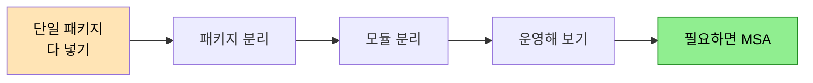
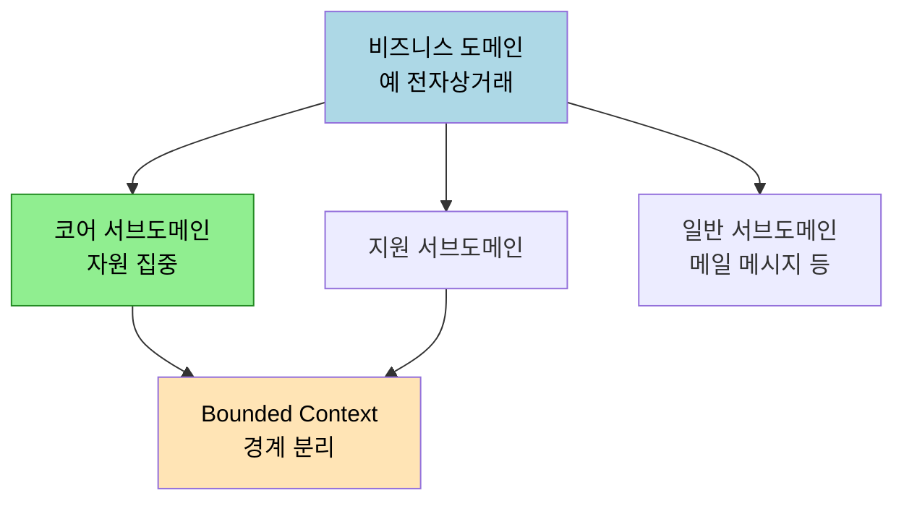

# DDD 그거 그렇게 하는 거 아닌데 — 도입 전략
---
> 이 문서를 읽고 나면 DDD 를 현장에 도입할 때 흔히 부딪히는 세 가지 거부감의 정체와, 그린필드·브라운필드 각각에서 빌딩 블록보다 먼저 해야 할 일이 무엇인지 설명할 수 있습니다.

> DDD 도입 실패는 대개 헥사고날·마이크로서비스·완벽한 설계를 *먼저* 들이밀기 때문입니다. 발표자는 "DDD 는 빌딩 블록이 아니라 도입 순서의 문제" 라는 관점에서, 거부감을 일으키는 세 문장을 해체하고 그린필드·브라운필드의 실전 절차를 제시합니다.

> 이 노트는 우아콘 발표(우아한형제들 박재성, 8년차 서버 개발자)를 정리한 것입니다. Bounded Context·유비쿼터스 언어·모놀리스 분리의 교과서 정의는 기존 편으로 링크하고, 여기서는 발표 고유의 도입 전략과 비유만 다룹니다.

## 1. 도입을 막는 세 가지 거부감

> "헥사고날을 먼저 써야 한다", "서비스부터 나눈다", "완벽하게 설계해야 한다" — 이 세 문장이 DDD 도입을 좌초시킵니다.

발표자는 그린필드(아무것도 없는 백지 프로젝트) 환경을 전제로, 개발자에게 거부감을 일으키는 세 문장을 제시합니다.

1. 도메인 주도 설계를 하려면 **헥사곤 아키텍처·클린 아키텍처를 사용해야** 한다.
2. 마이크로서비스 아키텍처를 적용하기 위해 **일단 서비스를 나누고** 시작한다.
3. 애그리거트·도메인 이벤트를 도입하려면 **완벽하게 설계해야** 한다.

각 문장의 굵은 부분이 거부감의 핵심입니다. 발표자는 이 거부감이 인류의 생존 본능(DNA)에 가까운 자연스러운 반응이라고 짚습니다. 모르는 것을 들이밀면 배타적으로 반응하는 것이 당연하다는 것입니다. 이어지는 절에서 세 문장을 하나씩 해체합니다.

## 2. 오스트랄로피테쿠스 패턴 — 생소한 용어 들이밀기

> 동료에게 "이번엔 TDD/BDD/애자일 합니다" 라고 무턱대고 꺼내면, 듣는 사람은 알 수 없는 학명을 들은 것처럼 거부합니다.

첫 번째 문장(헥사고날을 먼저)의 뿌리를 발표자는 **오스트랄로피테쿠스 패턴**이라 이름 붙입니다. 동료가 다가와 "이번 프로젝트에서는 오스트랄로피테쿠스 아프리카누스를 합니다" 라고 말하는 상황입니다. 지식이 전무한 상태에서 생소한 학명을 처음 들으면 누구나 배타적으로 반응합니다. TDD·BDD·ATDD·애자일 같은 단어를 맥락 없이 꺼내는 것이 바로 이 패턴입니다.

해결책은 뻔하지만 본질적입니다. 먼저 우리가 직면한 문제와 그것을 해결해야 하는 이유를 논의하고, 문제가 정의된 뒤에야 그것을 달성할 기술적 실행 갈래(헥사고날이든 TDD든)를 채택할지 이야기합니다. 모든 답은 상황마다 다릅니다. 팀원들이 반복된 야근으로 지쳐 있다면, 새 방법론을 신나서 들고 가도 반발심만 키웁니다.

## 3. 마이크로서비스 프리미엄 — 모놀리스로 시작하기

> 성급하게 서비스를 물리적으로 쪼개면 결합도 높은 분산 시스템이 되어 비용만 치릅니다. 일단 모놀리스로 시작합니다.

두 번째 문장(서비스부터 나누기)을 발표자는 이미 알려진 용어인 **마이크로서비스 프리미엄**으로 설명합니다. 마이크로서비스는 자동화된 배포·모니터링·실패 처리·결과적 일관성 같은 분산 시스템 지식을 요구하므로, 기술 도입만으로 복잡성이 증가합니다. 성급하게 DB 까지 물리적으로 분리해 놓으면 서비스 간 호출이 잦아져 결합도가 오히려 높아집니다. 발표자는 헥사고날·클린 아키텍처를 패키지 구조부터 나누고 시작하는 것도 같은 프리미엄을 유발한다고 봅니다.

해결책은 **일단 모놀리식으로 시작**하는 것입니다. 단일 패키지에 다 넣고 → 패키지를 나누고 → 모듈을 분리하고 → 운영해 보다가 → 필요하면 마이크로서비스를 도입합니다. 먼저 올바른 Bounded Context 를 찾는 노력, 즉 우리 도메인이 어떤 도메인인지 분석하는 시간이 우선입니다.

> 모놀리스를 언제·왜 마이크로서비스로 분리하는지의 교과서적 의사결정 기준은 [03-04 모놀리스에서 마이크로서비스로](../03-04.모놀리스에서%20마이크로서비스로%20—%20언제%2C%20왜.md) 에 정리되어 있습니다.

## 4. 완벽한 설계는 없다 — 변화를 내재화하기

> 소프트웨어는 말랑말랑하고 요구사항은 끊임없이 변합니다. 완벽한 설계를 좇는 대신 변화를 흡수하는 프로세스를 만듭니다.

세 번째 문장(완벽한 설계)에 대해 발표자는 완벽한 설계란 존재하지 않는다고 단언합니다. 아키텍처 의사결정은 0과 1의 디지털 세계처럼 보이지만 실제로는 사람이 내리는 아날로그적 판단이라 사람마다 가치관이 다릅니다. 게다가 우리는 하드웨어가 아닌 소프트(말랑말랑한)웨어를 만들고, 요구사항은 끊임없이 변하며 기획자조차 일을 완벽히 파악하지 못합니다.

따라서 변화에 맞서 싸우기보다 변화 자체를 내재화하는 프로세스를 만드는 것이 중요합니다. 발표자는 이 "변화를 내재화하는 프로세스" 를 짧게 줄이면 곧 애자일이라고 말합니다. DDD 의 개념적 기반이 객체지향과 애자일이라는 점이 여기서 연결됩니다.

그린필드에서 실제로 할 일은 단순합니다. 일단 구현하고, 구현을 통해 충분한 도메인 지식을 얻는 것입니다. 발표자는 `car.move()` 예제로 이를 보여 줍니다. 처음에는 getter/setter 로 시작하되(클래스의 역할·책임을 모르는 상태이므로), `getPosition` 후 `setPosition` 하는 로직이 보이면 `move` 함수로 도출하는 식으로 점진적으로 리팩토링합니다. getter/setter 가 무조건 나쁜 것은 아니며, 개발을 시작하는 데 도움이 됩니다. 이 점진적 리팩토링 과정이 빈약한 도메인 모델을 풍부한 모델로 끌어올립니다([01.빈약한 도메인 모델](./01.빈약한%20도메인%20모델%20—%20엔티티는%20왜%20DB%20테이블과%20같은가.md) 의 화자도 같은 결론에 도달합니다).

## 5. 유비쿼터스 언어 — 살아있는 문서로 관리

> 용어 사전을 위키가 아닌 README 로 두어 소스코드와 함께 형상 관리하고, 동사도 용어로, 한글·영문 모두 코드 리뷰 대상으로 삼습니다.

리팩토링이 어려워지는 순간 발표자가 꺼내는 도구가 유비쿼터스 언어입니다. 언제 어디서나 회의·기획·디자인·개발 전반에서 같은 언어를 쓰자는 것입니다. 영문 이름 고민을 개발자만 떠안지 말고 기획자·디자이너와 함께 정합니다.

발표자 팀의 실무 방식이 인상적입니다. 용어 사전을 별도 위키가 아니라 **README 파일**로 관리해 소스코드와 함께 형상 관리합니다. 그래서 용어 자체가 코드 리뷰 대상이 되고, 더 의미 있는 용어를 지속적으로 찾습니다. 명사만이 아니라 동사("이동하다" 등)도 용어 대상이며, 사전적 정의에 이해를 돕는 예시도 함께 적습니다.

구체적 사례로 "과제" 가 있습니다. 평가자(팀) 입장에서는 "내어 주는 것" 이고 지원자 입장에서는 "제출하는 것" 이라 의미가 혼용됐습니다. 그래서 한글 용어를 **과제**(내어 주는 것)와 **과제 제출물**(제출하는 것)로 분리했습니다. 같은 용어가 다른 의미를 갖는 이 현상이 곧 Bounded Context 경계의 신호입니다.

> 유비쿼터스 언어가 코드에 박히는 원리와 Bounded Context 안에서의 용어 정의는 [01-01 유비쿼터스 언어와 도메인 모델](../01-01.유비쿼터스%20언어와%20도메인%20모델.md) 에 정리되어 있습니다. 발표자는 그린필드 단계에서는 Bounded Context 가 아직 없으므로 먼저 만들 필요가 없다고 봅니다.

## 6. 브라운필드 — 도메인 지식과 전략적 설계

> 개발자는 비즈니스 도메인을 알아야 합니다(월급이 거기서 나오니까). 코어/지원/일반 서브도메인을 식별하고, 조직 협업과 외부 단절을 설계합니다.

브라운필드(어제까지 작성한 코드가 있는 프로젝트)에서 발표자가 해체하는 거부감 문장은 "개발자는 비즈니스 도메인을 잘 몰라도 괜찮다" 입니다. 발표자의 반박은 직설적입니다. 월급은 비즈니스에서 나오고, 비즈니스 도메인은 소프트웨어가 해결하려는 문제 영역이므로 개발자도 알아야 합니다.

도메인 지식을 쌓는 방법으로 선두·경쟁 업체가 어떤 기능을 제공하는지 살펴 확장 범위의 힌트를 얻는 법을 듭니다. 그리고 큰 비즈니스 도메인(예: 전자상거래)을 상품·전시·주문·결제·정산 같은 여러 **서브도메인**으로 쪼갭니다. **코어 도메인 차트**로 각 서브도메인이 핵심(Core)인지, 지원(Supporting)인지, 일반(Generic)인지 분류해 한정된 자원(인력·시간)을 어디에 집중할지 결정합니다. 핵심 도메인은 시장·비전·고객에 따라 변합니다.

도메인 지식 탐구 도구로는 이벤트 스토밍, 도메인 스토리텔링 같은 시각화 기법을 권합니다. 이 과정은 개발자만이 아니라 프로젝트 참여자 전원이 함께해야 합니다.

전략적 설계는 곧 조직의 문제입니다. 콘웨이 법칙에 따라 시스템 아키텍처는 조직 구조를 따라가므로, 조직 간 협업 방식(API 함께 논의, 일방 결정, 중앙 통제 등)이 전부 DDD 전략적 설계에 해당합니다. 조직 내에서는 경계를 나누는 기준 두 가지를 제시합니다 — ①같은 용어가 다른 의미를 갖거나 같은 대상을 다르게 지칭하는 경우, ②외부 시스템을 어떻게 격리할 것인가. 경계 분리도 빅뱅이 아니라 가장 작거나 영향력이 적거나 중요한 것부터 점진적으로 떼어냅니다.

## 7. 외부 단절 3패턴과 도입 마무리

> DTO·DIP·ACL 로 외부 시스템을 격리하면, 레이어드 아키텍처에 적용하는 것만으로 자연스럽게 도메인 주도 아키텍처가 그려집니다.

외부 세계가 우리 비즈니스에 간섭하지 못하게 막는 단절 패턴 세 가지를 발표자는 제시합니다 — **DTO**, **DIP**(의존성 역전), **ACL**(Anti-Corruption Layer, 부패 방지 계층). ACL 은 외부 시스템의 비즈니스 지식·용어가 우리 시스템에 들어오지 못하게 막거나 번역하는 계층입니다. 거창한 물리 계층이 아니라, 외부 API 호출을 우리 언어로 번역하는 메서드 하나만으로도 ACL 역할을 합니다. 이를 통해 외부 시스템과 단절하고 쉽게 교체할 수 있습니다.

핵심 통찰은 순서입니다. 단일 패키지 → N 패키지로 갈 때 보통 3티어(레이어드) 아키텍처를 선택하는데, 거기에 DTO·DIP·ACL 을 적용하다 보면 자연스럽게 도메인 주도 아키텍처가 그려집니다. 헥사고날·클린 아키텍처를 패키지 구조부터 잡고 시작하는 것보다, 일단 구현하고 필요한 순간에 리팩토링하면 도메인이 주도하는 아키텍처가 완성됩니다. 발표자는 Evans 의 책이 레이어드를, Vernon 의 책이 헥사고날을, 최근 책들이 클린 아키텍처를 그린다는 점을 들어 아키텍처는 계속 변한다고 정리합니다.

도입 자체도 전략입니다. 변화를 도울 사람과 동맹이 필요하고, 호기심 유발 같은 마케팅 기법이 필요합니다. 발표자는 사람이 자주 다니는 길목 화이트보드에 그림을 그려 두고 한 달간 호기심을 키운 뒤 Bounded Context 도출 이슈를 등록해 자연스럽게 논의를 끌어낸 경험을 공유합니다.

> 출처: 우아콘 발표 자막 [_src/04-ddd-not-like-that.srt](./_src/04-ddd-not-like-that.srt), [YouTube](https://www.youtube.com/watch?v=O3Cytc-sJSc). 발표자는 DDD 추천 도서로 DDD 책이 아닌 *소프트웨어 장인*·*팀 토폴로지*·*소프트웨어 아키텍처 101* 을 권하며, "좋은 DDD 는 'DDD 는 말이죠' 로 시작하지 않는다" 고 정리합니다.

## 8. 면접에서 받을 만한 질문

> 위 4개 질문에 *먼저 자답한 뒤* 아래 §9 정답 (자답 후 펼치기) 으로 내려갑니다.

1. DDD 도입을 막는 세 가지 거부감 문장은 무엇이고, 각각의 공통 오류는 무엇입니까?
2. "마이크로서비스 프리미엄" 을 피하기 위해 그린필드에서 권하는 시작 방식은 무엇입니까?
3. 유비쿼터스 언어 사전을 위키가 아닌 README 로 관리하면 어떤 이점이 있습니까?
4. 레이어드 아키텍처에 DTO·DIP·ACL 을 적용하면 왜 자연스럽게 도메인 주도 아키텍처가 됩니까?

## 9. 정답 (자답 후 펼치기)

> 위 §8 면접에서 받을 만한 질문 의 4개에 *먼저 자답한 뒤* 아래를 읽으세요. 자답 없이 먼저 읽으면 학습 효과가 0입니다.

### 정답 1 — 세 거부감과 공통 오류

①헥사고날·클린 아키텍처를 먼저 써야 한다, ②서비스부터 나눈다, ③완벽하게 설계해야 한다입니다. 공통 오류는 문제 정의와 도메인 분석보다 *기술적 수단을 먼저* 들이미는 것입니다. 문제와 그 해결 이유를 먼저 논의한 뒤에야 기술 갈래를 채택해야 합니다.

### 정답 2 — 그린필드 시작 방식

일단 모놀리식으로 시작합니다. 단일 패키지에 다 넣고 → 패키지 분리 → 모듈 분리 → 운영 → 필요하면 MSA 순으로 점진적으로 갑니다. 성급한 물리 분리는 결합도 높은 분산 시스템과 분산 시스템 학습 비용(프리미엄)만 부릅니다.

### 정답 3 — README 용어 사전의 이점

소스코드와 함께 형상 관리되므로 용어가 코드 리뷰 대상이 되고, 살아있는 문서로 지속적으로 개선됩니다. 별도 위키는 코드와 동기화가 끊기기 쉽지만, README 는 코드 변경과 함께 갱신되어 6개월 뒤에도 의미 해석 부담을 줄입니다.

### 정답 4 — 레이어드 + 3패턴이 도메인 주도가 되는 이유

DTO·DIP·ACL 이 외부 의존을 격리하고 도메인을 외부 모델 변화로부터 보호하기 때문입니다. 의존성이 역전되고 외부 번역 계층이 생기면, 도메인이 인프라에 의존하지 않는 형태(도메인 주도 아키텍처)가 자연스럽게 만들어집니다. 패키지 구조를 먼저 잡지 않아도 필요에 따른 리팩토링이 같은 결과에 도달합니다.

## 관련 문서

- [03-04 모놀리스에서 마이크로서비스로](../03-04.모놀리스에서%20마이크로서비스로%20—%20언제%2C%20왜.md) — "프리미엄" 을 피하는 분리 의사결정 기준
- [01-01 유비쿼터스 언어와 도메인 모델](../01-01.유비쿼터스%20언어와%20도메인%20모델.md) — 용어가 코드에 박히는 원리
- [01-04 Bounded Context 와 Context Map](../01-04.Bounded%20Context%20와%20Context%20Map.md) — "과제/과제 제출물" 처럼 경계가 갈리는 통합 패턴
- [01.빈약한 도메인 모델](./01.빈약한%20도메인%20모델%20—%20엔티티는%20왜%20DB%20테이블과%20같은가.md) — getter/setter → Rich 모델 점진 리팩토링의 또 다른 사례
- [05.Modular Monolith with DDD](./05.Modular%20Monolith%20with%20DDD%20—%20테스트로%20강제하는%20아키텍처.md) — 본 발표가 권한 "모놀리스로 시작" 을 코드로 구현한 사례
