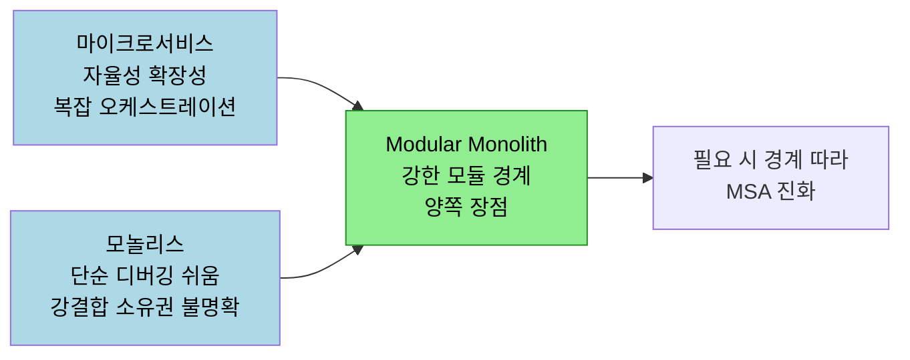
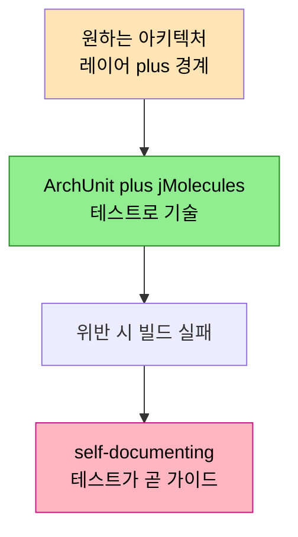

# Modular Monolith with DDD — 테스트로 강제하는 아키텍처
---
> 이 문서를 읽고 나면 Modular Monolith 가 마이크로서비스와 모놀리스의 장점을 어떻게 취하는지, 그리고 Spring Modulith·jMolecules·ArchUnit 로 아키텍처를 테스트로 강제해 자기 문서화(self-documenting)하는 방법을 설명할 수 있습니다.

> 아키텍처 규칙은 문서에 적어도 지켜지지 않습니다. 발표자들은 모듈 경계·레이어·Aggregate 규칙을 테스트로 박아, 위반하면 빌드가 깨지게 만듭니다. 그러면 아키텍처 자체가 살아있는 문서가 됩니다.

> 이 노트는 Spring IO 발표(Adesso 의 Mattia Curio·Gregorio)를 정리한 것입니다. Aggregate·이벤트의 교과서 정의는 기존 편으로 링크하고, 여기서는 Spring Modulith·jMolecules 라이브러리로 구현한 코드 사례에 집중합니다.

## 1. 왜 Modular Monolith 인가

> 마이크로서비스의 자율성·확장성과 모놀리스의 단순함을 함께 취하되, 강한 모듈 경계로 결합도를 낮춥니다.

발표자들은 두 아키텍처의 트레이드오프부터 짚습니다. 마이크로서비스는 자율성·수평 확장성·복원력을 주지만, 복잡한 오케스트레이션·네트워크 실패·동기 호출로 인한 강결합·분산 트랜잭션·관찰 가능성 오버헤드를 동반합니다. 모놀리스는 단순하고 디버깅이 쉽지만 여전히 강결합이고, 소유권이 불명확하며 부분 간 의존이 깨지기 쉽습니다.

Modular Monolith 는 양쪽의 좋은 부분을 취합니다. 내부를 강한 경계를 가진 모듈로 나눠 강결합을 없애고, 유지보수·테스트·이해가 가능하면서 문서화된 아키텍처를 목표로 합니다. 결정적으로, 필요할 때 모듈 경계를 따라 마이크로서비스로 진화할 수 있습니다. 마이크로서비스는 악이 아니라 함정(pitfall)이 있을 뿐이며, 필요에 맞는 최선의 아키텍처를 고르는 것이 핵심입니다.

> 모놀리스를 언제 마이크로서비스로 분리하는지의 교과서적 기준은 [03-04 모놀리스에서 마이크로서비스로](../03-04.모놀리스에서%20마이크로서비스로%20—%20언제%2C%20왜.md) 에, 같은 "모놀리스로 시작" 전략의 한국어 발표는 [04.DDD 그거 그렇게 하는 거 아닌데](./04.DDD%20그거%20그렇게%20하는%20거%20아닌데%20—%20도입%20전략.md) 에 있습니다.

## 2. Spring Modulith 와 jMolecules

> Spring Modulith 는 도메인이 주도하는 모듈을, jMolecules 는 DDD 빌딩 블록을 코드로 표현하게 해 줍니다.

구현에 쓴 두 라이브러리는 역할이 갈립니다. **Spring Modulith** 는 잘 구조화된 Spring Boot 애플리케이션을 만들게 해 주며, 핵심은 "모듈은 도메인이 주도해야 한다" 는 원칙입니다. 컨퍼런스 애플리케이션을 예로 들면 Session 이 한 모듈, Attendee 가 다른 모듈이 됩니다. 무엇이 한 모듈 안에 들어가고 무엇이 밖으로 나가는지를 도메인이 결정합니다. 이로써 모듈당 Bounded Context 를 모델링하고, 코드에 경계를 강제하며, 모듈 내·모듈 간 통신을 이벤트로 처리합니다. 통신이 이미 이벤트로 되어 있으면 나중에 마이크로서비스로 진화하기 쉽습니다.

**jMolecules** 는 DDD 빌딩 블록(Aggregate Root, Value Object, Identity, Repository)을 코드로 표현하게 돕는 라이브러리입니다. 발표에서는 `@AggregateRoot`, Value Object, jMolecules Repository 같은 타입으로 도메인 의도를 코드에 박습니다.

## 3. 테스트로 강제하는 self-documenting 아키텍처

> ArchUnit + jMolecules 로 레이어·Bounded Context 격리를 테스트에 적어, 위반하면 빌드가 깨지게 만듭니다.

이 발표의 핵심 통찰입니다. 처음의 Session 엔티티는 DDD 엔티티가 아니라 그냥 Jakarta Persistence 엔티티(테이블 매핑)입니다. Spring Modulith 는 DDD 사용을 권하지만 강제하지는 않습니다. 그래서 발표자들은 **아키텍처를 테스트로 기술**합니다. ArchUnit 과 jMolecules 로 원하는 아키텍처를 묘사하는 테스트를 쓰면, 규칙을 어겼을 때 그 테스트가 실패합니다.

처음 작성한 테스트들은 대부분 실패합니다 — 요소가 올바른 레이어에 없고, Bounded Context 격리가 안 됐기 때문입니다. 그다음 코드를 infrastructure·persistence·domain·application·presentation 으로 재구성하면 테스트가 통과합니다. 레이어 위반(예: application 레이어에서 Spring 서비스 사용)을 `@ApplicationLayer` 같은 어노테이션을 `package-info.java` 에 두고 테스트로 검증합니다. 비준수 어노테이션이 발견되면 에러를 냅니다.

이것이 **자기 문서화**입니다. 새 개발자가 합류해 "엔티티를 어디 둬야 하지?" 할 때, 테스트를 실행해 보면 잘못된 위치에 뒀을 때 알려 줍니다. 테스트가 아키텍처 가이드라인을 코드로 표현하므로, 문서가 아니라 테스트가 어디에 코드를 써야 하는지 알려 줍니다.

> 레이어 위반·도메인 의존 방향을 ArchUnit 으로 검증하는 패턴은 본 학습 노트 모음 전반에서 다루며, DDD 와 CI/CD 의 결합은 [04-03 DDD 와 CI/CD](../04-03.DDD%20와%20CI_CD.md) 에서 이어집니다.

## 4. Aggregate Root 와 자가검증 Value Object

> 상태 변경은 Aggregate Root 를 통해서만 일어나고, Value Object 는 스스로를 검증하며, 컬렉션은 불변 복사본으로 반환합니다.

Aggregate Root 는 트랜잭션 경계를 정의하고 모든 변경이 그 안에서 일어나도록 보장합니다. `changePrice` 유스케이스를 보면, Repository 로 Session 을 ID 로 찾아 Aggregate Root 의 `changePrice` 메서드를 호출하고, 연산의 유효성 검사는 전부 Aggregate 안에서 일어납니다.

Value Object 의 자가검증이 강력합니다. `Price` 는 null 이 아니면서 0 이상임을 스스로 보장하는 Value Object 입니다. 그래서 Aggregate 에 넘기는 인스턴스가 null 이 아니면 유효하다고 신뢰할 수 있습니다 — 이 보장을 Value Object 자신이 제공합니다.

Order Aggregate Root 는 `final class` 라 확장할 수 없고 `AggregateRoot with domain events` 를 확장합니다. 발표자들은 도메인·애플리케이션 레이어에 Spring·라이브러리 의존을 두지 않는 선택을 했습니다(이는 단순함과 DDD 순수성 사이의 균형 선택이라고 밝힙니다). 주문 상태 변경은 `checkModifyOrThrow` 처럼 Aggregate Root 안에서만 일어나고, `addItem` 은 같은 아이템 중복 추가를 막는 도메인 규칙을 강제합니다. `getItems` 는 변경 불가능한 복사본(immutable copy)을 반환해, 외부에서 내부 상태(ArrayList)를 수정하지 못하게 합니다.

> Aggregate Root·트랜잭션 경계·Value Object 의 교과서 규칙은 [02-01 Aggregate 설계 규칙](../02-01.Aggregate%20설계%20규칙.md) 과 [02-02 Entity 와 Value Object](../02-02.Entity%20와%20Value%20Object.md) 에 정리되어 있습니다.

## 5. 이벤트와 Transactional Outbox

> Spring Modulith 가 트랜잭션 커밋 시 이벤트 발행을 보장해 Transactional Outbox 패턴을 즉시 제공하고, 리스너 종류로 일관성 수준을 고릅니다.

Aggregate 가 `registerEvent` 로 도메인 이벤트(예: 가격 변경)를 등록하면, JPA 가 엔티티를 영속화할 때 Spring Modulith 가 **트랜잭션 커밋 직후 이벤트 발행을 보장**합니다. 이것이 Transactional Outbox 패턴을 별도 구현 없이 제공하는 부분으로, 영속성과 이벤트를 함께 다뤄 최소한의 결과적 일관성(eventual consistency)을 확보합니다.

리스너 종류로 일관성 수준을 조절합니다.

- **`@TransactionalEventListener`**: 동기·트랜잭션 리스너. 같은 트랜잭션에서 실행되며, 여기서 실패하면 전체 트랜잭션이 롤백됩니다. phase 로 before/after commit, after rollback, after completion 을 고를 수 있습니다.
- **`@ApplicationModuleListener`**: 비동기 + `REQUIRES_NEW` 전파. 결과적 일관성을 제공하며, 이벤트가 즉시 전송됨을 보장하지 않는 대신 미래에 처리할 수 있습니다.

발표에서는 가격 변경 핸들러에 런타임 예외를 일부러 던져 동작을 보여 줍니다. 동기 트랜잭션 리스너에서 예외가 나면 가격이 변경되지 않고 롤백됩니다(다른 모듈인 event-logger 에서 발생해도 Spring 트랜잭션 모델로 전체가 롤백). 반면 after-commit + REQUIRES_NEW 리스너는 커밋 후 새 트랜잭션에서 돌기 때문에 가격 변경은 성공합니다. 단순한 경우엔 이 강결합이 편리하지만, 얽힘을 만들 수 있으므로 단순함과의 트레이드오프를 직접 골라야 합니다. 실패한 이벤트는 Spring Modulith 의 재발행(republish) 기능으로 다시 보낼 수 있습니다.

> Aggregate 가 이벤트를 만드는 이유와 이벤트·CQRS 통합의 DDD 관점은 [04-02 이벤트와 CQRS 통합](../04-02.이벤트와%20CQRS%20통합.md) 에 정리되어 있습니다.

## 6. Named Interface 와 모듈 노출 제어

> 모듈은 base package 에 둔 것만 자동 노출하고, `@NamedInterface` 로 특정 패키지를 골라 노출합니다. 다른 모듈은 그 이름으로만 참조합니다.

Spring Modulith 의 모듈 노출 제어가 경계를 코드로 강제합니다. 기본적으로 모듈의 **base package** 에 둔 것만 다른 모듈에 노출되고, 그 외는 노출되지 않습니다. 특정 패키지를 골라 노출하려면 `package-info.java` 에 `@NamedInterface` 를 정의합니다. 예를 들어 session 모듈의 `domain.events` 패키지를 named interface 로 선언하면, order 모듈이 `session :: domain.events` 형태로 그것만 참조할 수 있습니다.

이 구조 덕분에 모듈 간 의존이 명시적이고 검증 가능합니다. order 모듈이 노출되지 않은 named interface 를 참조하면 애플리케이션이 뜨지 않습니다. 보통 이 검증을 테스트에 두지만, Spring 설정에 두면 실수로 잘못된 환경(운영 등)에 배포되는 것을 애플리케이션 기동 단계에서 막습니다.

UI 업데이트는 Server-Sent Events(SSE)로 완전히 디커플링합니다. 가격·총액 변경 이벤트를 SSE 채널로 프론트엔드에 흘려보내되, 이 리스너는 동기지만 트랜잭션에 묶이지 않습니다(프론트 갱신 실패가 주문 트랜잭션에 영향을 주지 않게). 새로고침이나 제출 시에는 올바른 상태의 Aggregate 를 사용합니다.

마지막으로 Spring Modulith 는 모듈 구조를 UML 문서로 자동 생성하는 테스트를 제공합니다(`target/spring-modulith-docs`). 모듈 간 관계(attendee 가 shared 에 의존 등)와 레이어 정보가 문서로 떨어집니다.

## 7. 정리 — 소유권·경계·진화

> 모듈 경계가 소유권을 명확히 하고, 그 경계가 곧 미래의 마이크로서비스 분리선이 되며, 테스트가 아키텍처를 살아있게 유지합니다.

발표의 takeaway 는 세 가지입니다. 첫째, 모놀리스에서 불명확하던 소유권이 모듈 경계로 명확해집니다. 둘째, 경계를 설정해 두면 Modular Monolith → 마이크로서비스 이동이 필요할 때 쉬워집니다 — 경계가 곧 모듈이 될 마이크로서비스의 분리선이기 때문입니다. DDD 가 그 경계(session 이 한 경계, attendee 가 다른 경계)를 인식하게 돕습니다. 셋째, 테스트가 아키텍처를 설계하고 코드를 올바른 위치에 두도록 도와, 유지보수 가능하고 이해 가능한 아키텍처를 만듭니다.

발표자들은 레이어드 아키텍처를 골라 테스트로 검증했지만, 헥사고날을 골라 그에 맞는 테스트를 써도 됩니다. 핵심은 자신에게 맞는 아키텍처를 고르고, 그것을 검증하는 테스트를 쓰는 것입니다. 그 테스트가 오늘의 아키텍처뿐 아니라 내일의 아키텍처까지 검증해 줍니다.

> 출처: Spring IO 발표 자막 [_src/05-modular-monolith.srt](./_src/05-modular-monolith.srt), [YouTube](https://www.youtube.com/watch?v=sLG5n_pXWK0). 발표에서 사용한 라이브러리는 Spring Modulith 와 jMolecules 이며, 예제 코드는 발표자들의 공개 리포지토리에 있다고 언급됩니다.

## 8. 면접에서 받을 만한 질문

> 위 4개 질문에 *먼저 자답한 뒤* 아래 §9 정답 (자답 후 펼치기) 으로 내려갑니다.

1. Modular Monolith 가 마이크로서비스·모놀리스 각각에서 취하는 장점은 무엇입니까?
2. 아키텍처를 테스트로 강제하면 왜 "self-documenting" 이 됩니까?
3. `@TransactionalEventListener` 와 `@ApplicationModuleListener` 의 일관성 차이는 무엇입니까?
4. Spring Modulith 의 Named Interface 가 모듈 경계를 어떻게 강제합니까?

## 9. 정답 (자답 후 펼치기)

> 위 §8 면접에서 받을 만한 질문 의 4개에 *먼저 자답한 뒤* 아래를 읽으세요. 자답 없이 먼저 읽으면 학습 효과가 0입니다.

### 정답 1 — Modular Monolith 의 장점 취합

마이크로서비스에서는 자율성·확장성·경계(소유권 명확화)를, 모놀리스에서는 단순함·쉬운 디버깅을 취합니다. 강한 모듈 경계로 결합도를 낮추면서도 분산 시스템의 오케스트레이션 비용을 피하고, 필요할 때 경계를 따라 마이크로서비스로 진화할 수 있습니다.

### 정답 2 — 테스트가 self-documenting 인 이유

원하는 아키텍처(레이어·Bounded Context 격리·모듈 노출)를 ArchUnit·jMolecules 테스트로 기술하면, 규칙 위반 시 빌드가 깨집니다. 새 개발자가 코드를 잘못된 위치에 두면 테스트가 알려 주므로, 문서가 아니라 테스트 자체가 "어디에 무엇을 써야 하는지" 의 가이드가 됩니다. 문서와 달리 코드와 항상 동기화됩니다.

### 정답 3 — 두 리스너의 일관성 차이

`@TransactionalEventListener` 는 동기·같은 트랜잭션이라 핸들러 실패 시 전체가 롤백됩니다(강한 일관성, phase 선택 가능). `@ApplicationModuleListener` 는 비동기 + REQUIRES_NEW 라 커밋 후 새 트랜잭션에서 돌며 결과적 일관성을 제공합니다 — 즉시 전송을 보장하지 않는 대신 디커플링됩니다.

### 정답 4 — Named Interface 의 경계 강제

모듈은 base package 에 둔 것만 자동 노출되고 그 외는 숨겨집니다. `@NamedInterface` 로 특정 패키지만 골라 노출하면, 다른 모듈은 그 이름으로만 참조할 수 있습니다. 노출되지 않은 것을 참조하면 애플리케이션이 기동되지 않아, 경계 위반이 런타임 이전에 막힙니다.

## 관련 문서

- [03-04 모놀리스에서 마이크로서비스로](../03-04.모놀리스에서%20마이크로서비스로%20—%20언제%2C%20왜.md) — Modular Monolith → MSA 진화의 의사결정 기준
- [02-01 Aggregate 설계 규칙](../02-01.Aggregate%20설계%20규칙.md) — 트랜잭션 경계로서의 Aggregate Root
- [04-02 이벤트와 CQRS 통합](../04-02.이벤트와%20CQRS%20통합.md) — Aggregate 가 도메인 이벤트를 만드는 이유
- [04.DDD 그거 그렇게 하는 거 아닌데](./04.DDD%20그거%20그렇게%20하는%20거%20아닌데%20—%20도입%20전략.md) — "모놀리스로 시작" 전략의 한국어 발표
