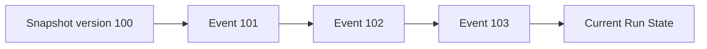

# 이벤트 소싱
---
> 이벤트 소싱(Event Sourcing)은 현재 상태만 저장하는 대신, 상태 변화를 일으킨 이벤트 시퀀스를 저장하는 방식이다.
>
> - append-only event log
> - replay
> - snapshot
> - auditability

## 1. 현재 상태 대신 변경 이력을 저장한다

전통적인 CRUD 구조에서는 현재 상태만 보면 된다. 그러나 “어떻게 이 상태가 되었는가”가 중요해지는 순간 한계가 드러난다. 카드게임 런 관리 서비스에서 특정 전투를 재현하거나 이상 행동을 디버깅하려면 상태 이력 자체가 필요하다.

이벤트 소싱은 이 문제를 해결한다. `Run`의 현재 상태를 직접 저장하는 대신, `RunStarted`, `CardPlayed`, `DamageApplied`, `RewardSelected`, `RunEnded` 같은 이벤트를 순서대로 저장한다.

## 2. 카드게임 도메인에 잘 맞는 이유

런 기반 게임은 본질적으로 상태 전이의 연속이다. 어떤 카드가 언제 사용되었는지, 어떤 유물이 어떤 효과를 냈는지, 어떤 보상을 선택했는지가 모두 의미 있는 이력이다.

그래서 이벤트 소싱은 다음 요구와 잘 맞는다:

- 특정 런을 그대로 재생하고 싶다.
- 카드 밸런스 문제를 사후 분석하고 싶다.
- 치명적인 버그를 시간순으로 추적하고 싶다.

## 3. 상태 복원 방식

이벤트 소싱에서는 현재 상태를 이벤트 재생으로 복원한다. 이벤트 수가 많아지면 Snapshot을 함께 써서 복원 비용을 줄인다.



이 구조는 단순히 저장 방식이 바뀌는 것이 아니라, 시스템이 “이력 중심”으로 바뀌는 것에 가깝다.

## 4. 예시 이벤트 스트림

다음은 하나의 런 스트림 예시다:

```json
[
  {"type":"RunStarted","runId":"run-1"},
  {"type":"BattleStarted","battleId":"b-1"},
  {"type":"CardPlayed","cardId":"strike","turn":1},
  {"type":"DamageApplied","target":"enemy-1","amount":6},
  {"type":"BattleWon","battleId":"b-1"},
  {"type":"RewardSelected","reward":"add-card"},
  {"type":"RunEnded","result":"victory"}
]
```

이 스트림만 있으면 런의 흐름을 다시 재구성할 수 있다.

## 5. 장점과 비용

이벤트 소싱의 장점은 추적성과 재현 가능성이다. 특히 운영 이슈 분석과 리플레이 기능에서 강력하다. CQRS와 결합하면 다양한 읽기 모델도 만들기 쉽다.

반면 비용도 크다. 이벤트 스키마 진화, Snapshot 전략, 리플레이 성능, 운영 난이도까지 함께 고려해야 한다. 단순 CRUD보다 설계와 도구가 훨씬 중요하다.

## 6. 언제 도입해야 하는가

이벤트 소싱은 “이력이 곧 비즈니스 가치”일 때 도입할 가치가 있다. 카드게임 런 관리 서비스에서도 모든 흐름에 적용하기보다, 리플레이와 분석 가치가 높은 영역에 한정해 단계적으로 도입하는 것이 현실적이다.

예를 들면 핵심 `Run` 진행에만 이벤트 소싱을 적용하고, 메타 진행이나 단순 설정 관리는 일반 CRUD로 유지할 수 있다.

## 7. 실무 결론

이 시리즈에서는 이벤트 소싱을 선택 가능한 고급 패턴으로 다룬다. 카드게임 도메인에서는 특히 런 리플레이, 전투 디버깅, 운영 분석에 매력적이지만, 기본 선택으로 강제하지는 않는다.

즉 이벤트 소싱은 “멋있어 보여서”가 아니라, 이력 자체가 중요한 도메인인지 확인한 뒤 도입해야 한다. 이 프로젝트에서는 그 가능성이 충분히 높다.
