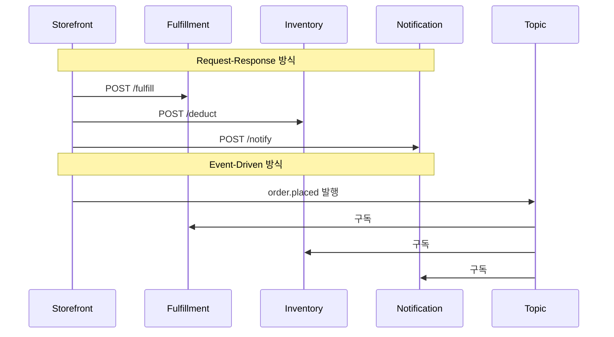
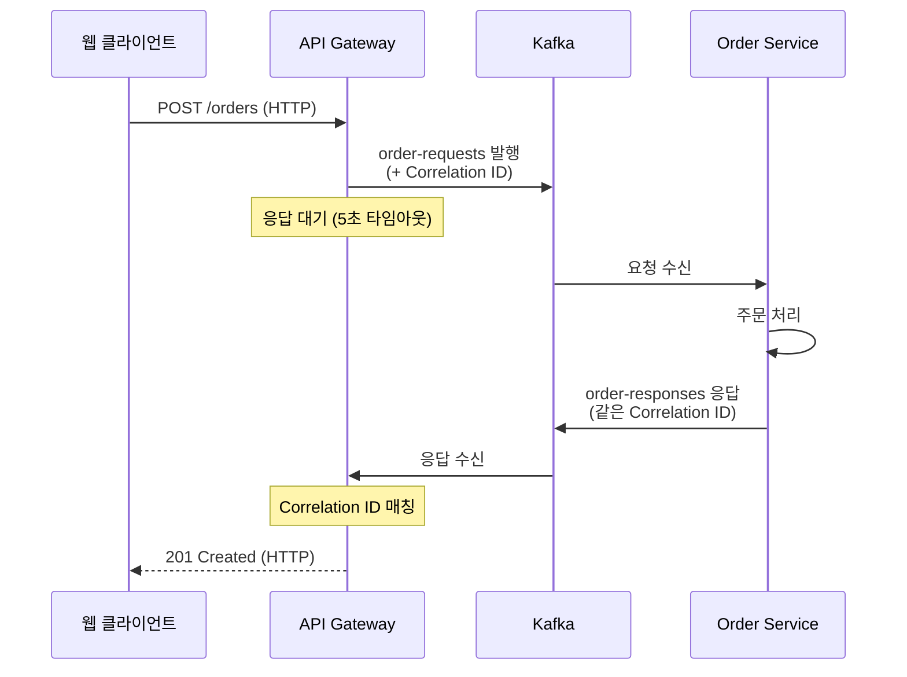
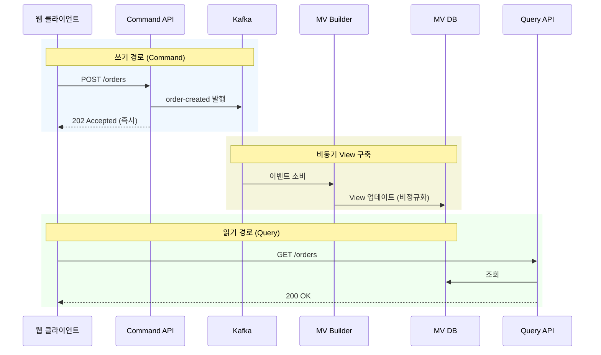
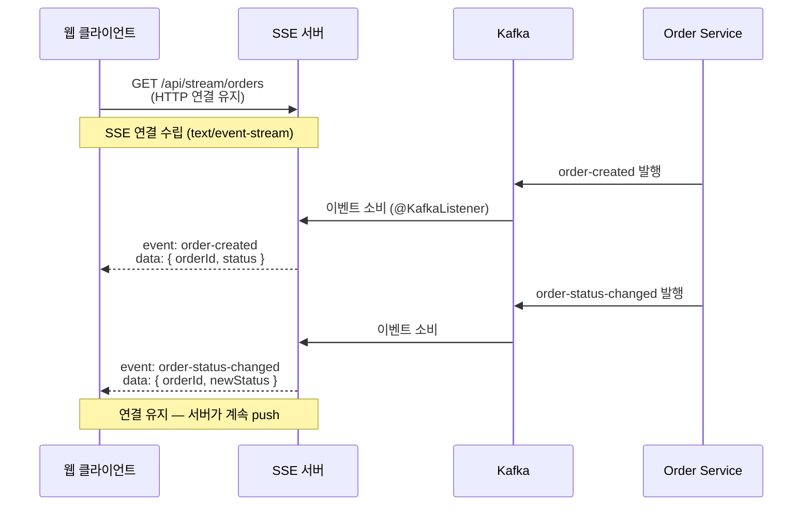
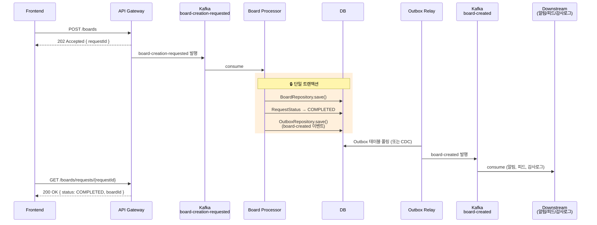

# 이벤트 기반 + 요청-응답

---

> 대부분의 애플리케이션은 하이브리드 구조다. 외부 클라이언트는 REST API(HTTP 요청 → 응답)를 기대하고, 내부 서비스는 이벤트 기반 비동기 통신(즉시 응답 불가)으로 동작한다. 두 패러다임을 어떻게 연결할지가 본 글의 주제다. 먼저 EDA와 Request/Response의 *구조적 차이* 6가지를 짚고, 둘을 잇는 *브릿지 패턴* 4가지를 정리한다.


## 학습 목표

> EDA와 Request/Response를 *경쟁 도구가 아니라 서로 다른 계층의 도구*로 구분하고, 둘을 잇는 브릿지 패턴을 선택할 수 있게 된다.

이 장을 다 읽고 다음 다섯 가지에 자신 있게 답할 수 있으면 학습이 완료된다.

1. EDA와 Request/Response의 *공간·시간 결합* 차이를 코드 예시로 설명할 수 있다.
2. 강한 일관성과 최종 일관성 중 어디를 골라야 하는지 비즈니스 도메인 기준으로 판단할 수 있다.
3. 4가지 브릿지 패턴(ReplyingKafkaTemplate / CQRS+MV / SSE / 202+Outbox)의 적용 시점을 구분할 수 있다.
4. Dual-Write 문제가 무엇이며 Outbox 패턴이 어떻게 푸는지 설명할 수 있다.
5. Read-Your-Own-Writes 문제와 202 + Retry-After Polling 패턴의 관계를 설명할 수 있다.


## 1. EDA vs Request/Response — 6가지 구조적 차이

이커머스 시스템을 예시로 본다. StoreFront가 주문을 생성하면 주문·재고·알림 서비스가 후속 작업을 처리해야 한다.



| 비교 기준            | Request-Response                 | Event-Driven                    |
| -------------------- | -------------------------------- | ------------------------------- |
| **Reactivity**       | 명시적 호출, 변경 시 호출자 수정 | 이벤트 구독, 발행자 변경 불필요 |
| **Coupling**         | 공간+시간 결합                   | 공간+시간 디커플링              |
| **Consistency**      | 강한 일관성 가능                 | 최종 일관성 전제                |
| **Historical State** | 현재 상태만, 감사 로그 별도      | 이벤트 로그가 이력 보존         |
| **Flexibility**      | 서비스 추가 시 기존 코드 수정    | 토픽 구독만으로 서비스 추가     |
| **Data Reuse**       | 서비스별 DB 격리                 | 토픽이 데이터 허브 역할         |

### 1-1. Reactivity (반응성)

Request-Response에서는 StoreFront가 각 서비스를 명시적으로 호출한다. 새로운 후속 서비스가 추가되면 StoreFront 코드를 수정해 호출을 추가해야 한다.

```java
// 포인트 서비스 추가 전
storefront.placeOrder() {
    fulfillment.fulfill(order);
    inventory.deduct(order);
    notification.notify(order);
}

// 포인트 서비스 추가 후 → Storefront 코드 수정 필요
storefront.placeOrder() {
    fulfillment.fulfill(order);
    inventory.deduct(order);
    notification.notify(order);
    points.accumulate(order);       // ← 새 호출 추가
}
```

EDA 방식에서는 이벤트를 발행할 뿐 누가 소비하는지 모른다. 새 서비스가 추가되면 그 서비스가 토픽을 구독하기만 하면 된다.

```java
// 포인트 서비스 추가 전이든 후든 Storefront 코드는 동일
storefront.placeOrder() {
    kafka.send("order.placed", order);  // 끝. 누가 소비하는지 모름
}

// 포인트 서비스는 자기 쪽에서 구독만 추가
@KafkaListener(topics = "order.placed")
void onOrderPlaced(OrderEvent e) { accumulate(e); }
```

### 1-2. Coupling (결합도)

결합에는 두 차원이 있다.

1. 공간 결합: 호출자가 수신자의 네트워크 주소를 알아야 하는가?

   ```java
   // Request-Response — Storefront가 각 서비스의 주소를 알아야 함
   fulfillmentClient.post("http://fulfillment:8080/fulfill", order);
   inventoryClient.post("http://inventory:8081/deduct", order);
   
   // EDA — 토픽 이름만 알면 됨, 소비자 주소 불필요
   kafka.send("order.placed", order);
   ```

2. 시간 결합: 수신자가 지금 살아 있는가?

   ```java
   // Request-Response:
     Storefront → Fulfillment (3초 응답) → Inventory (2초 응답)  → 총 5초 대기
     만약 Fulfillment 다운 → Storefront도 실패 (장애 전파)
   
   // EDA:
     Storefront → Kafka에 발행 (10ms) → 즉시 반환
     Fulfillment 다운 → 이벤트는 Kafka에 보존, 복구 후 처리
   ```

### 1-3. Consistency (일관성)

Request-Response는 동기 호출 체인에서 트랜잭션을 쓰면 강한 일관성을 보장할 수 있다(모든 단계 성공·실패).

EDA는 최종 일관성(eventual consistency)을 전제로 설계한다. 이벤트가 발행된 시점과 모든 소비자가 처리를 완료한 시점 사이에 간격이 존재한다.

```bash
# Request-Response (강한 일관성):
  T0: 주문 생성 요청
  T1: Storefront → Inventory 재고 차감 (동기) → 성공
  T2: Storefront → Payment 결제 처리 (동기) → 성공
  T3: 응답 반환 — 이 시점에 모든 서비스가 동일한 상태
  ※ T2에서 결제 실패 → T1의 재고 차감도 롤백 (분산 트랜잭션)

# EDA (최종 일관성):
  T0: 주문 생성 → order.placed 이벤트 발행 → 즉시 202 Accepted 반환
  T1: Inventory 서비스가 이벤트 수신 → 재고 차감 (50ms 후)
  T2: Payment 서비스가 이벤트 수신 → 결제 처리 (200ms 후)
  T3: Notification 서비스가 이벤트 수신 → 알림 발송 (500ms 후)
  ※ T0~T3 사이: 주문은 생성됐지만 재고는 아직 안 빠진 "불일치 구간" 존재
  ※ T3 이후: 모든 서비스가 일관된 상태에 도달 (최종 일관성)
```

- T0~T3 사이의 불일치 구간은 보통 밀리초 단위이며 대부분의 비즈니스 로직에서는 허용되지만, 은행 같은 곳은 강한 일관성이 필수다.
- 클라이언트는 202(Accepted)를 받은 후 최종 결과(실패·성공)를 어떻게 알 수 있나? REST에서는 응답 코드가 에러마다 들어오지만 EDA는 별도의 수신 채널이 필요하다 (§2.4 참조).

### 1-4. Historical State (상태 이력)

Request-Response 호출은 현재 상태를 반환하고 이전 상태를 덮어쓴다. "어제 재고가 몇 개였는가"에 답하려면 별도 감사 로그를 구현해야 한다.

EDA에서는 이벤트 로그가 자연스럽게 상태 이력을 보존한다. 토픽에 쌓인 이벤트를 처음부터 재생하면 임의 시점의 상태를 복원할 수 있다.

### 1-5. Architecture Flexibility (아키텍처 유연성)

Request-Response는 새 서비스를 추가하면 기존 호출자를 수정해야 한다. 서비스 간 의존 관계가 복잡해지고 변경의 영향 범위를 예측하기 어려워진다.

EDA는 새 서비스가 기존 토픽을 구독하기만 하면 된다. Uber의 `ride.requested` 이벤트를 처음에는 matching 서비스만 소비했지만, 나중에 ETA 예측·surge pricing·텔레메트리 서비스가 추가돼 이벤트를 독립적으로 소비했다.

### 1-6. Data Access & Reuse (데이터 접근과 재사용)

Request-Response는 데이터가 각 서비스의 DB에 격리돼 있다.

EDA는 이벤트 토픽이 조직 전체의 데이터 허브 역할을 한다. 분석 팀은 토픽을 구독해 실시간 데이터를 수집하고, ML 팀은 동일 토픽으로 모델 학습 파이프라인을 구축할 수 있다.


## 2. EDA와 Request/Response를 잇는 브릿지 패턴

| 측면          | ReplyingKafkaTemplate | CQRS + Materialized View   | Server-Sent Events | Event-First + Outbox     |
| ------------- | --------------------- | -------------------------- | ------------------ | ------------------------ |
| **응답 방식** | 동기 (타임아웃 내)    | 비동기 (쓰기), 동기 (읽기) | 단방향 스트림      | 202 Accepted + Polling   |
| **지연시간**  | 밀리초~초             | 쓰기: 즉시, 읽기: 즉시     | 실시간             | 수백ms~수초 (비동기)     |
| **사용 사례** | 즉시 결과 필요        | 읽기 성능 최적화           | 실시간 대시보드    | 서비스 간 완전 분리      |
| **복잡도**    | 낮음                  | 높음 (View 관리)           | 중간               | 중간 (Outbox + Relay)    |
| **확장성**    | 제한적 (요청당 대기)  | 매우 높음                  | 중간 (연결 유지)   | 높음 (서비스 독립 확장)  |
| **적용 예시** | 결제 승인, 재고 확인  | 주문 목록 조회             | 주문 상태 추적     | 게시판 글쓰기, 주문 생성 |

### 2-1. ReplyingKafkaTemplate (동기식 요청-응답)

클라이언트가 REST 요청을 보내면 API Gateway가 Kafka에 요청 메시지를 발행하고 응답 토픽에서 결과를 기다린다. 일정 시간 내에 응답이 오면 클라이언트에게 반환한다.



```java
@RestController
@RequestMapping("/api/orders")
@RequiredArgsConstructor
@Slf4j
public class OrderGatewayController {

    private final ReplyingKafkaTemplate<String, OrderRequest, OrderResponse> replyingKafkaTemplate;

    @PostMapping
    public ResponseEntity<OrderResponse> createOrder(@RequestBody CreateOrderRequest request)
            throws ExecutionException, InterruptedException, TimeoutException {

        String correlationId = UUID.randomUUID().toString();
        OrderRequest kafkaRequest = OrderRequest.builder()
                .correlationId(correlationId)
                .userId(request.getUserId())
                .productId(request.getProductId())
                .quantity(request.getQuantity())
                .totalAmount(request.getTotalAmount())
                .timestamp(Instant.now())
                .build();

      	// 요청 토픽 레코드
        ProducerRecord<String, OrderRequest> producerRecord =
                new ProducerRecord<>("order-requests", correlationId, kafkaRequest);
      
      	// 응답 토픽 헤더
        producerRecord.headers().add(
                new RecordHeader(KafkaHeaders.REPLY_TOPIC, "order-responses".getBytes())
        );

        // 요청 발행
        RequestReplyFuture<String, OrderRequest, OrderResponse> future =
                replyingKafkaTemplate.sendAndReceive(producerRecord);

        try {
          	// 5초 대기 이후 응답 받아옴
            ConsumerRecord<String, OrderResponse> consumerRecord =
                    future.get(5, TimeUnit.SECONDS);

            OrderResponse response = consumerRecord.value();

            return ResponseEntity.status(HttpStatus.CREATED).body(response);

        } catch (TimeoutException e) {
            log.error("Request timeout: correlationId={}", correlationId, e);
            throw new ServiceTimeoutException("Order service did not respond in time");
        }
    }
}
```

### 2-2. CQRS + Materialized View



**Command API**

```java
@RestController
@RequestMapping("/api/commands/orders")
@RequiredArgsConstructor
@Slf4j
public class OrderCommandController {

    private final KafkaTemplate<String, OrderEvent> kafkaTemplate;

    @PostMapping
    public ResponseEntity<CommandResponse> createOrder(@RequestBody CreateOrderRequest request) {
        String orderId = UUID.randomUUID().toString();

      	// 이벤트 생성
        OrderEvent event = OrderEvent.builder()
                .eventId(UUID.randomUUID().toString())
                .eventType("order-created")
                .orderId(orderId)
                .userId(request.getUserId())
                .productId(request.getProductId())
                .quantity(request.getQuantity())
                .totalAmount(request.getTotalAmount())
                .timestamp(Instant.now())
                .build();

      	// 토픽 적재
        kafkaTemplate.send("order-events", orderId, event);

      	// 토픽 적재 성공 응답
        CommandResponse response = CommandResponse.builder()
                .orderId(orderId)
                .message("Order is being processed")
                .build();

        return ResponseEntity.status(HttpStatus.ACCEPTED).body(response);
    }
}
```

**Query API**

```java
@RestController
@RequestMapping("/api/queries/orders")
@RequiredArgsConstructor
@Slf4j
public class OrderQueryController {

    private final OrderViewRepository orderViewRepository;

    @GetMapping("/{orderId}")
    public ResponseEntity<OrderView> getOrder(@PathVariable String orderId) {
      	// 조회
        Optional<OrderView> viewOpt = orderViewRepository.findById(orderId);

        if (viewOpt.isEmpty()) {
            // View가 아직 생성되지 않았을 수 있음 (이벤트 지연)
            return ResponseEntity.status(HttpStatus.ACCEPTED)
                    .header("Retry-After", "2")  // 2초 후 재시도 권장
                    .body(null);
        }

        return ResponseEntity.ok(viewOpt.get());
    }

    @GetMapping
    public ResponseEntity<List<OrderView>> listOrders(
            @RequestParam(required = false) String userId,
            @RequestParam(defaultValue = "0") int page,
            @RequestParam(defaultValue = "20") int size) {

        Pageable pageable = PageRequest.of(page, size, Sort.by("createdAt").descending());

        Page<OrderView> orders = (userId != null)
                ? orderViewRepository.findByUserId(userId, pageable)
                : orderViewRepository.findAll(pageable);

        return ResponseEntity.ok(orders.getContent());
    }
}
```

CQRS를 쓰지 않는 전통적인 구조에서는 단순해서 POST 직후 GET하면 바로 데이터가 보인다. 그러나 EDA를 도입해 비동기 쓰기를 같은 DB에서 읽으려 하면 한계가 드러난다.

- 읽기 최적화 문제: CQRS는 이벤트 소비 시점에 미리 JOIN해 View를 만들어 두므로, 조회가 단일 테이블 SELECT로 끝난다.
- 독립 확장 불가: 1000 TPS(쓰기), 100,000 TPS(읽기)가 같은 DB에 몰리면 한쪽이 다른 쪽을 끌어내린다.

### 2-3. Server-Sent Events (SSE)

클라이언트가 HTTP 연결을 열면 서버가 Kafka 이벤트를 실시간으로 스트리밍한다.



```java
@RestController
@RequestMapping("/api/stream")
@RequiredArgsConstructor
@Slf4j
public class OrderStreamController {

  	// Sinks.Many(Hot Publisher 역할): Kafka에서 이벤트를 받으면 연결된 모든 SSE에 브로드캐스트
    private final Sinks.Many<OrderEvent> eventSink = Sinks.many().multicast().onBackpressureBuffer();

    @GetMapping(value = "/orders", produces = MediaType.TEXT_EVENT_STREAM_VALUE)
    public Flux<ServerSentEvent<OrderEvent>> streamOrders(
            @RequestParam(required = false) String userId) {

        Flux<OrderEvent> eventFlux = eventSink.asFlux();

        // userId 필터링 (선택)
        if (userId != null) {
            eventFlux = eventFlux.filter(event -> userId.equals(event.getUserId()));
        }

        return eventFlux
                .map(event -> ServerSentEvent.<OrderEvent>builder()
                        .id(event.getEventId())
                        .event(event.getEventType())
                        .data(event)
                        .build())
                .doOnCancel(() -> log.info("SSE stream closed: userId={}", userId));
    }

  
    @KafkaListener(
            topics = "order-events",
            groupId = "sse-broadcaster"
    )
    public void broadcastEvent(OrderEvent event) {
        eventSink.tryEmitNext(event);
    }
}
```

### 2-4. Event-First (202 + Polling) + Outbox

API 경계에서는 Event-First로 서비스 간 완전 분리를 담당하고, Processor 내부에서는 Outbox 패턴으로 DB 저장과 이벤트 발행의 원자성을 보장한다. 이 패턴은 "처음부터 비동기로 설계하되, 클라이언트와 데이터 정합성을 어떻게 보장할까"에 초점을 맞춘다.



이 구조는 핵심적인 두 문제를 해결한다.

1. API 경계: 프론트엔드는 202 응답만 받고 `requestId`로 Polling해 결과를 확인한다. API Gateway와 Processor가 완전히 분리돼 독립 배포·확장이 가능해진다.
2. Processor 내부: Board 저장, 요청 상태 갱신, Outbox 저장을 같은 트랜잭션으로 묶어 Dual-Write 문제를 차단한다.

#### 2-4-1. Dual-Write 문제와 Outbox 패턴

Processor가 Board를 DB에 저장한 뒤 Kafka에 `board-created`를 직접 발행하면, 두 시스템의 트랜잭션이 같지 않아 원자성이 지켜지지 않는다. Outbox 패턴으로 이를 해소한다 (`05-03.Outbox` 참조).

#### 2-4-2. Read-Your-Own-Writes (비동기 쓰기 후 즉시 조회 문제)

비동기 쓰기(POST → Kafka 발행 → 202 Accepted)를 쓰면 Consumer가 DB에 적재하기 전에 클라이언트가 조회해 데이터가 없을 수 있다. 이를 해결하는 패턴을 소개한다.

#### 2-4-3. 202 + Retry-After Polling

202 + Retry-After는 CQRS나 특정 아키텍처에 종속되지 않은 *비동기 처리 전반의 범용 패턴*이다. 서버가 "아직 처리 중이니 N초 후에 다시 확인해 달라"고 알려주는 표준이다 (`01-03.202 Accepted + Polling 패턴`에서 상세).

```java
@GetMapping("/boards/requests/{requestId}")
public ResponseEntity<?> getRequestStatus(@PathVariable String requestId) {
    RequestStatus status = requestStatusRepository.findById(requestId)
            .orElseThrow(() -> new NotFoundException("Request not found"));

    return switch (status.getStatus()) {
        case PROCESSING -> ResponseEntity.status(HttpStatus.ACCEPTED)
                .header("Retry-After", "2")  // 2초 후 재시도 권장
                .body(Map.of("status", "PROCESSING"));
        case COMPLETED -> ResponseEntity.ok(
                Map.of("status", "COMPLETED", "boardId", status.getResultId()));
        case FAILED -> ResponseEntity.ok(
                Map.of("status", "FAILED", "reason", status.getFailReason()));
    };
}
```

```javascript
// 1단계: 주문 요청 (202 Accepted + correlationId 반환)
function useCreateOrder() {
  return useMutation({
    mutationFn: (order: CreateOrderRequest) =>
      api.post<{ correlationId: string }>('/api/commands/orders', order),

    onSuccess: (data) => {
      toast.info('주문을 처리하고 있습니다...');
      // correlationId를 상태로 저장 → Polling 시작 트리거
    },
  });
}

// 2단계: 상태 Polling (correlationId가 있을 때만 활성화)
function useOrderStatus(correlationId: string | null) {
  return useQuery({
    queryKey: ['order-status', correlationId],
    queryFn: () =>
      api.get<OrderStatus>(`/api/queries/orders/status/${correlationId}`),

    enabled: !!correlationId,       // correlationId 있을 때만 실행
    refetchInterval: 2000,          // 2초마다 재조회
    refetchIntervalInBackground: false, // 탭 비활성 시 중지
  });
}

// 3단계: 컴포넌트에서 조합
function OrderButton() {
  const [correlationId, setCorrelationId] = useState<string | null>(null);
  const createOrder = useCreateOrder();
  const { data: status } = useOrderStatus(correlationId);

  // 상태 변화 감지 → 토스트 + Polling 중지
  useEffect(() => {
    if (!status) return;

    if (status.state === 'COMPLETED') {
      toast.success(`주문이 완료되었습니다! 주문번호: ${status.orderId}`);
      setCorrelationId(null);  // Polling 중지
    } else if (status.state === 'FAILED') {
      toast.error(`주문 실패: ${status.reason}`);
      setCorrelationId(null);  // Polling 중지
    }
    // 'PROCESSING' 상태면 Polling 계속
  }, [status]);

  const handleOrder = () => {
    createOrder.mutate(orderData, {
      onSuccess: (data) => setCorrelationId(data.correlationId),
    });
  };

  return (
    <button onClick={handleOrder} disabled={createOrder.isPending || !!correlationId}>
      {correlationId ? '처리 중...' : '주문하기'}
    </button>
  );
}
```


## 3. 면접 대비 Q&A

> 면접에서 자주 나오는 형태로 5개. 답을 보지 않고 먼저 입으로 답해 본 뒤 비교한다.

### Q1. EDA와 Request/Response의 공간·시간 결합 차이를 한 문장씩 설명해 보세요.

공간 결합은 *호출자가 수신자의 네트워크 주소를 알아야 하는가*이고, 시간 결합은 *수신자가 지금 살아 있어야 하는가*이다. Request/Response는 둘 다 결합돼 있다 — `fulfillmentClient.post("http://fulfillment:8080", ...)`처럼 주소를 알아야 하고, 호출 시점에 살아 있어야 응답이 온다. EDA는 둘 다 분리된다 — 토픽 이름만 알면 되고, 수신자가 잠시 다운돼도 이벤트는 Kafka에 보존돼 복구 후 처리된다.

### Q2. 강한 일관성과 최종 일관성 중 어디를 골라야 하는지 어떤 기준으로 판단하나요?

기준은 *불일치 구간 동안 일어날 수 있는 사고의 비용*이다. 결제·잔액 같은 금융 도메인은 1ms 불일치도 이중 결제·잔액 음수 같은 사고로 이어지므로 강한 일관성이 필수다. 반대로 알림·분석·재고 등은 수백 ms 불일치가 비즈니스 영향이 거의 없으므로 최종 일관성을 받아들이고 시스템 분리·확장성을 얻는 게 유리하다. 같은 시스템 안에서도 도메인별로 다른 일관성 모델을 쓸 수 있다.

### Q3. 4가지 브릿지 패턴(ReplyingKafkaTemplate / CQRS+MV / SSE / 202+Outbox)은 어떻게 구분하나요?

선택 기준은 *응답 시점·읽기 빈도·실시간성·서비스 분리도*다.

- **ReplyingKafkaTemplate**: 즉시 결과가 필요하고 *응답 토픽으로 답을 받을 수 있는* 경우 (결제 승인, 재고 확인). 단점은 요청당 대기라 확장성이 제한적.
- **CQRS+MV**: 쓰기 모델과 읽기 모델을 분리해 *읽기 성능을 극대화*해야 하는 경우 (주문 목록 조회, 검색).
- **SSE**: 클라이언트가 *서버 푸시*를 받아야 하는 경우 (실시간 대시보드, 주문 상태 추적). 연결 유지 비용 있음.
- **202+Outbox**: *서비스 간 완전 분리*가 핵심이고 클라이언트가 polling을 받아들일 수 있는 경우 (게시판 글쓰기, 주문 생성).

### Q4. Dual-Write 문제가 무엇이고 Outbox는 어떻게 푸나요?

Processor가 DB에 저장한 뒤 Kafka에 발행하는 두 작업이 *서로 다른 트랜잭션*이라는 점이 Dual-Write 문제다. DB는 커밋됐는데 Kafka 발행이 실패하면 (또는 그 반대) 두 시스템 상태가 어긋나며, 이걸 자동 복구할 방법이 없다. Outbox는 두 작업을 *같은 DB 트랜잭션*에 묶는다 — Board와 Outbox 레코드를 한 트랜잭션에 저장하고, 별도 Relay 프로세스가 Outbox 테이블을 폴링해 Kafka에 발행한다. DB가 성공했으면 Outbox 레코드도 반드시 있으므로 Relay가 한 번이라도 동작하면 발행이 보장된다.

### Q5. Read-Your-Own-Writes 문제는 어떤 상황에 발생하고, 202 + Retry-After가 어떻게 풀어주나요?

비동기 쓰기에서 *클라이언트가 POST 직후 GET을 하면 Consumer가 아직 DB에 적재하지 않은 시점*이라 데이터가 없을 수 있다. 이게 Read-Your-Own-Writes(RYOW) 문제다. 202 + Retry-After는 클라이언트에게 명시적으로 "지금은 처리 중이니 N초 후 다시 시도하라"고 알려준다. 서버는 `requestId`로 요청 상태(`PROCESSING`/`COMPLETED`/`FAILED`)를 관리하고, 클라이언트는 `COMPLETED`가 될 때까지 polling한다. SSE나 WebSocket이 가능하면 더 좋지만, polling은 모든 클라이언트가 지원하는 *최소 공통 분모* 해법이다.


## 4. 관련 문서

- [01-01.EDA 기초](05-01.EDA%20기초.md) — Request/Response 한계와 EDA로의 전환 동기
- [01-03.202 Accepted + Polling 패턴](05-03.202%20Accepted%20+%20Polling%20패턴.md) — 202+Polling의 상세 구현
- [05-03.Outbox](../../04_messaging/05_ConsistencyPattern/02-01.Outbox.md) — DB와 이벤트 발행의 원자성 보장
- [07-01.Kafka CQRS](../../04_messaging/07_CQRS_EventSourcing/01-01.Kafka%20CQRS.md) — CQRS 쓰기·읽기 모델 분리

