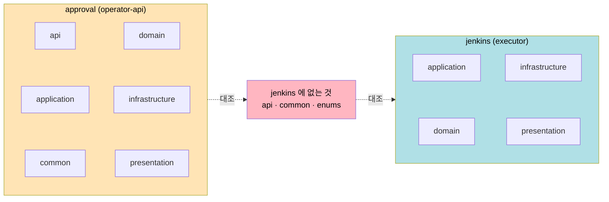

# CH01 TPS jenkins 적용 진단
---
> approval 진단([01-02](01-02.CH01_TPS-approval_%EC%A0%81%EC%9A%A9_%EC%A7%84%EB%8B%A8.md))과 같은 1장 잣대를 jenkins 모듈에 적용합니다. 두 모듈을 나란히 두면 1장 §"의도를 드러내는 아키텍처" 의 *일관성* 이 한 모듈만으로는 보이지 않던 각도로 드러나기 때문에, 별도 파일로 분리했습니다.

## 1. 진단 대상 범위

> approval 과 같은 1장 잣대를 적용하되, 두 모듈 비교에서만 보이는 *일관성* 축을 하나 더 추가합니다.

진단 대상은 `executor/engine/src/main/java/org/okestro/tps/jenkins` 패키지입니다. approval 과 동일하게 1장의 진단 축을 *구조의 결정* 과 *지식의 공유* 두 면에 한정합니다.

| 진단 축 | 책 절 | 진단 대상 |
|--------|------|---------|
| 구조의 결정 | §"정의" | `jenkins/` 패키지 구조 |
| 지식의 공유 | §"정의" | package-info.java, README, ADR |
| 의도 드러내기 | §"의도를 드러내는 아키텍처" | 패키지·인터페이스 이름의 추론 가능성 |
| 일관성 | §"의도를 드러내는 아키텍처" | approval 과 jenkins 사이 컨벤션 정합 |

의존성 규칙(5장), 디스패치·동시성 설계(별도 운영 주제), 유스케이스 인터페이스 적정성(6장)은 1장 범위 밖이므로 제외합니다. 마지막 축 *일관성* 은 approval 진단에는 없던 축인데, 같은 저장소의 두 모듈을 비교할 때만 의미가 생기므로 jenkins 진단에서 추가했습니다.


## 2. 현 상태 스냅샷 (read-only)

> 코드 변경 없이 `find`·`ls` 만으로 확인한 결과입니다. 비교를 위해 approval 열을 함께 둡니다.

| 산출물 | jenkins | approval | 메모 |
|--------|---------|----------|------|
| 1계 패키지 | application, domain, infrastructure, presentation (4) | api, application, common, domain, infrastructure, presentation (6) | jenkins 에 `api`·`common` 없음 |
| domain 하위 | component, dto, event, exception, model, port, vo (7) | 동일 7개 + `enums` (8) | jenkins 에 `enums` 없음 |
| port in/out | in 5 / out 12 | in 6 / out 18 | 둘 다 `domain/port/in,out` 분리 유지 |
| `package-info.java` | 0건 | 0건 | 두 모듈 모두 패키지 의도가 코드에 없음 |
| `README.md` (모듈 안) | 0건 | 0건 | 두 모듈 모두 진입점 문서 없음 |

port 이름은 도메인 어휘를 씁니다. `DispatchUseCase`·`BuildLifecycleUseCase` 같은 in 포트, `JenkinsCommandPort`·`ExecutionJobQueryPort`·`JobResultOutboxPort` 같은 out 포트가 그 예입니다. 구조의 의도는 분명하지만, approval 과 마찬가지로 그 의도가 코드 밖에는 남아 있지 않습니다.

스냅샷의 핵심은 두 모듈이 같은 헥사고날 골격을 공유하면서도 1계·domain 하위 패키지 구성이 다르다는 점입니다. jenkins 는 `api`·`common`·`enums` 를 두지 않습니다.

두 모듈의 1계 구조를 나란히 두면 차이가 한눈에 보입니다.



두 모듈 다 `domain/port/in,out` 골격은 같지만, 1계 패키지 가짓수가 다르고 그 차이의 *이유* 가 코드 안에 적혀 있지 않습니다. 이 자리가 §3·§4 의 *일관성* 진단 출발점입니다.


## 3. 책 개념과의 거리

> 거리는 두 갈래로 나뉩니다. *approval 과 공유하는 결함* 과 *두 모듈 비교에서만 보이는 jenkins 고유 거리* 입니다.

jenkins 의 거리는 두 갈래로 나뉩니다. 하나는 approval 과 공유하는 결함이고, 다른 하나는 두 모듈을 비교할 때만 보이는 jenkins 고유의 거리입니다.

공통 결함은 지식 공유 면의 공백입니다. jenkins 도 package-info 0건, README 0건이라, 1장이 정의한 아키텍처의 절반(지식 공유)이 approval 과 똑같이 비어 있습니다. 구조는 의도를 담지만 그 의도의 근거가 코드 옆에 없으므로, 1장의 *변경에 대한 용기* 가 서기 어렵습니다.

jenkins 고유의 거리는 일관성에서 나옵니다. 같은 저장소·같은 헥사고날 골격인데 jenkins 에는 `api`·`common`·`enums` 가 없습니다. 이 차이가 *의도된 축소* 인지(예: jenkins 는 외부 노출 API 가 없어 `api` 가 불필요), 아니면 두 모듈이 서로 다른 시점에 서로 다른 손으로 만들어진 흔적인지를 코드만으로는 가릴 수 없습니다. 1장 §"의도를 드러내는 아키텍처" 의 일관성 주장은, 임시방편이 쌓이면 시스템이 스파게티로 변질된다고 경고합니다. 모듈 간 컨벤션 차이 자체가 문제는 아니지만, 그 차이의 *이유가 어디에도 합의·기록되지 않은 상태* 가 1장이 경계하는 지점입니다.


## 4. 개선 후보와 영향 범위

> 후보 A·B 는 approval 과 같은 성격(코드 옆 산출물 추가)이고, 후보 C 는 jenkins 진단에서만 나오는 *모듈 간 컨벤션 합의 기록* 입니다.

후보는 세 개입니다. 앞의 두 후보(A·B)는 approval 진단과 같은 성격이고, 후보 C 는 jenkins 진단에서 새로 나온 일관성 후보입니다.

### 후보 A — `package-info.java` 도입

**의도**: jenkins 패키지의 의도를 코드 옆에 남깁니다. approval 후보 A 와 같은 취지이며, 두 모듈에 같은 양식으로 적용하면 그 자체가 일관성의 첫걸음이 됩니다.

영향 패키지·파일:

```
jenkins/domain/package-info.java                              (신규)
jenkins/domain/port/in/package-info.java                      (신규)
jenkins/domain/port/out/package-info.java                     (신규)
jenkins/domain/component/package-info.java                    (신규)
jenkins/application/package-info.java                         (신규)
jenkins/infrastructure/package-info.java                      (신규)
jenkins/presentation/package-info.java                        (신규)
```

난이도 **S** — 작성과 빌드만 필요하며 컴파일·테스트에 영향이 없습니다.

### 후보 B — `jenkins/README.md` 추가

**의도**: jenkins 모듈의 책임(빌드 디스패치·실행 수명주기·취소·복구)과 경계를 진입점에서 한 화면에 보여줍니다. 1장의 지식 공유와 협업 향상을 직접 실천합니다.

영향 파일:

```
executor/engine/src/main/java/org/okestro/tps/jenkins/README.md  (신규)
```

담을 항목은 모듈 책임 한 단락, 1계 패키지 4종 역할 표, 의존 방향 도식 1개, 핵심 진입점(`DispatchUseCase`·`BuildLifecycleUseCase`·`CancelUseCase`·`RecoveryUseCase`·`SubmitClaimUseCase`) cross-link입니다. 난이도 **S~M**.

### 후보 C — 모듈 간 패키지 컨벤션 합의 기록 (일관성)

**의도**: jenkins 에 `api`·`common`·`enums` 가 없는 것이 의도된 선택인지 우연인지를 한곳에 명시합니다. 1장 §"의도를 드러내는 아키텍처" 의 일관성 주장에 가장 직접 닿는 후보입니다.

영향 위치 후보:

```
operator/docs/architecture/module-dependencies.md  (기존 가이드에 절 추가)
또는 executor 측 동급 가이드 (없으면 신규)
```

이 후보는 코드가 아니라 *결정의 기록* 을 만드는 일이라, 두 모듈을 모두 보는 사람만 작성할 수 있습니다. 난이도 **M** — 작성 자체보다 "축소가 의도였는지" 를 사용자가 판단해야 하므로, 적용 결과(§5)에서 그 판단을 함께 적어주시면 좋습니다.

### 진단에서 후보로 올리지 않은 것

패키지 이름·구조를 approval 에 맞춰 강제 통일하는 일은 1장 범위를 넘습니다. 운영 안정성이 학습용 정렬보다 앞서므로, 통일이 아니라 *차이의 이유를 기록* 하는 후보 C 로 대신했습니다. ArchUnit 으로 두 모듈의 패키지 규칙을 검증하는 일은 5장 이후로 미룹니다.


## 5. 사용자 적용 결과

> ⏳ 다음 세션 전까지 사용자가 직접 시도한 뒤 채워주세요. 어시스턴트는 진단까지만 수행했고 코드를 수정하지 않았습니다.

### 적용한 항목

- [ ] 후보 A — package-info.java 도입
- [ ] 후보 B — jenkins/README.md 추가
- [ ] 후보 C — 모듈 간 컨벤션 합의 기록 (api·common·enums 축소가 의도였는지 판단 포함)
- [ ] 적용하지 않음 (이유: ___)

### 적용 diff 요약

```
(여기에 git diff --stat 또는 변경 파일 목록을 붙여주세요)
```

### 빌드·테스트 결과

| 항목 | 결과 |
|------|------|
| `./gradlew :engine:compileJava` | ___ |
| `./gradlew :engine:test` | ___ |
| Javadoc 빌드 (선택) | ___ |

### 적용하면서 부딪힌 것

(자유 서술)


## 6. 사용자 평가

> ⏳ "책 1장의 개념이 실제로 도움이 됐는가, 그리고 두 모듈을 나란히 본 것이 도움이 됐는가" 를 한 단락으로 직접 작성해 주세요. 어시스턴트는 채우지 않습니다.

(자유 서술 — 다음 세션 진입 전 작성)
