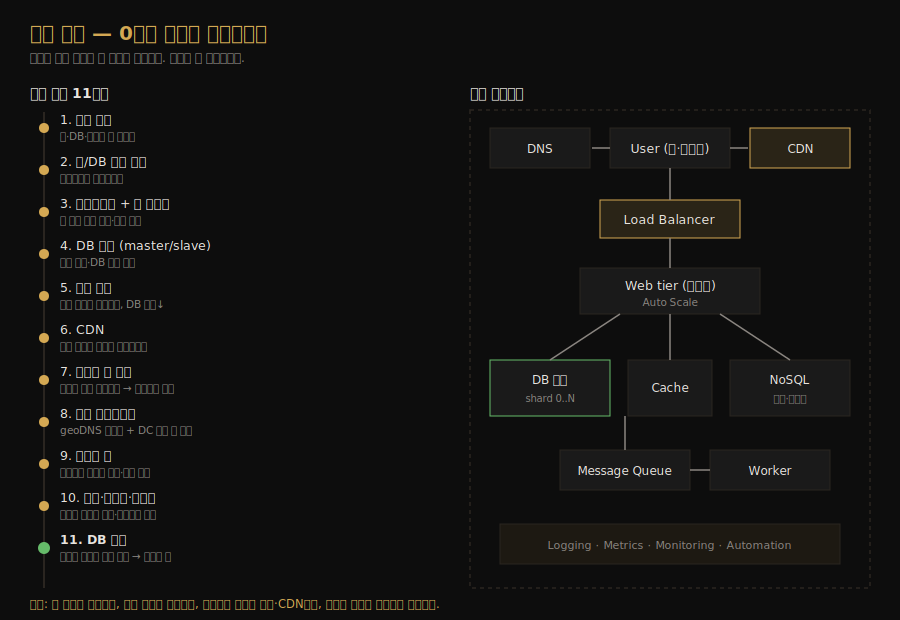
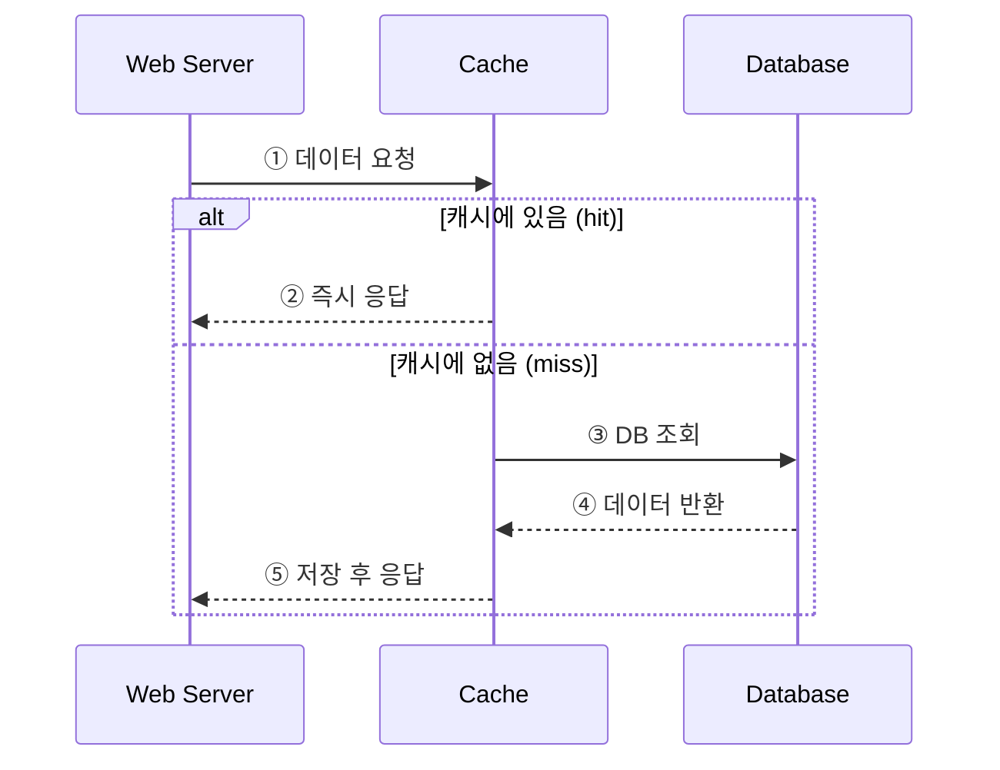
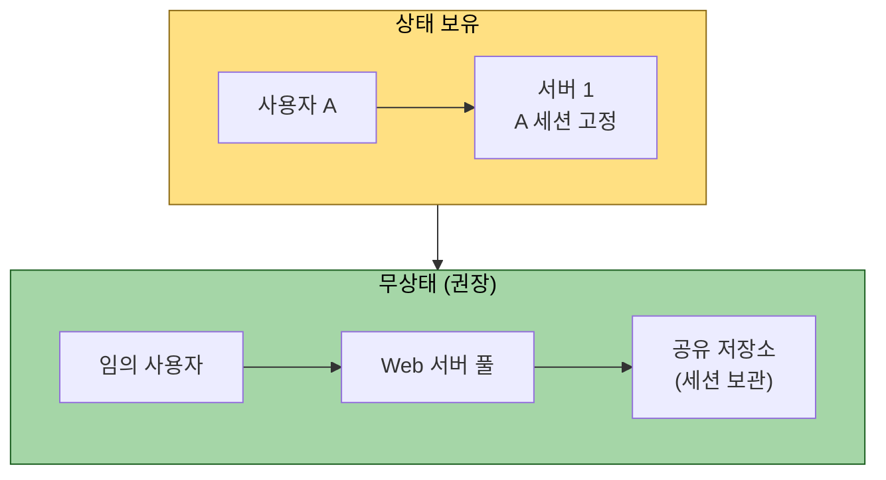
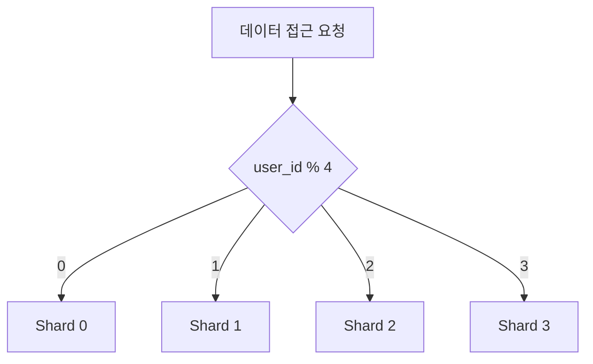

# 0부터 수백만 사용자까지 확장
---
> CH1 은 특정 시스템을 설계하지 않습니다. 단일 서버 한 대에서 시작해 병목이 생길 때마다 한 계층씩 덧붙여 수백만 사용자를 받는 시스템으로 키우는 *확장의 큰 그림*을 그립니다. 뒤따르는 모든 챕터가 여기서 배운 계층들을 도구로 씁니다.

## 핵심 요약

시스템 확장은 한 번에 완성되는 설계가 아니라 *반복적인 개선의 여정*입니다. 단일 서버 → 계층 분리 → 로드밸런서 → DB 복제 → 캐시 → CDN → 무상태 웹 계층 → 멀티 데이터센터 → 메시지 큐 → 관찰·자동화 → DB 샤딩의 순서로, 각 단계는 바로 앞 단계에서 드러난 병목을 푸는 답입니다. 그래서 이 순서 자체가 곧 우선순위이고, 면접에서도 이 흐름을 따라 설명하면 자연스럽습니다.

## 학습 목표

이 문서를 읽고 나면 다음을 할 수 있습니다.

1. 단일 서버에서 수백만 사용자 규모까지 시스템이 커지는 11단계를 순서대로 설명할 수 있습니다.
2. 각 단계가 *어떤 병목을 풀기 위해* 등장하는지 이유와 함께 말할 수 있습니다.
3. 무상태(stateless) 웹 계층이 왜 수평 확장의 전제 조건인지 설명할 수 있습니다.
4. DB 복제·캐시·CDN·샤딩이 각각 어떤 부하를 덜어주는지 구분할 수 있습니다.

## 본문 정리

### 1. 단일 서버에서 출발한다

모든 시스템은 웹 앱, 데이터베이스, 캐시가 한 서버에 올라간 단일 서버 구성에서 시작합니다. 사용자가 도메인 이름으로 접속하면 DNS 가 IP 주소를 돌려주고, 브라우저나 모바일 앱이 그 IP 로 HTTP 요청을 보내면 서버가 HTML 이나 JSON 으로 응답합니다. 트래픽은 보통 두 갈래에서 들어오는데, 하나는 서버사이드 언어와 클라이언트 언어를 함께 쓰는 웹 애플리케이션이고, 다른 하나는 HTTP·JSON 으로 통신하는 모바일 애플리케이션입니다.

이 구성은 단순해서 좋지만 서버 한 대가 모든 일을 떠안기 때문에 사용자가 늘면 가장 먼저 한계에 부딪힙니다. 그래서 다음 단계부터는 *책임을 나누고 이중화하는* 방향으로 나아갑니다.

### 2. 웹 계층과 데이터 계층을 분리한다

사용자가 늘면 서버 한 대로는 부족해지므로, 웹/모바일 트래픽을 받는 서버와 데이터를 보관하는 데이터베이스 서버를 분리합니다. 이렇게 나누면 웹 계층과 데이터 계층을 *서로 독립적으로* 확장할 수 있습니다. 웹 요청이 많으면 웹 서버만 늘리고, 데이터가 많으면 DB 만 키우면 됩니다.

데이터베이스는 관계형(RDBMS)과 비관계형(NoSQL) 중에 고릅니다. 대부분의 경우 40년 넘게 검증된 관계형이 무난하지만, 초저지연이 필요하거나 데이터가 비정형이거나 직렬화/역직렬화만 하면 되거나 데이터 양이 막대할 때는 NoSQL 이 더 맞습니다. 선택의 기준은 "관계형으로 풀리지 않는 구체적 사용 사례가 있는가"입니다.

### 3. 로드밸런서로 웹 계층을 다중화한다

웹 서버가 한 대면 그 서버가 죽을 때 사이트 전체가 멈추고, 동시 접속이 한계를 넘으면 응답이 느려집니다. 로드밸런서는 여러 웹 서버로 트래픽을 고르게 분배해 이 두 문제를 함께 해결합니다. 사용자는 로드밸런서의 공개 IP 로만 접속하고, 로드밸런서는 사설 IP 로 뒤쪽 웹 서버들과 통신하므로 보안도 좋아집니다.

서버 1번이 죽으면 트래픽이 2번으로 넘어가고, 트래픽이 폭증하면 서버 풀에 새 서버를 추가하기만 하면 로드밸런서가 알아서 분배를 시작합니다. 웹 계층의 가용성과 확장성이 한 번에 올라가는 셈입니다.

### 4. 데이터베이스를 복제한다

웹 계층을 이중화했으니 이제 데이터 계층 차례입니다. 데이터베이스 복제는 보통 master/slave 관계로 구성하는데, master 는 쓰기(insert·update·delete)를 담당하고 slave 는 master 의 복사본을 받아 읽기만 처리합니다. 대부분의 애플리케이션은 읽기가 쓰기보다 훨씬 많으므로, slave 를 master 보다 많이 두는 구성이 자연스럽습니다.

복제는 세 가지 이점을 줍니다. 읽기를 여러 slave 로 분산해 *성능*이 오르고, 데이터가 여러 곳에 복사돼 *신뢰성*이 높아지며, 한 DB 가 죽어도 다른 DB 로 서비스가 이어져 *가용성*이 좋아집니다. slave 가 죽으면 읽기를 다른 slave 나 master 로 돌리고, master 가 죽으면 slave 하나를 새 master 로 승격합니다. 실제 운영에서는 승격된 slave 의 데이터가 최신이 아닐 수 있어 복구 스크립트로 빠진 데이터를 채워야 하는 점이 까다롭습니다.

### 5. 캐시로 반복 읽기를 덜어낸다

페이지를 열 때마다 DB 를 반복 호출하면 성능이 크게 떨어집니다. 캐시는 비싼 응답이나 자주 읽는 데이터를 메모리에 잠시 저장해, 같은 요청을 DB 까지 가지 않고 빠르게 돌려주는 임시 저장 계층입니다. 웹 서버는 요청을 받으면 먼저 캐시를 확인하고, 있으면 바로 응답하고 없으면 DB 에서 읽어 캐시에 저장한 뒤 응답합니다. 이 전략을 read-through 캐시라고 부릅니다.

캐시를 쓸 때는 몇 가지를 신경 써야 합니다. 자주 읽고 드물게 바뀌는 데이터에 쓰고, 휘발성 메모리라 중요한 데이터는 영속 저장소에 따로 둡니다. 만료 정책(TTL)은 너무 짧으면 DB 재조회가 잦아지고 너무 길면 데이터가 낡으므로 균형이 필요합니다. 캐시 서버 한 대는 단일 장애점(SPOF)이 되므로 여러 데이터센터에 분산하고, 메모리가 가득 차면 LRU 같은 제거 정책으로 항목을 비웁니다.

### 6. CDN으로 정적 자산을 사용자 가까이에 둔다

CDN(Content Delivery Network)은 지리적으로 분산된 서버들로 이미지·비디오·CSS·JavaScript 같은 정적 콘텐츠를 전달합니다. 사용자와 *물리적으로 가까운* CDN 서버가 콘텐츠를 주므로 로딩이 빨라집니다. 샌프란시스코에 CDN 서버가 있다면 로스앤젤레스 사용자가 유럽 사용자보다 빠르게 받는 식입니다.

동작은 캐시와 비슷합니다. 사용자가 이미지를 요청했을 때 CDN 에 없으면 원본(origin)에서 가져와 저장하고 TTL 동안 그 캐시본을 돌려줍니다. CDN 은 외부 업체가 운영해 데이터 전송량에 따라 과금되므로, 잘 안 쓰이는 자산은 굳이 올리지 않습니다. 또 CDN 장애에 대비해 클라이언트가 원본에서 직접 받을 수 있어야 하고, 만료 전 파일을 바꾸려면 무효화 API 를 쓰거나 URL 에 버전(`image.png?v=2`)을 붙입니다.

### 7. 웹 계층을 무상태로 만든다

웹 계층을 수평으로 확장하려면 상태(예: 사용자 세션)를 웹 서버 밖으로 빼야 합니다. 상태를 서버가 들고 있으면(stateful) 같은 사용자의 요청이 *항상 같은 서버로* 가야 하는데, 이를 위해 sticky session 을 쓰면 부하가 한쪽으로 쏠리고 서버 추가·제거와 장애 대응이 어려워집니다.

세션을 관계형 DB 나 Redis, NoSQL 같은 *공유 저장소*에 두면 어느 웹 서버로 요청이 가도 동일한 상태를 읽을 수 있습니다. 상태가 빠진 웹 계층은 트래픽에 따라 서버를 자동으로 늘리고 줄이는 오토스케일링이 쉬워집니다. 무상태가 수평 확장의 전제 조건인 이유가 여기에 있습니다.

### 8. 멀티 데이터센터로 가용성과 지연을 개선한다

사용자가 여러 지역으로 퍼지면 데이터센터를 여러 곳에 둡니다. 평소에는 geoDNS 가 사용자를 *가장 가까운* 데이터센터로 보내 지연을 줄이고, 한 데이터센터가 통째로 죽으면 트래픽 전부를 살아 있는 쪽으로 우회시켜 가용성을 지킵니다. 큰 장애에도 서비스가 끊기지 않는 구조입니다.

멀티 데이터센터에는 세 가지 숙제가 따릅니다. 트래픽을 올바른 데이터센터로 보내는 라우팅(geoDNS), 지역마다 다른 DB·캐시를 일관되게 맞추는 데이터 동기화(보통 여러 DC 에 비동기 복제), 그리고 모든 위치에서 동일하게 동작하도록 보장하는 테스트·배포 자동화입니다.

### 9. 메시지 큐로 컴포넌트를 분리한다

시스템을 더 키우려면 컴포넌트들을 독립적으로 확장할 수 있게 *느슨하게* 묶어야 합니다. 메시지 큐는 비동기 통신을 지원하는 버퍼로, 생산자(producer)가 메시지를 큐에 넣고 소비자(consumer)가 꺼내 처리합니다. 생산자는 소비자가 바빠도 메시지를 넣을 수 있고, 소비자는 생산자가 없어도 큐에서 메시지를 읽을 수 있어 둘이 서로의 가용성에 묶이지 않습니다.

예를 들어 사진 보정처럼 시간이 걸리는 작업은 웹 서버가 큐에 작업을 넣고, 사진 처리 워커가 큐에서 꺼내 비동기로 처리합니다. 큐가 길어지면 워커를 늘리고 비어 있으면 줄이는 식으로, 생산자와 소비자를 따로 확장할 수 있습니다.

### 10. 로깅·메트릭·자동화를 갖춘다

서버 몇 대일 때는 로깅과 모니터링이 권장 사항이지만, 규모가 커지면 필수가 됩니다. 로깅은 에러를 찾는 출발점이라 중앙 서비스로 모아 검색·조회하게 만듭니다. 메트릭은 호스트 수준(CPU·메모리·디스크 I/O), 집계 수준(DB 계층·캐시 계층 성능), 비즈니스 수준(일일 활성 사용자·리텐션·매출)으로 나눠 시스템 건강과 사업 인사이트를 함께 봅니다. 자동화는 CI 로 코드 체크인을 검증하고 빌드·테스트·배포를 자동화해 생산성과 안정성을 끌어올립니다.

### 11. 데이터베이스를 샤딩한다

데이터가 매일 쌓이면 결국 데이터 계층이 병목입니다. 수직 확장(scale up)은 한 서버에 CPU·RAM·디스크를 더 붙이는 방식인데, 하드웨어 한계가 있고 단일 장애점 위험이 크며 고성능 서버일수록 비쌉니다. 그래서 대규모에서는 수평 확장, 즉 샤딩(sharding)으로 갑니다.

샤딩은 큰 데이터베이스를 같은 스키마를 공유하는 작은 조각(shard)들로 나눕니다. 데이터를 어느 샤드에 둘지는 샤딩 키(파티션 키)가 정하는데, 위 예처럼 `user_id % 4` 를 해시 함수로 쓰면 user_id 로 샤드를 찾습니다. 샤딩 키는 *데이터를 고르게 분산시키는* 키를 골라야 합니다. 다만 샤딩은 완벽한 해법이 아니어서 세 가지 새 문제를 낳습니다. 샤드가 가득 차면 데이터를 재분배해야 하고(resharding, 6장 consistent hashing 으로 완화), 특정 샤드에 인기 데이터가 몰리는 핫스팟(celebrity problem)이 생기며, 샤드 간 조인이 어려워 비정규화로 우회해야 합니다.

## 실무 적용 포인트

### 이런 순서로 접근하세요

- 트래픽이 적을 때는 단일 서버나 수직 확장으로 충분합니다. 과한 분산은 비용만 늘립니다.
- 웹 계층을 늘리기 전에 *무상태부터* 만듭니다. 상태가 남아 있으면 서버를 아무리 늘려도 sticky session 에 발목 잡힙니다.
- 읽기 부하는 복제(slave)와 캐시로, 정적 자산은 CDN 으로, 쓰기·저장 부하는 마지막에 샤딩으로 풉니다. 순서를 지키면 불필요한 복잡도를 피할 수 있습니다.

### 주의할 점

- ⚠️ 캐시·CDN·메시지 큐·샤딩은 각각 새로운 일관성·장애 처리 문제를 들여옵니다. "추가하면 좋아진다"가 아니라 "어떤 병목을 푸는 대신 무엇이 복잡해지는가"를 따져야 합니다.
- ⚠️ 샤딩은 한 번 적용하면 되돌리기 어렵습니다. 비정규화·핫스팟·재분배까지 감수할 준비가 됐을 때 마지막 카드로 씁니다.

## 면접 대비

### 한 줄 정의

시스템 확장이란 단일 서버에서 시작해 *병목이 드러날 때마다* 로드밸런서·복제·캐시·CDN·무상태화·멀티 DC·메시지 큐·샤딩을 차례로 더해 수백만 사용자를 감당하는 시스템으로 키우는 반복적 과정입니다.

### 핵심 포인트 3가지

1. **웹 계층은 무상태로**: 세션을 공유 저장소로 빼야 오토스케일링과 장애 대응이 쉬워집니다.
2. **모든 계층에 이중화를**: 웹은 로드밸런서, DB 는 복제, 캐시는 다중 데이터센터 분산으로 단일 장애점을 없앱니다.
3. **읽기는 캐시·CDN, 쓰기는 샤딩**: 부하의 성격에 맞는 도구를 골라야 합니다.

### 자주 묻는 질문

Q: 수직 확장과 수평 확장 중 무엇을 먼저 쓰나요?
A: 트래픽이 적으면 단순한 수직 확장이 낫습니다. 다만 하드웨어 한계와 단일 장애점, 높은 비용 때문에 대규모에서는 수평 확장(서버·샤드 추가)으로 가야 합니다.

Q: 캐시와 CDN 은 무엇이 다른가요?
A: 캐시는 *동적 데이터의 반복 읽기*를 메모리로 덜어내 DB 부하를 줄이고, CDN 은 *정적 자산*을 사용자와 가까운 위치에서 전달해 지연을 줄입니다. 푸는 부하의 종류가 다릅니다.

Q: 왜 무상태 웹 계층이 중요한가요?
A: 상태가 서버에 묶이면 같은 사용자의 요청을 같은 서버로 보내야 해서(sticky session) 부하가 쏠리고 서버 추가·제거가 어렵습니다. 상태를 공유 저장소로 빼면 어느 서버로 가도 동작하므로 자유롭게 확장할 수 있습니다.

## 핵심 개념 체크리스트

- [ ] 단일 서버에서 샤딩까지 11단계를 순서대로 말할 수 있는가?
- [ ] 각 단계가 어떤 병목을 푸는지 이유를 댈 수 있는가?
- [ ] master/slave 복제가 주는 세 가지 이점(성능·신뢰성·가용성)을 설명할 수 있는가?
- [ ] read-through 캐시의 동작과 TTL·SPOF·제거 정책 고려사항을 아는가?
- [ ] 무상태 웹 계층이 수평 확장의 전제인 이유를 설명할 수 있는가?
- [ ] 샤딩이 들여오는 세 가지 문제(재분배·핫스팟·조인)를 아는가?

## 참고 자료

- 연관 서적: Alex Xu, 『System Design Interview — An Insider's Guide』(Vol 1) CH1
- 연관 문서: [복제](../../05_data/theory/02-03.복제.md) · [샤딩](../../05_data/theory/02-04.샤딩.md) · [분산 아키텍처 기초](../03_distributed/01-01.분산 아키텍처 기초.md)
