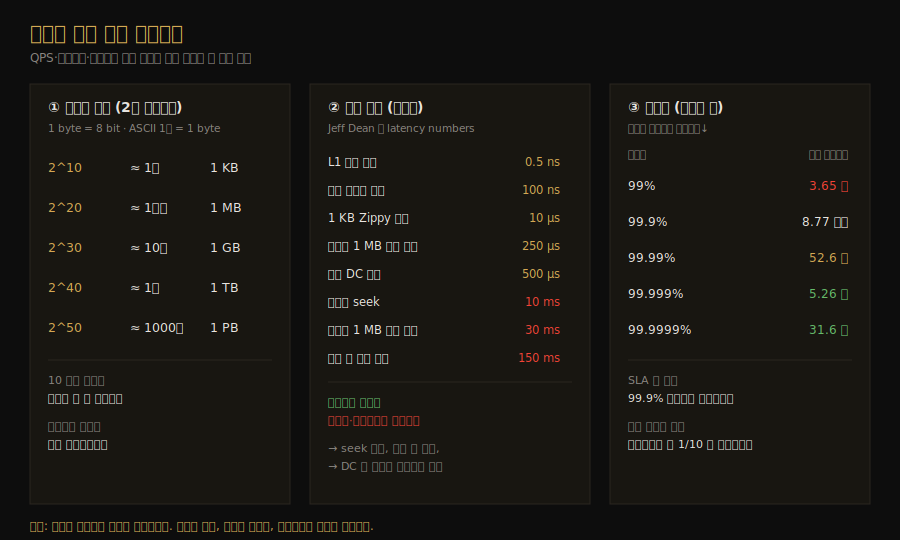

# 개략적 규모 추정
---
> CH2 는 설계의 규모를 *수로 따지는 법*을 다룹니다. QPS, 스토리지, 가용성을 어림셈으로 빠르게 추정하는 기술인데, 정밀한 계산보다 합리적인 가정과 깔끔한 과정이 핵심입니다. CH1 의 큰 그림 위에서 "이 시스템이 초당 몇 건을 받고 몇 PB 를 저장하는가"를 답할 수 있게 됩니다.


## 핵심 요약

개략적 규모 추정(back-of-the-envelope estimation)은 사고 실험과 흔한 성능 수치를 조합해 설계가 요구사항을 감당할지 가늠하는 기술입니다. Google 의 Jeff Dean 이 말한 것처럼 정확한 답이 아니라 *느낌을 잡는* 도구이므로, 면접관도 정밀도가 아니라 문제 해결 과정을 봅니다. 이를 잘하려면 2의 거듭제곱(데이터 단위), latency numbers(연산별 지연), 가용성 수치(나인의 수) 세 가지를 머릿속에 넣고 있어야 합니다.




## 학습 목표

이 문서를 읽고 나면 다음을 할 수 있습니다.

1. 2의 거듭제곱으로 데이터 단위(KB~PB)를 환산해 스토리지를 추정할 수 있습니다.
2. 주요 연산의 지연 시간을 비교해 "메모리는 빠르고 디스크·네트워크는 느리다"는 결론을 끌어낼 수 있습니다.
3. 가용성 퍼센트(나인의 수)와 연간 다운타임의 대응 관계를 설명할 수 있습니다.
4. DAU 에서 QPS·peak QPS·스토리지를 단계적으로 추정하는 절차를 실행할 수 있습니다.


## 본문 정리

### 1. 2의 거듭제곱으로 데이터 단위를 잡는다

분산 시스템의 데이터 양은 막대해지지만 계산은 결국 기본으로 돌아갑니다. 1 byte 는 8 bit 이고 ASCII 한 글자가 1 byte 를 쓴다는 사실에서 출발해, 데이터 단위는 2의 거듭제곱으로 환산합니다. 지수가 10 오를 때마다 단위가 한 칸씩 커지는 규칙만 외우면 됩니다.

| 거듭제곱 | 근삿값 | 단위 |
|----------|--------|------|
| 2^10 | 1천 | 1 KB |
| 2^20 | 1백만 | 1 MB |
| 2^30 | 10억 | 1 GB |
| 2^40 | 1조 | 1 TB |
| 2^50 | 1000조 | 1 PB |

이 표가 스토리지 추정의 뼈대입니다. "사용자 1억 명 × 평균 1 MB" 같은 계산에서 결과가 어느 단위에 떨어지는지 바로 가늠할 수 있어야 추정이 빨라집니다.

### 2. 지연 시간(latency numbers)을 기억한다

Google 의 Dr. Dean 이 정리한 연산별 지연 시간은 2010년 수치라 일부는 낡았지만, *연산 사이의 상대적 빠르기*를 잡는 데는 여전히 유용합니다. 절대값을 외우기보다 "무엇이 무엇보다 몇 배 느린가"를 체감하는 게 목적입니다.

| 연산 | 지연 시간 |
|------|----------|
| L1 캐시 참조 | 0.5 ns |
| 메인 메모리 참조 | 100 ns |
| 1 KB Zippy 압축 | 10 µs |
| 메모리에서 1 MB 순차 읽기 | 250 µs |
| 같은 데이터센터 내 왕복 | 500 µs |
| 디스크 seek | 10 ms |
| 디스크에서 1 MB 순차 읽기 | 30 ms |
| 캘리포니아↔네덜란드 패킷 왕복 | 150 ms |

여기서 다섯 가지 결론이 나옵니다. 메모리는 빠르지만 디스크는 느리고, 그래서 가능하면 디스크 seek 를 피해야 합니다. 단순 압축 알고리즘은 빠르므로 인터넷 전송 전에 데이터를 압축하는 편이 낫고, 데이터센터는 보통 다른 지역에 있어 그 사이 통신에는 시간이 듭니다. 이 결론들은 캐시를 어디에 둘지, 데이터를 어떻게 옮길지 같은 설계 판단의 근거가 됩니다.

### 3. 가용성을 나인의 수로 표현한다

가용성(availability)은 시스템이 얼마나 오래 끊김 없이 동작하는지를 퍼센트로 나타냅니다. 100% 는 다운타임이 0인 상태이고, 대부분의 서비스는 99%~100% 사이에 있습니다. SLA(서비스 수준 협약)는 제공자가 고객에게 약속하는 가동 시간인데, Amazon·Google·Microsoft 같은 클라우드 제공자는 보통 99.9% 이상으로 잡습니다. 가용성은 흔히 "나인의 수"로 부르며 나인이 많을수록 좋습니다.

| 가용성 | 연간 다운타임 |
|--------|--------------|
| 99% | 3.65 일 |
| 99.9% | 8.77 시간 |
| 99.99% | 52.6 분 |
| 99.999% | 5.26 분 |
| 99.9999% | 31.6 초 |

나인이 하나 늘 때마다 허용 다운타임이 약 10분의 1로 줄어듭니다. 99% 와 99.99% 는 한눈에 비슷해 보이지만 연간 다운타임은 3.65일과 52.6분으로 완전히 다른 수준입니다. 그래서 "가용성 99.99%를 보장한다"는 말은 연간 1시간도 멈추면 안 된다는 뜻으로, 설계 난이도가 크게 올라갑니다.

### 4. 예제 — Twitter QPS와 스토리지 추정

추정의 실제 흐름은 가정을 먼저 적고, 그 위에서 QPS 와 스토리지를 단계적으로 계산하는 것입니다. 아래 수치는 연습용 가정이며 실제 Twitter 수치는 아닙니다.

```text
[가정]
- 월간 활성 사용자(MAU)      = 3억 명
- 일일 사용 비율             = 50%
- 사용자당 트윗              = 하루 평균 2건
- 미디어 포함 트윗 비율       = 10%
- 데이터 보관 기간           = 5년

[QPS 추정]
DAU      = 3억 × 50%                    = 1.5억 명
트윗 QPS = 1.5억 × 2 ÷ 24시간 ÷ 3600초  ≈ 3500
peak QPS = 2 × QPS                      ≈ 7000

[스토리지 추정 — 미디어만]
평균 트윗 크기: tweet_id 64 byte + text 140 byte + media 1 MB
일일 미디어  = 1.5억 × 2 × 10% × 1 MB    = 30 TB/일
5년 미디어   = 30 TB × 365 × 5           ≈ 55 PB
```

이 절차의 핵심은 *가정 → DAU → QPS → peak QPS → 스토리지* 순으로 한 칸씩 밟아가는 것입니다. peak QPS 를 평균의 2배로 잡는 것처럼 어림수를 쓰고, 매 단계에서 단위를 명확히 붙여 나중에 참조할 수 있게 합니다. 면접관은 7000이라는 정확한 숫자보다 이 흐름이 합리적인지를 봅니다.

### 5. 추정을 잘하는 팁

추정은 결과가 아니라 과정이 중요합니다. 복잡한 계산은 반올림과 근사로 단순화합니다. 예를 들어 `99987 / 9.1` 은 면접 중에 정확히 풀 필요 없이 `100000 / 10` 으로 바꿔 빠르게 답합니다. 가정은 적어두어 나중에 참조하고, 숫자에는 단위를 붙여 "5"가 5 KB 인지 5 MB 인지 모호하지 않게 합니다. 자주 나오는 추정 대상은 QPS·peak QPS·스토리지·캐시·서버 수이므로, 면접 준비 때 이 계산들을 미리 연습해두면 좋습니다.


## 실무 적용 포인트

### 이런 상황에서 사용하세요

- 새 기능의 용량을 가늠할 때 — DAU 와 사용자당 행동 수에서 QPS·스토리지를 빠르게 추정해 인프라 규모를 잡습니다.
- 캐시·DB 용량 산정 — "하루 30 TB, 5년 55 PB" 같은 추정으로 스토리지 비용과 샤딩 시점을 미리 판단합니다.
- 가용성 목표 합의 — 99.9% 와 99.99% 의 차이(연 8.77시간 vs 52.6분)를 수로 보여주면 비현실적 SLA 요구를 조정할 수 있습니다.

### 주의할 점

- ⚠️ latency numbers 는 2010년 기준이라 절대값은 낡았습니다. 상대적 빠르기를 잡는 용도로만 쓰고, 정확한 벤치마크가 필요하면 실측합니다.
- ⚠️ peak QPS 를 평균의 2배로 잡는 건 어디까지나 어림수입니다. 트래픽이 시간대에 크게 몰리는 서비스는 더 큰 배수를 가정해야 합니다.


## 면접 대비

### 한 줄 정의

개략적 규모 추정이란 사고 실험과 흔한 성능 수치(거듭제곱·지연 시간·가용성)를 조합해 설계가 요구 규모를 감당할지 *어림셈으로* 가늠하는 기술입니다.

### 핵심 포인트 3가지

1. **단위는 2의 거듭제곱으로**: 지수 10마다 KB→MB→GB→TB→PB 한 칸씩 커집니다.
2. **메모리는 빠르고 디스크·네트워크는 느리다**: seek 회피·전송 전 압축·DC 간 통신 비용 계산의 근거입니다.
3. **나인 하나당 다운타임 1/10**: 99% 는 연 3.65일, 99.99% 는 연 52.6분으로 차원이 다릅니다.

### 자주 묻는 질문

Q: DAU 에서 QPS 는 어떻게 구하나요?
A: DAU 에 사용자당 행동 수를 곱한 일일 총량을, 하루 초(24×3600)로 나눕니다. peak QPS 는 보통 평균 QPS 의 2배 정도로 잡습니다.

Q: 99.9% 와 99.99% 는 실제로 얼마나 차이 나나요?
A: 연간 다운타임이 8.77시간과 52.6분으로 약 10배 차이입니다. 나인이 하나 늘면 허용 다운타임이 대략 1/10 로 줄어듭니다.

Q: 추정에서 정확한 계산이 안 떠오르면 어떻게 하나요?
A: 정밀도는 기대되지 않으므로 반올림·근사로 단순화합니다. `99987/9.1` 은 `100000/10` 으로 바꿔 빠르게 답하고, 대신 가정과 단위를 명확히 적습니다.


## 핵심 개념 체크리스트

- [ ] 2의 거듭제곱 표(2^10~2^50 ↔ KB~PB)를 외워 스토리지를 환산할 수 있는가?
- [ ] 메모리·디스크·네트워크 지연의 상대적 빠르기와 다섯 가지 결론을 말할 수 있는가?
- [ ] 가용성 퍼센트와 연간 다운타임의 대응을 설명할 수 있는가?
- [ ] DAU → QPS → peak QPS → 스토리지 추정 절차를 단계별로 실행할 수 있는가?
- [ ] 반올림·가정 명시·단위 표기 세 가지 팁을 적용할 수 있는가?


## 참고 자료

- 연관 서적: Alex Xu, 『System Design Interview — An Insider's Guide』(Vol 1) CH2
- 연관 문서: [0부터 수백만 사용자까지 확장](01-01.0부터 수백만 사용자까지 확장.md) · [시스템 설계 면접 4단계 프레임워크](01-03.시스템 설계 면접 4단계 프레임워크.md)
