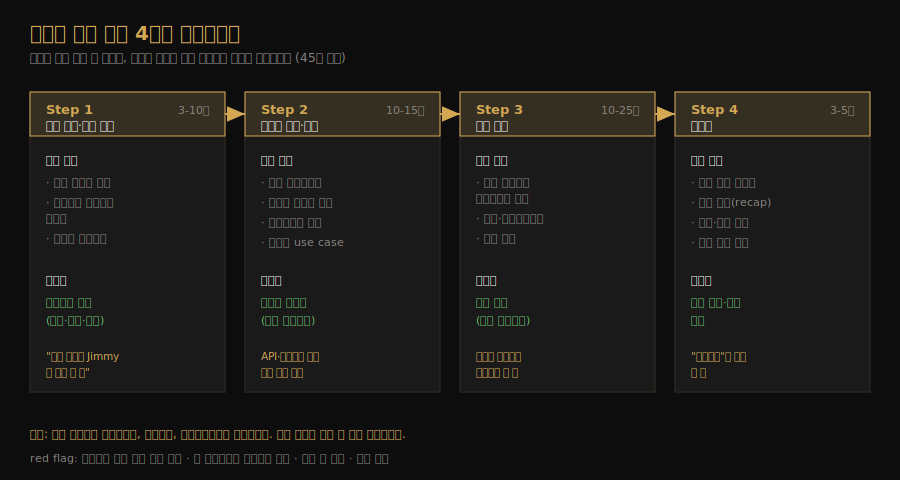
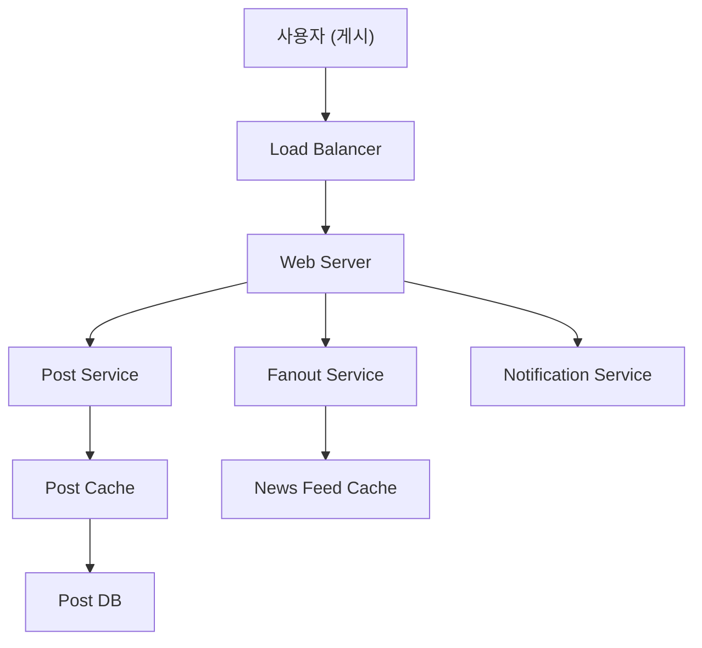
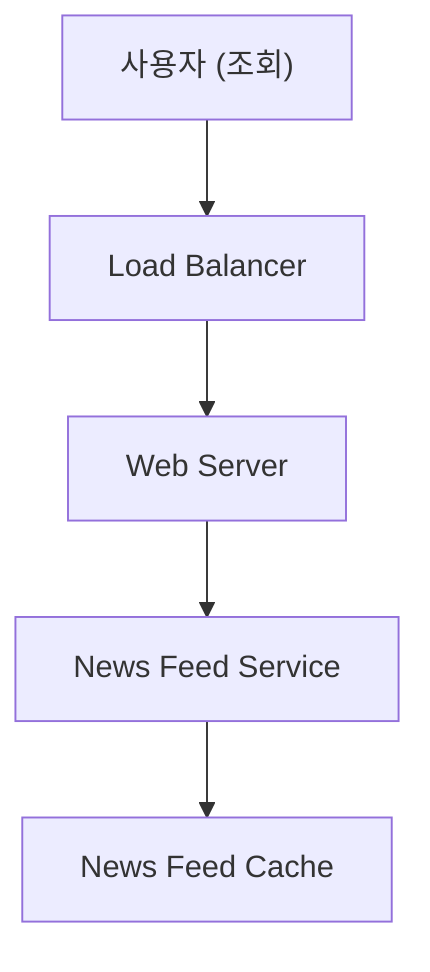

# 시스템 설계 면접 4단계 프레임워크
---
> CH3 은 시스템을 설계하는 법이 아니라 *면접이라는 상황을 푸는 절차*를 다룹니다. 모호하고 광범위한 문제 앞에서 정답을 빨리 내려고 서두르는 대신, 네 단계를 밟아 면접관과 함께 설계를 만들어가는 방법입니다. 앞선 CH1·CH2 가 이 절차 안에서 쓰는 재료가 됩니다.

## 핵심 요약

시스템 설계 면접은 정답을 맞히는 시험이 아니라, 두 동료가 모호한 문제를 함께 풀어가는 *협업 시뮬레이션*입니다. 면접관은 설계 실력만이 아니라 협업·압박 대응·모호함 해소 능력, 그리고 좋은 질문을 던지는 능력을 봅니다. 효과적으로 풀려면 ① 문제 이해와 범위 설정 ② 고수준 설계와 합의 ③ 심층 설계 ④ 마무리의 네 단계를 순서대로 밟습니다. 가장 큰 감점 요인은 트레이드오프를 무시한 과잉 설계(over-engineering)입니다.

## 학습 목표

이 문서를 읽고 나면 다음을 할 수 있습니다.

1. 시스템 설계 면접의 네 단계와 각 단계의 목표를 설명할 수 있습니다.
2. 각 단계에서 무엇을 하고 무엇을 피해야 하는지 구분할 수 있습니다.
3. 45분 면접에서 단계별 시간을 어떻게 배분하는지 말할 수 있습니다.
4. 면접관이 보는 신호(좋은 질문·소통·트레이드오프 의식)와 red flag 를 알 수 있습니다.

## 본문 정리

### 0. 면접관은 무엇을 보는가

많은 사람이 시스템 설계 면접을 기술 설계 실력만 보는 자리로 오해합니다. 실제로는 협업 능력, 압박 속 문제 해결, 모호함을 건설적으로 푸는 능력에 대한 신호를 봅니다. 좋은 질문을 던지는 능력도 핵심이라, 많은 면접관이 이 점을 일부러 살핍니다.

반대로 감점되는 red flag 도 분명합니다. 가장 큰 것은 트레이드오프를 무시하고 설계 순수성에만 빠지는 과잉 설계입니다. 과잉 설계된 시스템이 치르는 비용을 모르는 엔지니어가 많고, 그 무지로 회사가 큰 대가를 치르기 때문입니다. 좁은 시야나 고집도 red flag 에 들어갑니다.

### 1. Step 1 — 문제를 이해하고 범위를 정한다 (3-10분)

가장 중요한 원칙은 *바로 답하지 않는 것*입니다. 책은 질문이 나오면 무조건 손부터 드는 "Jimmy" 가 되지 말라고 합니다. 충분히 이해하지 않고 답을 내놓는 건 큰 red flag 인데, 면접은 상식 퀴즈가 아니고 정답도 없기 때문입니다. 속도를 늦추고 깊이 생각하며 질문으로 요구사항과 가정을 명확히 하는 것이 이 단계의 전부입니다.

물어볼 질문은 요구사항을 정확히 파악하는 것들입니다. 어떤 기능을 만드는지, 사용자가 몇 명인지, 회사가 얼마나 빨리 확장할 계획인지, 기존 기술 스택에서 무엇을 활용할 수 있는지를 묻습니다. 면접관이 질문에 직접 답하지 않고 가정을 세우라고 하면, 그 가정을 적어둡니다. 나중에 필요해집니다.

예를 들어 뉴스 피드 시스템을 설계하라는 문제라면 이런 대화가 오갑니다. 모바일·웹 여부, 가장 중요한 기능(게시·친구 피드 보기), 정렬 방식(역시간순), 친구 수 상한(5000명), 트래픽 규모(DAU 1000만), 미디어 포함 여부를 차례로 확인하며 범위를 좁힙니다.

### 2. Step 2 — 고수준 설계를 제안하고 합의한다 (10-15분)

이 단계의 목표는 고수준 설계를 그리고 면접관과 합의에 이르는 것입니다. 면접관을 팀원처럼 대하며 함께 만들어갑니다. 클라이언트·API·웹 서버·데이터 저장소·캐시·CDN·메시지 큐 같은 주요 컴포넌트를 박스 다이어그램으로 그리고, 어림셈으로 이 청사진이 규모 제약을 만족하는지 검증합니다. 가능하면 구체적인 use case 를 몇 개 짚어보는데, 이 과정에서 미처 생각 못 한 엣지 케이스가 드러나기도 합니다.

뉴스 피드 예제에서는 설계를 두 흐름으로 나눕니다. 하나는 게시물을 올릴 때 캐시·DB 에 쓰고 친구 피드로 퍼뜨리는 *피드 발행(feed publishing)* 흐름이고, 다른 하나는 친구들의 게시물을 역시간순으로 모아 보여주는 *피드 조회(news feed retrieval)* 흐름입니다.

API 엔드포인트와 DB 스키마를 이 단계에 넣을지는 문제에 따라 다릅니다. "구글 검색 엔진 설계"처럼 큰 문제에는 너무 낮은 수준이라 부적절하지만, 멀티플레이어 포커 게임 백엔드처럼 구체적인 문제에는 적절합니다. 어느 쪽인지 면접관과 소통해 정합니다.

### 3. Step 3 — 심층 설계에 들어간다 (10-25분)

이 단계에 오면 전체 목표와 기능 범위에 합의했고, 고수준 청사진을 그렸으며, 면접관의 피드백을 받았고, 어디를 깊게 팔지 감을 잡은 상태입니다. 면접관과 함께 아키텍처에서 우선순위가 높은 컴포넌트를 골라 깊이 들어갑니다. 면접마다 초점이 달라서, 어떤 면접관은 고수준 설계를 좋아하고 어떤 면접관은 시니어 후보에게 성능 특성·병목·자원 추정을 묻습니다. 대개는 일부 컴포넌트의 디테일을 파고들기를 원합니다.

예를 들어 URL 단축기라면 긴 URL 을 짧게 바꾸는 해시 함수 설계가 흥미롭고, 채팅 시스템이라면 지연을 줄이는 법과 온라인·오프라인 상태를 지원하는 법이 좋은 주제입니다. 다만 시간 관리가 중요합니다. 능력을 보여주지 못하는 사소한 디테일에 매몰되기 쉬운데, 예컨대 페이스북 피드의 EdgeRank 알고리즘을 시시콜콜 설명하는 건 시간만 잡아먹고 확장 가능한 시스템 설계 능력을 증명하지 못합니다.

### 4. Step 4 — 마무리한다 (3-5분)

마지막 단계에서는 면접관이 후속 질문을 던지거나 추가 논의를 열어줍니다. 이때 좋은 방향이 몇 가지 있습니다. 시스템 병목을 짚고 개선안을 논의하되, "내 설계는 완벽하고 고칠 게 없다"고는 절대 말하지 않습니다. 개선할 점은 항상 있고, 이를 짚는 것이 비판적 사고를 보여줄 기회입니다. 여러 해법을 제시했다면 설계를 요약(recap)해 면접관의 기억을 되살리는 것도 도움이 됩니다.

장애 사례(서버 실패·네트워크 손실)나 운영 이슈(메트릭·에러 로그 모니터링, 롤아웃)도 좋은 이야깃거리입니다. 다음 확장 곡선을 다루는 것도 흥미로운데, 가령 지금 설계가 100만 사용자를 받는다면 1000만 명을 받으려면 무엇을 바꿔야 하는지 같은 질문입니다.

### 5. DO / DON'T

| DO | DON'T |
|----|-------|
| 항상 명확화 질문을 한다 (가정이 맞다고 단정 X) | 전형적 질문에 준비 없이 들어간다 |
| 요구사항을 이해한다 | 요구사항·가정 확인 없이 바로 해법으로 뛴다 |
| 여러 접근을 제시한다 | 초반부터 한 컴포넌트 디테일에 매몰된다 |
| 생각을 소리 내어 면접관과 소통한다 | 침묵 속에서 혼자 생각한다 |
| 합의 후 핵심 컴포넌트부터 깊이 들어간다 | 설계를 내놓으면 끝이라고 여긴다 |
| 막히면 힌트를 요청한다 | 포기한다 |

### 6. 시간 배분 (45분 기준)

면접 질문은 대개 광범위해서 45분~1시간으로 전체 설계를 다 다루기 어렵습니다. 그래서 시간 관리가 핵심입니다. 대략적인 배분은 Step 1 에 3-10분, Step 2 에 10-15분, Step 3 에 10-25분, Step 4 에 3-5분입니다. 이는 어디까지나 러프한 기준이고, 실제 배분은 문제 범위와 면접관의 요구에 따라 달라집니다.

## 실무 적용 포인트

### 이런 상황에서 사용하세요

- 시스템 설계 면접 준비 — 네 단계를 체크리스트로 삼아 어떤 문제든 같은 절차로 접근합니다.
- 실무 설계 회의 — 요구사항 명확화 → 고수준 합의 → 심층 설계 → 병목 점검 순서는 면접 밖에서도 그대로 통합니다.
- 설계 리뷰 — "어떤 트레이드오프를 택했는가"를 묻는 습관은 과잉 설계를 걸러냅니다.

### 주의할 점

- ⚠️ 시간 배분은 러프한 기준입니다. 면접관이 특정 단계를 길게 보고 싶어 하면 거기에 맞춥니다.
- ⚠️ 고수준 설계에 API·스키마를 넣을지는 문제 크기에 달렸습니다. 큰 문제(검색 엔진)에는 과한 디테일이니 면접관과 합의하고 정합니다.

## 면접 대비

### 한 줄 정의

시스템 설계 면접 프레임워크란 모호한 문제를 ① 이해·범위 설정 ② 고수준 설계·합의 ③ 심층 설계 ④ 마무리의 네 단계로 풀어, 정답이 아니라 *설계 과정과 협업*을 보여주는 절차입니다.

### 핵심 포인트 3가지

1. **바로 답하지 않는다**: 질문으로 요구사항을 명확히 하는 것이 1단계의 전부입니다.
2. **면접관과 합의하며 만든다**: 박스 다이어그램 → 피드백 → 어림셈 검증 순으로 청사진에 동의를 얻습니다.
3. **과잉 설계가 최대 감점**: 트레이드오프를 의식하고, 핵심 컴포넌트부터 우선순위로 깊이 들어갑니다.

### 자주 묻는 질문

Q: 가장 흔한 감점 요인은 무엇인가요?
A: 트레이드오프를 무시한 과잉 설계입니다. 그 외에 요구사항 확인 없이 바로 설계로 뛰는 것, 한 컴포넌트에 초반부터 매몰되는 것, 침묵 속에 혼자 생각하는 것도 red flag 입니다.

Q: 고수준 설계에 DB 스키마와 API 를 꼭 넣어야 하나요?
A: 문제 크기에 달렸습니다. "구글 검색 엔진"처럼 큰 문제에는 너무 낮은 수준이고, 구체적인 백엔드 문제에는 적절합니다. 면접관과 소통해 정합니다.

Q: 시간이 부족하면 어느 단계를 줄이나요?
A: 보통 Step 3(심층 설계)이 가장 유연합니다. 다만 Step 1(요구사항)을 건너뛰면 잘못된 시스템을 설계하게 되므로 줄이지 않습니다.

## 핵심 개념 체크리스트

- [ ] 네 단계와 각 단계의 목표를 순서대로 말할 수 있는가?
- [ ] Step 1 에서 "바로 답하지 않기"가 왜 중요한지 설명할 수 있는가?
- [ ] 고수준 설계에서 박스 다이어그램·피드백·어림셈 검증의 역할을 아는가?
- [ ] 과잉 설계가 왜 최대 감점 요인인지 말할 수 있는가?
- [ ] 45분 기준 단계별 시간 배분을 기억하는가?

## 참고 자료

- 연관 서적: Alex Xu, 『System Design Interview — An Insider's Guide』(Vol 1) CH3
- 연관 문서: [0부터 수백만 사용자까지 확장](01-01.0부터 수백만 사용자까지 확장.md) · [개략적 규모 추정](01-02.개략적 규모 추정.md)
