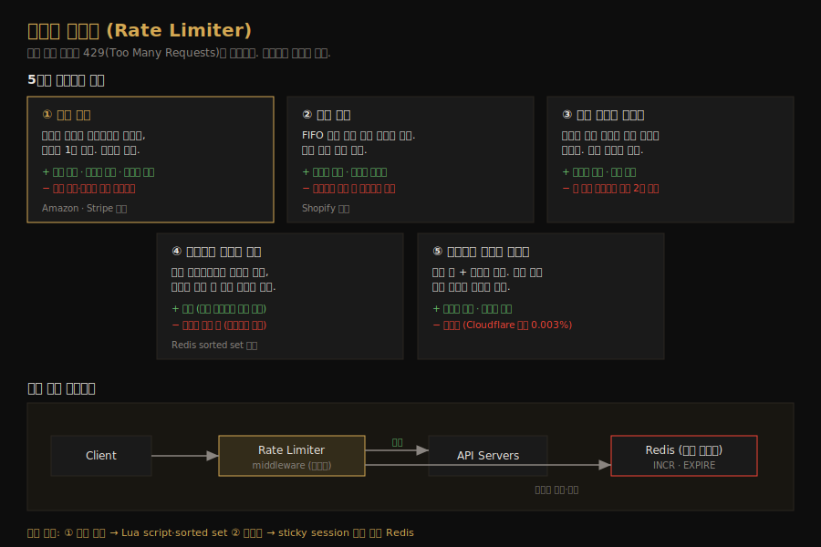

# 처리율 제한기 설계
---
> CH4 부터는 개별 시스템을 설계합니다. 처리율 제한기(rate limiter)는 클라이언트가 보내는 요청 속도를 제어해, 한도를 넘으면 추가 요청을 차단하는 컴포넌트입니다. 이 챕터의 핵심은 다섯 가지 제한 알고리즘의 트레이드오프와, 분산 환경에서 카운터를 어떻게 일관되게 다루는가입니다.

## 핵심 요약

처리율 제한기는 DoS 공격으로 인한 자원 고갈을 막고, 유료 외부 API 호출 비용을 줄이며, 봇·오용으로 인한 서버 과부하를 방지합니다. 설계의 중심에는 다섯 가지 알고리즘(토큰 버킷·누출 버킷·고정 윈도우 카운터·슬라이딩 윈도우 로그·슬라이딩 윈도우 카운터)이 있고, 각각 메모리·정확도·버스트 허용에서 트레이드오프가 다릅니다. 카운터는 디스크가 느려 Redis 같은 인메모리 저장소에 두며, 여러 제한기 서버를 쓰는 분산 환경에서는 경쟁 조건과 동기화가 핵심 난제입니다.

## 학습 목표

이 문서를 읽고 나면 다음을 할 수 있습니다.

1. 처리율 제한기를 두는 위치(클라이언트·서버·API 게이트웨이)와 그 트레이드오프를 설명할 수 있습니다.
2. 다섯 가지 제한 알고리즘의 동작과 장단점을 비교할 수 있습니다.
3. Redis 기반 고수준 아키텍처와 INCR·EXPIRE 의 역할을 설명할 수 있습니다.
4. 분산 환경의 경쟁 조건과 동기화 문제, 그리고 해법을 말할 수 있습니다.

## 본문 정리

### 1. 왜 필요한가 — 요구사항부터

처리율 제한기는 세 가지 이유로 씁니다. 의도적·비의도적 DoS 공격을 막아 자원 고갈을 방지하고, 초과 요청을 줄여 비용(특히 유료 외부 API 호출)을 아끼며, 봇이나 사용자 오용이 서버를 과부하시키는 것을 막습니다. 면접에서 합의해야 할 요구사항은 정확한 초과 제한, 낮은 지연, 적은 메모리, 분산 환경 지원, 명확한 예외 표시(429), 높은 결함 내성입니다.

여기서 결함 내성이 중요한데, 제한기에 문제가 생겨도(예: 캐시 서버 다운) 시스템 전체가 멈추면 안 됩니다. 제한기는 *보호 장치*이지 그 자체가 단일 장애점이 되어선 곤란합니다.

### 2. 어디에 둘 것인가

제한기는 클라이언트, 서버, 또는 그 사이의 미들웨어에 둘 수 있습니다. 클라이언트는 요청을 쉽게 위조할 수 있고 제어권이 없을 수 있어 신뢰할 수 없는 위치입니다. 서버사이드에 두면 알고리즘을 완전히 통제할 수 있습니다. 세 번째 선택지는 API 게이트웨이 같은 미들웨어인데, 한도를 넘은 요청에 429(Too Many Requests)를 돌려줍니다.

어디에 둘지는 절대적 정답이 없습니다. 현재 기술 스택, 엔지니어링 자원, 우선순위에 달렸습니다. 이미 마이크로서비스에 API 게이트웨이가 있고 거기서 인증·IP 화이트리스팅을 한다면 제한기도 게이트웨이에 얹는 게 자연스럽고, 제한기를 직접 만들 자원이 부족하면 상용 API 게이트웨이가 낫습니다.

### 3. 다섯 가지 알고리즘

#### 토큰 버킷 (Token Bucket)

미리 정한 용량의 버킷에 토큰을 주기적으로(리필률만큼) 채우고, 요청이 올 때마다 토큰 하나를 소비합니다. 토큰이 있으면 통과시키고 없으면 버립니다. 버킷 크기와 리필률 두 파라미터로 제어하며, 토큰이 남아 있는 한 짧은 버스트 트래픽을 허용하는 게 특징입니다. 구현이 쉽고 메모리 효율이 좋아 Amazon 과 Stripe 가 씁니다. 단점은 두 파라미터를 적절히 튜닝하기가 까다롭다는 점입니다.

#### 누출 버킷 (Leaking Bucket)

토큰 버킷과 비슷하지만 요청을 *고정 속도로* 처리합니다. 보통 FIFO 큐로 구현해, 요청이 오면 큐가 가득 찼는지 보고 여유가 있으면 넣고 없으면 버립니다. 큐에서 일정 간격으로 요청을 꺼내 처리합니다. 안정적인 처리율이 필요한 경우에 맞고 Shopify 가 씁니다. 단점은 버스트가 큐를 옛 요청으로 채우면 최신 요청이 제한될 수 있다는 점입니다.

#### 고정 윈도우 카운터 (Fixed Window Counter)

시간을 고정 크기 창으로 나누고 창마다 카운터를 둡니다. 요청이 올 때마다 카운터를 1 올리고, 임곗값에 도달하면 새 창이 시작될 때까지 거절합니다. 메모리 효율이 좋고 이해하기 쉽지만, *창 경계*에서 버스트가 몰리면 허용량의 2배가 통과할 수 있는 치명적 약점이 있습니다. 분당 5건 제한이라도 한 창의 끝과 다음 창의 시작에 각각 5건씩 몰리면 30초 사이에 10건이 지나갑니다.

#### 슬라이딩 윈도우 로그 (Sliding Window Log)

고정 윈도우의 경계 문제를 푸는 알고리즘입니다. 요청 타임스탬프를 로그(보통 Redis sorted set)에 보관하고, 새 요청이 오면 현재 창보다 오래된 타임스탬프를 모두 제거한 뒤 새 타임스탬프를 추가합니다. 로그 크기가 허용 개수 이하면 통과시킵니다. 어떤 롤링 윈도우에서도 한도를 넘지 않아 정확하지만, 거절된 요청의 타임스탬프도 저장될 수 있어 메모리를 많이 씁니다.

#### 슬라이딩 윈도우 카운터 (Sliding Window Counter)

고정 윈도우 카운터와 슬라이딩 윈도우 로그를 섞은 혼합 방식입니다. 현재 창의 요청 수에, 이전 창의 요청 수를 *겹친 비율*만큼 가중해 더해 현재 윈도우의 요청 수를 추정합니다. 예를 들어 분당 7건 제한에서 이전 창 5건·현재 창 3건이고 현재 창의 30% 위치라면 `3 + 5 × 70% = 6.5`로 계산해 통과시킵니다. 버스트를 매끄럽게 다루고 메모리 효율도 좋습니다. 이전 창이 고르게 분포한다고 가정하는 근사값이지만, Cloudflare 실험에서 4억 요청 중 0.003%만 잘못 처리될 만큼 실용적입니다.

### 4. 고수준 아키텍처 — Redis 카운터

알고리즘의 공통 핵심은 카운터입니다. 같은 사용자·IP 가 보낸 요청 수를 세고, 한도를 넘으면 막습니다. 카운터를 DB 에 두면 디스크 접근이 느려 부적합하므로, 빠르고 시간 기반 만료를 지원하는 인메모리 저장소를 씁니다. Redis 가 대표적인데, 카운터를 1 올리는 `INCR` 과 타임아웃을 걸어 자동 삭제하는 `EXPIRE` 두 명령을 제공합니다.

흐름은 단순합니다. 클라이언트 요청이 제한기 미들웨어로 가면, 미들웨어가 Redis 에서 해당 버킷의 카운터를 가져와 한도 도달 여부를 확인합니다. 도달하지 않았으면 요청을 API 서버로 보내고 카운터를 증가시켜 Redis 에 저장하며, 도달했으면 429 를 돌려줍니다. 규칙은 보통 설정 파일(예: Lyft 의 오픈소스 형식)로 디스크에 저장하고, 워커가 주기적으로 읽어 캐시에 올립니다.

클라이언트는 응답 헤더로 제한 상태를 압니다. `X-Ratelimit-Remaining`(남은 허용 요청 수), `X-Ratelimit-Limit`(창당 허용 호출 수), `X-Ratelimit-Retry-After`(재시도까지 대기 초)를 돌려주며, 한도 초과 시 429 와 함께 `Retry-After` 를 보냅니다.

### 5. 분산 환경의 두 난제

단일 서버 제한기는 어렵지 않지만, 여러 서버와 동시 스레드로 확장하면 두 문제가 생깁니다.

첫째는 경쟁 조건(race condition)입니다. "카운터 읽기 → 한도 확인 → 1 증가" 흐름에서 두 요청이 *값을 쓰기 전에 동시에* 카운터를 읽으면, 둘 다 같은 값을 읽고 각자 1만 올려 실제보다 작은 값을 씁니다. 카운터가 3일 때 동시 요청 둘이 모두 4로 만들지만 정답은 5인 식입니다. 락은 가장 단순한 해법이지만 시스템을 크게 느리게 하므로, 보통 Lua 스크립트나 Redis sorted set 으로 원자성을 확보합니다.

둘째는 동기화입니다. 제한기 서버가 여러 대면 서로 상태를 공유해야 합니다. 웹 계층이 무상태라 클라이언트 요청이 매번 다른 제한기로 갈 수 있는데, 제한기 1이 클라이언트 2의 데이터를 모르면 제대로 동작하지 않습니다. sticky session 으로 같은 제한기에 묶을 수도 있지만 확장성·유연성이 떨어집니다. 더 나은 방법은 Redis 같은 *중앙 집중식 저장소*를 두어 모든 제한기가 같은 카운터를 보게 하는 것입니다.

### 6. 성능 최적화와 모니터링

성능은 두 가지로 개선합니다. 멀티 데이터센터로 사용자와 가까운 엣지 서버에서 처리해 지연을 줄이고(Cloudflare 는 전 세계 수백 개 엣지 보유), 데이터는 최종 일관성(eventual consistency) 모델로 동기화합니다. 제한기를 운영한 뒤에는 알고리즘과 규칙이 효과적인지 분석 데이터를 모읍니다. 규칙이 너무 빡빡해 정상 요청이 버려지면 완화하고, 플래시 세일처럼 급증 트래픽에 무력해지면 버스트를 허용하는 토큰 버킷으로 알고리즘을 바꿉니다.

## 실무 적용 포인트

### 알고리즘 선택 기준

- 짧은 버스트를 허용하고 싶다 → **토큰 버킷** (남은 토큰만큼 순간 폭증 허용)
- 안정적인 고정 처리율이 필요하다 → **누출 버킷** (큐에서 일정 속도로 배출)
- 메모리가 빠듯하고 경계 문제를 감수할 수 있다 → **고정 윈도우 카운터**
- 정확도가 최우선이고 메모리 여유가 있다 → **슬라이딩 윈도우 로그**
- 버스트 완화와 메모리 효율을 동시에 원한다 → **슬라이딩 윈도우 카운터** (실무 기본값)

### 주의할 점

- ⚠️ 고정 윈도우 카운터는 창 경계 버스트로 한도의 2배가 통과합니다. 정확도가 중요하면 슬라이딩 계열을 씁니다.
- ⚠️ 분산 환경에서 락으로 경쟁 조건을 풀면 느려집니다. Lua 스크립트나 sorted set 으로 원자성을 확보합니다.
- ⚠️ 제한기 자체가 단일 장애점이 되면 안 됩니다. Redis 장애 시 요청을 무조건 막기보다 통과시키는(fail-open) 정책도 고려합니다.

## 면접 대비

### 한 줄 정의

처리율 제한기란 클라이언트의 요청 속도를 제어해 한도 초과 요청을 429 로 차단하는 컴포넌트로, DoS 방어·비용 절감·과부하 방지를 위해 씁니다.

### 핵심 포인트 3가지

1. **알고리즘은 트레이드오프**: 토큰 버킷(버스트 허용)·누출 버킷(안정 처리율)·고정 윈도우(경계 약점)·슬라이딩 로그(정확·고메모리)·슬라이딩 카운터(균형).
2. **카운터는 Redis 로**: 디스크는 느리므로 인메모리 + INCR·EXPIRE 로 카운터와 만료를 처리합니다.
3. **분산은 경쟁 조건·동기화**: 원자 연산(Lua·sorted set)과 중앙 저장소로 풉니다.

### 자주 묻는 질문

Q: 토큰 버킷과 누출 버킷의 차이는?
A: 토큰 버킷은 토큰이 남아 있으면 *버스트를 허용*하고, 누출 버킷은 FIFO 큐에서 *고정 속도로* 배출해 처리율이 일정합니다. 순간 폭증 허용 여부가 핵심 차이입니다.

Q: 고정 윈도우 카운터의 약점은?
A: 창 경계에 트래픽이 몰리면 허용량의 2배가 통과합니다. 분당 5건이라도 창 끝과 다음 창 시작에 5건씩 몰리면 30초에 10건이 지나갑니다. 슬라이딩 윈도우가 이를 해결합니다.

Q: 분산 환경에서 카운터 경쟁 조건은 어떻게 푸나요?
A: 락은 느리므로 Redis Lua 스크립트나 sorted set 으로 "읽기-확인-증가"를 원자적으로 처리합니다. 여러 제한기 서버는 중앙 Redis 로 카운터를 공유합니다.

## 핵심 개념 체크리스트

- [ ] 제한기를 두는 세 위치와 트레이드오프를 설명할 수 있는가?
- [ ] 다섯 알고리즘의 동작과 장단점을 비교할 수 있는가?
- [ ] 고정 윈도우 카운터의 경계 버스트 약점을 예로 들 수 있는가?
- [ ] Redis INCR·EXPIRE 가 고수준 아키텍처에서 하는 역할을 아는가?
- [ ] 분산 환경의 경쟁 조건·동기화 문제와 해법을 말할 수 있는가?

## 참고 자료

- 연관 서적: Alex Xu, 『System Design Interview — An Insider's Guide』(Vol 1) CH4
- 연관 문서: [시스템 설계 면접 4단계 프레임워크](01-03.시스템 설계 면접 4단계 프레임워크.md)
