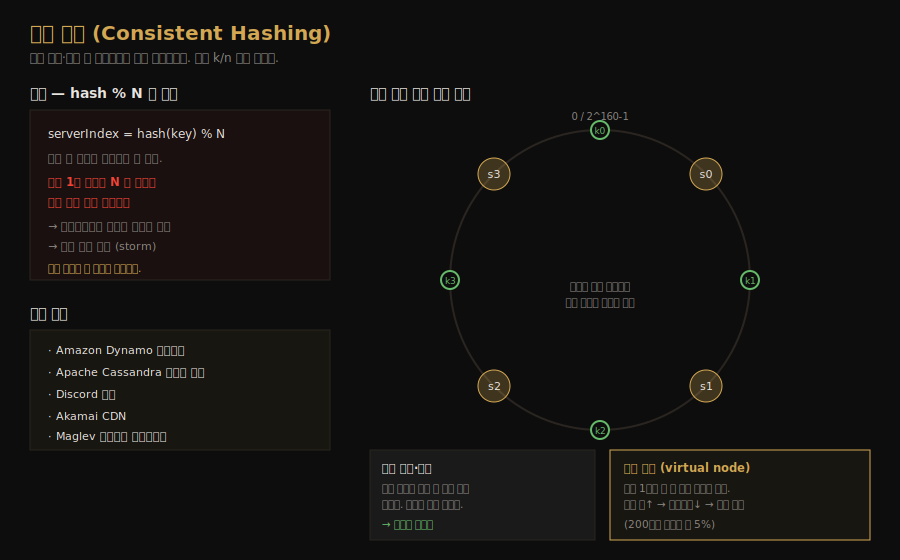

# 안정 해시 설계
---
> CH5 는 수평 확장에서 요청·데이터를 서버에 *고르게 그리고 안정적으로* 분배하는 안정 해시(consistent hashing)를 다룹니다. 핵심은 서버를 추가하거나 제거할 때 재배치되는 키를 최소화하는 것인데, 단순한 `hash % N` 이 왜 무너지는지부터 출발합니다.

## 핵심 요약

안정 해시는 해시 테이블 크기가 바뀔 때 평균적으로 `k/n` 개의 키만 재배치되는 특별한 해싱입니다(k 는 키 수, n 은 슬롯 수). 일반 해시(`hash % N`)는 서버 한 대만 추가·제거돼도 거의 모든 키가 재배치돼 캐시 미스 폭풍을 일으키는데, 안정 해시는 키와 서버를 하나의 해시 링 위에 올리고 키에서 시계 방향으로 가장 가까운 서버에 할당함으로써 이 문제를 풉니다. 분포가 한쪽으로 쏠리는 약점은 가상 노드(virtual node)로 보완합니다.

## 학습 목표

이 문서를 읽고 나면 다음을 할 수 있습니다.

1. `hash % N` 방식이 서버 변경 시 왜 캐시 미스 폭풍을 일으키는지 설명할 수 있습니다.
2. 해시 링 위에서 키를 서버에 할당하는 시계 방향 규칙을 설명할 수 있습니다.
3. 서버 추가·제거 시 영향받는 키 범위를 찾을 수 있습니다.
4. 가상 노드가 분포 균등화와 어떻게 연결되는지 말할 수 있습니다.

## 본문 정리

### 1. 재해싱 문제 — hash % N 의 한계

n 개의 캐시 서버에 부하를 분산하는 흔한 방법은 `serverIndex = hash(key) % N` 입니다. 서버 풀 크기가 고정이고 데이터가 고르면 잘 동작합니다. 문제는 서버를 추가하거나 기존 서버가 빠질 때입니다. 서버 한 대가 죽어 N 이 4에서 3으로 바뀌면, 같은 키의 해시값은 그대로지만 모듈러 연산 결과가 달라져 *거의 모든 키가 다른 서버로 재배치*됩니다.

이게 치명적인 이유는 캐시 환경에서 드러납니다. 키 대부분이 재배치되면 클라이언트가 엉뚱한 서버로 데이터를 조회하게 되고, 그 결과 대규모 캐시 미스가 한꺼번에 발생합니다. 빠진 서버가 들고 있던 키만 옮겨가야 정상인데, 무관한 키까지 전부 흔들리는 것입니다. 안정 해시는 바로 이 *불필요한 재배치*를 막습니다.

### 2. 해시 링과 시계 방향 탐색

안정 해시는 해시 함수 f 의 출력 공간(예: SHA-1 은 0 ~ 2^160-1)을 양 끝을 이어 붙여 하나의 원, 즉 해시 링으로 만듭니다. 서버는 IP 나 이름을 해시해 링 위 한 점에 올리고, 키도 같은 함수로 링 위에 올립니다. 여기서는 `hash % N` 같은 모듈러 연산을 쓰지 않는다는 점이 중요합니다.

키가 어느 서버에 저장되는지는 *시계 방향* 규칙으로 정합니다. 키 위치에서 링을 시계 방향으로 돌다가 처음 만나는 서버가 그 키의 담당입니다. 이렇게 하면 서버 풀 크기가 바뀌어도 대부분의 키는 같은 서버에 그대로 남습니다.

### 3. 서버 추가·제거 시 영향 범위

안정 해시의 핵심 이점은 서버를 추가하거나 제거할 때 *일부 키만* 재배치된다는 점입니다. 새 서버 s4 를 추가하면, 영향받는 키는 s4 위치에서 반시계 방향으로 돌다 만나는 직전 서버(s3) 사이 구간의 키뿐입니다. 그 구간 키만 s4 로 옮겨가고 나머지는 그대로입니다.

서버 제거도 대칭입니다. s1 이 빠지면 s1 위치에서 반시계 방향으로 직전 서버(s0) 사이 구간의 키만 시계 방향 다음 서버(s2)로 재배치됩니다. 어느 경우든 영향 범위가 인접 두 노드 사이로 한정되므로, `hash % N` 의 전면 재배치와 달리 캐시 미스 폭풍이 일어나지 않습니다.

### 4. 기본 방식의 두 가지 문제

MIT 의 Karger 등이 제안한 기본 안정 해시에는 두 약점이 있습니다. 첫째, 서버를 추가·제거할 수 있다는 점을 고려하면 모든 서버의 파티션(인접 서버 사이 해시 공간) 크기를 똑같이 유지하기가 불가능합니다. 어떤 서버는 아주 작은 구간을, 어떤 서버는 큰 구간을 맡게 됩니다. 한 서버가 빠지면 그 부담을 떠안는 서버의 파티션이 다른 서버의 2배가 되기도 합니다.

둘째, 키 분포가 링 위에서 균등하지 않을 수 있습니다. 서버들이 링의 한쪽에 몰려 배치되면 대부분의 키가 특정 서버 하나에 쏠리고, 나머지 서버는 데이터가 거의 없는 상황이 생깁니다. 두 문제 모두 데이터가 고르게 분산되지 못한다는 점에서 같은 뿌리를 갖습니다.

### 5. 가상 노드로 분포를 고르게

가상 노드(virtual node, 또는 replica)가 이 두 문제를 해결합니다. 가상 노드는 실제 서버를 가리키되, 서버 하나를 링 위 *여러 점*으로 표현하는 기법입니다. 예를 들어 server 0 을 s0_0, s0_1, s0_2 세 점으로, server 1 을 s1_0, s1_1, s1_2 세 점으로 올립니다. 각 서버가 링 위 여러 구간을 책임지게 되어, 한쪽으로 쏠리던 분포가 흩어집니다.

키가 어느 서버에 저장되는지는 동일하게 시계 방향으로 처음 만나는 *가상 노드*를 찾고, 그 가상 노드가 가리키는 실제 서버에 저장합니다. 가상 노드 수가 늘수록 키 분포의 표준편차가 작아져 분포가 균등해집니다. 한 실험에서 가상 노드 100~200개면 표준편차가 평균의 5%(200개)~10%(100개) 수준으로 줄었습니다. 다만 가상 노드 정보를 저장할 공간이 더 필요하므로, 노드 수는 시스템 요구에 맞춰 조정하는 트레이드오프입니다.

## 실무 적용 포인트

### 이런 곳에서 사용됩니다

- Amazon Dynamo 의 파티셔닝 컴포넌트 — 데이터를 노드에 안정적으로 분산합니다.
- Apache Cassandra 의 클러스터 데이터 분산 — 노드 변경 시 재배치를 최소화합니다.
- Discord 채팅, Akamai CDN, Maglev 네트워크 로드밸런서 등도 같은 원리를 씁니다.

### 주의할 점

- ⚠️ 기본 안정 해시는 분포 쏠림 문제가 있습니다. 가상 노드 없이 쓰면 특정 서버에 키가 몰릴 수 있습니다.
- ⚠️ 가상 노드 수는 분포 균등성과 메모리의 트레이드오프입니다. 많을수록 고르지만 저장 공간이 늘어납니다.
- ⚠️ 영향받는 키 범위를 찾을 때 추가는 새 노드에서 반시계로, 제거는 빠진 노드에서 반시계로 직전 서버까지입니다. 방향을 헷갈리지 않아야 합니다.

## 면접 대비

### 한 줄 정의

안정 해시란 서버 수가 바뀔 때 평균 `k/n` 개의 키만 재배치되도록, 키와 서버를 해시 링에 올리고 시계 방향으로 가장 가까운 서버에 키를 할당하는 기법입니다.

### 핵심 포인트 3가지

1. **hash % N 의 전면 재배치를 막는다**: 서버 변경 시 영향 범위를 인접 두 노드 사이로 한정해 캐시 미스 폭풍을 방지합니다.
2. **시계 방향 규칙**: 키에서 링을 시계 방향으로 돌아 처음 만나는 서버(또는 가상 노드)가 담당합니다.
3. **가상 노드로 균등화**: 서버 하나를 여러 점으로 올려 분포 쏠림을 해소하고, 노드 수로 균등성을 조절합니다.

### 자주 묻는 질문

Q: `hash % N` 은 왜 문제인가요?
A: 서버가 하나만 추가·제거돼도 N 이 바뀌어 거의 모든 키의 모듈러 결과가 달라집니다. 키 대부분이 재배치돼 클라이언트가 엉뚱한 서버를 조회하고, 대규모 캐시 미스가 발생합니다.

Q: 서버를 추가하면 어떤 키가 옮겨가나요?
A: 새 서버 위치에서 반시계 방향으로 직전 서버까지 구간의 키만 새 서버로 옮겨갑니다. 나머지 키는 그대로 남아 재배치가 최소화됩니다.

Q: 가상 노드는 왜 필요한가요?
A: 기본 안정 해시는 파티션 크기 불균형과 키 분포 쏠림 문제가 있습니다. 서버 하나를 링 위 여러 점으로 올리면 분포의 표준편차가 줄어 데이터가 고르게 퍼집니다.

## 핵심 개념 체크리스트

- [ ] `hash % N` 이 서버 변경 시 캐시 미스 폭풍을 일으키는 이유를 설명할 수 있는가?
- [ ] 해시 링과 시계 방향 키 할당 규칙을 말할 수 있는가?
- [ ] 서버 추가·제거 시 영향받는 키 범위를 찾을 수 있는가?
- [ ] 기본 안정 해시의 두 문제(파티션 불균형·분포 쏠림)를 아는가?
- [ ] 가상 노드가 분포 균등화와 어떻게 연결되는지 설명할 수 있는가?

## 참고 자료

- 연관 서적: Alex Xu, 『System Design Interview — An Insider's Guide』(Vol 1) CH5
- 연관 문서: [처리율 제한기 설계](02-01.처리율 제한기 설계.md) · [샤딩](../../05_data/theory/02-04.샤딩.md)
