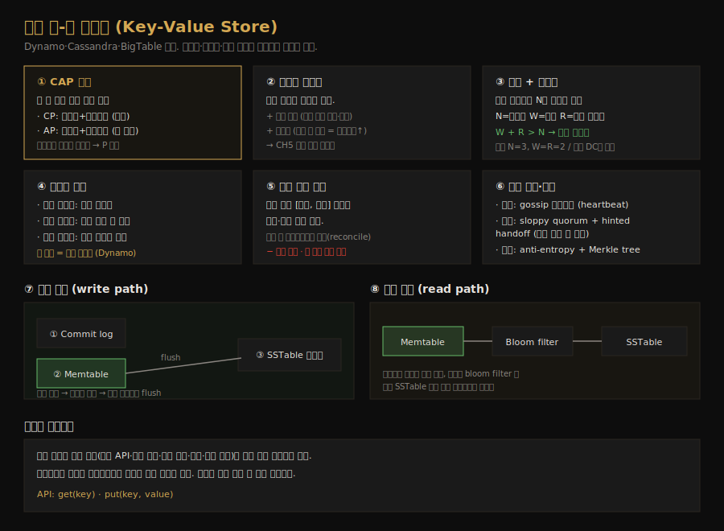
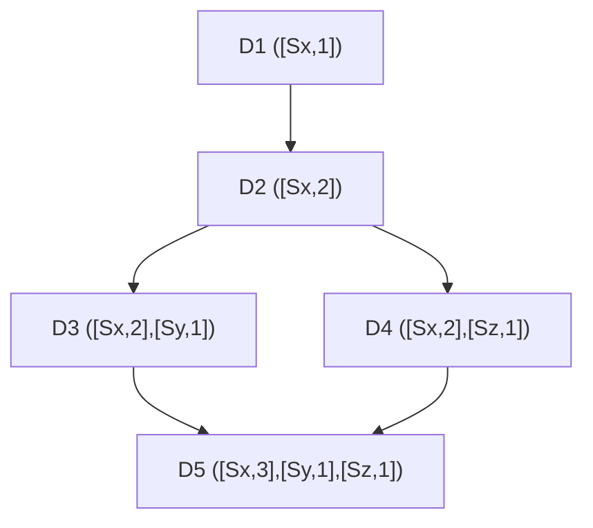
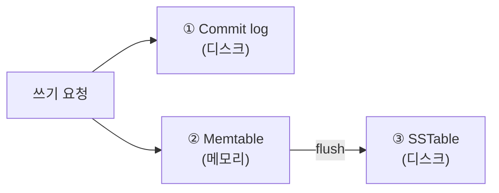

# 키-값 저장소 설계
---
> CH6 은 이 시리즈에서 가장 밀도가 높은 챕터입니다. 분산 키-값 저장소(분산 해시 테이블)를 처음부터 설계하면서 CAP 정리, 파티션, 복제와 정족수, 일관성 모델, 벡터 시계, 장애 감지와 복구, 그리고 쓰기·읽기 경로까지 분산 시스템의 핵심 도구를 한 번에 훑습니다. Dynamo·Cassandra·BigTable 의 설계가 바탕입니다.

## 핵심 요약

분산 키-값 저장소는 키-값 쌍을 여러 서버에 분산하는 시스템으로, 설계의 출발점은 CAP 정리입니다. 네트워크 분할이 불가피하므로 일관성(C)과 가용성(A) 중 하나를 골라야 하는데, 본 설계는 가용성을 택한 AP 시스템입니다. 데이터는 안정 해시로 파티션하고 N 개 서버에 복제하며, W·R·N 정족수로 일관성 수준을 조절합니다. 복제가 낳는 충돌은 벡터 시계로 해결하고, 장애는 gossip 으로 감지해 hinted handoff·Merkle tree 로 복구하며, 저장 엔진은 commit log·memtable·SSTable·bloom filter 로 구성합니다.

## 학습 목표

이 문서를 읽고 나면 다음을 할 수 있습니다.

1. CAP 정리로 CP·AP 시스템의 차이와 선택 기준을 설명할 수 있습니다.
2. N·W·R 정족수가 일관성·지연 트레이드오프와 어떻게 연결되는지 말할 수 있습니다.
3. 벡터 시계가 버전 충돌을 어떻게 감지·해결하는지 설명할 수 있습니다.
4. gossip·sloppy quorum·hinted handoff·Merkle tree 가 각각 어떤 장애를 다루는지 구분할 수 있습니다.
5. commit log·memtable·SSTable·bloom filter 로 이뤄진 쓰기·읽기 경로를 설명할 수 있습니다.

## 본문 정리

### 1. 요구사항과 CAP 정리

키-값 저장소의 요구사항은 작은 키-값 쌍(10 KB 미만) 저장, 대용량 데이터, 높은 가용성과 확장성, 자동 확장, 튜닝 가능한 일관성, 낮은 지연입니다. 완벽한 설계는 없고 읽기·쓰기·메모리 사이의 균형이 필요한데, 가장 근본적인 선택이 일관성과 가용성 사이의 트레이드오프입니다. 이것을 정리한 것이 CAP 정리입니다.

CAP 정리는 분산 시스템이 일관성(Consistency)·가용성(Availability)·분할 내성(Partition Tolerance) 셋 중 둘만 동시에 보장할 수 있다고 말합니다. 일관성은 어느 노드에 접속하든 같은 데이터를 본다는 뜻이고, 가용성은 일부 노드가 죽어도 요청에 응답한다는 뜻이며, 분할 내성은 네트워크 단절에도 시스템이 동작한다는 뜻입니다. 현실 분산 시스템에서 네트워크 분할은 피할 수 없으므로 P 는 필수이고, 결국 CP(일관성 우선, 예: 은행)와 AP(가용성 우선) 중 하나를 고릅니다. 분할이 생겼을 때 CP 는 일관성을 지키려 쓰기를 막아 시스템을 멈추고, AP 는 낡은 데이터를 감수하며 계속 읽기·쓰기를 받습니다.

### 2. 데이터 파티션

대규모 데이터는 한 서버에 담을 수 없으므로 작은 파티션으로 쪼개 여러 서버에 나눕니다. 이때 두 과제가 있습니다. 데이터를 서버에 *고르게* 분산하는 것과, 노드 추가·제거 시 *데이터 이동을 최소화*하는 것입니다. CH5 에서 본 안정 해시가 두 과제를 모두 풉니다. 서버를 해시 링에 올리고 키를 시계 방향으로 가장 가까운 서버에 저장합니다.

안정 해시 파티션은 두 가지 이점을 더 줍니다. 부하에 따라 서버를 자동으로 추가·제거하는 자동 확장이 가능하고, 서버 용량에 비례해 가상 노드 수를 배정하는 이질성(heterogeneity) 처리가 됩니다. 용량이 큰 서버에 가상 노드를 더 많이 두면 그만큼 더 많은 데이터를 맡습니다.

### 3. 복제와 정족수

가용성과 신뢰성을 위해 데이터를 N 개 서버에 비동기 복제합니다. 키를 해시 링에 올린 뒤 시계 방향으로 도는 첫 N 개의 *고유한* 서버에 복사본을 둡니다(가상 노드 때문에 물리 서버가 겹치지 않도록 고유 서버만 고릅니다). 같은 데이터센터의 노드는 정전·재해로 동시에 죽을 수 있으므로, 복제본은 서로 다른 데이터센터에 두고 고속망으로 연결합니다.

복제본이 여럿이면 동기화가 필요하고, 이를 정족수 합의(quorum consensus)로 보장합니다. N 은 복제 수, W 는 쓰기 정족수(쓰기가 성공으로 간주되려면 W 개 복제본의 확인 필요), R 은 읽기 정족수(읽기가 R 개 복제본의 응답 대기)입니다. W·R·N 은 지연과 일관성의 트레이드오프입니다. W=1 이나 R=1 이면 코디네이터가 아무 복제본 하나의 응답만 기다리면 되어 빠르고, W 나 R 이 1보다 크면 가장 느린 복제본을 기다려야 해 느리지만 일관성이 좋아집니다.

핵심 공식은 `W + R > N` 입니다. 이 조건이 성립하면 최신 데이터를 가진 노드가 읽기·쓰기 집합에 반드시 하나는 겹치므로 강한 일관성이 보장됩니다. 보통 N=3, W=R=2 로 잡습니다. R=1, W=N 이면 빠른 읽기에, W=1, R=N 이면 빠른 쓰기에 최적화됩니다. 요구에 맞춰 세 값을 조절합니다.

### 4. 일관성 모델과 버전 충돌 해결

일관성 모델은 데이터 일관성의 정도를 정합니다. 강한 일관성은 읽기가 항상 최신 쓰기 값을 돌려주고, 약한 일관성은 최신이 아닐 수 있으며, 최종 일관성은 약한 일관성의 한 형태로 시간이 충분히 지나면 모든 복제본이 같아집니다. 강한 일관성은 모든 복제본이 합의할 때까지 새 읽기·쓰기를 막아야 해서 고가용성 시스템에 부적합합니다. 그래서 Dynamo·Cassandra 처럼 본 설계도 최종 일관성을 택하고, 동시 쓰기로 생긴 불일치는 클라이언트가 읽어서 화해(reconcile)하게 합니다.

화해의 도구가 버전 관리와 벡터 시계입니다. 데이터 수정을 *새로운 불변 버전*으로 다루는데, 두 서버가 같은 원본을 동시에 다르게 고치면 v1·v2 충돌이 생깁니다. 벡터 시계는 데이터에 `[서버, 버전]` 쌍을 붙여 한 버전이 다른 버전의 조상인지, 후손인지, 충돌인지 판별합니다.

D3 와 D4 처럼 서로 다른 서버(Sy·Sz)가 D2 를 동시에 고치면 충돌입니다. 한 벡터 시계의 모든 카운터가 다른 쪽 이상이면 조상 관계(충돌 없음)이고, 어느 카운터라도 작으면 형제 관계(충돌)입니다. 클라이언트가 충돌을 감지해 화해한 결과가 D5 입니다. 벡터 시계에는 두 단점이 있습니다. 클라이언트에 충돌 해결 로직이 필요해 복잡해지고, `[서버:버전]` 쌍이 빠르게 늘 수 있어 길이 임곗값을 두고 오래된 쌍을 제거합니다(Dynamo 는 실제로 이 문제를 겪지 않았다고 보고).

### 5. 장애 감지와 처리

대규모 시스템에서 장애는 흔하므로 감지와 복구가 중요합니다. 한 서버가 다른 서버 하나의 말만 듣고 죽었다고 판단하면 안 되고, 보통 *둘 이상의 독립된 출처*가 동의해야 다운으로 표시합니다. 전체-대-전체 멀티캐스팅은 단순하지만 서버가 많으면 비효율적이라, 탈중앙 방식인 gossip 프로토콜을 씁니다.

gossip 은 각 노드가 멤버 목록(멤버 ID·heartbeat 카운터)을 유지하고, 주기적으로 자기 heartbeat 를 올린 뒤 무작위 노드들에 보내며, 받은 노드가 또 다른 노드들로 전파하는 방식입니다. 어떤 멤버의 heartbeat 가 정해진 기간 이상 안 오르면 오프라인으로 간주합니다. 한 노드가 특정 멤버의 정체를 감지하면 그 정보를 퍼뜨려 다른 노드들이 확인하고, 합의되면 다운으로 표시합니다.

장애 처리는 임시·영구로 나뉩니다. 임시 장애에는 엄격한 정족수 대신 *sloppy quorum* 을 씁니다. 링에서 정상인 첫 W 개(쓰기)·R 개(읽기) 서버를 골라 처리하고 죽은 서버는 건너뜁니다. 죽은 서버 대신 다른 서버가 임시로 요청을 처리하다가, 그 서버가 돌아오면 데이터를 돌려주는 것을 hinted handoff 라 합니다. 영구 장애에는 복제본을 동기화하는 anti-entropy 프로토콜을 쓰고, 불일치를 효율적으로 찾기 위해 Merkle tree 를 씁니다.

Merkle tree 는 잎이 데이터 해시이고 부모가 자식 해시의 해시인 트리입니다. 두 복제본의 트리를 비교할 때 루트 해시가 같으면 데이터가 동일하고, 다르면 자식 해시를 따라 내려가 *불일치한 버킷만* 찾아 그 부분만 동기화합니다. 덕분에 동기화 데이터량이 전체 데이터가 아니라 *차이*에 비례합니다. 실무에서는 버킷이 커서, 예컨대 10억 키에 100만 버킷이면 버킷당 1000개 키 정도입니다.

### 6. 시스템 아키텍처와 쓰기·읽기 경로

전체 아키텍처는 탈중앙입니다. 클라이언트는 `get(key)`·`put(key, value)` 단순 API 로 통신하고, 코디네이터 노드가 클라이언트와 저장소 사이 프록시 역할을 합니다. 노드는 안정 해시 링에 분산되고, 모든 노드가 같은 책임(클라 API·장애 감지·충돌 해결·복제·저장 엔진)을 가져 단일 장애점이 없습니다.

쓰기 경로는 Cassandra 기반입니다. 쓰기 요청이 오면 먼저 commit log 파일에 기록해 영속성을 확보하고, 메모리 캐시(memtable)에 데이터를 저장합니다. memtable 이 차거나 임곗값에 도달하면 디스크의 SSTable(정렬된 키-값 목록)로 flush 합니다.

읽기 경로는 먼저 memtable 을 확인해 데이터가 있으면 즉시 돌려줍니다. 없으면 디스크에서 읽어야 하는데, 어느 SSTable 에 키가 있는지 효율적으로 찾기 위해 bloom filter 를 씁니다. bloom filter 가 후보 SSTable 을 좁히면 거기서 데이터를 읽어 반환합니다.

## 실무 적용 포인트

### 설계 선택 기준

- 강한 일관성이 필수다(은행 잔액 등) → CP 시스템, `W + R > N` 정족수
- 가용성이 우선이다(대부분의 대규모 서비스) → AP 시스템, 최종 일관성 + 벡터 시계 화해
- 빠른 읽기가 중요하다 → R=1, W=N / 빠른 쓰기가 중요하다 → W=1, R=N

### 주의할 점

- ⚠️ 벡터 시계는 클라이언트에 충돌 해결 로직을 요구합니다. 화해를 클라가 못 하면 최종 일관성 모델이 무너집니다.
- ⚠️ 복제본은 서로 다른 데이터센터에 둡니다. 같은 DC 안에만 두면 정전·재해로 동시에 잃습니다.
- ⚠️ Merkle tree 의 버킷 크기는 트레이드오프입니다. 작으면 정밀하지만 트리가 커지고, 크면 동기화 단위가 거칠어집니다.

## 면접 대비

### 한 줄 정의

분산 키-값 저장소란 키-값 쌍을 안정 해시로 파티션해 N 개 서버에 복제하고, W·R·N 정족수로 일관성을 조절하며, 벡터 시계·gossip·Merkle tree 로 충돌과 장애를 다루는 분산 해시 테이블입니다.

### 핵심 포인트 3가지

1. **CAP 에서 AP 를 택한다**: 네트워크 분할은 불가피하므로 가용성을 위해 최종 일관성을 받아들입니다.
2. **W + R > N 이 강한 일관성**: 읽기·쓰기 정족수가 겹치면 최신값이 보장됩니다(보통 N=3, W=R=2).
3. **충돌은 벡터 시계, 장애는 계층별로**: gossip(감지) → sloppy quorum·hinted handoff(임시) → anti-entropy·Merkle tree(영구).

### 자주 묻는 질문

Q: `W + R > N` 이 왜 강한 일관성을 보장하나요?
A: 쓰기가 W 개, 읽기가 R 개 복제본에 닿는데 W+R 이 N 을 넘으면 두 집합이 반드시 하나 이상 겹칩니다. 그 겹치는 노드가 최신 데이터를 갖고 있어 읽기가 항상 최신값을 봅니다.

Q: 벡터 시계로 충돌을 어떻게 판별하나요?
A: 한 버전의 벡터 시계 카운터가 다른 버전의 모든 카운터 이상이면 조상 관계로 충돌이 없습니다. 어느 카운터라도 더 작으면 두 버전이 형제 관계, 즉 충돌입니다.

Q: hinted handoff 와 anti-entropy 의 차이는?
A: hinted handoff 는 *임시* 장애 대응으로, 죽은 서버 대신 다른 서버가 처리하다 복귀 시 데이터를 돌려줍니다. anti-entropy 는 *영구* 장애 대응으로, Merkle tree 로 복제본 간 차이를 찾아 동기화합니다.

Q: 읽기 경로에서 bloom filter 는 왜 쓰나요?
A: 메모리에 없는 키를 디스크에서 찾을 때, 여러 SSTable 을 다 뒤지면 느립니다. bloom filter 가 "이 SSTable 에 키가 있을 가능성"을 빠르게 알려줘 탐색 대상을 좁힙니다.

## 핵심 개념 체크리스트

- [ ] CAP 정리로 CP·AP 의 차이와 선택 기준을 설명할 수 있는가?
- [ ] `W + R > N` 이 강한 일관성을 보장하는 이유를 아는가?
- [ ] 벡터 시계로 조상·형제(충돌) 관계를 판별할 수 있는가?
- [ ] gossip·sloppy quorum·hinted handoff·Merkle tree 가 각각 다루는 장애를 구분하는가?
- [ ] commit log·memtable·SSTable·bloom filter 의 쓰기·읽기 경로를 설명할 수 있는가?

## 참고 자료

- 연관 서적: Alex Xu, 『System Design Interview — An Insider's Guide』(Vol 1) CH6
- 연관 문서: [안정 해시 설계](02-02.안정 해시 설계.md) · [일관성과 합의](../../05_data/theory/02-06.일관성과 합의.md) · [복제](../../05_data/theory/02-03.복제.md)
