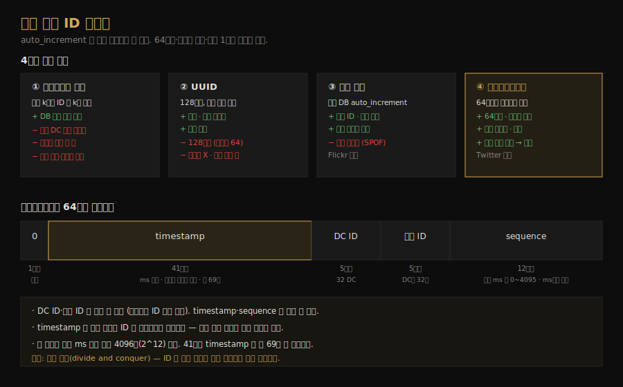

# 분산 유일 ID 생성기 설계
---
> CH7 은 분산 환경에서 유일한 ID 를 만드는 생성기를 설계합니다. 단일 DB 의 `auto_increment` 가 왜 분산에서 무너지는지부터, 네 가지 대안을 거쳐 트위터 스노우플레이크에 도달하는 과정을 따라갑니다. 64비트를 구획으로 나눠 조립하는 발상이 이 챕터의 핵심입니다.

## 핵심 요약

분산 시스템에서 유일 ID 를 만들려고 단일 DB 의 `auto_increment` 를 쓰면, 서버 한 대로는 처리량이 부족하고 여러 DB 사이에서 지연 없이 유일성을 보장하기 어렵습니다. 대안으로 멀티마스터 복제·UUID·티켓 서버·스노우플레이크 네 가지를 검토하는데, 64비트·시간순 정렬·초당 1만 개 이상이라는 요구를 모두 만족하는 것은 트위터 스노우플레이크입니다. 스노우플레이크는 64비트를 부호·타임스탬프·데이터센터 ID·머신 ID·시퀀스 번호로 나눠, 서버 간 조정 없이도 시간순으로 정렬되는 유일 ID 를 만듭니다.

## 학습 목표

이 문서를 읽고 나면 다음을 할 수 있습니다.

1. `auto_increment` 가 분산 환경에서 부적합한 이유를 설명할 수 있습니다.
2. 멀티마스터 복제·UUID·티켓 서버의 장단점을 비교할 수 있습니다.
3. 스노우플레이크 64비트 레이아웃의 각 구획 역할을 설명할 수 있습니다.
4. 타임스탬프가 상위 비트에 있어 ID 가 시간순으로 정렬되는 원리를 말할 수 있습니다.

## 본문 정리

### 1. 요구사항과 auto_increment 의 한계

문제를 받으면 먼저 요구사항을 명확히 합니다. ID 는 유일하고, 숫자 값이며, 64비트에 들어가고, 날짜순으로 정렬되며, 초당 1만 개 이상 생성할 수 있어야 합니다. "날짜순 정렬"은 저녁에 만든 ID 가 같은 날 아침에 만든 것보다 크다는 뜻으로, 단순히 1씩 증가하는 것과는 다릅니다.

가장 먼저 떠오르는 단일 DB 의 `auto_increment` 는 분산에서 통하지 않습니다. 서버 한 대로는 충분히 크지 않고, 여러 DB 에 걸쳐 지연을 최소화하면서 유일 ID 를 만드는 일이 까다롭기 때문입니다. 그래서 분산용 대안을 검토합니다.

### 2. 멀티마스터 복제

첫 접근은 멀티마스터 복제로, DB 의 `auto_increment` 를 쓰되 ID 를 1씩이 아니라 사용 중인 서버 수 k 만큼 증가시킵니다. 서버가 2대면 한쪽은 1, 3, 5…, 다른 쪽은 2, 4, 6…을 냅니다. ID 가 DB 수에 맞춰 확장된다는 점은 일부 확장성 문제를 풀어줍니다.

하지만 약점이 큽니다. 여러 데이터센터로 확장하기 어렵고, 여러 서버에 걸쳐 ID 가 시간순으로 증가하지 않으며, 서버를 추가하거나 제거할 때 잘 동작하지 않습니다. 시간순 정렬 요구를 만족하지 못하는 점이 특히 치명적입니다.

### 3. UUID

UUID 는 정보를 식별하는 데 쓰는 128비트 숫자로, 충돌 확률이 극히 낮습니다(초당 10억 개를 약 100년간 만들어야 단일 충돌 확률이 50%에 이를 정도). 각 웹 서버가 ID 생성기를 갖고 독립적으로 만들 수 있습니다. 서버 간 조정이 필요 없어 동기화 문제가 없고, 각 서버가 자기 ID 를 책임지므로 웹 서버와 함께 쉽게 확장됩니다.

단점은 요구사항과 어긋난다는 데 있습니다. ID 가 128비트라 64비트 요구를 넘고, 시간순으로 증가하지 않으며, 숫자가 아닐 수 있습니다(예: `09c93e62-50b4-468d-bf8a-c07e1040bfb2`). 단순하고 확장성은 좋지만 정렬과 길이 요구를 못 채웁니다.

### 4. 티켓 서버

티켓 서버는 Flickr 가 분산 기본 키 생성에 쓴 방식으로, 중앙 DB 서버 한 대의 `auto_increment` 를 *중앙집중식*으로 씁니다. 모든 웹 서버가 이 티켓 서버에서 ID 를 받아갑니다. 숫자 ID 를 얻을 수 있고 구현이 쉬워 중소 규모 애플리케이션에 적합합니다.

단점은 단일 장애점입니다. 티켓 서버가 죽으면 이를 의존하는 모든 시스템이 멈춥니다. 티켓 서버를 여러 대 두면 이 문제를 피할 수 있지만, 이번에는 서버 간 데이터 동기화라는 새 과제가 생깁니다.

### 5. 트위터 스노우플레이크

앞의 세 접근은 아이디어를 주지만 요구를 모두 만족하지는 못합니다. 트위터의 스노우플레이크가 모든 요구를 채웁니다. 핵심 발상은 *분할 정복*입니다. ID 를 직접 만들지 않고 64비트를 여러 구획으로 나눕니다.

| 구획 | 비트 | 역할 |
|------|------|------|
| 부호(sign) | 1 | 항상 0. 향후 부호 구분용 예약 |
| 타임스탬프 | 41 | epoch 이후 밀리초. 시간순 정렬의 핵심 |
| 데이터센터 ID | 5 | 2^5 = 32개 데이터센터 |
| 머신 ID | 5 | 데이터센터당 32대 머신 |
| 시퀀스 번호 | 12 | 같은 머신·같은 ms 안에서 0부터 증가, ms마다 리셋 |

데이터센터 ID 와 머신 ID 는 시작 시 정해져 보통 고정됩니다. 이 값을 실수로 바꾸면 ID 충돌이 날 수 있어 신중히 다룹니다. 반면 타임스탬프와 시퀀스 번호는 생성기가 돌면서 즉석에서 만들어집니다.

타임스탬프 41비트가 가장 중요합니다. 시간이 흐를수록 타임스탬프가 커지고, 이 값이 *상위 비트*에 있으므로 ID 전체가 시간순으로 정렬됩니다. 비트 배치만으로 "날짜순 정렬" 요구를 만족시키는 셈입니다. 41비트로 표현할 수 있는 최대 시간은 약 69년이라, 그 후에는 새 epoch 가 필요합니다. 시퀀스 번호 12비트는 2^12 = 4096 조합이라, 한 머신이 같은 밀리초 안에 최대 4096개의 ID 를 만들 수 있습니다.

## 실무 적용 포인트

### 접근 선택 기준

- 숫자 ID 가 필요하고 중소 규모다 → 티켓 서버(단, SPOF 감수)
- 서버 독립 생성과 단순함이 최우선이고 길이·정렬은 무관하다 → UUID
- 64비트·시간순 정렬·고처리량을 모두 원한다 → 스노우플레이크
- 비트 구획은 요구에 맞춰 조정합니다. 동시성이 낮으면 시퀀스 비트를 줄이고 타임스탬프 비트를 늘려 수명을 연장할 수 있습니다.

### 주의할 점

- ⚠️ 스노우플레이크는 서버 시계가 같다고 가정합니다. 한 서버의 여러 코어나 여러 머신에서 시계가 어긋나면 정렬이 깨지므로, NTP 같은 시계 동기화가 필요합니다.
- ⚠️ 데이터센터 ID·머신 ID 를 실행 중 바꾸면 ID 충돌 위험이 있습니다. 시작 시 고정하고 변경은 신중히 검토합니다.
- ⚠️ 41비트 타임스탬프는 약 69년 뒤 오버플로합니다. custom epoch 를 현재에 가깝게 잡아 수명을 확보합니다.

## 면접 대비

### 한 줄 정의

분산 유일 ID 생성기란 서버 간 조정 없이 64비트·숫자·시간순 정렬되는 유일 ID 를 만드는 시스템으로, 트위터 스노우플레이크는 64비트를 타임스탬프·데이터센터·머신·시퀀스 구획으로 나눠 이를 달성합니다.

### 핵심 포인트 3가지

1. **auto_increment 는 분산에서 안 된다**: 처리량 부족과 다중 DB 유일성 문제로 대안이 필요합니다.
2. **스노우플레이크는 분할 정복**: 64비트를 구획으로 나눠 조정 없이 유일성을 확보합니다.
3. **타임스탬프가 상위 비트라 시간순 정렬**: 비트 배치만으로 정렬 요구를 만족합니다.

### 자주 묻는 질문

Q: 왜 UUID 대신 스노우플레이크인가요?
A: UUID 는 128비트라 64비트 요구를 넘고, 시간순으로 증가하지 않으며 숫자가 아닐 수 있습니다. 스노우플레이크는 64비트·시간순 정렬·숫자 ID 를 모두 만족합니다.

Q: 스노우플레이크 ID 가 어떻게 시간순으로 정렬되나요?
A: 타임스탬프 41비트가 ID 의 상위 비트에 있어, 나중에 만든 ID 일수록 값이 큽니다. 그래서 ID 를 그대로 정렬하면 생성 시간순이 됩니다.

Q: 한 머신이 같은 밀리초에 ID 를 몇 개까지 만들 수 있나요?
A: 시퀀스 번호 12비트라 2^12 = 4096개입니다. 같은 ms 안에서 시퀀스를 증가시키고, 다음 ms 가 되면 0으로 리셋합니다.

## 핵심 개념 체크리스트

- [ ] `auto_increment` 가 분산 환경에서 부적합한 이유를 설명할 수 있는가?
- [ ] 멀티마스터·UUID·티켓 서버의 장단점을 비교할 수 있는가?
- [ ] 스노우플레이크 64비트 구획의 역할을 각각 말할 수 있는가?
- [ ] 타임스탬프 상위 비트가 시간순 정렬을 만드는 원리를 아는가?
- [ ] 시퀀스 12비트가 같은 ms 내 4096개 생성과 연결되는지 아는가?

## 참고 자료

- 연관 서적: Alex Xu, 『System Design Interview — An Insider's Guide』(Vol 1) CH7
- 연관 문서: [키-값 저장소 설계](02-03.키-값 저장소 설계.md) · [개략적 규모 추정](01-02.개략적 규모 추정.md)
