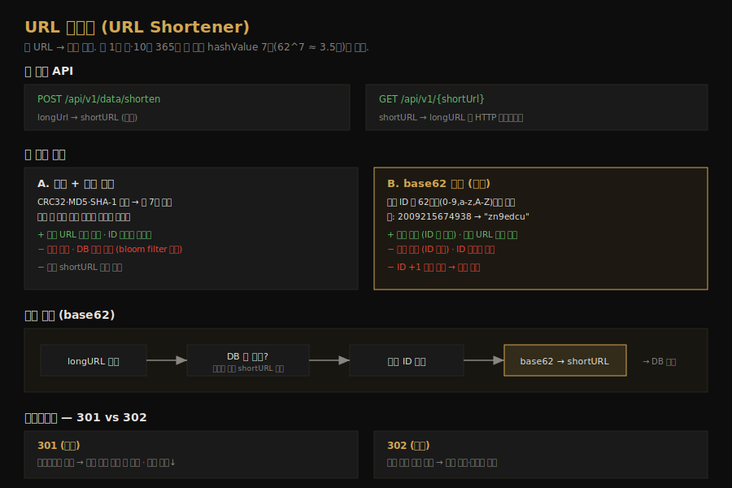

# URL 단축기 설계
---
> CH8 은 tinyurl 같은 URL 단축 서비스를 설계합니다. 긴 URL 을 짧은 별칭으로 바꾸고 다시 원래 URL 로 되돌리는 단순한 기능이지만, 짧은 키를 어떻게 만들지(해시 vs base62)와 리다이렉트를 어떻게 처리할지(301 vs 302)에서 흥미로운 트레이드오프가 드러납니다.

## 핵심 요약

URL 단축기는 긴 URL 을 짧은 별칭으로 바꾸고(shortening), 그 별칭으로 접속하면 원래 URL 로 되돌립니다(redirecting). 짧은 키 `hashValue` 는 62개 문자([0-9, a-z, A-Z])로 만드는데, 일 1억·10년 365억 건 기준 `62^7 ≈ 3.5조`라 7자면 충분합니다. 키를 만드는 방법은 해시+충돌 해결과 base62 변환 두 가지인데, base62 가 충돌이 없고 다음 키 계산이 쉬워 본 설계의 선택입니다. 리다이렉트는 서버 부하를 줄이는 301(영구)과 클릭 추적에 유리한 302(임시) 중에 고릅니다.

## 학습 목표

이 문서를 읽고 나면 다음을 할 수 있습니다.

1. URL 단축·리다이렉트의 두 API 와 흐름을 설명할 수 있습니다.
2. `hashValue` 길이를 base62 로 추정하는 계산을 할 수 있습니다.
3. 해시+충돌 해결과 base62 변환의 트레이드오프를 비교할 수 있습니다.
4. 301 과 302 리다이렉트의 차이와 선택 기준을 말할 수 있습니다.

## 본문 정리

### 1. 요구사항과 규모 추정

요구사항은 단축(긴 URL → 짧은 URL), 리다이렉트(짧은 URL → 원래 URL 로 이동), 그리고 고가용성·확장성·결함 내성입니다. 규모는 추정으로 잡습니다. 일 1억 건 쓰기면 초당 약 1160건이고, 읽기:쓰기 비율을 10:1 로 보면 초당 약 11,600건 읽기입니다. 10년 운영에 일 1억 건이면 `1억 × 365 × 10 = 3650억 건`의 레코드이고, 평균 URL 길이를 100바이트로 보면 10년 스토리지는 약 365 TB 입니다.

이 추정이 뒤따르는 설계 판단의 근거가 됩니다. 특히 3650억 건이라는 레코드 수가 짧은 키의 길이를 정하는 출발점입니다.

### 2. API 와 리다이렉트

URL 단축기는 두 개의 REST API 면 충분합니다. 단축은 `POST /api/v1/data/shorten` 으로 longUrl 을 받아 shortURL 을 돌려주고, 리다이렉트는 `GET /api/v1/{shortUrl}` 로 shortURL 을 받아 longURL 로 HTTP 리다이렉트합니다.

리다이렉트에는 301 과 302 중 선택이 있습니다. 301(영구 이동)은 브라우저가 응답을 캐시해, 같은 단축 URL 의 이후 요청은 단축 서버를 거치지 않고 곧장 원래 URL 서버로 갑니다. 302(임시 이동)는 이후 요청도 단축 서버를 먼저 거친 뒤 리다이렉트됩니다. 서버 부하를 줄이는 게 우선이면 301 이 낫고, 클릭률·출처 같은 분석이 중요하면 매번 서버를 거치는 302 가 낫습니다. 리다이렉트 구현은 `<shortURL, longURL>` 매핑을 해시 테이블에 두고 조회하는 방식이 직관적입니다.

### 3. hashValue 길이 — base62로 추정

`hashValue` 는 62개 문자([0-9, a-z, A-Z])로 이뤄집니다. 길이 n 을 정하려면 `62^n ≥ 3650억` 을 만족하는 가장 작은 n 을 찾습니다.

| n | 최대 URL 수 |
|---|------------|
| 6 | 62^6 ≈ 568억 |
| 7 | 62^7 ≈ 3.5조 |

n=6 은 568억으로 3650억에 못 미치고, n=7 은 약 3.5조로 충분히 넘습니다. 그래서 `hashValue` 길이는 7자로 정합니다. 추정으로 나온 레코드 수가 곧장 키 길이를 결정하는 셈입니다.

### 4. 두 해시 접근 비교

짧은 키를 만드는 방법은 두 가지입니다.

첫째는 *해시 + 충돌 해결* 입니다. CRC32·MD5·SHA-1 같은 해시 함수로 긴 URL 을 해싱한 뒤 앞 7자만 씁니다. 다만 앞 7자만 자르면 충돌이 생길 수 있어, 충돌 시 미리 정한 문자열을 덧붙여 다시 해싱하기를 충돌이 없어질 때까지 반복합니다. 매 요청마다 DB 에 해당 shortURL 이 있는지 조회하는 비용이 드는데, 이는 bloom filter 로 줄일 수 있습니다.

둘째는 *base62 변환* 입니다. 유일 ID 를 62진법으로 변환해 키를 만듭니다. 62진법은 0-9, a-z(10-35), A-Z(36-61)를 쓰는데, 예를 들어 십진수 11157 은 `2 × 62² + 55 × 62¹ + 59 × 62⁰`이라 `[2, 55, 59] → 2TX` 가 됩니다. ID 2009215674938 은 `zn9edcu` 로 변환됩니다.

| 비교 항목 | 해시 + 충돌 해결 | base62 변환 |
|----------|-----------------|-------------|
| 짧은 URL 길이 | 고정 | 가변(ID 에 따라) |
| 유일 ID 생성기 | 불필요 | 필요 |
| 충돌 | 가능, 해결 필요 | 불가능(ID 가 유일) |
| 다음 URL 예측 | 불가 | 가능(ID +1) → 보안 우려 |

base62 는 충돌이 원천적으로 없고 다음 키를 쉽게 계산할 수 있어 본 설계가 택합니다. 다만 ID 가 1씩 증가하면 다음 shortURL 을 예측할 수 있어 보안에 주의해야 합니다.

### 5. 단축 흐름과 상세 설계

base62 기반 단축 흐름은 다음과 같습니다. longURL 이 입력되면 DB 에 이미 있는지 확인하고, 있으면 기존 shortURL 을 그대로 돌려줍니다. 없으면 유일 ID 생성기로 새 ID(기본 키)를 만들고, 그 ID 를 base62 로 변환해 shortURL 을 얻은 뒤, ID·shortURL·longURL 을 DB 한 행에 저장합니다. 예를 들어 입력이 `https://en.wikipedia.org/wiki/Systems_design` 이고 ID 가 2009215674938 이면 shortURL 은 `zn9edcu` 가 됩니다.

데이터 모델은 고수준 설계의 해시 테이블 대신 관계형 DB 를 씁니다. 메모리는 비싸고 한정적이라, `id`·`shortURL`·`longURL` 세 컬럼을 가진 `url` 테이블에 매핑을 저장합니다.

리다이렉트 흐름은 읽기가 쓰기보다 많으므로 캐시를 활용합니다. 사용자가 단축 URL 을 클릭하면 로드밸런서가 요청을 웹 서버로 보내고, 웹 서버는 먼저 캐시에서 `<shortURL, longURL>` 매핑을 찾습니다. 캐시에 있으면 longURL 을 바로 돌려주고, 없으면 DB 에서 가져옵니다. DB 에도 없으면 잘못된 shortURL 일 가능성이 높습니다.

### 6. 추가 고려사항

마무리에서 짚을 점들이 있습니다. 악의적 사용자가 단축 요청을 대량으로 보내는 보안 문제는 처리율 제한기(CH4)로 IP 등 기준으로 거릅니다. 웹 계층이 무상태라 서버 추가·제거로 쉽게 확장하고, 데이터 계층은 복제·샤딩으로 확장합니다. 분석을 붙이면 링크 클릭 수·시점 같은 비즈니스 질문에 답할 수 있고, 가용성·일관성·신뢰성은 CH1 에서 본 기법으로 보강합니다.

## 실무 적용 포인트

### 설계 선택 기준

- 짧은 URL 길이를 고정하고 ID 생성기를 두고 싶지 않다 → 해시 + 충돌 해결
- 충돌을 원천 차단하고 다음 키 계산이 쉬워야 한다 → base62 변환(단, 예측 가능성 주의)
- 서버 부하를 줄이는 게 우선이다 → 301 리다이렉트 / 클릭 분석이 중요하다 → 302

### 주의할 점

- ⚠️ base62 변환은 ID 가 순차 증가하면 다음 shortURL 을 예측할 수 있습니다. 보안이 중요하면 ID 를 비순차로 만들거나 해시 방식을 검토합니다.
- ⚠️ 해시+충돌 해결은 매 요청 DB 조회 비용이 있습니다. bloom filter 로 "존재 여부"를 먼저 걸러 비용을 줄입니다.
- ⚠️ 리다이렉트에 301 을 쓰면 브라우저가 캐시해 클릭 추적이 어렵습니다. 분석이 필요하면 302 를 씁니다.

## 면접 대비

### 한 줄 정의

URL 단축기란 긴 URL 을 62개 문자로 된 짧은 키로 바꾸고 그 키로 원래 URL 에 리다이렉트하는 서비스로, 키 생성은 base62 변환, 리다이렉트는 301·302 중 선택으로 설계합니다.

### 핵심 포인트 3가지

1. **키 길이는 base62 로 추정**: `62^7 ≈ 3.5조 ≥ 365억`이라 7자면 충분합니다.
2. **base62 가 해시보다 충돌에 강하다**: 유일 ID 를 변환하므로 충돌이 없지만 다음 키 예측은 가능합니다.
3. **301 은 부하 절감, 302 는 분석 유리**: 캐시 여부가 클릭 추적 가능성을 가릅니다.

### 자주 묻는 질문

Q: 왜 hashValue 길이를 7자로 정하나요?
A: 문자가 62종이라 길이 n 의 조합은 `62^n` 입니다. 10년 365억 건을 담으려면 `62^7 ≈ 3.5조`가 필요한 7자가 가장 작은 충분한 길이입니다(62^6 ≈ 568억은 부족).

Q: 해시 방식과 base62 변환 중 무엇을 고르나요?
A: base62 가 충돌이 없고 다음 키 계산이 쉬워 흔히 택합니다. 다만 유일 ID 생성기가 필요하고 ID +1 예측이 가능합니다. 해시 방식은 길이가 고정이지만 충돌 해결과 DB 조회 비용이 듭니다.

Q: 301 과 302 리다이렉트는 어떻게 다른가요?
A: 301(영구)은 브라우저가 캐시해 이후 요청이 단축 서버를 안 거쳐 부하가 줄고, 302(임시)는 매번 단축 서버를 거쳐 클릭률·출처를 추적하기 좋습니다.

## 핵심 개념 체크리스트

- [ ] 단축·리다이렉트 두 API 와 흐름을 설명할 수 있는가?
- [ ] `62^n ≥ 레코드 수`로 키 길이를 추정할 수 있는가?
- [ ] 해시+충돌 해결과 base62 변환의 트레이드오프를 비교할 수 있는가?
- [ ] base62 변환 과정(십진수 → 62진법)을 예로 보일 수 있는가?
- [ ] 301·302 리다이렉트의 차이와 선택 기준을 아는가?

## 참고 자료

- 연관 서적: Alex Xu, 『System Design Interview — An Insider's Guide』(Vol 1) CH8
- 연관 문서: [분산 유일 ID 생성기 설계](02-04.분산 유일 ID 생성기 설계.md) · [개략적 규모 추정](01-02.개략적 규모 추정.md)
