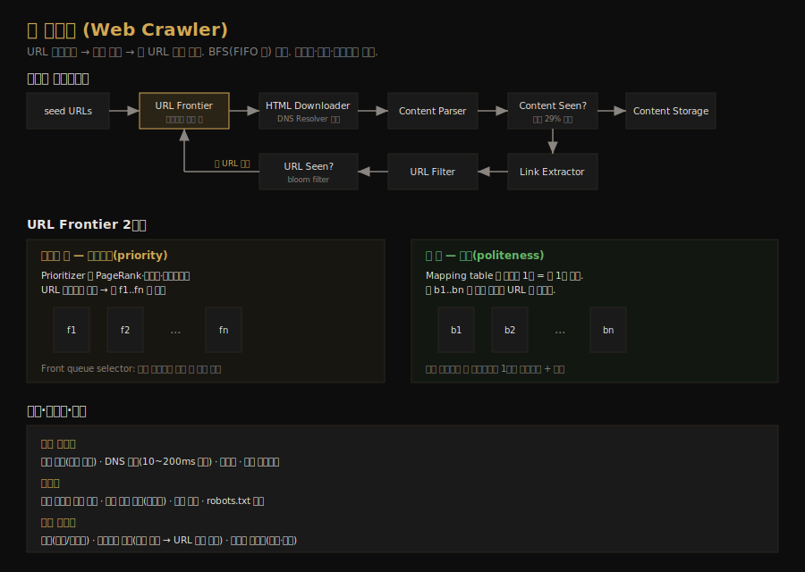

# 웹 크롤러 설계
---
> CH9 는 검색 엔진이 웹의 새 콘텐츠를 발견하는 데 쓰는 웹 크롤러를 설계합니다. "URL 다운로드 → 링크 추출 → 새 URL 추가"를 반복하는 단순한 알고리즘처럼 보이지만, 수십억 페이지 규모에서 예의(politeness)·우선순위·견고성을 지키려면 URL Frontier 라는 정교한 큐 구조가 필요합니다.

## 핵심 요약

웹 크롤러는 시드 URL 에서 출발해 페이지를 다운로드하고 거기서 링크를 추출해 다시 큐에 넣는 과정을 반복합니다. 핵심 컴포넌트는 다운로드 대기 URL 을 담는 URL Frontier, HTML Downloader, Content Parser, 중복을 거르는 Content Seen, Link Extractor, URL Filter, URL Seen 입니다. 그래프 순회는 깊이가 너무 깊어지는 DFS 대신 BFS(FIFO 큐)를 쓰는데, 표준 BFS 의 예의·우선순위 부재를 URL Frontier 가 프론트 큐(우선순위)와 백 큐(예의) 2계층으로 보완합니다. 확장성·견고성·함정 회피가 좋은 크롤러의 조건입니다.

## 학습 목표

이 문서를 읽고 나면 다음을 할 수 있습니다.

1. 크롤러의 핵심 컴포넌트와 워크플로우 순서를 설명할 수 있습니다.
2. DFS 대신 BFS 를 쓰는 이유와 표준 BFS 의 두 한계를 말할 수 있습니다.
3. URL Frontier 의 프론트 큐(우선순위)·백 큐(예의) 2계층 구조를 설명할 수 있습니다.
4. robots.txt·DNS 캐시·중복·스파이더 트랩 등 실무 고려사항을 구분할 수 있습니다.

## 본문 정리

### 1. 요구사항과 규모

크롤러의 용도는 검색 엔진 인덱싱, 웹 아카이빙, 웹 마이닝, 웹 모니터링입니다. 좋은 크롤러의 조건은 네 가지로, 수십억 페이지를 효율적으로 다루는 확장성(scalability), 잘못된 HTML·응답 없는 서버·악성 링크 같은 함정을 견디는 견고성(robustness), 한 사이트에 짧은 시간 너무 많은 요청을 보내지 않는 예의(politeness), 새 콘텐츠 유형을 최소 변경으로 지원하는 확장성(extensibility)입니다.

규모는 월 10억 페이지 다운로드를 가정하면 초당 약 400페이지, 피크는 약 800페이지입니다. 평균 페이지 크기를 500 KB 로 보면 월 500 TB 이고, 5년 보관이면 약 30 PB 입니다.

### 2. 고수준 설계와 워크플로우

크롤러는 컴포넌트들이 순환하는 파이프라인입니다. 시드 URL 을 URL Frontier 에 넣으면, HTML Downloader 가 Frontier 에서 URL 을 꺼내 DNS Resolver 로 IP 를 얻어 다운로드합니다. Content Parser 가 HTML 을 파싱·검증하고(잘못된 HTML 이 문제를 일으키므로 별도 컴포넌트로 분리), Content Seen 이 콘텐츠 중복을 거릅니다. 웹의 약 29%가 중복 콘텐츠라, 페이지를 통째로 비교하는 대신 해시값을 비교해 효율적으로 중복을 찾습니다.

중복이 아니면 Link Extractor 가 링크를 뽑고(상대 경로는 절대 URL 로 변환), URL Filter 가 특정 콘텐츠 타입·확장자·블랙리스트를 걸러냅니다. 그다음 URL Seen 이 이미 방문했거나 Frontier 에 있는 URL 인지 확인하는데, 같은 URL 을 여러 번 넣으면 서버 부하와 무한 루프가 생기므로 bloom filter 나 해시 테이블로 거릅니다. 처리되지 않은 새 URL 만 다시 URL Frontier 로 들어가 순환이 이어집니다.

### 3. DFS vs BFS

웹은 페이지가 노드, 하이퍼링크가 간선인 방향 그래프이고, 크롤은 이 그래프를 순회하는 일입니다. DFS 는 깊이가 너무 깊어질 수 있어 보통 부적합합니다. 그래서 크롤러는 FIFO 큐로 구현하는 BFS 를 흔히 씁니다. 다만 표준 BFS 에는 두 한계가 있습니다.

첫째, 한 페이지의 링크 대부분이 같은 호스트를 가리킵니다. 위키피디아 페이지의 링크는 거의 위키피디아 내부 링크라, 병렬 다운로드 시 같은 호스트에 요청이 쏟아져 예의에 어긋납니다. 둘째, 표준 BFS 는 URL 의 우선순위를 고려하지 않습니다. 웹 페이지는 품질·중요도가 제각각인데, PageRank·트래픽·갱신 빈도에 따라 우선순위를 두고 싶습니다. URL Frontier 가 이 두 문제를 풉니다.

### 4. URL Frontier — 예의와 우선순위

URL Frontier 는 다운로드 대기 URL 을 담는 자료구조로, 예의·우선순위·신선도를 보장합니다. 구조는 프론트 큐와 백 큐 2계층입니다.

예의는 같은 호스트에 한 번에 한 페이지씩, 다운로드 사이에 지연을 두는 식으로 지킵니다. 백 큐가 이를 담당하는데, Mapping table 이 호스트 하나를 큐 하나에 매핑해 각 백 큐(b1, b2 … bn)에는 *같은 호스트의 URL 만* 담깁니다. 워커 스레드는 자기에게 배정된 백 큐에서 URL 을 하나씩 꺼내 다운로드하고, 작업 사이에 지연을 둡니다. 한 호스트의 URL 이 한 큐·한 워커에 묶이므로 동시 요청이 호스트당 하나로 제한됩니다.

우선순위는 프론트 큐가 담당합니다. Prioritizer 가 PageRank·트래픽·갱신 빈도로 URL 우선순위를 계산해 우선순위별 큐(f1 … fn)에 배치하고, Front queue selector 가 높은 우선순위 큐를 더 자주(확률적으로) 고릅니다. 전체 흐름은 입력 URL → Prioritizer → 프론트 큐 → Front queue selector → Back queue router → 백 큐 → 워커 순입니다.

신선도도 고려합니다. 웹 페이지는 계속 추가·삭제·수정되므로 주기적으로 재크롤해야 하는데, 전부 재크롤하면 비용이 크므로 갱신 이력 기반으로 재크롤하거나 중요 페이지를 더 자주 재크롤합니다. Frontier 의 URL 은 수억 개에 이를 수 있어, 대부분을 디스크에 두되 인큐·디큐 비용을 줄이려 메모리 버퍼를 두고 주기적으로 디스크에 쓰는 하이브리드 방식을 씁니다.

### 5. HTML Downloader — robots.txt와 성능

HTML Downloader 는 HTTP 로 페이지를 받습니다. 다운로드 전에 robots.txt(로봇 제외 프로토콜)를 먼저 확인합니다. robots.txt 는 사이트가 크롤러에게 어느 페이지를 다운로드해도 되는지 알려주는 표준이고, 반복 다운로드를 피하려 결과를 캐시합니다.

성능 최적화는 네 가지입니다. 크롤 작업을 여러 서버에 분산하고(각 서버가 URL 공간의 일부 담당), DNS Resolver 를 캐시합니다(DNS 응답이 10~200ms 라 동기 호출이 병목이 됨). 크롤 서버를 지리적으로 분산해 호스트와 가깝게 두고, 응답이 느린 서버에는 짧은 타임아웃을 둬 오래 기다리지 않습니다.

### 6. 견고성과 함정 회피

견고성은 안정 해시(다운로더 간 부하 분산, CH5), 크롤 상태·데이터 저장(장애 시 재시작), 예외 처리(크래시 없이 우아하게 처리), 데이터 검증으로 확보합니다. 확장성은 새 모듈을 끼워 넣는 방식으로 얻는데, PNG Downloader 나 Web Monitor 모듈을 플러그인처럼 추가합니다.

피해야 할 콘텐츠는 세 가지입니다. 중복 콘텐츠(웹의 약 30%)는 해시·체크섬으로 거르고, 스파이더 트랩(무한히 깊은 디렉토리 구조로 크롤러를 무한 루프에 빠뜨리는 페이지)은 URL 최대 길이를 두거나 비정상적으로 페이지가 많은 사이트를 식별해 제외합니다. 광고·코드 조각·스팸 같은 데이터 노이즈도 가치가 없어 가능하면 제외합니다.

## 실무 적용 포인트

### 설계 핵심

- 그래프 순회는 BFS(FIFO 큐)로 합니다. DFS 는 깊이가 통제되지 않습니다.
- 예의는 호스트당 한 큐·한 워커로 동시 요청을 제한해 지킵니다(백 큐).
- 우선순위는 PageRank·트래픽·갱신 빈도로 매겨 프론트 큐에서 확률적으로 선택합니다.

### 주의할 점

- ⚠️ robots.txt 를 반드시 확인합니다. 무시하면 사이트에 차단되거나 법적 문제가 생길 수 있습니다.
- ⚠️ DNS 동기 호출은 병목입니다. DNS 캐시를 두지 않으면 스레드가 줄줄이 블록됩니다.
- ⚠️ 스파이더 트랩은 자동 탐지가 어렵습니다. URL 길이 제한 + 페이지 수 이상 탐지 + 수동 필터를 병행합니다.

## 면접 대비

### 한 줄 정의

웹 크롤러란 시드 URL 에서 출발해 페이지를 다운로드하고 링크를 추출해 새 URL 을 큐에 넣기를 반복하는 시스템으로, URL Frontier 의 프론트 큐(우선순위)·백 큐(예의) 2계층으로 대규모 크롤을 제어합니다.

### 핵심 포인트 3가지

1. **BFS 를 쓴다**: DFS 는 깊이가 통제되지 않아 FIFO 큐 기반 BFS 가 적합합니다.
2. **URL Frontier 가 BFS 의 한계를 보완**: 백 큐로 예의를, 프론트 큐로 우선순위를 처리합니다.
3. **함정을 피한다**: 중복(해시)·스파이더 트랩(URL 길이 제한)·데이터 노이즈를 거릅니다.

### 자주 묻는 질문

Q: 왜 DFS 가 아니라 BFS 인가요?
A: DFS 는 한 경로를 끝까지 따라가 깊이가 통제되지 않습니다. BFS 는 FIFO 큐로 너비 우선 탐색해 깊이가 폭주하지 않고, 우선순위·예의 제어를 큐 구조에 얹기 쉽습니다.

Q: 예의(politeness)는 어떻게 보장하나요?
A: 백 큐에서 호스트 하나를 큐 하나에 매핑하고, 각 큐를 워커 하나가 담당합니다. 한 워커가 한 호스트에서 페이지를 하나씩, 사이에 지연을 두고 받으므로 같은 호스트에 요청이 쏟아지지 않습니다.

Q: 같은 URL 을 중복으로 크롤하지 않으려면?
A: URL Seen 컴포넌트가 bloom filter 나 해시 테이블로 이미 방문했거나 Frontier 에 있는 URL 을 거릅니다. 이는 서버 부하와 무한 루프를 막습니다.

## 핵심 개념 체크리스트

- [ ] 크롤러 컴포넌트와 워크플로우 순서를 설명할 수 있는가?
- [ ] DFS 대신 BFS 를 쓰는 이유와 표준 BFS 의 두 한계를 아는가?
- [ ] URL Frontier 의 프론트 큐·백 큐가 각각 무엇을 처리하는지 아는가?
- [ ] robots.txt·DNS 캐시·짧은 타임아웃 등 성능 고려사항을 말할 수 있는가?
- [ ] 중복·스파이더 트랩·데이터 노이즈 회피 방법을 구분하는가?

## 참고 자료

- 연관 서적: Alex Xu, 『System Design Interview — An Insider's Guide』(Vol 1) CH9
- 연관 문서: [안정 해시 설계](02-02.안정 해시 설계.md) · [개략적 규모 추정](01-02.개략적 규모 추정.md)
