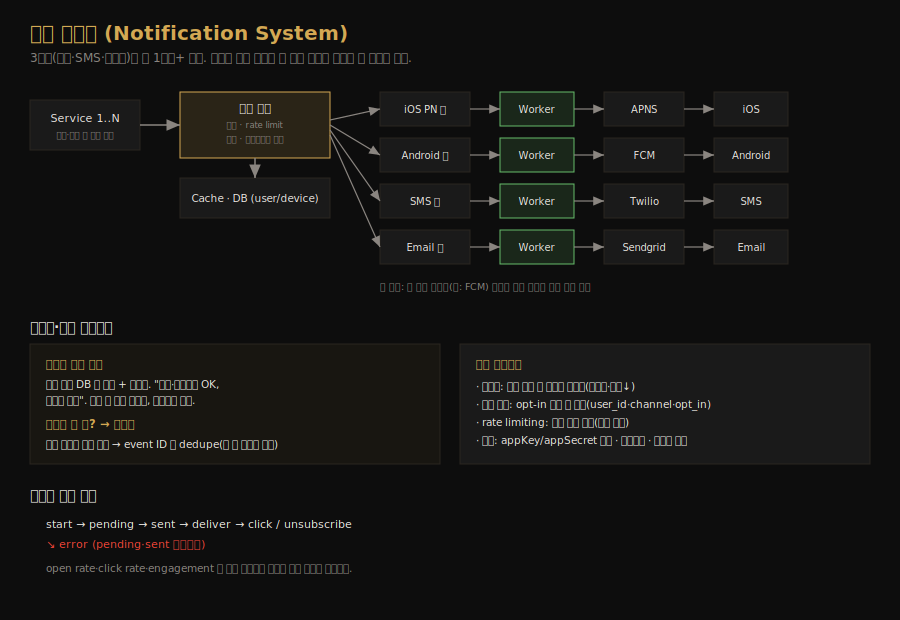

# 알림 시스템 설계
---
> CH10 은 푸시 알림·SMS·이메일을 보내는 알림 시스템을 설계합니다. 채널마다 외부 서비스(APNS·FCM·Twilio·Sendgrid)가 다르고, 일 수백만 건을 잃지 않고 보내야 하므로, 메시지 큐로 컴포넌트를 분리하고 데이터 손실 방지·중복 제거·재시도를 갖추는 것이 핵심입니다.

## 핵심 요약

알림 시스템은 푸시 알림(iOS APNS·Android FCM)·SMS(Twilio)·이메일(Sendgrid) 세 채널로 알림을 보냅니다. 초기 단일 서버 설계는 단일 장애점·확장 한계·성능 병목 문제가 있어, DB·캐시를 서버에서 분리하고 알림 서버를 수평 확장하며 *채널별 메시지 큐*로 컴포넌트를 분리해 개선합니다. 큐를 채널마다 두면 한 외부 서비스의 장애가 다른 채널로 번지지 않습니다. 알림은 지연·재정렬은 괜찮지만 손실은 안 되므로, 알림 로그 DB 에 영속하고 재시도하며, 분산 특성상 생기는 중복은 event ID 기반 dedupe 로 줄입니다.

## 학습 목표

이 문서를 읽고 나면 다음을 할 수 있습니다.

1. 세 알림 채널이 각각 어떤 외부 서비스로 전달되는지 설명할 수 있습니다.
2. 초기 설계의 세 문제와 메시지 큐 기반 개선을 말할 수 있습니다.
3. 채널별 큐 분리가 왜 장애 격리에 유리한지 설명할 수 있습니다.
4. 데이터 손실 방지·중복 제거·재시도 등 안정성 기법을 구분할 수 있습니다.

## 본문 정리

### 1. 채널별 알림 흐름

알림은 세 채널이 각자의 외부 서비스를 거칩니다. iOS 푸시는 Provider 가 device token 과 payload(JSON)를 APNS(Apple Push Notification Service)에 보내면 APNS 가 iOS 기기로 전파합니다. Android 푸시는 같은 흐름이되 APNS 대신 FCM(Firebase Cloud Messaging)을 씁니다. SMS 는 Twilio·Nexmo 같은 상용 서비스를, 이메일은 Sendgrid·Mailchimp 같은 상용 서비스를 흔히 씁니다. 이메일 상용 서비스는 전달률과 데이터 분석이 자체 서버보다 낫습니다.

알림을 보내려면 먼저 연락처 정보를 모아야 합니다. 사용자가 앱을 설치하거나 가입할 때 API 서버가 device token·전화번호·이메일을 수집해 DB 에 저장합니다. 이메일·전화번호는 `user` 테이블에, device token 은 `device` 테이블에 두는데, 한 사용자가 기기를 여럿 가질 수 있어 user 와 device 는 1:N 관계입니다. 그래서 푸시 알림을 사용자의 모든 기기에 보낼 수 있습니다.

### 2. 초기 설계와 세 가지 문제

초기 설계는 여러 서비스(결제·쇼핑 등)가 알림 서버 하나의 API 를 호출하면, 알림 서버가 payload 를 만들어 외부 서비스로 보내는 구조입니다. 여기에 세 가지 문제가 있습니다. 알림 서버가 하나면 단일 장애점(SPOF)이고, 모든 것을 한 서버가 처리해 DB·캐시·알림 처리 컴포넌트를 독립적으로 확장하기 어려우며, HTML 구성과 외부 서비스 응답 대기에 시간이 걸려 피크 시간에 시스템이 과부하될 수 있습니다.

확장성에서 한 가지 짚을 점은 외부 서비스의 가용성입니다. 좋은 확장성은 외부 서비스를 쉽게 끼우고 빼는 유연함을 뜻하는데, 예를 들어 FCM 은 중국에서 막혀 있어 그곳에서는 Jpush·PushY 같은 대안을 써야 합니다. 그래서 외부 서비스를 갈아끼우기 쉬운 구조가 중요합니다.

### 3. 메시지 큐로 개선

개선의 핵심은 세 가지입니다. DB·캐시를 알림 서버에서 분리하고, 알림 서버를 여러 대로 늘려 자동 수평 확장하며, 메시지 큐를 도입해 컴포넌트를 분리합니다.

개선된 흐름은 왼쪽에서 오른쪽으로 읽습니다. 서비스가 알림 서버 API 를 호출하면(이 API 는 스팸 방지를 위해 내부나 검증된 클라이언트만 접근), 알림 서버가 기본 검증을 하고 캐시·DB 에서 알림 렌더링에 필요한 데이터를 조회한 뒤, 알림 데이터를 *채널별 메시지 큐*에 넣습니다. 워커들이 큐에서 이벤트를 꺼내 해당 외부 서비스로 보내고, 외부 서비스가 기기로 전달합니다.

채널마다 큐를 따로 두는 것이 핵심입니다. 메시지 큐는 컴포넌트 간 의존을 끊고 대량 알림이 몰릴 때 버퍼 역할을 하는데, 알림 타입마다 별도 큐를 두면 *한 외부 서비스의 장애가 다른 알림 타입에 영향을 주지 않습니다*. FCM 이 죽어도 SMS·이메일은 그대로 나갑니다.

### 4. 안정성 — 데이터 손실 방지와 중복 제거

분산 환경의 알림 시스템에서 가장 중요한 요구는 데이터를 잃지 않는 것입니다. 알림은 보통 지연되거나 순서가 바뀌어도 괜찮지만 사라지면 안 됩니다. 이를 위해 알림 데이터를 알림 로그 DB 에 영속하고 재시도 메커니즘을 둡니다. 워커가 외부 서비스로 보낼 때 알림 로그에 기록해, 장애가 나도 복구할 수 있게 합니다.

수신자가 알림을 *정확히 한 번* 받을까요? 답은 아니오입니다. 대부분은 한 번 전달되지만, 분산 특성상 중복이 생길 수 있습니다. 중복을 줄이기 위해 dedupe 메커니즘을 둡니다. 알림 이벤트가 처음 도착하면 event ID 로 이전에 본 적 있는지 확인하고, 봤으면 버리고 아니면 보냅니다. "정확히 한 번" 전달이 분산 시스템에서 불가능에 가깝다는 점을 받아들이고, 실패 케이스를 신중히 다루는 쪽으로 설계합니다.

### 5. 추가 컴포넌트

실무 알림 시스템에는 여러 컴포넌트가 더 붙습니다. 알림 템플릿은 매번 알림을 처음부터 만들지 않고 미리 만든 양식에 파라미터·스타일·추적 링크만 채우는 방식으로, 일관된 형식·실수 감소·시간 절약을 줍니다. 알림 설정은 사용자가 채널별로 수신 여부를 세밀하게 제어하게 하는데(`user_id`·`channel`·`opt_in` 필드), 알림을 보내기 전에 사용자가 그 타입을 opt-in 했는지 먼저 확인합니다.

처리율 제한(rate limiting)은 사용자가 알림에 압도돼 알림을 아예 꺼버리지 않도록 받는 알림 수를 제한합니다. 재시도는 외부 서비스 전송 실패 시 알림을 큐에 다시 넣어 재시도하고, 문제가 지속되면 개발자에게 알립니다. 보안은 iOS·Android 앱의 appKey·appSecret 으로 인증된 클라이언트만 알림 API 를 쓰게 합니다.

모니터링은 큐에 쌓인 알림 수를 핵심 지표로 봅니다. 이 수가 크면 워커가 충분히 빨리 처리하지 못한다는 뜻이라 워커를 늘립니다. 이벤트 추적은 open rate·click rate·engagement 를 분석 서비스로 추적하는데, 알림이 `start → pending → sent → deliver → click/unsubscribe` 상태를 거치고 pending·sent 단계에서 error 로 빠질 수 있습니다. 이 추적으로 고객 행동을 이해합니다.

## 실무 적용 포인트

### 설계 핵심

- 외부 서비스가 채널마다 다르므로(APNS·FCM·Twilio·Sendgrid), 갈아끼우기 쉬운 구조를 만듭니다.
- 채널별 메시지 큐로 컴포넌트를 분리해 장애를 격리하고 대량 트래픽을 버퍼링합니다.
- 알림은 손실 불가이므로 로그 DB 영속 + 재시도 + event ID dedupe 로 안정성을 확보합니다.

### 주의할 점

- ⚠️ "정확히 한 번" 전달은 분산에서 불가능에 가깝습니다. dedupe 로 중복을 줄이되 완전 제거를 가정하지 않습니다.
- ⚠️ 알림 발송 전 사용자 opt-in 을 반드시 확인합니다. 무시하면 사용자가 알림을 통째로 꺼버립니다.
- ⚠️ FCM 처럼 지역에서 막히는 외부 서비스가 있습니다. 대안 서비스로 교체 가능한 구조가 필요합니다.

## 면접 대비

### 한 줄 정의

알림 시스템이란 푸시·SMS·이메일 채널로 알림을 보내는 시스템으로, 채널별 외부 서비스 앞에 메시지 큐를 두어 컴포넌트를 분리하고 로그 영속·재시도·dedupe 로 손실 없이 전달합니다.

### 핵심 포인트 3가지

1. **채널별 큐로 장애 격리**: 한 외부 서비스(FCM 등)가 죽어도 다른 채널은 영향받지 않습니다.
2. **손실 불가, 중복 허용**: 알림 로그 DB 영속 + 재시도로 손실을 막고, event ID dedupe 로 중복을 줄입니다.
3. **opt-in·rate limiting 필수**: 사용자가 알림을 꺼버리지 않도록 수신 설정과 빈도를 존중합니다.

### 자주 묻는 질문

Q: 왜 채널마다 큐를 따로 두나요?
A: 한 큐를 공유하면 외부 서비스 하나의 장애가 모든 알림을 막습니다. 채널별로 큐를 분리하면 FCM 장애가 SMS·이메일에 영향을 주지 않아 장애가 격리됩니다.

Q: 알림이 정확히 한 번 전달되나요?
A: 아니오. 분산 특성상 중복이 생길 수 있습니다. event ID 로 이전에 본 이벤트인지 확인해 중복을 줄이지만, "정확히 한 번"은 보장하지 않고 실패 케이스를 신중히 다룹니다.

Q: 데이터 손실은 어떻게 막나요?
A: 알림 데이터를 알림 로그 DB 에 영속하고 재시도 메커니즘을 둡니다. 외부 서비스 전송이 실패하면 큐에 다시 넣어 재시도하고, 지속되면 개발자에게 알립니다.

## 핵심 개념 체크리스트

- [ ] 세 채널과 각 외부 서비스(APNS·FCM·Twilio·Sendgrid)를 짝지을 수 있는가?
- [ ] 초기 설계의 세 문제(SPOF·확장·병목)와 개선책을 아는가?
- [ ] 채널별 큐 분리가 장애 격리에 유리한 이유를 설명할 수 있는가?
- [ ] 데이터 손실 방지(로그·재시도)와 중복 제거(event ID)를 구분하는가?
- [ ] 템플릿·opt-in 설정·rate limiting·이벤트 추적의 역할을 아는가?

## 참고 자료

- 연관 서적: Alex Xu, 『System Design Interview — An Insider's Guide』(Vol 1) CH10
- 연관 문서: [웹 크롤러 설계](02-06.웹 크롤러 설계.md) · [처리율 제한기 설계](02-01.처리율 제한기 설계.md)
