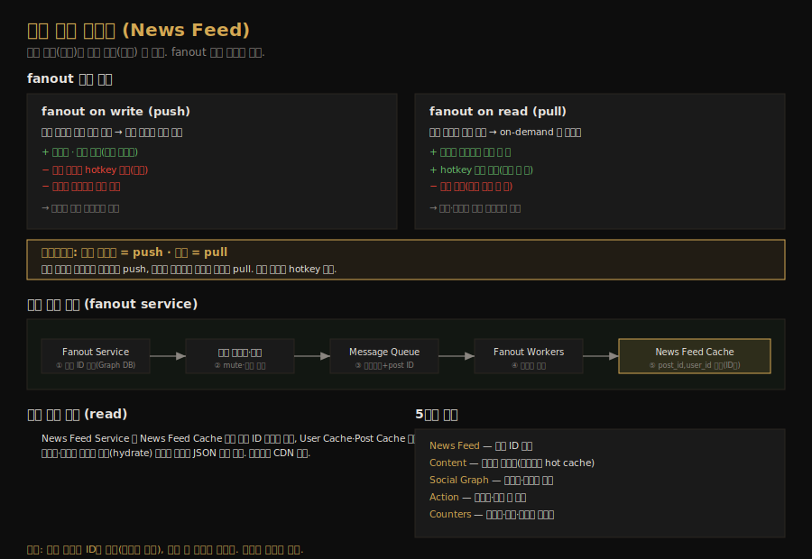

# 뉴스 피드 시스템 설계
---
> CH11 은 페이스북·인스타그램·트위터 같은 뉴스 피드를 설계합니다. CH3 에서 고수준 설계를 맛봤던 주제를 여기서 깊이 들어갑니다. 핵심은 게시물을 친구 피드에 *언제* 뿌리느냐 — 쓰기 시점(push)인가 읽기 시점(pull)인가 — 라는 fanout 모델 선택과, 캐시를 어떻게 계층화하느냐입니다.

## 핵심 요약

뉴스 피드 시스템은 피드 발행(feed publishing)과 피드 조회(news feed retrieval) 두 흐름으로 나뉩니다. 발행은 게시물을 친구들의 피드에 뿌리는 fanout 이 핵심인데, 쓰기 시점에 미리 계산하는 fanout on write(push)와 읽기 시점에 생성하는 fanout on read(pull) 두 모델이 트레이드오프를 갖습니다. push 는 조회가 빠르지만 친구 많은 사용자에서 hotkey 문제가 있고, pull 은 비활성 사용자에 자원을 안 쓰지만 조회가 느립니다. 그래서 일반 사용자는 push, 셀럽은 pull 로 결합하는 하이브리드를 씁니다. 캐시가 성능의 거의 전부라 5계층으로 나눠 관리합니다.

## 학습 목표

이 문서를 읽고 나면 다음을 할 수 있습니다.

1. 피드 발행과 피드 조회 두 흐름을 구분해 설명할 수 있습니다.
2. fanout on write(push)와 fanout on read(pull)의 트레이드오프를 비교할 수 있습니다.
3. 하이브리드 fanout 이 왜 필요한지, hotkey 문제와 함께 설명할 수 있습니다.
4. 뉴스 피드 캐시에 왜 ID 만 저장하는지와 5계층 캐시 구조를 말할 수 있습니다.

## 본문 정리

### 1. 요구사항과 두 흐름

요구사항은 사용자가 게시물을 올리고 친구들의 게시물을 역시간순으로 보는 것입니다. 친구는 최대 5000명, 트래픽은 일 1000만 DAU, 피드에는 이미지·비디오 같은 미디어가 포함됩니다. 설계는 두 흐름으로 나뉩니다. 피드 발행은 사용자가 게시물을 올리면 캐시·DB 에 쓰고 친구들의 피드에 채우는 흐름이고, 피드 조회는 친구들의 게시물을 역시간순으로 모아 보여주는 흐름입니다.

API 는 두 개입니다. `POST /v1/me/feed`(content + auth_token)로 게시물을 올리고, `GET /v1/me/feed`(auth_token)로 피드를 조회합니다. 웹 서버는 클라이언트와 통신하면서 인증과 처리율 제한을 담당합니다. 유효한 auth_token 으로 로그인한 사용자만 게시할 수 있고, 일정 기간 게시 수를 제한해 스팸과 악성 콘텐츠를 막습니다.

### 2. 피드 발행과 fanout service

피드 발행의 핵심은 fanout service 입니다. fanout 은 게시물을 모든 친구에게 전달하는 과정인데, 흐름은 다음과 같습니다. 먼저 그래프 DB 에서 친구 ID 를 조회합니다(그래프 DB 가 친구 관계·추천 관리에 적합). 다음 사용자 캐시에서 친구 정보를 가져와 사용자 설정 기준으로 거릅니다 — 예를 들어 mute 한 친구의 게시물은 피드에 안 뜨고, 특정 친구에게만 공유하거나 일부에게 숨길 수도 있습니다. 그다음 친구 목록과 새 게시물 ID 를 메시지 큐에 보내고, fanout workers 가 큐에서 데이터를 꺼내 뉴스 피드 캐시에 저장합니다.

뉴스 피드 캐시는 `<post_id, user_id>` 매핑 테이블로 생각할 수 있습니다. 새 게시물이 생기면 이 테이블에 추가됩니다. 중요한 점은 *전체 사용자·게시물 객체가 아니라 ID 만 저장*한다는 것입니다. 객체를 통째로 캐시하면 메모리가 폭증하므로 설정 가능한 한도를 둬 메모리를 작게 유지합니다. 대부분의 사용자는 최신 콘텐츠만 보고 수천 개의 게시물을 스크롤할 확률이 낮아 캐시 미스율이 낮습니다.

### 3. fanout on write vs fanout on read

fanout 모델은 두 가지입니다.

fanout on write(push 모델)는 *쓰기 시점에* 피드를 미리 계산합니다. 새 게시물이 발행되면 즉시 친구들의 캐시에 전달됩니다. 장점은 피드가 실시간으로 생성돼 친구에게 바로 푸시되고, 미리 계산돼 있어 조회가 빠릅니다. 단점은 친구가 많으면 친구 목록을 가져와 모두의 피드를 생성하는 게 느리고 시간이 걸리는 hotkey 문제가 생기고, 비활성 사용자나 거의 로그인 안 하는 사용자의 피드를 미리 계산하는 건 자원 낭비입니다.

fanout on read(pull 모델)는 *읽기 시점에* 피드를 생성하는 on-demand 모델입니다. 사용자가 홈을 열 때 최신 게시물을 끌어옵니다. 장점은 비활성 사용자의 자원을 낭비하지 않고, 데이터를 친구에게 푸시하지 않아 hotkey 문제가 없습니다. 단점은 미리 계산돼 있지 않아 조회가 느립니다.

### 4. 하이브리드 접근

두 모델의 장점을 취하고 함정을 피하려 하이브리드를 씁니다. 피드를 빠르게 가져오는 게 중요하므로 *대다수 사용자에게는 push 모델*을 쓰고, 친구·팔로워가 많은 셀럽에게는 *팔로워가 콘텐츠를 pull* 하게 해 시스템 과부하를 막습니다. 셀럽이 게시물을 올릴 때마다 수백만 팔로워의 피드에 push 하면 시스템이 무너지므로, 셀럽 게시물은 팔로워가 조회할 때 끌어오게 합니다.

여기서 안정 해시(CH5)가 도움이 됩니다. hotkey 문제는 요청·데이터가 특정 노드에 몰리는 것인데, 안정 해시로 요청과 데이터를 더 고르게 분산하면 이를 완화할 수 있습니다.

### 5. 피드 조회와 캐시 아키텍처

피드 조회 흐름은 다음과 같습니다. 사용자가 `/v1/me/feed` 로 요청하면 로드밸런서가 웹 서버로 분배하고, 웹 서버가 뉴스 피드 서비스를 호출합니다. 뉴스 피드 서비스는 뉴스 피드 캐시에서 피드 ID 목록을 가져옵니다. 피드는 ID 목록 이상이라 사용자명·프로필 사진·게시물 내용·게시물 이미지 등이 필요하므로, 사용자 캐시와 게시물 캐시에서 완전한 사용자·게시물 객체를 가져와 *완성된(hydrated)* 피드를 만듭니다. 완성된 피드를 JSON 으로 클라이언트에 돌려줍니다. 미디어(이미지·비디오)는 빠른 조회를 위해 CDN 에 둡니다.

캐시는 뉴스 피드 시스템에서 결정적이라 5계층으로 나눕니다. News Feed 는 피드 ID 를 저장하고, Content 는 모든 게시물 데이터를 저장하되 인기 콘텐츠는 hot cache 에 둡니다. Social Graph 는 사용자 관계 데이터를, Action 은 좋아요·답글 같은 행동 정보를, Counters 는 좋아요·답글·팔로워·팔로잉 카운터를 저장합니다.

## 실무 적용 포인트

### 설계 핵심

- 피드 캐시에는 객체가 아니라 ID(`<post_id, user_id>`)만 저장해 메모리를 아낍니다. 조회 때 객체를 채웁니다.
- fanout 은 일반 사용자 push, 셀럽 pull 의 하이브리드로 갑니다. 조회 속도와 과부하 방지를 동시에 잡습니다.
- 친구 관계는 그래프 DB 가 적합하고, 캐시는 역할별 5계층으로 나눠 관리합니다.

### 주의할 점

- ⚠️ 셀럽 게시물을 push 하면 수백만 피드에 동시에 써야 해 시스템이 무너집니다. 셀럽은 반드시 pull 로 처리합니다.
- ⚠️ push 모델은 비활성 사용자에게 자원을 낭비합니다. 로그인 빈도가 낮은 사용자는 pull 을 고려합니다.
- ⚠️ 피드 캐시에 전체 객체를 저장하면 메모리가 폭증합니다. ID 만 저장하고 한도를 둡니다.

## 면접 대비

### 한 줄 정의

뉴스 피드 시스템이란 게시물을 친구 피드에 뿌리는 발행과 친구 게시물을 모아 보여주는 조회 두 흐름으로 이뤄진 시스템으로, 일반 사용자는 push·셀럽은 pull 하는 하이브리드 fanout 으로 설계합니다.

### 핵심 포인트 3가지

1. **fanout push vs pull 트레이드오프**: push 는 조회 빠르나 hotkey, pull 은 자원 절약하나 조회 느림.
2. **하이브리드로 결합**: 일반 사용자 push, 셀럽 pull 로 조회 속도와 과부하 방지를 모두 잡습니다.
3. **캐시에 ID 만 저장**: `<post_id, user_id>` 매핑만 두고 조회 때 객체를 채워 메모리를 아낍니다.

### 자주 묻는 질문

Q: fanout on write 와 on read 중 무엇을 쓰나요?
A: 둘을 결합한 하이브리드를 씁니다. 조회 속도가 중요한 대다수 일반 사용자는 push(쓰기 시 미리 계산)로, 팔로워가 많아 push 가 과부하를 일으키는 셀럽은 pull(읽기 시 생성)로 처리합니다.

Q: 셀럽 문제(hotkey)는 어떻게 푸나요?
A: 셀럽이 게시물을 올릴 때 수백만 팔로워 피드에 push 하면 시스템이 무너집니다. 셀럽 게시물은 팔로워가 조회할 때 pull 하게 하고, 안정 해시로 요청·데이터를 고르게 분산합니다.

Q: 왜 피드 캐시에 ID 만 저장하나요?
A: 전체 사용자·게시물 객체를 캐시하면 메모리가 폭증합니다. `<post_id, user_id>` ID 매핑만 저장하고 조회 시점에 사용자 캐시·게시물 캐시에서 객체를 채워 완성된 피드를 만듭니다.

## 핵심 개념 체크리스트

- [ ] 피드 발행과 피드 조회 두 흐름을 구분해 설명할 수 있는가?
- [ ] fanout on write(push)와 on read(pull)의 장단점을 비교할 수 있는가?
- [ ] 하이브리드 fanout 과 셀럽 hotkey 문제를 설명할 수 있는가?
- [ ] 피드 캐시에 ID 만 저장하는 이유를 아는가?
- [ ] 5계층 캐시(News Feed·Content·Social Graph·Action·Counters)의 역할을 아는가?

## 참고 자료

- 연관 서적: Alex Xu, 『System Design Interview — An Insider's Guide』(Vol 1) CH11
- 연관 문서: [시스템 설계 면접 4단계 프레임워크](01-03.시스템 설계 면접 4단계 프레임워크.md) · [안정 해시 설계](02-02.안정 해시 설계.md)
