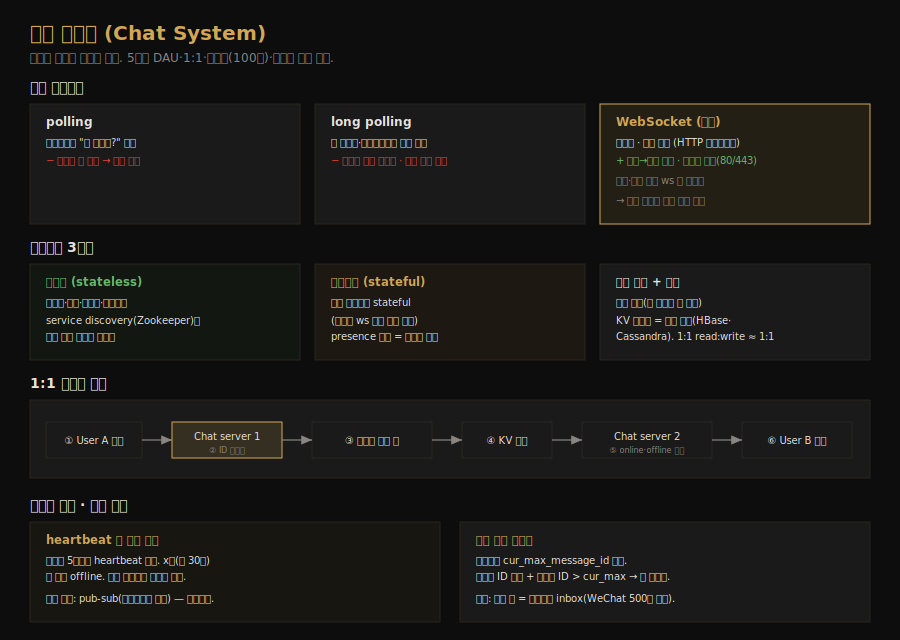

# 채팅 시스템 설계
---
> CH12 는 페이스북 메신저 같은 채팅 시스템을 설계합니다. 핵심은 클라이언트가 서로 직접 통신하지 않고 채팅 서비스를 거친다는 점, 그리고 서버가 클라이언트에게 *능동적으로* 메시지를 보내야 한다는 점입니다. 이를 위해 WebSocket 을 쓰고, 1:1·그룹 메시지 흐름과 온라인 상태를 설계합니다.

## 핵심 요약

채팅 시스템에서 클라이언트는 서로 직접 통신하지 않고 채팅 서비스에 연결합니다. 송신은 HTTP 로도 되지만 수신은 서버가 능동적으로 보내야 하므로, polling·long polling 의 한계를 넘어 양방향·영속 연결인 WebSocket 을 씁니다. 시스템은 무상태 서비스(로그인·프로필 등), 상태유지 서비스(채팅·presence), 외부 연동(푸시 알림)으로 나뉩니다. 채팅 이력은 KV 저장소에 두고, 1:1 메시지는 채팅 서버 → 메시지 동기 큐 → KV 저장 흐름을 거치며 수신자가 온라인이면 전달, 오프라인이면 푸시합니다. 온라인 상태는 heartbeat 로 관리합니다.

## 학습 목표

이 문서를 읽고 나면 다음을 할 수 있습니다.

1. polling·long polling·WebSocket 의 차이와 WebSocket 을 쓰는 이유를 설명할 수 있습니다.
2. 무상태·상태유지·외부 연동 세 분류로 채팅 아키텍처를 나눌 수 있습니다.
3. 1:1 메시지 흐름과 다중 기기 동기화(cur_max_message_id)를 설명할 수 있습니다.
4. heartbeat 기반 온라인 상태 관리와 presence fanout 을 말할 수 있습니다.

## 본문 정리

### 1. 통신 프로토콜 — WebSocket을 쓰는 이유

채팅에서 송신은 HTTP 로 충분합니다. 클라이언트가 keep-alive 로 영속 연결을 유지하면 TCP 핸드셰이크가 줄어 효율적이고, 페이스북도 초기에 HTTP 로 메시지를 보냈습니다. 문제는 *수신*입니다. HTTP 는 클라이언트가 시작하므로 서버가 능동적으로 보내기 까다롭습니다. 이를 흉내 내는 세 기법이 polling·long polling·WebSocket 입니다.

polling 은 클라이언트가 주기적으로 "새 메시지 있나?"를 묻는데, 대부분 빈 응답이라 자원을 낭비합니다. long polling 은 새 메시지나 타임아웃까지 연결을 열어두지만, 송신자와 수신자가 같은 채팅 서버에 연결된다는 보장이 없고(HTTP 서버는 보통 무상태) 서버가 클라이언트 단절을 알기 어려우며 비효율적입니다. WebSocket 은 클라이언트가 시작하는 양방향·영속 연결로, HTTP 연결을 핸드셰이크로 "업그레이드"해 만듭니다. 이 연결로 서버가 클라이언트에 업데이트를 보낼 수 있고, 80·443 포트를 써서 방화벽도 대개 통과합니다. 송신·수신 모두 WebSocket 으로 통일하면 설계가 단순해지지만, 연결이 영속적이라 *효율적인 연결 관리*가 서버의 핵심 과제가 됩니다.

### 2. 고수준 설계 — 세 분류

채팅 시스템은 무상태 서비스·상태유지 서비스·외부 연동 셋으로 나뉩니다.

무상태 서비스는 로그인·가입·프로필처럼 전통적인 요청/응답 서비스로, 로드밸런서 뒤에 둡니다. 여기서 깊이 볼 것은 service discovery 입니다. 그 역할은 클라이언트가 연결할 채팅 서버의 DNS 호스트명 목록을 주는 것으로, Apache Zookeeper 가 흔한 해법입니다. 사용 가능한 채팅 서버를 등록하고 지리적 위치·서버 용량 같은 기준으로 최적 서버를 골라줍니다.

상태유지 서비스는 채팅 서비스뿐입니다. 각 클라이언트가 채팅 서버와 영속 연결을 유지하므로 상태유지입니다. 클라이언트는 서버가 살아 있는 한 다른 서버로 바꾸지 않고, service discovery 가 채팅 서비스와 협력해 서버 과부하를 막습니다. 외부 연동은 푸시 알림이 가장 중요한데, 앱이 실행 중이지 않을 때도 새 메시지를 알립니다(CH10).

데이터는 두 종류입니다. 프로필·설정·친구 목록 같은 일반 데이터는 관계형 DB 에 두고 복제·샤딩으로 가용성·확장성을 확보합니다. 채팅 이력 데이터는 채팅 시스템 고유인데, 양이 막대하고(메신저·왓츠앱은 하루 600억 건) 최근 채팅만 자주 조회되며 1:1 채팅의 읽기:쓰기 비율은 약 1:1 입니다. 수평 확장이 쉽고 지연이 낮으며 long tail 데이터를 잘 다루는 KV 저장소가 적합해, 메신저는 HBase·Discord 는 Cassandra 를 씁니다.

### 3. 데이터 모델과 메시지 ID

1:1 채팅의 메시지 테이블은 `message_id` 를 기본 키로 씁니다. 두 메시지가 같은 시각에 생길 수 있어 `created_at` 으로 순서를 정할 수 없기 때문입니다. 그룹 채팅은 `(channel_id, message_id)` 복합 기본 키를 쓰고, 그룹 내 모든 쿼리가 채널 단위로 이뤄지므로 `channel_id` 가 파티션 키입니다.

`message_id` 는 유일하면서 시간순 정렬이 가능해야 합니다(새 행이 오래된 행보다 큰 ID). NoSQL 은 보통 `auto_increment` 가 없으므로, 스노우플레이크 같은 전역 64비트 시퀀스 생성기(CH7)를 쓰거나, 지역(local) 시퀀스 생성기를 씁니다. 지역 생성기는 한 채널 안에서만 유일하면 되는데, 1:1·그룹 채널 내 메시지 순서만 지키면 충분해 전역 구현보다 쉽습니다.

### 4. 1:1 메시지 흐름과 다중 기기 동기화

User A 가 User B 에게 메시지를 보내는 흐름은 다음과 같습니다. A 가 채팅 서버 1로 메시지를 보내면, 서버 1이 ID 생성기에서 메시지 ID 를 받고, 메시지를 메시지 동기 큐에 보냅니다. 메시지는 KV 저장소에 저장됩니다. 여기서 분기가 생기는데, B 가 온라인이면 B 가 연결된 채팅 서버 2로 전달하고, B 가 오프라인이면 푸시 알림 서버에서 푸시를 보냅니다. 채팅 서버 2가 B 와의 영속 WebSocket 연결로 메시지를 전달합니다.

다중 기기 동기화는 기기마다 `cur_max_message_id`(그 기기가 본 최신 메시지 ID)를 두어 처리합니다. 어떤 메시지가 "새 메시지"인 조건은 두 가지입니다 — 수신자 ID 가 현재 로그인한 사용자 ID 와 같고, KV 저장소의 메시지 ID 가 `cur_max_message_id` 보다 큰 것입니다. 기기마다 별도의 `cur_max_message_id` 를 두면 각 기기가 KV 저장소에서 자기가 못 받은 메시지만 가져오므로 동기화가 쉽습니다.

### 5. 그룹 채팅

그룹 채팅은 1:1 보다 복잡합니다. User A 가 3명 그룹(A·B·C)에 메시지를 보내면, A 의 메시지가 각 멤버의 메시지 동기 큐에 복사됩니다(B 용 하나, C 용 하나). 메시지 동기 큐를 수신자의 *받은 편지함(inbox)* 으로 보면 됩니다. 이 방식은 소그룹에 좋은데, 각 클라이언트가 자기 inbox 만 확인하면 새 메시지를 받을 수 있어 동기화가 단순하고, 그룹이 작으면 멤버마다 사본을 두는 비용이 크지 않습니다. WeChat 도 이 방식을 쓰며 그룹을 500명으로 제한합니다. 수신자 입장에서는 한 inbox 가 여러 발신자의 메시지를 담습니다.

### 6. 온라인 상태

온라인 상태 표시(프로필 옆 초록 점)는 presence 서버가 WebSocket 으로 관리합니다. 로그인하면 WebSocket 연결이 맺힌 뒤 사용자의 online 상태와 `last_active_at` 이 KV 저장소에 저장됩니다. 로그아웃하면 offline 으로 바뀝니다.

까다로운 건 단절입니다. 인터넷 연결은 자주 끊겼다 붙는데(터널 통과 등), 단절·재연결마다 상태를 바꾸면 표시가 너무 자주 깜빡여 경험이 나빠집니다. 이를 heartbeat 로 해결합니다. 온라인 클라이언트가 주기적으로(예: 5초마다) heartbeat 를 보내고, presence 서버가 일정 시간(예: 30초) 안에 heartbeat 를 받으면 online, 아니면 offline 으로 봅니다. 잠깐 끊겨도 heartbeat 가 곧 오면 online 을 유지해 깜빡임을 막습니다.

친구에게 상태 변화를 알리는 것은 pub-sub 모델로 합니다. 친구 쌍마다 채널을 두고, A 의 상태가 바뀌면 A-B·A-C·A-D 채널에 이벤트를 발행하면 구독 중인 B·C·D 가 받습니다. 소그룹에 효과적이지만, 10만 명 그룹이면 상태 변화마다 10만 이벤트가 생겨 병목이라, 큰 그룹은 사용자가 그룹에 들어가거나 친구 목록을 수동 새로고침할 때만 상태를 가져오는 식으로 완화합니다.

## 실무 적용 포인트

### 설계 핵심

- 수신을 위해 WebSocket 을 씁니다. 송신·수신 모두 WebSocket 으로 통일하면 설계가 단순해집니다.
- 채팅 이력은 KV 저장소(HBase·Cassandra)에 둡니다. 막대한 양과 낮은 지연, long tail 에 적합합니다.
- 온라인 상태는 heartbeat 로 관리해 단절·재연결 깜빡임을 막습니다.

### 주의할 점

- ⚠️ 단절마다 상태를 바꾸면 표시가 깜빡입니다. heartbeat 로 일정 시간 무응답일 때만 offline 으로 바꿉니다.
- ⚠️ presence fanout(pub-sub)은 큰 그룹에서 병목입니다. 10만 명 그룹은 진입 시·수동 새로고침 시에만 상태를 가져옵니다.
- ⚠️ 채팅 서버는 영속 연결이 많아 stateful 입니다. 장애 시 service discovery 가 새 서버를 주고 재연결합니다.

## 면접 대비

### 한 줄 정의

채팅 시스템이란 클라이언트가 채팅 서비스를 거쳐 실시간으로 메시지를 주고받는 시스템으로, WebSocket 으로 양방향 통신하고 KV 저장소에 이력을 두며 heartbeat 로 온라인 상태를 관리합니다.

### 핵심 포인트 3가지

1. **WebSocket 으로 양방향**: polling·long polling 의 한계를 넘어 서버가 클라이언트에 능동적으로 메시지를 보냅니다.
2. **KV 저장소 + 메시지 동기 큐**: 이력을 KV 에 두고, 수신자별 inbox 역할의 동기 큐로 메시지를 전달합니다.
3. **heartbeat 로 온라인 상태**: 단절·재연결 깜빡임을 막고, 친구 통지는 pub-sub 으로 합니다.

### 자주 묻는 질문

Q: 왜 long polling 대신 WebSocket 인가요?
A: long polling 은 송신·수신 서버가 다를 수 있고 단절 감지가 어려우며 비효율적입니다. WebSocket 은 양방향·영속 연결이라 서버가 능동적으로 메시지를 보낼 수 있고 방화벽도 통과합니다.

Q: 다중 기기에서 메시지를 어떻게 동기화하나요?
A: 기기마다 `cur_max_message_id`(본 최신 메시지 ID)를 둡니다. 수신자 ID 가 일치하고 메시지 ID 가 이 값보다 크면 새 메시지로 보고, 각 기기가 KV 저장소에서 자기가 못 받은 것만 가져옵니다.

Q: 온라인 상태에서 단절을 어떻게 처리하나요?
A: heartbeat 를 씁니다. 클라이언트가 주기적으로 heartbeat 를 보내고, 서버가 일정 시간(예: 30초) 안에 받으면 online, 아니면 offline 으로 봅니다. 잠깐 끊겨도 곧 heartbeat 가 오면 online 을 유지해 깜빡임을 막습니다.

## 핵심 개념 체크리스트

- [ ] polling·long polling·WebSocket 의 차이와 WebSocket 선택 이유를 아는가?
- [ ] 무상태·상태유지·외부 연동 세 분류를 설명할 수 있는가?
- [ ] 1:1 메시지 흐름(채팅 서버 → 동기 큐 → KV → online/offline)을 아는가?
- [ ] `cur_max_message_id` 로 다중 기기를 동기화하는 원리를 아는가?
- [ ] heartbeat 온라인 상태 관리와 pub-sub presence fanout 을 아는가?

## 참고 자료

- 연관 서적: Alex Xu, 『System Design Interview — An Insider's Guide』(Vol 1) CH12
- 연관 문서: [뉴스 피드 시스템 설계](02-08.뉴스 피드 시스템 설계.md) · [분산 유일 ID 생성기 설계](02-04.분산 유일 ID 생성기 설계.md)
