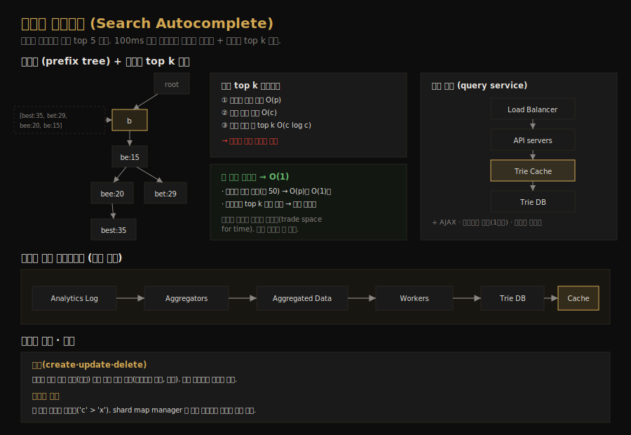

# 검색어 자동완성 시스템 설계
---
> CH13 은 구글·아마존 검색창의 자동완성(typeahead)을 설계합니다. 사용자가 입력하는 접두사마다 인기 검색어 top k 를 빠르게 반환해야 하는데, 핵심 자료구조는 트라이(trie)입니다. 기본 트라이를 어떻게 최적화해 100ms 안에 응답하느냐가 이 챕터의 묘미입니다.

## 핵심 요약

검색어 자동완성은 접두사를 입력하면 빈도순으로 정렬된 인기 검색어 top k(보통 5개)를 반환합니다. 시스템은 데이터 수집 서비스(쿼리를 집계)와 조회 서비스(접두사로 top k 반환)로 나뉩니다. 핵심 자료구조는 접두사 트리인 트라이인데, 기본 알고리즘은 접두사 노드를 찾아 하위 트리를 순회·정렬하므로 `O(p) + O(c) + O(c log c)`로 느립니다. 이를 접두사 길이 제한과 노드별 top k 캐시 두 최적화로 `O(1)`까지 끌어올립니다. 데이터 수집은 analytics log → aggregator → worker 로 트라이를 주간 갱신하고, 저장소는 첫 글자 샤딩의 불균형을 shard map manager 로 보완합니다.

## 학습 목표

이 문서를 읽고 나면 다음을 할 수 있습니다.

1. 트라이 자료구조와 top k 자동완성 기본 알고리즘을 설명할 수 있습니다.
2. 접두사 길이 제한과 노드별 top k 캐시가 어떻게 O(1)을 만드는지 말할 수 있습니다.
3. 데이터 수집 파이프라인(log → aggregate → worker → Trie DB)을 설명할 수 있습니다.
4. 첫 글자 샤딩의 불균형 문제와 shard map manager 해법을 설명할 수 있습니다.

## 본문 정리

### 1. 요구사항과 규모

요구사항을 명확히 합니다. 매칭은 접두사(검색어 앞부분)에서만 하고, 자동완성 제안은 5개를 반환하며, 어떤 5개인지는 과거 쿼리 빈도(인기도)로 정합니다. 맞춤법 검사는 없고, 영어 소문자만 다룹니다. 추가로 응답이 빨라야 하고(페이스북 자료에 따르면 100ms 안에 안 오면 끊김 발생), 검색어와 관련 있어야 하며, 빈도순 정렬·확장성·고가용성을 갖춰야 합니다.

규모는 일 1000만 DAU, 1인당 하루 10회 검색, 쿼리당 20바이트로 추정합니다. 글자마다 요청을 보내므로(예: "dinner" 입력에 d, di, din… 6요청) 쿼리당 평균 20요청을 가정하면 QPS 는 약 24,000, 피크는 약 48,000 입니다. 새 쿼리가 일일 20%라 하루 약 0.4 GB 가 추가됩니다.

### 2. 고수준 설계 — 두 서비스

시스템은 두 서비스로 나뉩니다. 데이터 수집 서비스는 사용자 입력 쿼리를 모아 집계하고, 조회 서비스는 접두사를 받아 가장 자주 검색된 5개를 돌려줍니다. 가장 단순한 출발점은 쿼리·빈도를 담은 빈도 테이블입니다. 조회는 `SELECT * FROM frequency_table WHERE query LIKE 'prefix%' ORDER BY frequency DESC LIMIT 5` 같은 SQL 로 가능합니다. 데이터가 작을 때는 괜찮지만, 커지면 DB 접근이 병목이라 트라이로 최적화합니다.

### 3. 트라이 자료구조

트라이(trie, "try"로 발음, retrieval 에서 유래)는 문자열을 압축해 저장하는 트리형 자료구조입니다. 루트는 빈 문자열을 나타내고, 각 노드는 한 글자를 저장하며 가능한 글자마다 자식을 가질 수 있습니다(영어면 최대 26개). 각 트리 노드는 한 단어나 접두사를 나타냅니다. 빈도순 정렬을 지원하려면 노드에 빈도 정보를 함께 둡니다.

자동완성의 기본 알고리즘은 세 단계입니다. 접두사 노드를 찾고(시간복잡도 `O(p)`, p 는 접두사 길이), 그 노드에서 하위 트리를 순회해 유효한 자식을 모두 모으고(`O(c)`, c 는 자식 수), 자식들을 정렬해 top k 를 얻습니다(`O(c log c)`). 예를 들어 "tr"을 입력하면 tr 노드를 찾아 하위의 [tree:10], [true:35], [try:29]를 모은 뒤 정렬해 top 2 인 [true:35], [try:29]를 반환합니다. 전체 시간복잡도는 `O(p) + O(c) + O(c log c)`인데, 최악의 경우 전체 트라이를 순회해야 해서 느립니다.

### 4. 두 가지 최적화 — O(1) 만들기

느린 기본 알고리즘을 두 최적화로 개선합니다.

첫째, 접두사 최대 길이를 제한합니다. 사용자가 아주 긴 검색어를 입력하는 일은 드물어 p 를 작은 상수(예: 50)로 봐도 안전합니다. 접두사 길이를 제한하면 "접두사 찾기"의 시간복잡도가 `O(p)`에서 `O(1)`로 줄어듭니다.

둘째, 노드마다 top k 검색어를 캐시합니다. 트라이 전체를 순회하지 않으려고, 각 노드에 가장 자주 검색된 top k 쿼리를 미리 저장합니다. 자동완성 제안은 5~10개면 충분하므로 k 가 작습니다. 노드마다 top k 를 캐시하면 조회 시 정렬이 필요 없어 시간복잡도가 크게 줍니다. 공간을 더 쓰지만 응답 속도가 중요하므로 *공간을 내주고 속도를 얻는* 트레이드오프가 정당합니다. 두 최적화를 적용하면 접두사 찾기 `O(1)`, top k 반환 `O(1)`로 전체가 `O(1)`이 됩니다.

### 5. 데이터 수집 서비스

매 쿼리마다 트라이를 실시간 갱신하는 건 비현실적입니다. 하루 수십억 쿼리를 매번 반영하면 조회가 크게 느려지고, top 제안은 트라이가 한번 만들어지면 자주 바뀌지 않아 빈번한 갱신이 불필요합니다. 그래서 데이터는 analytics 나 로깅 서비스에서 가져와 주기적으로 처리합니다.

파이프라인은 다음과 같습니다. Analytics Log 가 쿼리 원본을 append-only 로 저장하고, Aggregators 가 이 큰 로그를 시스템이 처리하기 좋은 형태로 집계합니다. 집계된 Aggregated Data 를 Workers 가 비동기로 가져와 트라이를 만들어 Trie DB 에 저장합니다. Trie Cache 는 트라이를 메모리에 두는 분산 캐시로 DB 의 주간 스냅샷을 가집니다. 집계 주기는 사용 사례에 따라 다른데, 트위터처럼 실시간이 중요하면 짧게, 많은 경우 주 1회로 충분합니다. 트라이는 주간 재구축을 가정합니다.

### 6. 조회 서비스와 트라이 운영

조회 흐름은 다음과 같습니다. 검색 쿼리가 로드밸런서로 가고, API 서버로 라우팅되며, API 서버가 Trie Cache 에서 트라이 데이터를 가져와 자동완성 제안을 만듭니다. 캐시에 없으면(캐시 서버 메모리 부족·오프라인 시) DB 에서 가져와 캐시를 채웁니다. 조회는 빨라야 하므로 AJAX 요청(페이지 새로고침 없이 요청/응답), 브라우저 캐시(구글은 1시간 캐시), 데이터 샘플링(N 건당 1건만 로깅)으로 최적화합니다.

트라이 운영은 create·update·delete 입니다. create 는 워커가 집계 데이터로 만들고, update 는 주간 통째 교체(권장)나 개별 노드 직접 수정(느림 — 노드 수정 시 조상까지 top k 를 갱신해야 함) 중에 고릅니다. delete 는 유해·폭력·위험한 제안을 거르는데, Trie Cache 앞에 필터 레이어를 둬 규칙별로 제거하고, DB 에서는 비동기로 물리 삭제해 다음 갱신 주기에 반영합니다.

### 7. 저장소 확장

트라이가 한 서버에 안 들어갈 만큼 커지면 샤딩합니다. 영어만 지원하므로 첫 글자로 샤딩하는 게 단순한데, 예를 들어 2서버면 a~m / n~z 로 나눕니다. 26글자라 최대 26서버까지, 더 나누려면 둘째·셋째 글자로 내려갑니다. 문제는 'c'로 시작하는 단어가 'x'보다 훨씬 많아 *분포가 불균형*하다는 점입니다.

이를 shard map manager 로 완화합니다. 과거 데이터 분포를 분석해 더 똑똑하게 샤딩하는데, 's'의 쿼리 수가 'u'~'z' 합과 비슷하면 's' 전용 샤드 하나와 'u'~'z' 샤드 하나로 묶습니다. shard map manager 는 어느 행이 어느 샤드에 있는지 룩업 DB 를 유지하고, 웹 서버가 "이 검색어는 어느 샤드?"를 물은 뒤 해당 샤드에서 데이터를 가져옵니다.

## 실무 적용 포인트

### 설계 핵심

- top k 자동완성은 트라이 + 노드별 top k 캐시로 O(1) 조회를 만듭니다.
- 트라이는 실시간 갱신하지 않고 로그 집계로 주간 재구축합니다. 제안은 자주 안 바뀝니다.
- 첫 글자 샤딩은 분포가 불균형하므로 shard map manager 로 이력 기반 균등 배분합니다.

### 주의할 점

- ⚠️ 노드별 top k 캐시는 공간을 많이 씁니다. 응답 속도가 더 중요해 정당하지만, 메모리 비용을 인지합니다.
- ⚠️ 개별 노드 직접 수정은 조상까지 top k 를 갱신해야 해 느립니다. 트라이가 크면 주간 통째 교체가 낫습니다.
- ⚠️ 첫 글자 단순 샤딩은 'c' 쏠림을 낳습니다. 이력 기반 shard map 으로 균등하게 나눕니다.

## 면접 대비

### 한 줄 정의

검색어 자동완성이란 접두사로 인기 검색어 top k 를 100ms 안에 반환하는 시스템으로, 트라이에 노드별 top k 를 캐시해 O(1) 조회를 달성하고 로그 집계로 트라이를 주기적으로 재구축합니다.

### 핵심 포인트 3가지

1. **트라이 + 노드별 top k 캐시 = O(1)**: 접두사 길이 제한과 노드 캐시로 조회를 상수 시간에 만듭니다.
2. **트라이는 주간 재구축**: 실시간 갱신은 비현실적이라 로그를 집계해 워커가 주기적으로 만듭니다.
3. **shard map manager 로 균등 샤딩**: 첫 글자 쏠림('c'>'x')을 이력 기반 샤드 배분으로 보완합니다.

### 자주 묻는 질문

Q: 트라이 조회를 어떻게 O(1)로 만드나요?
A: 접두사 최대 길이를 상수로 제한해 노드 찾기를 O(1)로, 노드마다 top k 를 미리 캐시해 정렬을 없애 반환을 O(1)로 만듭니다. 공간을 더 쓰지만 응답 속도를 얻습니다.

Q: 왜 트라이를 실시간으로 갱신하지 않나요?
A: 하루 수십억 쿼리를 매번 반영하면 조회가 크게 느려지고, top 제안은 자주 바뀌지 않습니다. 그래서 로그를 집계해 워커가 주 1회 정도 트라이를 재구축합니다.

Q: 첫 글자 샤딩의 문제는?
A: 'c'로 시작하는 단어가 'x'보다 훨씬 많아 분포가 불균형합니다. shard map manager 가 과거 분포를 분석해 쿼리 수가 비슷하도록 샤드를 묶어 균등하게 배분합니다.

## 핵심 개념 체크리스트

- [ ] 트라이 구조와 top k 기본 알고리즘(`O(p)+O(c)+O(c log c)`)을 설명할 수 있는가?
- [ ] 접두사 길이 제한·노드별 top k 캐시가 O(1)을 만드는 원리를 아는가?
- [ ] 데이터 수집 파이프라인(log→aggregate→worker→Trie DB)을 아는가?
- [ ] 트라이 운영(통째 교체 vs 노드 수정, 필터 레이어)을 구분하는가?
- [ ] 첫 글자 샤딩의 불균형과 shard map manager 해법을 아는가?

## 참고 자료

- 연관 서적: Alex Xu, 『System Design Interview — An Insider's Guide』(Vol 1) CH13
- 연관 문서: [채팅 시스템 설계](02-09.채팅 시스템 설계.md) · [키-값 저장소 설계](02-03.키-값 저장소 설계.md)
