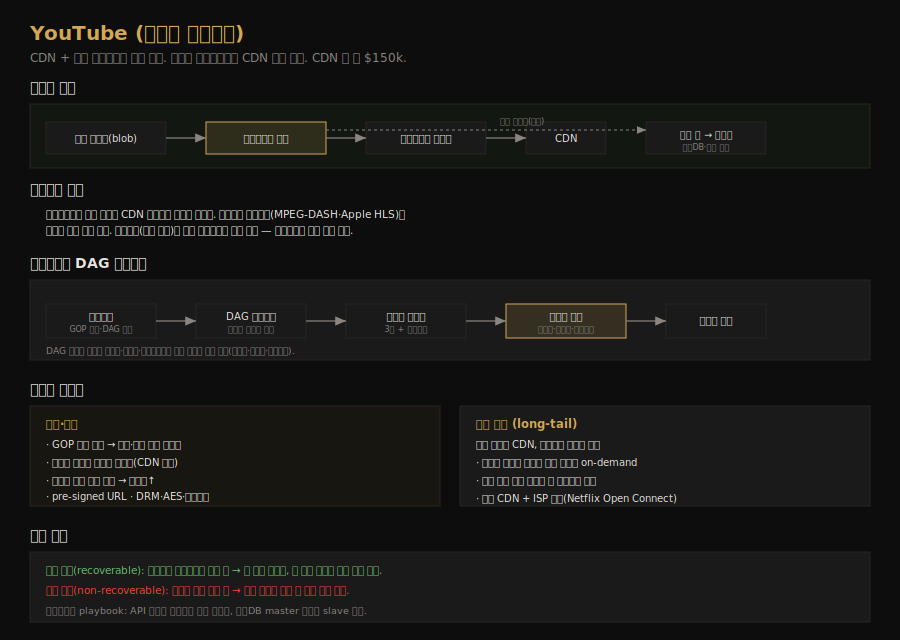

# YouTube 설계
---
> CH14 는 YouTube 같은 비디오 스트리밍 서비스를 설계합니다(넷플릭스·훌루에도 적용 가능). 단순해 보이지만 비디오 트랜스코딩과 CDN 비용 때문에 까다롭습니다. CDN·블롭 스토리지를 빌려 쓰고, DAG 모델로 트랜스코딩을 병렬화하며, long-tail 분포를 이용해 비용을 줄이는 것이 핵심입니다.

## 핵심 요약

YouTube 설계는 처음부터 다 만들지 않고 CDN 과 블롭 스토리지 같은 클라우드 서비스를 빌려 씁니다. 비디오를 클릭하면 CDN 에서 스트리밍하고, 그 외 요청(추천·메타데이터·가입)은 API 서버가 처리합니다. 업로드 흐름은 원본 저장소 → 트랜스코딩 서버 → 트랜스코딩 저장소 → CDN 을 거치며, 트랜스코딩은 DAG(directed acyclic graph) 모델로 비디오·오디오·메타데이터를 단계별로 병렬 처리합니다. CDN 비용이 막대해(일 약 $150k) long-tail 분포를 이용해 인기 영상만 CDN 에 두는 식으로 절감합니다.

## 학습 목표

이 문서를 읽고 나면 다음을 할 수 있습니다.

1. 비디오 업로드 흐름과 스트리밍 흐름을 구분해 설명할 수 있습니다.
2. 비디오 트랜스코딩이 왜 필요한지와 DAG 모델의 역할을 말할 수 있습니다.
3. 트랜스코딩 아키텍처(전처리기·DAG 스케줄러·리소스 매니저·태스크 워커)를 설명할 수 있습니다.
4. GOP 병렬 업로드·메시지 큐·long-tail 비용 절감 같은 최적화를 구분할 수 있습니다.

## 본문 정리

### 1. 요구사항과 추정

핵심 기능은 비디오 업로드와 시청입니다. 클라이언트는 모바일·웹·스마트TV 를 지원하고, 일 500만 DAU, 1인당 하루 5개 시청, 평균 영상 300 MB 를 가정합니다. 그러면 일 저장 공간은 `500만 × 10%(업로드 비율) × 300 MB = 150 TB` 이고, CDN 비용은 영상 스트리밍만 따져도 `500만 × 5 × 0.3 GB × $0.02 ≈ 일 $150,000` 입니다. CDN 비용이 막대하다는 점이 뒤따르는 비용 절감 설계의 동기입니다.

설계 원칙은 처음부터 다 만들지 않는 것입니다. 면접은 기술을 밑바닥부터 구현하는 자리가 아니라 *적절한 기술을 골라 쓰는* 자리이고, 확장 가능한 블롭 스토리지나 CDN 을 직접 만드는 건 극도로 복잡하고 비쌉니다. 넷플릭스는 AWS 를, 페이스북은 Akamai CDN 을 빌려 씁니다.

### 2. 고수준 설계와 두 흐름

전체는 세 컴포넌트입니다. 클라이언트(컴퓨터·모바일·스마트TV)가 비디오를 보고, CDN 이 비디오를 저장해 재생 시 스트리밍하며, API 서버가 스트리밍 외 모든 것(추천·업로드 URL 생성·메타데이터 갱신·가입)을 처리합니다.

업로드 흐름은 두 프로세스가 병렬로 돕니다. 하나는 실제 비디오 업로드로, 원본이 원본 저장소(블롭)에 올라가면 트랜스코딩 서버가 가져와 변환하고, 변환된 영상은 트랜스코딩 저장소를 거쳐 CDN 으로 배포됩니다. 동시에 트랜스코딩 완료 이벤트가 완료 큐에 쌓이고 완료 핸들러가 메타DB·캐시를 갱신합니다. 다른 하나는 메타데이터 갱신으로, 파일명·크기·포맷 같은 메타데이터를 API 서버가 메타데이터 캐시·DB 에 씁니다.

스트리밍 흐름은 더 단순합니다. 비디오는 가장 가까운 CDN 엣지에서 직접 스트리밍돼 지연이 작습니다. 여기서 다운로드와 스트리밍이 다른데, 다운로드는 전체 영상을 기기로 복사하는 것이고 스트리밍은 원격 영상을 *조금씩 연속 수신*해 바로 보는 것입니다. 스트리밍 프로토콜(MPEG-DASH·Apple HLS·Microsoft Smooth Streaming 등)이 데이터 전송을 표준화하는데, 프로토콜마다 지원하는 인코딩·플레이어가 달라 사용 사례에 맞게 고릅니다.

### 3. 비디오 트랜스코딩과 DAG 모델

트랜스코딩(비디오 인코딩)은 영상을 호환되는 비트레이트·포맷으로 바꾸는 일입니다. 필요한 이유는 네 가지입니다. 원본은 저장 공간을 크게 쓰고(1시간 HD 60fps 면 수백 GB), 기기·브라우저마다 지원 포맷이 달라 호환을 맞춰야 하며, 네트워크가 좋은 사용자에게는 고화질·나쁜 사용자에게는 저화질을 줘야 하고, 네트워크 상태 변화에 맞춰 화질을 자동 전환해야 부드럽습니다. 인코딩 포맷은 보통 컨테이너(.mp4·.mov 같은 영상·오디오·메타데이터를 담는 바구니)와 코덱(H.264·VP9·HEVC 같은 압축 알고리즘)으로 나뉩니다.

트랜스코딩은 계산이 비싸고 콘텐츠 제작자마다 처리 요구가 다릅니다(누구는 워터마크, 누구는 썸네일). 다양한 파이프라인을 유연하게·병렬로 처리하려고 DAG(directed acyclic graph) 모델을 씁니다. 페이스북 스트리밍 엔진이 쓰는 방식으로, 작업을 단계로 정의해 순차·병렬로 실행합니다. 원본 영상을 비디오·오디오·메타데이터로 나누고, 비디오에는 검수·인코딩·썸네일·워터마크 등의 태스크를, 오디오에는 오디오 인코딩을 적용한 뒤 조립(assemble)합니다.

### 4. 트랜스코딩 아키텍처

트랜스코딩 아키텍처는 여섯 컴포넌트입니다.

전처리기(preprocessor)는 네 가지를 합니다. 영상을 GOP(Group of Pictures, 독립 재생 가능한 몇 초짜리 프레임 묶음) 정렬로 분할하고, 분할을 지원 못 하는 구형 기기를 위해 서버에서 GOP 분할을 대신하며, 설정 파일을 바탕으로 DAG 를 생성하고, GOP·메타데이터를 임시 저장소에 캐시해 인코딩 실패 시 재시도에 씁니다.

DAG 스케줄러는 DAG 그래프를 태스크 단계로 쪼개 리소스 매니저의 태스크 큐에 넣습니다. 리소스 매니저는 자원 할당 효율을 관리하는데, 태스크 큐(실행할 태스크 우선순위 큐)·워커 큐(워커 사용률 우선순위 큐)·실행 큐(현재 실행 중인 태스크·워커 정보)와 태스크 스케줄러로 구성됩니다. 스케줄러가 가장 높은 우선순위 태스크와 최적 워커를 골라 바인딩해 실행 큐에 넣고, 끝나면 큐에서 제거합니다. 태스크 워커는 DAG 에 정의된 태스크(워터마크·인코더·썸네일·병합)를 실행합니다. 임시 저장소는 데이터 성격에 따라 메타데이터는 메모리 캐시, 영상·오디오는 블롭 스토리지에 두고 처리가 끝나면 비웁니다. 인코딩 결과(예: `funny_720p.mp4`)가 최종 출력입니다.

### 5. 시스템 최적화

속도 최적화는 네 가지입니다. 영상을 GOP 단위로 분할하면 업로드를 병렬화하고 실패 시 재개할 수 있는데, 이 분할을 클라이언트가 수행해 속도를 올립니다. 업로드 센터를 전 세계에 두고(CDN 을 업로드 센터로 활용) 사용자와 가깝게 합니다. 메시지 큐로 모듈을 느슨하게 묶어, 인코딩 모듈이 다운로드 모듈의 출력을 기다리지 않고 큐의 이벤트를 병렬 처리하게 합니다.

안전 최적화로 pre-signed URL 을 씁니다. 클라이언트가 API 서버에서 pre-signed URL 을 받아 그 URL 로만 업로드해 권한 있는 사용자만 올바른 위치에 업로드하게 합니다(AWS S3 의 pre-signed URL, Azure 의 Shared Access Signature). 영상 보호는 DRM(Apple FairPlay·Google Widevine·Microsoft PlayReady)·AES 암호화·워터마크 중에 고릅니다.

비용 절감은 long-tail 분포를 활용합니다. 인기 영상 몇 개가 자주 보이고 나머지는 거의 안 보이는 분포라, 인기 영상만 CDN 에서 주고 비인기 영상은 고용량 비디오 서버에서 줍니다. 비인기 영상은 인코딩 버전을 적게 두고 on-demand 로 만들며, 특정 지역에서만 인기인 영상은 그 지역에만 분배합니다. 더 나아가 넷플릭스처럼 자체 CDN 을 만들고 ISP 와 제휴해 대역폭 비용을 줄일 수도 있습니다.

### 6. 에러 처리

대규모 시스템에서 에러는 불가피하므로 우아하게 처리하고 빠르게 복구합니다. 복구 가능(recoverable) 에러는 세그먼트 트랜스코딩 실패처럼 몇 번 재시도하고, 그래도 안 되면 적절한 에러 코드를 클라이언트에 돌려줍니다. 복구 불가(non-recoverable) 에러는 잘못된 영상 포맷처럼 관련 태스크를 중단하고 에러 코드를 돌려줍니다. 컴포넌트별 playbook 도 둡니다 — 업로드 에러는 재시도, API 서버 다운은 무상태라 다른 서버로 라우팅, 메타DB master 다운은 slave 를 master 로 승격하는 식입니다.

## 실무 적용 포인트

### 설계 핵심

- CDN·블롭 스토리지는 직접 만들지 말고 빌려 씁니다. 면접도 실무도 적절한 기술 선택이 핵심입니다.
- 트랜스코딩은 DAG 모델로 비디오·오디오·메타데이터를 단계별 병렬 처리합니다.
- CDN 비용은 long-tail 분포를 이용해 인기 영상만 CDN 에 둬 절감합니다.

### 주의할 점

- ⚠️ CDN 비용이 막대합니다(일 $150k 규모). 모든 영상을 CDN 에 두지 말고 인기도로 차등합니다.
- ⚠️ GOP 분할은 구형 기기가 못 할 수 있습니다. 그 경우 서버(전처리기)가 대신 분할합니다.
- ⚠️ 모듈 간 직접 의존은 병렬성을 막습니다. 메시지 큐로 느슨하게 묶어 다운로드·인코딩을 분리합니다.

## 면접 대비

### 한 줄 정의

YouTube 설계란 CDN·블롭 스토리지를 빌려 비디오를 업로드·트랜스코딩·스트리밍하는 시스템으로, DAG 모델로 트랜스코딩을 병렬화하고 long-tail 분포로 CDN 비용을 절감합니다.

### 핵심 포인트 3가지

1. **CDN 으로 스트리밍, API 서버로 나머지**: 비디오는 가까운 CDN 엣지에서, 그 외는 API 서버가 처리합니다.
2. **DAG 모델로 트랜스코딩 병렬화**: 영상을 비디오·오디오·메타데이터로 나눠 단계별로 병렬 처리합니다.
3. **long-tail 로 비용 절감**: 인기 영상만 CDN, 나머지는 고용량 서버·on-demand 인코딩으로 비용을 줄입니다.

### 자주 묻는 질문

Q: 왜 비디오를 트랜스코딩하나요?
A: 원본은 용량이 크고 기기마다 지원 포맷이 다릅니다. 트랜스코딩으로 여러 해상도·포맷·비트레이트를 만들어 호환성을 맞추고, 네트워크 상태에 따라 화질을 전환할 수 있게 합니다.

Q: DAG 모델은 왜 쓰나요?
A: 트랜스코딩은 비싸고 제작자마다 처리 요구가 다릅니다(워터마크·썸네일 등). DAG 로 작업을 단계로 정의하면 비디오·오디오·메타데이터를 순차·병렬로 유연하게 처리할 수 있습니다.

Q: CDN 비용을 어떻게 줄이나요?
A: 영상 시청은 long-tail 분포라 인기 영상 몇 개가 대부분의 트래픽입니다. 인기 영상만 CDN 에 두고 나머지는 고용량 서버·on-demand 인코딩·지역 한정 분배로 처리하며, 자체 CDN + ISP 제휴도 고려합니다.

## 핵심 개념 체크리스트

- [ ] 업로드 흐름과 스트리밍 흐름을 구분해 설명할 수 있는가?
- [ ] 비디오 트랜스코딩이 필요한 네 가지 이유를 아는가?
- [ ] DAG 트랜스코딩 아키텍처의 컴포넌트(전처리기·스케줄러·리소스 매니저·워커)를 아는가?
- [ ] GOP 병렬 업로드·메시지 큐·pre-signed URL 같은 최적화를 구분하는가?
- [ ] long-tail 비용 절감과 recoverable/non-recoverable 에러 처리를 아는가?

## 참고 자료

- 연관 서적: Alex Xu, 『System Design Interview — An Insider's Guide』(Vol 1) CH14
- 연관 문서: [검색어 자동완성 시스템 설계](02-10.검색어 자동완성 시스템 설계.md) · [키-값 저장소 설계](02-03.키-값 저장소 설계.md)
