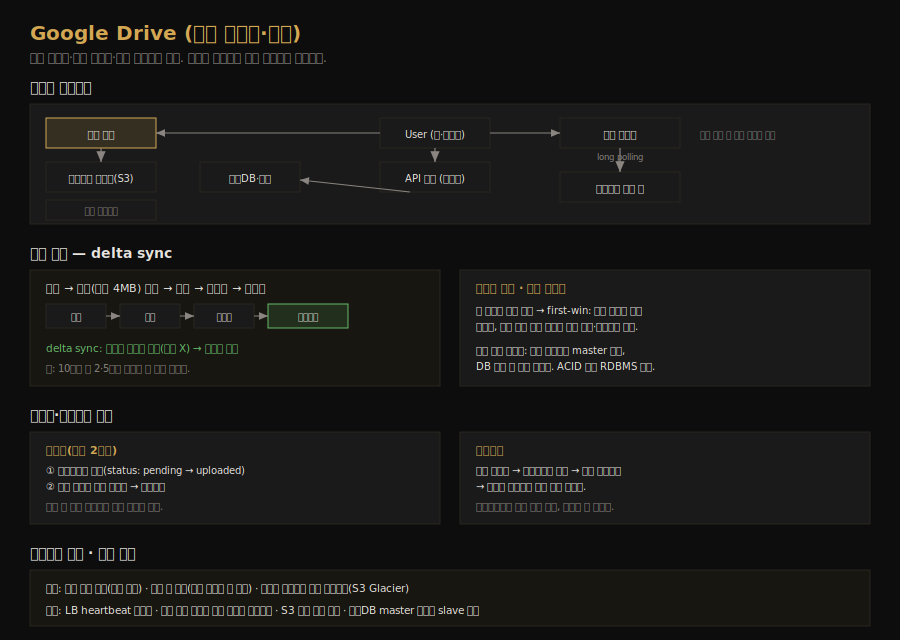

# Google Drive 설계
---
> CH15 는 Google Drive·Dropbox 같은 클라우드 저장·동기화 서비스를 설계합니다. 이 시리즈의 마지막 본편으로, 파일을 블록으로 쪼개 변경분만 전송하는 delta sync, 기기 간 동기화와 충돌 해결, 메타데이터·블록 분리 저장이 핵심입니다. 데이터 손실은 절대 안 된다는 신뢰성 요구가 모든 결정을 좌우합니다.

## 핵심 요약

Google Drive 는 파일 업로드·다운로드·기기 간 동기화·알림을 제공합니다. 신뢰성(데이터 손실 불가)·빠른 동기화·낮은 대역폭이 핵심 요구라, 파일을 블록(최대 4MB)으로 쪼개 압축·암호화해 클라우드 저장소(S3)에 올리고, 수정 시 변경된 블록만 전송하는 delta sync 로 대역폭을 아낍니다. 메타데이터는 별도 DB 에 두고, 파일 변경은 알림 서비스(long polling)가 다른 기기에 통지합니다. 동시 수정 충돌은 먼저 처리된 쪽이 이기는(first-win) 전략으로 풀고, 강한 일관성을 위해 ACID 를 지원하는 관계형 DB 를 씁니다.

## 학습 목표

이 문서를 읽고 나면 다음을 할 수 있습니다.

1. 블록 서버와 delta sync 가 어떻게 대역폭을 절약하는지 설명할 수 있습니다.
2. 메타데이터 DB 와 클라우드 저장소를 분리하는 이유를 말할 수 있습니다.
3. 업로드·다운로드·동기화 흐름과 알림 서비스의 역할을 설명할 수 있습니다.
4. 동기화 충돌 해결(first-win)과 저장공간 절약 기법을 구분할 수 있습니다.

## 본문 정리

### 1. 요구사항과 규모

핵심 기능은 파일 추가(드래그앤드롭)·다운로드·기기 간 동기화·파일 개정 이력·공유·알림입니다. 비기능 요구가 특히 중요한데, 저장 시스템이라 신뢰성(데이터 손실 절대 불가)이 최우선이고, 빠른 동기화·낮은 대역폭·확장성·고가용성이 따릅니다. 규모는 가입자 5천만·DAU 1천만, 1인당 10 GB 무료, 하루 2개 업로드(평균 500 KB)를 가정합니다. 총 할당 공간은 `5천만 × 10 GB = 500 PB`, 업로드 API QPS 는 약 240, 피크는 약 480 입니다.

### 2. 단일 서버에서 출발해 확장하기

처음엔 웹 서버·DB·1TB 저장소를 한 서버에 둡니다. `drive/` 루트 아래 사용자별 네임스페이스(루트 디렉토리)를 두고 파일을 보관합니다. API 는 세 개입니다 — 파일 업로드(작은 파일은 simple, 큰 파일은 네트워크 중단에 대비한 resumable), 다운로드, 개정 이력 조회. 모든 API 는 인증을 요구하고 HTTPS(SSL)로 보호합니다.

파일이 쌓여 저장소가 차면 데이터를 샤딩합니다(`user_id % 4` 등). 그래도 서버 장애 시 데이터 손실이 걱정되므로 파일을 Amazon S3 에 둡니다. S3 는 같은 리전·교차 리전 복제를 지원해, 여러 리전에 중복 저장하면 데이터 손실을 막고 가용성을 높입니다. 여기에 로드밸런서(트래픽 분산·웹 서버 장애 재분배), 웹 서버 다중화, DB 분리·복제·샤딩을 더해 웹 서버·메타데이터 DB·파일 저장소를 단일 서버에서 분리합니다.

### 3. 동기화 충돌 해결

대규모 저장 시스템에서는 동기화 충돌이 종종 생깁니다. 두 사용자가 같은 파일·폴더를 동시에 수정하면 충돌인데, 해결 전략은 *먼저 처리된 버전이 이기고(first-win), 나중에 처리된 버전은 충돌을 받는* 것입니다. user 1 과 user 2 가 동시에 수정해 user 1 이 먼저 처리되면, user 2 는 충돌을 받습니다. 시스템은 user 2 에게 두 사본(user 2 의 로컬 사본과 서버의 최신 버전)을 모두 보여주고, user 2 가 둘을 병합하거나 한쪽으로 덮어쓸지 선택하게 합니다.

### 4. 고수준 설계와 블록 서버

고수준 설계의 컴포넌트는 다음과 같습니다. 블록 서버는 블록을 클라우드 저장소에 올립니다. 블록 저장소(block-level storage)는 파일을 작은 블록으로 쪼개 각 블록을 고유 해시값으로 메타데이터 DB 에 기록하고, 각 블록을 독립 객체로 S3 에 저장하는 기술입니다. 파일을 재구성하려면 블록을 특정 순서로 잇습니다. 블록 크기는 Dropbox 를 참고해 최대 4MB 로 잡습니다. 클라우드 저장소는 블록을 저장하고, 콜드 스토리지는 오래 접근 안 된 비활성 데이터를 둡니다. 그 외 알림 서비스는 파일 변경을 다른 기기에 통지하고, 오프라인 백업 큐는 오프라인 클라이언트가 못 받은 변경을 저장합니다. 메타데이터 DB 는 사용자·파일·블록·버전 메타데이터만 저장합니다(실제 파일은 클라우드에).

블록 서버는 두 최적화로 업로드 대역폭을 줄입니다. delta sync 는 파일이 수정되면 전체가 아니라 *변경된 블록만* 동기화하고(rsync 같은 알고리즘), 압축은 파일 타입에 맞는 알고리즘(텍스트는 gzip·bzip2)으로 블록 크기를 줄입니다. 블록 서버는 클라이언트가 보낸 파일을 블록으로 나눠 각각 압축·암호화한 뒤 변경된 블록만 클라우드에 올립니다.

### 5. 강한 일관성과 메타데이터 DB

시스템은 기본적으로 강한 일관성을 요구합니다. 같은 파일이 기기마다 다르게 보이면 안 되기 때문입니다. 메모리 캐시는 기본이 최종 일관성이라, 강한 일관성을 위해 캐시 복제본과 master 데이터가 일치하게 하고 DB 쓰기 시 캐시를 무효화합니다. 관계형 DB 는 ACID(원자성·일관성·격리·지속성)를 기본 지원해 강한 일관성이 쉽지만, NoSQL 은 ACID 를 기본 지원하지 않아 동기화 로직에 직접 넣어야 합니다. 그래서 본 설계는 관계형 DB 를 고릅니다.

메타데이터 DB 스키마의 핵심 테이블은 user(사용자 기본 정보), device(기기 정보·push_id), workspace(사용자 루트 디렉토리=네임스페이스), file(최신 파일 정보), file_version(파일 버전 이력, 기존 행은 read-only 로 무결성 유지), block(파일 블록 정보, 올바른 순서로 이으면 어떤 버전이든 재구성)입니다.

### 6. 업로드·다운로드·동기화 흐름

업로드는 두 요청이 병렬로 돕니다. 하나는 파일 메타데이터 추가로, 메타DB 에 새 메타데이터를 저장하고 상태를 "pending"으로 바꾼 뒤 알림 서비스에 통지하면 관련 기기에 알립니다. 다른 하나는 파일 업로드로, 블록 서버가 파일을 블록으로 쪼개 압축·암호화해 클라우드에 올리고, 완료되면 콜백이 API 서버로 가 상태를 "uploaded"로 바꾸고 다시 통지합니다.

다운로드는 파일이 다른 곳에서 추가·수정될 때 시작됩니다. 클라이언트가 온라인이면 알림 서비스가 변경을 알려 최신 데이터를 pull 하게 하고, 오프라인이면 변경이 캐시(오프라인 백업 큐)에 저장됐다가 온라인 시 가져옵니다. 변경을 알면 클라이언트는 먼저 API 서버로 메타데이터를 요청하고, 그다음 블록 서버에 블록을 요청해 클라우드에서 받아 순서대로 합쳐 파일을 재구성합니다.

알림 서비스는 파일 변경을 다른 기기에 알려 충돌을 줄입니다. long polling 과 WebSocket 중 long polling 을 고르는데, 알림 통신이 단방향(서버→클라이언트)이고 채팅처럼 실시간 양방향이 필요 없으며, 알림이 자주·버스트 없이 오기 때문입니다. 클라이언트가 long poll 연결을 유지하다 변경이 감지되면 연결을 닫고 메타데이터 서버에서 변경을 받은 뒤 즉시 새 연결을 엽니다.

### 7. 저장공간 절약과 장애 처리

파일 버전 이력을 여러 데이터센터에 두면 저장 공간이 빠르게 찹니다. 세 기법으로 절약합니다. 중복 블록 제거는 계정 단위로 같은 해시값을 가진 블록을 하나만 두고, 지능형 백업은 버전 수에 한도를 둬(가장 오래된 것을 새 것으로 교체) 자주 수정되는 파일이 버전을 무한정 쌓지 않게 하며, 비활성 데이터는 콜드 스토리지(S3 Glacier, S3 보다 훨씬 저렴)로 옮깁니다.

장애 처리는 컴포넌트별로 둡니다. 로드밸런서는 heartbeat 로 서로 감시하다 죽으면 secondary 가 트래픽을 이어받고, 블록 서버가 죽으면 다른 서버가 미완·대기 작업을 이어받습니다. 클라우드 저장소는 S3 다중 리전 복제로, API 서버는 무상태라 다른 서버로 라우팅해 처리합니다. 메타DB master 가 죽으면 slave 를 master 로 승격하고, 알림 서비스는 서버당 100만+ long poll 연결을 갖는데 서버가 죽으면 모든 연결이 끊겨 클라이언트가 재연결해야 합니다(느린 과정).

## 실무 적용 포인트

### 설계 핵심

- 파일을 블록으로 쪼개 delta sync 로 변경분만 전송해 대역폭을 아낍니다.
- 메타데이터(작고 자주 접근)는 DB·캐시에, 실제 파일은 클라우드 저장소(S3)에 분리해 둡니다.
- 강한 일관성을 위해 ACID 를 기본 지원하는 관계형 DB 를 씁니다.

### 주의할 점

- ⚠️ 데이터 손실은 저장 시스템에서 치명적입니다. S3 다중 리전 복제로 신뢰성을 확보합니다.
- ⚠️ 매 수정마다 전체 파일을 보내면 대역폭을 낭비합니다. delta sync 로 변경 블록만 전송합니다.
- ⚠️ 알림은 단방향이라 WebSocket 이 과합니다. long polling 으로 충분하고 자원을 아낍니다.

## 면접 대비

### 한 줄 정의

Google Drive 설계란 파일을 블록으로 쪼개 압축·암호화해 클라우드에 저장하고 변경 블록만 동기화(delta sync)하는 시스템으로, 메타데이터는 관계형 DB 에 두고 알림 서비스로 기기 간 변경을 통지합니다.

### 핵심 포인트 3가지

1. **블록 + delta sync 로 대역폭 절약**: 파일을 4MB 블록으로 쪼개 변경된 블록만 전송합니다.
2. **메타데이터와 파일 분리**: 메타데이터는 DB·캐시, 실제 파일은 S3 에 둡니다.
3. **first-win 충돌 + 강한 일관성**: 먼저 처리된 쪽이 이기고, ACID RDBMS 로 일관성을 보장합니다.

### 자주 묻는 질문

Q: delta sync 가 무엇이고 왜 쓰나요?
A: 파일이 수정될 때 전체가 아니라 변경된 블록만 동기화하는 기법입니다. 큰 파일이 자주 바뀔 때 전체 전송은 대역폭 낭비라, 변경 블록만 보내 네트워크 트래픽을 크게 줄입니다.

Q: 알림에 왜 WebSocket 대신 long polling 인가요?
A: 알림은 서버→클라이언트 단방향이고, 채팅처럼 실시간 양방향이 필요 없습니다. 또 알림이 자주·버스트 없이 오므로, 양방향 영속 연결인 WebSocket 은 과합니다. long polling 이 적합합니다.

Q: 동기화 충돌은 어떻게 해결하나요?
A: 먼저 처리된 버전이 이기고(first-win), 나중 버전은 충돌을 받습니다. 충돌 사용자에게 로컬 사본과 서버 최신 버전 두 사본을 보여주고, 병합할지 한쪽으로 덮어쓸지 선택하게 합니다.

## 핵심 개념 체크리스트

- [ ] 블록 서버와 delta sync 가 대역폭을 절약하는 원리를 아는가?
- [ ] 메타데이터 DB 와 클라우드 저장소를 분리하는 이유를 아는가?
- [ ] 업로드·다운로드·동기화 흐름과 알림 서비스 역할을 설명할 수 있는가?
- [ ] first-win 충돌 해결과 강한 일관성(ACID RDBMS)을 아는가?
- [ ] 저장공간 절약(중복 제거·버전 제한·콜드 스토리지)을 구분하는가?

## 참고 자료

- 연관 서적: Alex Xu, 『System Design Interview — An Insider's Guide』(Vol 1) CH15
- 연관 문서: [YouTube 설계](02-11.YouTube 설계.md) · [키-값 저장소 설계](02-03.키-값 저장소 설계.md)
