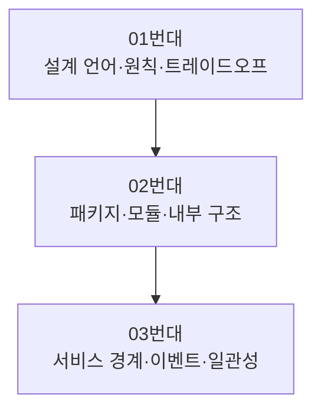
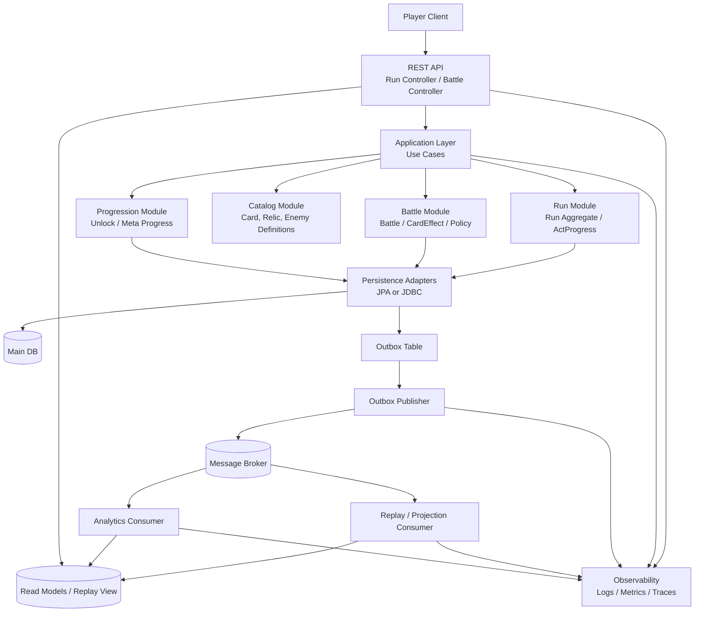

# 아키텍처 시리즈
---
> Spring Boot 4.x와 Java 25 기준으로 애플리케이션 아키텍처를 정리한다. 하나의 도메인을 여러 아키텍처 관점으로 반복 해석한다.

예시 프로젝트는 로그라이크 덱빌딩 게임 `Slay the Spire 2` 스타일의 단일 런(run) 관리 서비스다. 플레이어가 런을 시작하고, 전투를 진행하고, 보상을 선택하고, 다음 노드로 이동하는 흐름을 중심으로 설명한다. 단순 쇼핑몰 예제보다 규칙 변화와 상태 전이가 풍부해 객체지향·DDD·이벤트 소싱 같은 주제를 설명하기에 적합하다.

## 1. 공통 도메인

시리즈 전체에서 사용하는 핵심 용어는 다음과 같다:

- `Run`: 플레이어의 단일 게임 세션
- `Battle`: 턴 기반 전투 단위
- `Deck`, `Hand`, `DrawPile`, `DiscardPile`: 카드 상태 집합
- `Relic`, `Potion`, `Reward`: 런 중 획득 가능한 보조 요소
- `ActProgress`: 맵 진행 상태와 보스 도달 여부

## 2. 기준 기술 스택

본 시리즈는 다음 전제 위에 작성한다:

- 프레임워크: Spring Boot `4.x`
- 언어: Java `25` (record, sealed type, virtual thread 활용)
- 아키텍처 스타일: 모듈러 모놀리스 우선, 필요 시 서비스 분리
- 비동기 처리: 메시징 기반 확장 가능

Spring Boot 4.x는 최신 Jakarta 스택과 관측성, 모듈화, AOT 친화성을 전제한다. Java 25는 현대적 언어/런타임 기능을 안정적으로 활용하는 기준점이다.

## 3. 읽는 순서

> 번호 순서대로 읽으면 개념이 자연스럽게 이어진다. 01번대는 기초, 02번대는 애플리케이션 내부, 03번대는 서비스 경계와 이벤트 흐름이다.

01번대에서 설계 언어와 품질 속성, 아키텍트 관점을 맞춘다. 02번대에서 한 애플리케이션 내부를 어떻게 나눌지 결정한다. 03번대에서 서비스 경계를 어디에 두고 어떻게 통신·일관성을 유지할지 다룬다.

## 4. 문서 목록

### 01번대 — 아키텍처 기초와 아키텍트 관점

| # | 문서 | 다루는 질문 |
|---|------|------------|
| 01-01 | [소프트웨어 아키텍처와 품질 속성](01-01.소프트웨어%20아키텍처와%20품질%20속성.md) | 아키텍처는 무엇을 지키는 제약인가 |
| 01-02 | [객체지향과 설계 원칙](01-02.객체지향과%20설계%20원칙.md) | 좋은 객체와 SOLID는 어떻게 적용하는가 |
| 01-04 | [아키텍트의 관점과 품질 속성 트레이드오프](01-04.아키텍트의%20관점과%20품질%20속성%20트레이드오프.md) | 어떤 결정이 무엇을 희생하는가 |
| 01-05 | [ADR과 Spring Boot 아키텍처 의사결정](01-05.ADR과%20Spring%20Boot%20아키텍처%20의사결정.md) | 결정을 어떻게 남길 것인가 |

> 01-03 유비쿼터스 언어와 도메인 모델은 [`03_ddd/`](03_ddd/) 서브폴더로 이동했다.

### 02번대 — 애플리케이션 내부 구조

| # | 문서 | 다루는 질문 |
|---|------|------------|
| 02-01 | [Spring Boot 레이어드 아키텍처와 패키지 구조](02-01.Spring%20Boot%20레이어드%20아키텍처와%20패키지%20구조.md) | 가장 흔한 출발점에서 service가 비대해지는 이유 |
| 02-02 | [클린 아키텍처](02-02.클린%20아키텍처.md) | 의존성 규칙이 풀고자 한 문제 |
| 02-03 | [헥사고날 아키텍처](02-03.헥사고날%20아키텍처.md) | Ports & Adapters의 책임 분할 |
| 02-05 | [모듈러 모놀리스와 Spring Modulith](02-05.모듈러%20모놀리스와%20Spring%20Modulith.md) | 모놀리스 안에서 경계를 어떻게 강제할 것인가 |
| 02-07 | [계층 내부 의존성 룰 — 사이클 방지를 위한 sub-layer DAG](02-07.계층%20내부%20의존성%20룰%20—%20사이클%20방지를%20위한%20sub-layer%20DAG.md) | 같은 레이어 내 사이클을 어떻게 막을 것인가 |
| 02-08 | [도구 레이어 — Implement Layer와 Reader Writer 패턴](02-08.도구%20레이어%20—%20Implement%20Layer와%20Reader%20Writer%20패턴.md) | 추가 분할은 어떤 책임을 표현해야 하는가 |
| 02-10 | [다중 엔티티 조회 API 설계](02-10.다중%20엔티티%20조회%20API%20설계.md) | API Composition·BFF·GraphQL 중 어느 것 |
| 02-11 | [실용적 아키텍처 패턴 — 5계층 절충형](02-11.실용적%20아키텍처%20패턴%20—%205계층%20절충형.md) | 유스케이스를 1급 계층으로, 나머지는 필요할 때만 |

> 02-04 (DDD 전략적·전술적 패턴), 02-06 (헥사고날 변형 TPS 사례), 02-09 (도메인 책임 분리) 는 [`03_ddd/`](03_ddd/) 서브폴더로 이동했다.

### 03번대 — 서비스 경계와 이벤트 기반 확장

| # | 문서 | 다루는 질문 |
|---|------|------------|
| 03-01 | [분산 아키텍처 기초](03-01.분산%20아키텍처%20기초.md) | 언제 분리하고 무엇을 잃는가 |
| 03-02 | [서비스 간 연동 방식 비교](03-02.서비스%20간%20연동%20방식%20비교.md) | 동기·비동기·이벤트 통신의 차이 |
| 03-03 | [REST, gRPC, Messaging 선택 기준](03-03.REST%2C%20gRPC%2C%20Messaging%20선택%20기준.md) | 워크로드별 통신 프로토콜 선택 |
| 03-04 | [트랜잭션 경계와 데이터 일관성](03-04.트랜잭션%20경계와%20데이터%20일관성.md) | 강한 일관성 vs 결과적 일관성 |
| 03-05 | [프론트엔드와 백엔드의 책임 경계](03-05.프론트엔드와%20백엔드의%20책임%20경계.md) | 진실 공급원은 어디에 두는가, 02-10과 자매 관계 |

### 04번대 — 도메인 주도 설계 시리즈

DDD 4개 절(전략·전술·진화·사례) 을 독립 시리즈로 묶었다. SSOT: `docs/02_Architecture/02_DDD/` 13편.

→ [`03_ddd/`](03_ddd/) — 절 체계와 문서 목록은 서브폴더 README 참조. 갭은 [`03_ddd/GAP.md`](03_ddd/GAP.md).

### 05번대 — 이벤트 기반 아키텍처 시리즈

EDA 4개 절(기초·처리 모델·워크플로우·운영) 을 독립 시리즈로 묶었다. SSOT: `docs/02_Architecture/03_EventDriven/` 17편. 구현 디테일은 [`../04_messaging/`](../04_messaging/) 에 위임.

→ [`04_edd/`](04_edd/) — 절 체계와 문서 목록은 서브폴더 README 참조. 갭은 [`04_edd/GAP.md`](04_edd/GAP.md).

## 5. 관련 참고

본 시리즈는 `poc/02_Architecture/01-event-driven`의 학습 자료와 연결된다. 특히 CQRS, 이벤트 소싱, Saga, Request-Response Bridge 문서는 해당 PoC 개념 흐름을 Spring Boot 애플리케이션 설계 관점으로 가져온 것이다.

문서 형식은 `write/` 하네스를 따른다. 한 문서 안에서는 번호 있는 `##` 섹션을 유지하고, 문체는 한다체로 통일한다.

## 6. 최종 구현 흐름

이 시리즈의 내용을 모두 반영해 구현하면 프로그램은 대체로 다음 흐름으로 동작한다:

핵심 게임플레이는 `Run`과 `Battle` 모듈이 같은 애플리케이션 안에서 강한 일관성으로 처리한다. 전투 완료, 보상 선택, 런 종료 같은 사실은 Outbox를 거쳐 메시지 브로커로 전달되고, 리플레이 뷰와 분석 모델은 이를 비동기로 소비해 별도 읽기 모델을 만든다.

## 7. 후속 주제 (예정)

Spring의 **설계 철학** 관점은 별도 추가가 예정되어 있다. Spring Framework의 구현 디테일은 [`11_spring/`](../11_spring/)에 속하며, 본 시리즈는 아키텍처 원칙과의 연결만 다룬다.

- `IoC를 GoF·DIP 관점으로 해석` — IoC가 풀고자 했던 설계 문제
- `AOP가 해결하는 횡단 관심사` — Decorator 패턴의 프레임워크화
- `Convention over Configuration` — Spring Boot의 철학적 기반

## 8. 작성 메모

02-06~02-10과 03-05는 2026-05-16에 표준 패턴(PoEAA, DDD, Hexagonal, BFF/GraphQL) 관점으로 신규 작성되었다. 02-06은 TPS 결재 도메인을 사례로 헥사고날 변형 결정을, 02-08~02-10과 03-05는 클라이언트·서버 책임 분담 문제를 차례로 다룬다.

02-11은 2026-05-24에 mangkyu/455 "실용적 아키텍처 패턴"을 정리해 신규 작성되었다. 레이어드·클린·헥사고날·도구 레이어의 장점만 절충해 유스케이스를 1급 계층으로 끌어올린 5계층 패턴으로, 02-01·02-02·02-03·02-08과 cross-link된다.
