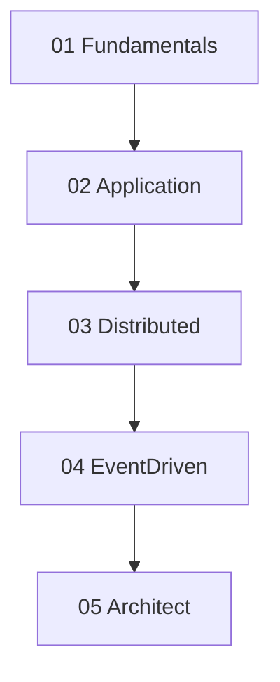
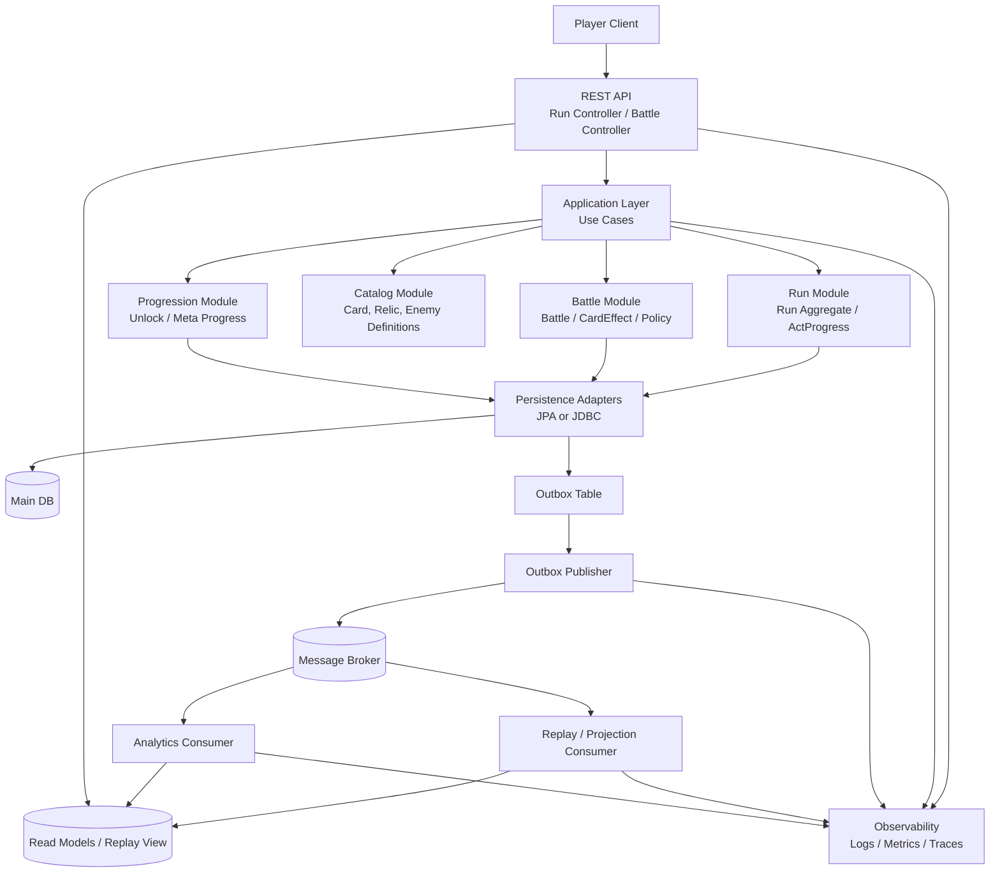
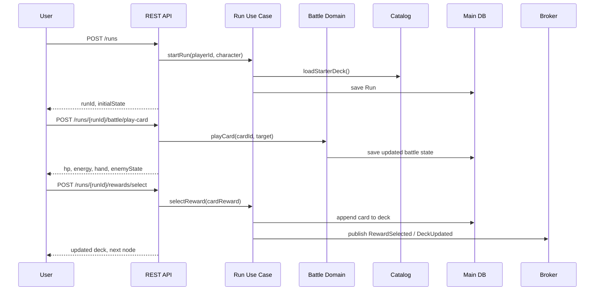

# 아키텍처 시리즈
---
> Spring Boot 4.x와 Java 25를 기준으로 애플리케이션 아키텍처를 정리한다.
>
> - 공통 예시 프로젝트: `Slay the Spire 2` 스타일의 런 관리 서비스
> - 공통 관점: 객체지향, DDD, 클린/헥사고날, 분산 연동, 이벤트 기반 확장
> - 공통 목표: Spring Boot에서 어디까지 모놀리스로 두고, 어디부터 분리할지 판단한다.

이 시리즈는 하나의 도메인을 여러 아키텍처 관점으로 반복해 해석하는 방식으로 구성한다. 예시 프로젝트는 로그라이크 덱빌딩 게임의 단일 런(run) 관리 서비스다. 플레이어가 런을 시작하고, 전투를 진행하고, 보상을 선택하고, 다음 노드로 이동하는 흐름을 중심으로 설명한다.

## 1. 공통 도메인

시리즈 전체에서 사용하는 핵심 용어는 다음과 같다:

- `Run`: 플레이어의 단일 게임 세션
- `Battle`: 턴 기반 전투 단위
- `Deck`, `Hand`, `DrawPile`, `DiscardPile`: 카드 상태 집합
- `Relic`, `Potion`, `Reward`: 런 중 획득 가능한 보조 요소
- `ActProgress`: 맵 진행 상태와 보스 도달 여부

이 도메인은 단순 쇼핑몰보다 규칙 변화가 많고 상태 전이가 풍부하다. 그래서 객체지향, 유비쿼터스 언어, 이벤트 소싱 같은 설계 주제를 설명하기에 적합하다.

## 2. 기준 기술 스택

본 문서의 기본 전제는 다음과 같다:

- 프레임워크: Spring Boot `4.x`
- 언어: Java `25`
- 아키텍처 스타일: 모듈러 모놀리스 우선, 필요 시 서비스 분리
- 비동기 처리: 메시징 기반 확장 가능

Spring Boot 4.x는 최신 Jakarta 기반 스택, 관측성, 모듈화, AOT 친화성을 전제로 삼는다. Java 25는 record, sealed type, virtual thread 같은 현대적 언어/런타임 기능을 안정적으로 활용하는 기준점으로 둔다.

## 3. 읽는 순서

다음 순서로 읽으면 개념이 자연스럽게 이어진다:

1단계에서는 설계 언어를 맞춘다. 2단계에서는 애플리케이션 구조를 정한다. 3단계에서는 서비스 경계를 고민한다. 4단계에서는 이벤트 기반 확장을 다룬다. 5단계에서는 아키텍트 관점에서 트레이드오프를 정리한다.

## 4. 디렉토리 구성

| 디렉토리 | 설명 | 대표 질문 |
|----------|------|----------|
| `01_Fundamentals` | 설계 언어와 기본 원칙 | 좋은 객체와 좋은 모델은 무엇인가 |
| `02_Application` | 애플리케이션 내부 구조 | 패키지와 모듈을 어떻게 나눌 것인가 |
| `03_Distributed` | 서비스 간 연동과 일관성 | 언제 분리하고 어떻게 통신할 것인가 |
| `04_EventDriven` | CQRS, 이벤트 소싱, Saga | 상태를 이벤트로 다뤄야 하는가 |
| `05_Architect` | 품질 속성과 ADR | 어떤 결정을 어떤 근거로 남길 것인가 |

## 5. 관련 참고

이 시리즈는 `poc/02_Architecture/01-event-driven`의 학습 자료와 연결된다. 특히 `CQRS`, `이벤트 소싱`, `Saga`, `Request-Response Bridge` 문서는 해당 PoC의 개념 흐름을 Spring Boot 애플리케이션 설계 쪽으로 끌어와 설명한다.

문서 형식은 기존 `write` 하위 문서의 구조를 따른다. 하나의 문서 안에서는 번호 있는 `##` 섹션을 유지하고, 문체는 한다체로 통일한다.

## 6. 최종 구현 흐름

이 시리즈의 내용을 모두 반영해 구현하면 프로그램은 대체로 다음 흐름으로 동작한다:

핵심 게임플레이는 `Run`과 `Battle` 모듈이 같은 애플리케이션 안에서 강한 일관성으로 처리한다. 전투 완료, 보상 선택, 런 종료 같은 사실은 Outbox를 거쳐 메시지 브로커로 전달되고, 리플레이 뷰와 분석 모델은 이를 비동기로 소비해 별도 읽기 모델을 만든다.

## 7. 패키지 구조도

실제 구현 시 패키지 구조는 대체로 다음처럼 잡을 수 있다:

```mermaid
flowchart TD
    Root[com.example.spire]
    Root --> Bootstrap[bootstrap]
    Root --> Shared[shared]
    Root --> Run[run]
    Root --> Battle[battle]
    Root --> Catalog[catalog]
    Root --> Progression[progression]
    Root --> Analytics[analytics]

    Run --> RunApi[api]
    Run --> RunApp[application]
    Run --> RunDomain[domain]
    Run --> RunInfra[infrastructure]

    Battle --> BattleApi[api]
    Battle --> BattleApp[application]
    Battle --> BattleDomain[domain]
    Battle --> BattleInfra[infrastructure]

    Catalog --> CatalogApi[api]
    Catalog --> CatalogApp[application]
    Catalog --> CatalogDomain[domain]
    Catalog --> CatalogInfra[infrastructure]

    Progression --> ProgressionApi[api]
    Progression --> ProgressionApp[application]
    Progression --> ProgressionDomain[domain]
    Progression --> ProgressionInfra[infrastructure]

    Analytics --> AnalyticsApi[api]
    Analytics --> AnalyticsApp[application]
    Analytics --> AnalyticsDomain[domain]
    Analytics --> AnalyticsInfra[infrastructure]
```

각 모듈은 같은 내부 구조를 가진다. `api`는 외부에 노출되는 계약, `application`은 유스케이스 조합, `domain`은 핵심 규칙, `infrastructure`는 DB와 메시징 같은 기술 구현을 담당한다.

## 8. 실제 사용자 흐름

이 문서 세트가 전제하는 예시 프로젝트는 단순 조회 서버가 아니다. 제대로 구현하면 실제로 다음 같은 흐름이 가능하다:

- 사용자가 새 런을 시작한다.
- 서버가 시작 덱, 시작 체력, 시작 유물, 시작 맵 상태를 만든다.
- 사용자가 전투에서 카드를 한 장 사용한다.
- 서버가 에너지, 손패, 적 체력, 상태 이상, 턴 종료 여부를 계산한다.
- 전투 승리 후 카드 보상을 선택하면 서버가 덱에 카드를 추가한다.
- 다음 노드로 이동하면 `Run` 상태가 갱신되고, 필요한 이벤트가 외부로 발행된다.

즉 이 구조는 실제로 **배틀 시뮬레이션**과 **카드 보상 선택 후 덱 편입**을 처리할 수 있는 형태다. 다만 현재 `write/03_architecture`는 그 서버를 설계하는 문서 세트이지, 실행 가능한 게임 서버 코드를 이미 구현한 상태는 아니다.

## 9. 예시 시나리오

사용자 한 명의 실제 흐름을 단순화하면 다음과 같다:

여기서 중요한 점은 카드 선택 결과가 실제 `Run`의 덱 상태를 바꾼다는 것이다. 따라서 이 설계는 “문서만 그럴듯한 구조”가 아니라, 실제 Slay the Spire 스타일 게임 진행을 서버 쪽에서 관리할 수 있는 모델을 전제로 한다.
