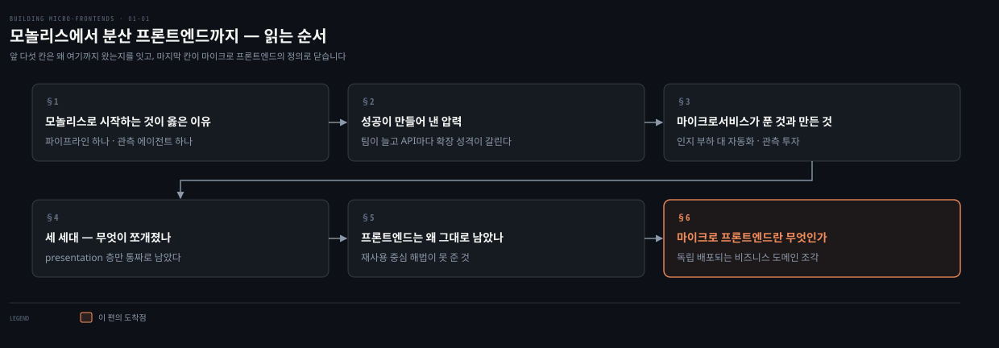
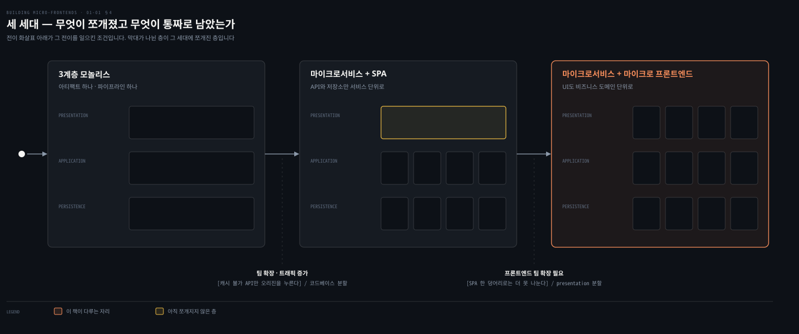
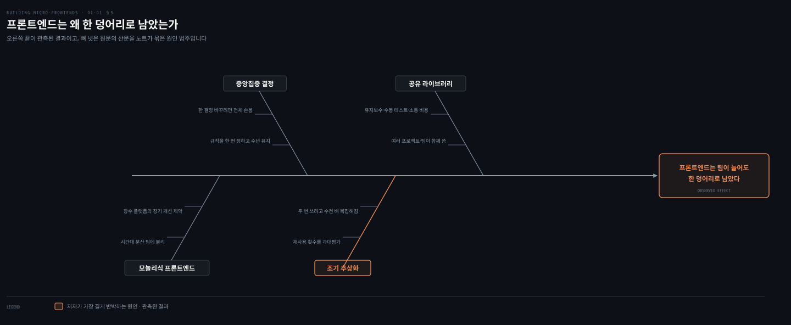
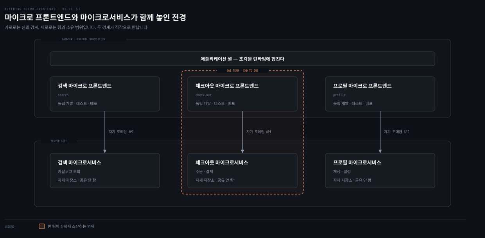

# 모놀리스에서 분산 프론트엔드까지

---

> 1장 전반부는 마이크로 프론트엔드가 무엇인지 말하기 전에 왜 그것이 필요해졌는지를 먼저 답합니다. 저자는 모놀리스가 옳았던 자리에서 출발해 백엔드만 쪼개진 경위를 짚고, 프론트엔드가 통짜로 남은 채 무엇을 잃었는지로 이어 갑니다.

## 핵심 요약

> 이 편이 매달린 하나의 생각은 **모놀리스를 쪼개는 힘이 백엔드에서는 마이크로서비스로 결실을 봤지만 프론트엔드에는 닿지 않았고, 그 빈자리를 메우려는 것이 마이크로 프론트엔드**라는 것입니다.

모놀리스는 처음에 옳은 선택입니다. 파이프라인 하나, 관측 에이전트 하나, 배포 전략 하나로 끝나기 때문에 팀은 자동화가 아니라 비즈니스 로직에 힘을 씁니다. 그 선택을 뒤집는 것은 실패가 아니라 성공입니다. 팀이 커지면 소통 비용이 붙고 소수가 전원의 몫을 결정하게 됩니다. 저자가 분할을 결심한 근거도 직감이 아니라 관측이었습니다. 로그를 보니 캐시가 잘 되는 API는 CDN이 대부분 흡수하고 있었고 오리진을 누르는 것은 캐시가 안 되는 소수뿐이었습니다.

그런데 쪼개진 것은 백엔드뿐이었습니다. 애플리케이션 층과 저장소 층은 서비스 단위로 갈라졌지만 프레젠테이션 층은 SPA 한 덩어리로 남았고, 프론트엔드가 택한 답은 분할이 아니라 재사용이었습니다. 공유 컴포넌트 라이브러리와 로직 추상화가 그것입니다. 저자는 그 답이 팀 자율성을 주지 못했다고 봅니다. 규칙은 한 번 정해지면 수년을 가고 조기 추상화는 두 번 쓰려고 코드를 수천 배 복잡하게 만들기 때문입니다.

## 학습 목표

이 내용을 읽고 나면:

1. 새 프로젝트에서 모놀리스가 합리적인 선택인 이유를 자동화 비용의 관점에서 설명할 수 있습니다.
2. 저자가 모놀리스를 쪼갤 시점을 판단할 때 근거로 삼은 관측이 무엇이었는지 말할 수 있습니다.
3. 마이크로서비스가 준 것과 대신 요구한 투자를 나누어 설명할 수 있습니다.
4. 공유 컴포넌트 라이브러리와 코드 추상화가 프론트엔드 확장의 답이 되지 못한 이유를 댈 수 있습니다.
5. 마이크로 프론트엔드의 정의를 저자의 문장대로 재현하고, 그 정의의 각 조각이 무엇을 막는지 설명할 수 있습니다.

아래는 이 문서를 읽는 순서로 이은 지도입니다. 칸마다 절 번호와 그 절이 답하는 질문 하나를 적었습니다. 색이 붙은 마지막 칸이 이 편의 도착점입니다.

## 1. 모놀리스로 시작하는 것이 옳은 이유

> 저자가 신생 프로젝트에 모놀리스를 권하는 근거는 코드가 작다는 데 있지 않습니다. 무엇에 힘을 쓰게 되느냐에 있습니다.

### 풀려는 문제

마이크로서비스를 겪어 본 사람일수록 새 프로젝트를 처음부터 쪼개고 싶어집니다. 나중에 쪼개려면 더 비싸다는 것을 알기 때문입니다. 그런데 저자는 반대로 말합니다.

여기서 흔히 듣는 답이 "아직 작으니까"입니다. 이 답은 판단 기준이 못 됩니다. 얼마나 작아야 작은 것인지 말해 주지 않기 때문입니다. 팀이 다섯 명이면 모놀리스이고 열 명이면 아닌지, 엔드포인트가 서른 개면 어느 쪽인지 이 답으로는 정할 수 없습니다.

### 저자가 대는 근거 — 아끼는 것이 코드가 아니다

그래서 파고들 것이 이겁니다. 저자가 아끼라고 한 것은 코드의 양이 아니라 **힘을 쓰는 대상**입니다.

새 서비스를 여는 첫 반복의 목적은 아이디어가 성공할 만한지 확인하는 데 있습니다. 저자는 이 단계에서 팀에 익숙한 기술 스택을 고르라고 말합니다. 불필요한 장식을 걷어내고 최소한만 남겨야 사용자에게서 정보를 빨리 얻기 때문입니다. 이렇게 만든 것을 최소 기능 제품, 곧 MVP라고 부릅니다.

API 층을 하나의 코드베이스로 두면 아끼는 것이 셋입니다.

- 지속적 통합과 배포 파이프라인을 하나만 세우면 됩니다.
- 관측성은 가상 머신이나 컨테이너마다 에이전트를 하나씩 돌리는 것으로 끝납니다.
- 배포도 자동화 전략 하나와 릴리스 전략 하나로 API 층 전체를 덮습니다.

트래픽이 늘어도 대응이 단순합니다. 요청을 감당할 만큼 애플리케이션 서버를 옆으로 늘리면 됩니다.

남은 결정도 같은 기준으로 고릅니다. 데이터는 그래프와 NoSQL과 SQL 가운데 사업에 맞는 것을 고르고, 호스팅은 클라우드와 온프레미스 중에서 정합니다. 표현 계층도 마찬가지입니다. 익숙한 자바스크립트 프레임워크를 고르고 서버 사이드 렌더링과 단일 페이지 애플리케이션 중 하나를 정한 뒤 코드 컨벤션과 린팅과 CSS 규칙을 세웁니다.

그 끝에 남는 그림이 원문 Figure 1-1의 3계층 구조입니다. 표현 계층인 프론트엔드, 애플리케이션 계층인 API 층, 그리고 영속 계층인 데이터베이스입니다.

### 읽어내기 — 크기가 아니라 값의 시점

저자는 이 셈을 그대로 결론으로 씁니다. 모놀리식 아키텍처가 신생 프로젝트에 좋은 선택인 이유는 자동화 같은 복잡한 일에 힘을 덜 쓰고 비즈니스 로직에 더 쓸 수 있기 때문입니다.

그러면 앞의 질문에 답이 생깁니다. **"작으니까"가 아니라 "자동화에 낼 값이 아직 값을 못 하니까"입니다.** 기준이 팀 인원수에서 투자 회수 시점으로 옮겨 갑니다. 이 기준은 다음 절에서 그대로 뒤집힙니다. 자동화 투자가 값을 하기 시작하는 순간이 곧 쪼갤 순간이기 때문입니다.

## 2. 성공이 만들어 낸 압력

> 언제 쪼갤지를 정한 것은 조직 규모가 아니라 로그와 대시보드에서 읽은 확장 성격의 차이였습니다.

### 풀려는 문제

앞 절의 기준을 받아들이면 곧바로 다음 질문이 옵니다. 그러면 언제 쪼개야 할까요.

실무에서 이 결정은 대개 체감으로 내려집니다. 아래 같은 감각이 쌓이면 분리 이야기가 나옵니다.

- 배포가 느려졌습니다.
- 릴리스가 무섭습니다.
- 회의가 길어졌습니다. 문제는 이 감각이 근거가 아니라는 데 있습니다. 같은 감각을 근거로 쪼갠 팀이 6개월 뒤 서비스 사이를 오가는 호출을 세며 후회하는 일이 드물지 않습니다.

### 저자가 실제로 본 것

그래서 눈여겨볼 것이 저자가 무엇을 보고 결정했는지입니다. 그는 감각을 적지 않고 관측을 적습니다.

사업이 검증되면 회사는 기술 조직을 키웁니다. 엔지니어와 품질 분석가와 스크럼 마스터가 들어옵니다. 팀이 중형 이상으로 커지면 소통 비용이 붙고, 소수가 전원을 대신해 결정하는 중앙집중 구조가 굳습니다. 큰 모놀리스를 가진 회사는 새 기능 하나를 내보내는 데 필요한 모든 작업이 느려집니다. 배포할 때마다 코드베이스 전체를 테스트하고 내보내야 하므로 운영 API를 깨뜨리거나 새 버그를 심을 확률도 올라갑니다.

여기까지는 감각과 같습니다. 다른 것은 그다음입니다. 저자는 로그와 대시보드를 열고 **API마다 확장 성격이 다르다**는 사실을 셉니다.

- 캐시가 잘 듣는 API는 CDN이 대다수 클라이언트를 받아 내고 있었습니다.
- 오리진 서버가 압박을 받는 것은 캐시가 안 되는 응답을 낼 때뿐이었습니다.
- 그런 응답은 다행히 소수였습니다.

이 관측 위에서 저자는 분할이 말이 되기 시작한다고 적습니다. 내부 성장과 함께 시스템이 어떻게 도는지에 대한 이해가 나아졌기 때문입니다.

### 분할이 저장소까지 바꾼다

분할은 API에서 끝나지 않습니다. 저장소 전략까지 함께 바뀝니다. 데이터베이스는 여러 개가 되고 서비스끼리 공유하지 않습니다. 필요하면 데이터를 부분적으로 복제해 각 서비스가 응답 지연을 줄이도록 합니다.

그 결과가 탈중앙 생태계입니다. 움직이는 부품은 많아지지만 민첩성이 올라가고 위험은 줄어듭니다. 팀마다 자기 서비스 묶음을 책임집니다. 어떤 데이터베이스를 쓸지, 스키마를 어떻게 짤지, 무엇을 캐시할지, 어떤 언어를 고를지를 팀이 정합니다. 시스템 전체에 걸친 공통 표준은 로깅과 모니터링 같은 핵심 결정에만 남습니다.

### 읽어내기 — 순서가 뒤집히면 실패한다

앞의 질문으로 돌아가면 답은 이렇습니다. **쪼갤 시점은 조직이 커진 때가 아니라 시스템의 확장 성격을 셀 수 있게 된 때입니다.**

저자의 순서가 그것을 보여 줍니다. 유행이 아니라 측정이 먼저였습니다. 측정이 "일부 API만 자동으로 확장된다"는 사실을 준 다음에 분할이 왔습니다. 순서를 뒤집으면 어떤 경계를 그어야 할지 모르는 채 나누게 되고, 그 결과가 다음 절의 실패입니다.

## 3. 마이크로서비스가 푼 것과 새로 만든 것

> 마이크로서비스가 실패하는 원인은 마이크로서비스 자체가 아니라 경계를 그은 자리에 있습니다.

### 풀려는 문제

마이크로서비스의 장점 목록은 어디에나 있습니다. 그 목록을 보고 도입한 팀 가운데 상당수가 몇 년 뒤 같은 자리에 도착합니다. 서비스는 여럿인데 배포는 늘 함께 나가고, 하나를 고치려면 옆의 셋을 같이 봐야 합니다. 쪼개기 전보다 나빠진 셈입니다.

장점 목록만으로는 이 결말을 설명할 수 없습니다. 목록에 없는 것이 있다는 뜻입니다.

### 얻은 것과 낸 값

저자는 이득과 값을 나란히 적습니다. 이득은 둘입니다.

- **인지 부하의 감소** — 각 서비스가 더 작고 단순한 문제를 맡으므로 개발자는 수천 줄의 모놀리스를 통째로 들여다보지 않아도 됩니다. 코드베이스와 그 기능에 대한 그림을 또렷하게 유지하기가 쉬워집니다.
- **부분 확장** — 애플리케이션의 일부만 따로 확장하고, 서비스마다 가장 알맞은 방식을 골라 쓸 수 있습니다. 모놀리스의 획일적인 모델과 다른 점이 여기입니다.

대신 요구하는 값이 있습니다. 저자는 분산 시스템을 통제하려면 자동화와 관측성과 모니터링에 상당한 투자가 필요하다고 적습니다. 이 값을 안 내면 분산은 이득이 아니라 부채가 됩니다.

| 축 | 모놀리스가 유리한 자리 | 마이크로서비스가 유리한 자리 |
|---|---|---|
| 초기 속도 | 파이프라인·관측·배포가 각각 하나 | 서비스 수만큼 파이프라인이 늘어남 |
| 인지 부하 | 작을 때는 전체를 한눈에 봄 | 커진 뒤에는 서비스 단위로 좁혀 봄 |
| 확장 | 서버를 옆으로 늘리는 획일적 대응 | 필요한 서비스만, 그 서비스에 맞는 방식으로 |
| 배포 위험 | 매번 전체를 테스트·배포 | 서비스 단위로 독립 배포 |
| 실패 지점 | 한 곳이 무너지면 전부 | 잘못 그은 경계가 강결합을 만듦 |

### 읽어내기 — 목록에 없던 항목은 경계였다

앞의 결말을 설명하는 것이 표의 마지막 줄입니다. 저자가 드는 예는 혼자서는 아무 동작도 완결하지 못할 만큼 작게 잘라 놓은 서비스입니다. 그런 서비스는 다른 서비스에 크게 기댈 수밖에 없습니다. 그러면 서비스 사이에 강한 결합이 생기고, 배포할 때마다 함께 나가야 합니다. 이 현상이 여러 서비스로 번지면 확장하기 어려울 만큼 복잡한 시스템이 됩니다. 저자는 그것을 큰 진흙 공에 빗댑니다.

그래서 저자의 결론은 조건부입니다. 소프트웨어 아키텍처의 선택지를 놓고 볼 때 마이크로서비스는 필요할 때만 고르는 것입니다. 최신이고 좋아 보인다는 이유로 무턱대고 도입하는 일은 피해야 합니다.

**목록에 없던 항목은 "경계를 어디에 긋는가"였습니다.** 이 항목은 다음 절부터 프론트엔드에서 다시 나옵니다.

## 4. 세 세대 — 무엇이 쪼개졌고 무엇이 통짜로 남았는가

> 저자가 세 장의 그림으로 나누어 보인 상태를 한 축 위에 이어 붙이면, 세 계층 가운데 프레젠테이션만 마지막까지 통짜로 남았다는 사실이 드러납니다.

### 풀려는 문제

여기까지는 익숙한 이야기입니다. 모놀리스를 쪼개 마이크로서비스로 갔고, 그 과정에서 무엇을 얻고 무엇을 잃는지도 봤습니다.

그런데 그 결과 그림에서 프론트엔드가 어디에 있는지는 잘 보이지 않습니다. 마이크로서비스 아키텍처 도해를 떠올리면 대개 서비스 상자들과 데이터베이스가 먼저 그려지고, 브라우저는 맨 위에 상자 하나로 붙습니다. 그 상자 하나가 무슨 상태인지는 묻지 않고 넘어갑니다.

### 세 그림을 한 축에 세우면

그래서 해 볼 것이 이겁니다. 원문은 Figure 1-1과 Figure 1-2와 Figure 1-3을 각각 다른 절에서 보여 주는데, 세 그림을 한 줄로 세워 보면 그 상자 하나의 이력이 나옵니다. 이렇게 세우는 것은 원문에 없는 노트의 읽기입니다. 세 그림이 같은 시스템의 세 세대라는 점은 저자의 서술 순서가 그대로 말해 줍니다.

첫 세대는 3계층 모놀리스입니다. 프레젠테이션과 애플리케이션과 영속 계층이 각각 하나씩입니다. 아티팩트도 하나이고 파이프라인도 하나입니다.

둘째 세대에서 애플리케이션 계층과 영속 계층이 갈라집니다. API는 마이크로서비스가 되고 데이터베이스는 서비스마다 따로 섭니다.

### 읽어내기 — 캡션 안에 답이 있다

원문 Figure 1-2의 캡션이 이 상태를 "Microservices with SPA"라고 적습니다. **캡션 안의 SPA가 이 편의 결론을 미리 말해 줍니다.** 프레젠테이션 계층은 여전히 단일 페이지 애플리케이션 한 덩어리입니다. 위 도식에서 색이 다른 막대 하나가 그 자리입니다.

저자는 이 상태를 그대로 질문으로 바꿉니다. API 층과 영속 층은 잘 정의된 패턴과 모범 사례로 확장할 수 있는데, 사업이 커져서 프론트엔드 팀까지 확장해야 할 때는 어떻게 하느냐는 질문입니다. 셋째 세대는 그 질문에 답한 상태입니다.

## 5. 프론트엔드는 왜 한 덩어리로 남았는가

> 프론트엔드도 나누기는 했습니다. 다만 나눈 축이 코드였고 팀이 아니었습니다.

### 풀려는 문제

앞 절의 사실을 놓고 나면 반문이 하나 생깁니다. 프론트엔드도 나눌 수 있지 않느냐는 것입니다. 실제로 나눕니다. 컴포넌트로 쪼개고 공통 로직을 라이브러리로 뺍니다. 디자인 시스템도 따로 둡니다.

그런데 그렇게 나눈 조직에서도 팀은 여전히 서로를 기다립니다.

- 릴리스는 한 번에 나갑니다.
- 프레임워크 버전을 올리려면 전원이 합의해야 합니다.
- 라이브러리 하나를 고치면 그 주에 세 팀이 회귀 테스트를 돕니다.

나누기는 했는데 자율성으로 이어지지 않은 것입니다.

### 전제가 무너진 자리

그래서 먼저 볼 것은 프론트엔드가 왜 확장을 고민하지 않아도 됐는가입니다. 몇 해 전까지는 그럴 필요가 크지 않았습니다. 표준 접근이 두꺼운 서버와 얇은 클라이언트였기 때문입니다. 비즈니스 로직은 전부 서버에서 돌고, 클라이언트는 서버가 내놓은 계산 결과를 보여 주는 역할이었습니다.

이 전제가 최근 몇 년 사이에 무너졌습니다. 사용자는 웹 플랫폼을 쓰면서 더 나은 경험과 더 매끄러운 상호작용을 기대합니다. 저자가 드는 생활의 변화가 구체적입니다.

- 편성 채널 대신 주문형 영상을 봅니다.
- CD를 사는 대신 애플리케이션으로 음악을 듣습니다.
- 식당에 전화하는 대신 모바일 앱으로 음식을 시킵니다.

이런 변화는 마찰 없는 경험을 요구합니다. 그 요구가 클라이언트 쪽 코드의 몸집을 키웠습니다.

### 재사용이라는 답과 그 값

몸집이 커진 프론트엔드를 다루려고 그동안 쓴 방법은 재사용이었습니다. 애플리케이션의 일부를 공유 컴포넌트 라이브러리로 떼어 내거나 비즈니스 로직을 별도 라이브러리로 추상화했습니다. 되도록 많은 코드를 재사용하는 것이 목표였습니다.

저자는 이 해법들이 틀렸다고 말하지 않습니다. 여전히 유효하고 많은 프로젝트에 잘 맞는다고 먼저 인정합니다. 다만 그것을 받아들일 때 만나는 문제가 적지 않다고 짚습니다. 원문은 이 문제들을 번호로 세지 않고 이어지는 산문으로 적습니다. 아래 넷으로 묶은 것은 노트의 읽기이며, 위 도식의 네 범주도 그 묶음을 그린 것입니다.

첫째는 중앙집중 결정입니다. 개발 팀이 여럿이면 코드베이스에 적용할 규칙은 대개 한 번 정해집니다. 그리고 수개월에서 수년을 그대로 갑니다. 결정 하나를 바꾸려면 코드베이스 전체에 걸쳐 상당한 노력이 들기 때문입니다. 고객에게도 회사에도 당장의 가치를 주지 않는 큰 투자가 됩니다.

둘째는 그 결정에 섞여 드는 타협입니다. 개발 중에 내리는 판단에는 시간 부족과 이상적인 일관성과 사람의 게으름이 끼어듭니다. 저자는 사업도 기술도 저마다의 속도로 변하며 이것은 피할 수 없다고 적습니다.

셋째는 조기 추상화입니다. 저자는 코드 추상화가 은탄환이 아니라고 못 박습니다. 재사용하려고 미리 추상화하면 이득보다 문제가 클 때가 잦습니다. 그가 자주 본 장면은 같은 프로젝트 안에서 딱 두 번 쓰이려고 코드가 수천 배 복잡해지는 일이었습니다. 많은 개발자가 수십 번 재사용될 것이라 여기고 과하게 설계하지만, 실제 재사용 횟수는 그보다 훨씬 적습니다. 여러 프로젝트와 팀에 걸쳐 라이브러리를 쓰는 것도 이득보다 복잡도를 키울 수 있습니다.

- 코드베이스가 유지하기 어려워집니다.
- 수동 테스트 부담이 늘어납니다.
- 소통 비용이 붙습니다.

넷째는 프론트엔드 모놀리스 자체의 구조입니다. 이 구조는 장기적으로 아키텍처를 개선할 여지를 좁힙니다. 여러 해 동안 서비스할 플랫폼이거나 여러 시간대에 흩어진 팀이 함께 일하는 경우에 특히 그렇습니다. 사업에 기술 전면 개편을 요구하면 결과가 나오기 전에 큰 선행 투자가 발생합니다.

### 읽어내기 — 넷이 공통으로 못 준 것

앞의 반문으로 돌아갑니다. 왜 나눴는데 자율성이 안 왔을까요. 네 원인을 겹쳐 보면 빠진 것이 하나로 모입니다. **넷 다 코드를 나눴을 뿐 배포를 나누지 않았습니다.**

공유 라이브러리는 함께 빌드됩니다. 중앙 결정은 전원에게 동시에 적용됩니다. 추상화는 호출자 모두를 묶습니다. 프론트엔드 모놀리스는 통째로 나갑니다. 나눈 단위가 배포 단위가 아니면 팀은 여전히 같은 릴리스 열차를 기다립니다.

이 넷을 모아 놓으면 저자의 질문이 자연스럽게 나옵니다. 다음 셋을 모두 해내는 잘 알려진 패턴이나 아키텍처가 있느냐는 질문입니다.

- 새 기능을 빠르게 더합니다.
- 사업과 함께 진화합니다.
- 애플리케이션의 일부를 자율적으로 내보냅니다.

조건이 하나 붙습니다. 한 번에 전부 내보내는 빅뱅 릴리스를 요구하지 않아야 합니다.

## 6. 마이크로 프론트엔드란 무엇인가

> 저자의 정의는 한 문장이지만, 그 안의 네 조각이 앞 절의 실패를 하나씩 막습니다.

### 풀려는 문제

여기서 가장 흔한 오해가 나옵니다. 마이크로 프론트엔드는 컴포넌트를 더 크게 나눈 것이냐는 것입니다.

이 오해가 생기는 이유가 있습니다. 화면에서 보이는 결과가 비슷하기 때문입니다. 화면 한 장이 여러 조각으로 이뤄지고 조각마다 담당이 다르다는 점은 컴포넌트 분할과 다르지 않아 보입니다. 오해를 풀려면 정의를 크기가 아니라 다른 축에서 읽어야 합니다.

### 저자의 정의

저자가 1장 도입에서 내리는 정의는 이렇습니다. 마이크로 프론트엔드는 독립적으로 개발되고 테스트되고 배포되는 사용자 인터페이스의 한 조각이며, 하나의 비즈니스 도메인을 나타냅니다. 그리고 런타임에 다른 마이크로 프론트엔드와 합쳐져 완전한 애플리케이션을 이룹니다. 그 결과로 팀은 자율적으로 일하고 기능을 독립적으로 릴리스합니다.

정의에 크기에 대한 언급이 없다는 점이 답입니다. 대신 배포와 도메인과 조합 시점이 들어 있습니다.

### 읽어내기 — 조각마다 막는 실패가 다르다

정의를 조각으로 끊어 앞 절의 네 원인과 나란히 놓으면, 각 조각이 무엇을 막으려고 거기 있는지 보입니다.

| 정의의 조각 | 막으려는 것 |
|---|---|
| 독립적으로 개발·테스트·배포된다 | 배포마다 전체를 테스트하고 내보내는 빅뱅 릴리스 |
| 하나의 비즈니스 도메인을 나타낸다 | 기술 축으로 잘라 도메인이 여러 팀에 흩어지는 일 |
| 런타임에 합쳐진다 | 빌드 시점에 묶여 함께 배포될 수밖에 없는 결합 |
| 팀이 자율적으로 일한다 | 중앙에서 내린 결정 하나가 전체를 묶어 두는 상태 |

앞 절이 지목한 공통 실패가 "배포를 안 나눴다"였으므로, 정의의 첫 조각과 셋째 조각이 정면으로 그것을 겨냥합니다. 컴포넌트 분할과 갈라지는 자리도 여기입니다. 컴포넌트는 크기를 줄이지만 배포 단위는 그대로 두고, 마이크로 프론트엔드는 배포 단위 자체를 나눕니다.

원문 Figure 1-3은 이 조각들이 마이크로서비스와 함께 놓였을 때의 전경을 보여 줍니다. 캡션은 마이크로서비스와 마이크로 프론트엔드가 함께 살 수 있음을 보이는 상위 수준 그림이라고 적습니다. 위 도식의 도메인 이름은 지어낸 것이 아니라 저자가 프론트엔드 도메인의 예로 든 체크아웃과 검색과 프로필을 그대로 쓴 것입니다.

저자는 정의를 내놓자마자 경계도 함께 칩니다. 마이크로서비스가 모든 소프트웨어 분해의 보편적인 답이 아니듯 마이크로 프론트엔드도 그렇습니다. 이 경고는 1장 후반부에서 적합한 상황과 그렇지 않은 상황의 목록으로 다시 나옵니다.

## 심화 학습

> 아래 두 링크는 책 밖 보강입니다. 본문의 주장을 대체하지 않고 배경만 채웁니다.

저자가 큰 진흙 공이라고 부른 상태에는 원전이 있습니다. Brian Foote와 Joseph Yoder가 1997년 PLoP 컨퍼런스에서 발표한 [Big Ball of Mud](http://www.laputan.org/mud/)입니다. 경계 없이 자란 시스템이 어떤 모습이 되는지를 패턴으로 정리한 글입니다.

마이크로 프론트엔드를 다룬 널리 읽히는 글로 Cam Jackson이 2019년 6월 Martin Fowler의 사이트에 쓴 [Micro Frontends](https://martinfowler.com/articles/micro-frontends.html)가 있습니다. 이 책이 나오기 전에 커뮤니티의 공통 어휘를 만든 글이라, 책의 용어와 어긋나는 부분이 있는지 대조하며 읽으면 좋습니다.

## 적용 관점

> 아래는 백엔드 개발자가 이미 가진 판단 기준과 이 장을 잇는 노트의 읽기입니다. 책이 백엔드 독자를 향해 쓴 대목이 아닙니다.

모놀리스로 시작하라는 저자의 근거는 백엔드에서 이미 쓰는 근거와 같습니다. 자동화 복잡도에 쓸 힘을 비즈니스 로직으로 돌린다는 것입니다. Spring Boot 애플리케이션 하나로 시작하고 필요할 때 모듈을 가르는 판단이 같은 자리에 있습니다.

더 옮겨 쓸 만한 것은 저자가 분할 시점을 정한 방법입니다. 그는 "이제 마이크로서비스를 할 때가 됐다"에서 출발하지 않았습니다. 로그와 대시보드를 보고 어떤 API가 CDN에 흡수되고 어떤 API가 오리진을 누르는지 먼저 셌습니다. 서비스 분리를 논의할 때 같은 순서를 지킬 수 있습니다. 경계를 긋기 전에 어느 엔드포인트가 어떤 확장 성격을 갖는지를 먼저 재는 것입니다.

경계를 잘못 그은 마이크로서비스의 증상도 낯설지 않습니다. 혼자서는 동작을 완결하지 못해 다른 서비스를 계속 부르고, 그래서 배포가 늘 함께 나갑니다. 이는 Aggregate 경계를 너무 잘게 잡았을 때 나타나는 증상과 같은 모양입니다. 자세한 판단 기준은 [Aggregate 설계 규칙](../../04_ddd/02-01.Aggregate%20설계%20규칙.md)이 갖고 있습니다.

마지막으로 §5의 결론은 백엔드의 공통 모듈 이야기와 같습니다. 여러 팀이 함께 쓰는 `common` 모듈이 어느 순간부터 아무도 못 고치는 자산이 되는 과정이 저자가 프론트엔드에서 관찰한 것과 같은 인과입니다. 규칙이 한 번 정해집니다. 바꾸려면 전체를 손봐야 합니다. 그래서 아무도 바꾸지 않습니다. 나눈 단위가 배포 단위가 아니면 코드를 아무리 잘게 잘라도 자율성은 오지 않습니다.

## 면접 대비

### 한 줄 정의

마이크로 프론트엔드란 독립적으로 개발·테스트·배포되며 하나의 비즈니스 도메인을 나타내는 UI 조각으로, 런타임에 다른 조각과 합쳐져 완전한 애플리케이션을 이루는 것입니다.

### 핵심 포인트 세 가지

1. 마이크로서비스가 애플리케이션 계층과 영속 계층을 갈랐지만 프레젠테이션 계층은 SPA 한 덩어리로 남았고, 그 빈자리를 메우려는 것이 마이크로 프론트엔드입니다.
2. 프론트엔드가 택했던 답은 코드를 나누는 재사용이었고, 배포를 나누지 않았기 때문에 팀 자율성으로 이어지지 않았습니다.
3. 분할 시점의 근거는 유행이 아니라 관측입니다. 저자는 어떤 API가 CDN에 흡수되고 어떤 API가 오리진을 누르는지 먼저 쟀습니다.

### 자주 묻는 질문

Q: 처음부터 마이크로서비스로 시작하면 안 되나요?
A: 저자는 반대합니다. 신생 프로젝트에서 모놀리스가 좋은 선택인 이유는 자동화 같은 복잡한 일에 힘을 덜 쓰고 비즈니스 로직에 더 쓸 수 있기 때문입니다. 분산 시스템을 통제하려면 자동화와 관측성과 모니터링에 상당한 투자가 필요하고, 그 투자가 초기에는 값을 하지 못합니다.

Q: 마이크로 프론트엔드는 컴포넌트를 잘게 나누는 것과 무엇이 다른가요?
A: 나누는 축이 다릅니다. 컴포넌트는 크기를 줄이지만 배포 단위는 그대로 둡니다. 마이크로 프론트엔드는 배포 단위 자체를 나누고 비즈니스 도메인을 통째로 소유합니다. 이 대비는 1장 후반부에서 저자가 직접 설명합니다. 자세한 내용은 [다음 편](01-02.일곱%20원칙과%20프론트엔드로의%20번역.md)에 있습니다.

Q: 큰 진흙 공은 왜 생기나요?
A: 경계를 잘못 그었기 때문입니다. 혼자서 동작을 완결하지 못할 만큼 작게 자른 서비스는 다른 서비스에 크게 기대고, 그래서 늘 함께 배포됩니다. 이 결합이 여러 서비스로 번지면 확장하기 어려운 시스템이 됩니다.

## 핵심 개념 체크리스트

- [ ] 모놀리스가 신생 프로젝트에 유리한 이유를 "작아서"가 아닌 말로 설명할 수 있는가?
- [ ] 저자가 분할을 결심한 근거가 무엇이었는지 한 문장으로 댈 수 있는가?
- [ ] 마이크로서비스의 장점 목록에 빠져 있던 항목이 무엇인지 말할 수 있는가?
- [ ] 두 번째 세대에서 쪼개진 층과 남은 층을 구분해 말할 수 있는가?
- [ ] 재사용 중심 해법 넷이 공통으로 못 준 것이 무엇인지 댈 수 있는가?
- [ ] 마이크로 프론트엔드 정의의 네 조각과 각 조각이 막으려는 것을 짝지을 수 있는가?

## 관련 문서

- [일곱 원칙과 프론트엔드로의 번역](01-02.일곱%20원칙과%20프론트엔드로의%20번역.md) — 이 편이 던진 질문에 저자가 원칙으로 답하는 후반부
- [모놀리스에서 마이크로서비스로 — 언제, 왜](../../04_ddd/03-04.모놀리스에서%20마이크로서비스로%20—%20언제%2C%20왜.md) — 같은 분할 판단을 도메인 관점에서 다룬 문서
- [프론트엔드와 백엔드의 책임 경계](../../03_distributed/01-05.프론트엔드와%20백엔드의%20책임%20경계.md) — 두꺼운 서버·얇은 클라이언트 전제가 무너진 뒤의 책임 배분
- [분산 아키텍처 기초](../../03_distributed/01-01.분산%20아키텍처%20기초.md) — 이 편이 전제하는 분산 시스템 어휘
- [Building Micro-Frontends 정독 인덱스](README.md) — 장별 목표와 진행 상태

## 참고 자료

- 《Building Micro-Frontends, Second Edition》(Luca Mezzalira, O'Reilly, 2026) ISBN 978-1-098-17078-3
  - 다룬 범위: Chapter 1 도입부 · Monolith to Distributed Systems · Moving to Microservices · Introducing Micro-Frontends
- [Micro Frontends](https://martinfowler.com/articles/micro-frontends.html) — Cam Jackson, martinfowler.com, 2019
- [Big Ball of Mud](http://www.laputan.org/mud/) — Brian Foote·Joseph Yoder, 1997
