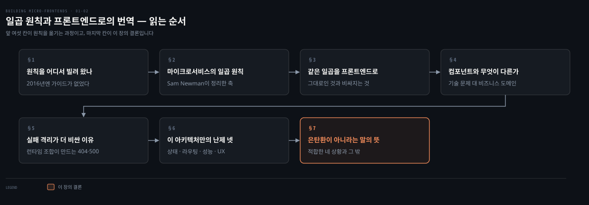
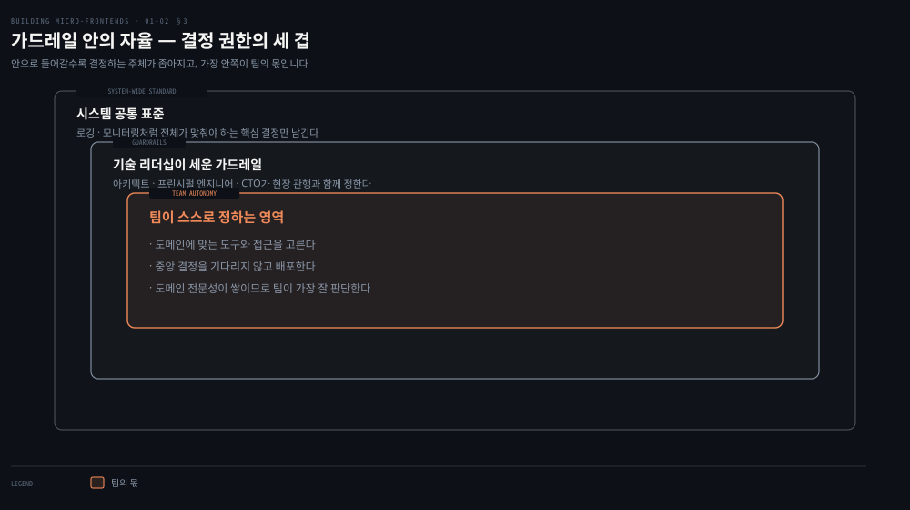
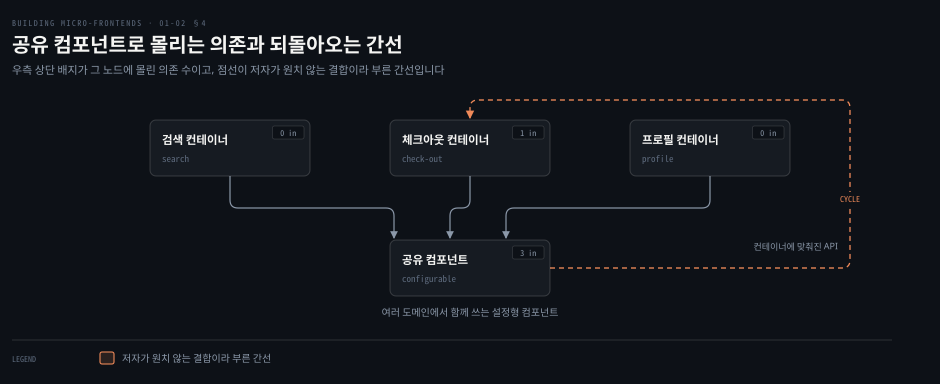
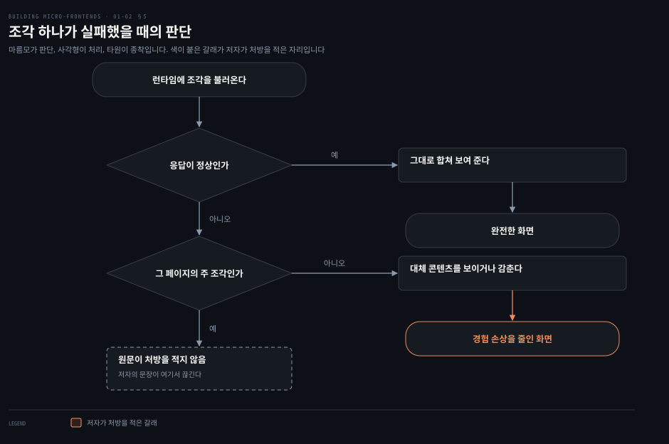

# 일곱 원칙과 프론트엔드로의 번역

---

> 1장 후반부는 마이크로 프론트엔드를 어떻게 만드는지 대신 무엇을 지켜야 하는지를 답합니다. 저자는 마이크로서비스의 일곱 원칙을 그대로 가져와 프론트엔드에 하나씩 대 보고, 그 과정에서 프론트엔드에서만 비싸지는 자리를 짚습니다.

## 핵심 요약

> 이 편 전체가 매달린 하나의 생각은 **마이크로서비스의 일곱 원칙이 프론트엔드에도 그대로 성립하지만, 런타임에 UI를 조합한다는 사실 하나 때문에 실패 격리와 관측과 일관성의 값이 백엔드보다 비싸진다**는 것입니다.
>
> 원칙은 빌려 온 것입니다. 저자가 2016년에 마이크로 프론트엔드를 시작할 때 그런 아키텍처를 짜는 가이드가 없었습니다. 그래서 기술 구현에서 한 발 물러나 소프트웨어를 확장하는 다른 아키텍처의 원칙을 봤고, Sam Newman이 정리한 마이크로서비스의 일곱 원칙에서 답을 찾았습니다.
>
> 일곱은 프론트엔드에서도 성립합니다. 도메인 중심 모델링, 자동화 문화, 구현 은닉, 분산화, 독립 배포, 실패 격리, 높은 관측성이 그것입니다. 저자는 일곱을 하나씩 다시 짚으며 프론트엔드에서 그 원칙이 어떤 모습이 되는지 보입니다.
>
> 값이 달라지는 자리가 있습니다. 실패 격리가 대표적입니다. 단일 페이지 애플리케이션에서는 아키텍처 특성상 큰 문제가 아니지만, 런타임에 UI를 합치는 구조에서는 조각마다 네트워크 실패와 404가 따로 납니다.
>
> 그래서 결론은 조건부입니다. 마이크로 프론트엔드는 프론트엔드 아키텍처의 추가 선택지 하나이며, 단점과 과제가 장점을 넘으면 맞는 접근이 아닙니다.

## 학습 목표

이 내용을 읽고 나면:

1. 마이크로서비스의 일곱 원칙을 이름과 한 줄 정의로 재현할 수 있습니다.
2. 일곱 가운데 프론트엔드로 옮길 때 값이 달라지는 원칙을 짚고 그 이유를 댈 수 있습니다.
3. 컴포넌트와 마이크로 프론트엔드를 가르는 기준을 모듈화의 축으로 설명할 수 있습니다.
4. 마이크로 프론트엔드에만 있는 난제 넷을 들고 각각이 왜 생기는지 말할 수 있습니다.
5. 마이크로 프론트엔드가 적합한 네 상황을 재현하고, 적합성을 판단하는 저자의 기준을 설명할 수 있습니다.

아래는 이 문서를 읽는 순서로 이은 지도입니다. 앞 여섯 칸이 원칙을 옮기는 과정이고 색이 붙은 마지막 칸이 이 장의 결론입니다.

## 1. 원칙을 어디서 빌려 왔나

> 참고할 사례가 없는 아키텍처를 시작할 때 저자가 택한 순서는 기술이 아니라 원칙이 먼저였습니다.

### 풀려는 문제

앞 편은 "마이크로 프론트엔드가 필요하다"까지 왔습니다. 그러면 무엇부터 정해야 할까요.

2016년의 저자에게는 참고할 것이 없었습니다. 사례도 가이드도 없는 상태에서 흔히 벌어지는 일이 있습니다. **기술부터 고르는 것입니다.** 조합 방식을 먼저 정하고 프레임워크를 고른 뒤, 그 선택을 정당화할 이유를 나중에 붙입니다. 그렇게 만들어진 아키텍처는 다음 질문에 답하지 못합니다. 새 요구가 왔을 때 지금 구조를 바꿔야 하는지 아닌지를 무엇으로 판정하느냐는 질문입니다.

### 저자가 한 것 — 한 발 물러서기

그래서 저자는 반대로 갔습니다. 기술 구현에서 한 발 물러서서, 소프트웨어 프로젝트를 확장하려고 만들어진 **다른 아키텍처들의 원칙**을 먼저 봤습니다. 그리고 물었습니다. 그 원칙이 프론트엔드에도 적용될까요.

답을 준 것이 마이크로서비스의 원칙이었습니다. 저자는 Sam Newman이 《Building Microservices》에서 짚은 아이디어들을 가져와 원문 Figure 1-4로 요약합니다.[^year]

[^year]: 서문에서는 마이크로 프론트엔드를 2015년부터 생각했다고 적고 본문에서는 여정의 시작을 2016년이라고 적습니다. 착상과 실무 착수는 다른 사건이므로 모순이 아니라고 읽었습니다. 이 판단은 노트의 읽기이며 저자가 직접 밝힌 것이 아닙니다.

### 읽어내기 — 원칙이 북극성 노릇을 하려면

앞의 질문으로 돌아가면 순서의 값이 보입니다. 원칙을 먼저 세우면 그것이 **판정 기준**이 됩니다. 새 요구가 왔을 때 "이 변경이 독립 배포를 깨는가"를 물을 수 있게 되는 것입니다.

기술을 먼저 고르면 그 기준이 없습니다. 남는 것은 "지금 쓰는 프레임워크로 되는가"뿐이고, 그 질문은 아키텍처가 아니라 편의를 묻습니다. 저자가 원칙을 북극성이라고 부른 이유가 여기 있습니다.

## 2. 마이크로서비스의 일곱 원칙

> 원칙은 외우는 목록이 아니라 어겼을 때 무엇이 깨지는지로 읽어야 판정 기준이 됩니다.

### 풀려는 문제

일곱 개짜리 목록은 외우기 쉽고 쓰기 어렵습니다. "높은 관측성"이나 "자동화 문화" 같은 말에는 반대할 사람이 없기 때문입니다.

반대할 수 없는 말은 판정을 못 합니다. 설계 리뷰에서 "이 설계가 높은 관측성을 지키나요"라고 물으면 대개 "네"가 나옵니다. 로그를 남기고 있으니까요. 그래서 원칙 목록을 그대로 들고 있으면 아무것도 걸러지지 않습니다.

### 일곱 원칙과 어겼을 때 깨지는 것

그래서 뒤집어 읽습니다. 각 원칙을 **지키지 않으면 무엇이 깨지는가**로 놓으면 판정할 수 있는 문장이 됩니다.

| 원칙 | 핵심 | 지키지 않으면 |
|---|---|---|
| 비즈니스 도메인 중심 모델링 | 소프트웨어가 조직이 하는 일을 반영한다 | 도메인 경계가 흐려져 팀이 어디까지 책임지는지 모른다 |
| 자동화 문화 | 독립 단위를 여러 환경에 자동으로 배포한다 | 자율 배포가 수작업이 되어 속도가 죽는다 |
| 구현 세부 은닉 | API 계약만 노출하고 나머지는 감춘다 | 스키마 하나 바꾸면 의존하는 서비스가 전부 깨진다 |
| 분산화 | 결정 권한을 문제를 아는 사람에게 내린다 | 소수가 내린 타협이 시스템 생애주기 내내 남는다 |
| 독립 배포 | 서비스 하나만 따로 내보낸다 | 매번 전체를 배포해 위험과 롤백 비용이 커진다 |
| 실패 격리 | 일부가 죽어도 나머지는 응답한다 | 서비스 하나의 장애가 전체 장애가 된다 |
| 높은 관측성 | 요청 하나를 시스템 끝까지 따라간다 | 분산이 늘어난 만큼 원인을 못 찾는다 |

### 저자가 덧붙인 설명

몇 가지는 저자의 설명을 더 옮겨 둘 만합니다.

도메인 중심 모델링은 도메인 주도 설계의 핵심 원칙입니다. 도메인과 서브도메인을 기준으로 아키텍처를 설계하고 사업 전반이 공유하는 유비쿼터스 언어를 쓰는 일입니다. 사업 관점에서 볼 때 얻는 것이 셋입니다.

- 시스템을 더 잘 이해하게 됩니다.
- 비즈니스 도메인을 기술로 어떻게 표현할지 정의하기 쉬워집니다.
- 팀이 움직일 경계가 또렷해집니다.

저자는 이 원칙에 프론트엔드용 실무 팁을 바로 붙입니다. 프론트엔드 도메인은 사용자 여정의 단계나 명확한 비즈니스 역량으로 식별하라는 것입니다. 그가 든 예가 체크아웃과 검색과 프로필입니다. 기술 프레임워크나 컴포넌트 타입으로 나누지 말라고 못 박습니다. 그렇게 나누면 팀이 사업이 아니라 기술 축으로 갈라지기 때문입니다.

구현 은닉은 API 우선이라는 이름으로도 불립니다. 먼저 API를 생산자와 소비자를 묶는 계약으로 정의합니다. 그러면 양쪽이 병렬로 일할 수 있습니다. 한쪽은 생산에, 다른 쪽은 소비에 집중합니다. 개발 초기부터 API에 집중하면 협업과 확장성과 적응력이 함께 올라갑니다.

분산화의 근거는 인지 부하입니다. 분산 시스템에서는 팀마다 짊어질 인지 부하가 적습니다. 그래서 구성원이 빠르게 도메인 전문가가 되고, 자기 몫을 어떻게 진화시킬지 가장 잘 판단하게 됩니다.

### 읽어내기 — 원칙이 요구하는 것은 코드 밖에 있다

표의 오른쪽 열을 훑어보면 공통점이 보입니다. 깨지는 것이 대부분 **코드가 아니라 일하는 방식**입니다. 책임의 경계, 배포의 단위, 결정의 위치가 그것입니다.

저자도 같은 자리에서 조건을 답니다. 이 원칙들을 받아들이려면 소프트웨어 아키텍처뿐 아니라 회사가 조직된 방식까지 사고방식을 바꿔야 합니다. 중앙집중에서 탈중앙으로 옮겨 가고, 교차 기능 팀이 자기 비즈니스 도메인을 끝까지 소유하게 하는 일입니다. 중견 이상 조직에는 이것이 상당한 도전이 됩니다.

## 3. 같은 일곱을 프론트엔드로 옮기면

> 원칙은 하나도 버려지지 않습니다. 달라지는 것은 그 원칙을 지키는 값입니다.

### 풀려는 문제

"마이크로서비스 원칙이 프론트엔드에도 그대로 적용된다"는 문장은 그 자체로는 검증이 아닙니다. 무엇이 그대로이고 무엇이 달라지는지 말하지 않기 때문입니다.

이 구분이 없으면 실무에서 두 가지 실패가 납니다. 백엔드에서 쓰던 방법을 그대로 옮겼다가 안 통하는 자리에서 막히거나, 반대로 프론트엔드는 다르다며 원칙 자체를 버립니다.

### 일곱의 프론트엔드 표현

그래서 하나씩 대 봅니다. 저자는 일곱을 하나도 버리지 않고 그대로 옮깁니다.

| 원칙 | 프론트엔드에서 이런 모습이 됩니다 |
|---|---|
| 비즈니스 도메인 중심 모델링 | 마이크로 프론트엔드가 도메인을 완전히 소유합니다. 제품 팀과 기술 팀이 함께 움직일 때 힘을 냅니다 |
| 자동화 문화 | 조각이 수십에서 수백 개라 CI·CD가 견고하고 피드백이 빨라야 합니다 |
| 구현 세부 은닉 | API 계약을 일찍 정의해 공유하고 강한 캡슐화로 도메인 누수를 막습니다 |
| 분산화 | 기술 리더십이 세운 가드레일 안에서 팀이 스스로 정합니다 |
| 독립 배포 | UI를 컴포넌트로만 취급하지 않고 외부 의존을 줄여 빠른 흐름을 만듭니다 |
| 실패 격리 | 런타임 조합이라 조각마다 404·500이 나므로 대체 콘텐츠나 감춤이 필요합니다 |
| 높은 관측성 | 프론트엔드 관측 도구로 어디서 왜 실패하는지 봅니다 |

### 자동화가 실제로 푸는 것

자동화 문화는 프론트엔드에서 값이 특히 올라갑니다. 조각이 수십에서 수백 개이므로 파이프라인이 약하면 자율 배포가 곧 혼란이 됩니다. 저자가 자동화로 푼다고 든 문제가 구체적입니다.

- 공유 라이브러리를 특정 버전으로 정렬하는 일
- 마이크로 프론트엔드마다 크기 예산을 강제하는 일
- 모든 조각을 최신 디자인 시스템 버전으로 올리도록 요구하는 일

저자는 자동화의 값이 아티팩트 생성에만 있지 않다고 적습니다. 더 중요한 것은 개발자에게 빠른 피드백을 준다는 점입니다. 그 피드백이 팀 안에서 올바른 행동을 기르고, 분산 시스템 전반에 아키텍처 특성을 강제합니다.

### 분산화 — "각자 알아서"가 아니다

분산화는 오해를 사기 쉬운 원칙이라 저자가 따로 선을 긋습니다. 팀마다 제 갈 길을 가라는 뜻이 아닙니다. 아키텍트와 프린시펄 엔지니어와 CTO 같은 기술 리더십이 현장에서 쓰이는 관행과 함께 가드레일을 제공해야 합니다. 팀은 그 울타리 안에서 중앙 결정을 기다리지 않고 움직입니다.

위 도식의 세 겹이 그 구조입니다. 가운데 고리와 안쪽 고리는 이 절의 서술 그대로이고, 가장 바깥의 로깅·모니터링은 앞 편에서 다룬 Moving to Microservices 절의 사실을 노트가 끌어와 겹쳐 놓은 것입니다. 저자가 분산화 절에서 함께 적은 내용이 아닙니다.

### 읽어내기 — 원칙은 같고 값이 다르다

앞의 질문에 답이 생깁니다. **일곱 가운데 버려지는 것은 없고, 대신 셋의 값이 올라갑니다.** 자동화는 조각 수만큼, 실패 격리는 조합 시점 때문에, 관측성은 실패가 화면에 보이기 때문에 비싸집니다.

관측성에서 저자가 인용하는 문장이 그 값을 다루는 방식을 보여 줍니다. 아마존 CTO인 Werner Vogels의 "Everything fails, all the time"입니다. 저자는 여기서 결론을 하나 끌어냅니다. 문제를 완전히 막으려 애쓰기보다 빠르게 해결할 수 있는 상태를 만드는 데 자원을 쓰는 편이 낫다는 것입니다.

값이 오른 셋 가운데 실패 격리를 §5에서 따로 봅니다. 그전에 §4에서 도메인 소유가 컴포넌트 분할과 어떻게 갈라지는지를 먼저 정리합니다.

## 4. 컴포넌트와 마이크로 프론트엔드를 가르는 것

> 둘의 차이는 크기가 아니라 계약의 넓이입니다. 넓은 계약은 변경을 되돌려 보냅니다.

### 풀려는 문제

공통으로 쓰라고 만든 컴포넌트가 어느 순간부터 아무도 못 고치는 자산이 되는 일이 있습니다. 고치겠다고 하면 그 컴포넌트를 쓰는 화면들의 담당자가 전부 회의에 들어옵니다.

이상한 점은 그 컴포넌트가 작다는 것입니다. 코드는 몇백 줄이고 책임도 하나입니다. 그런데도 손대기가 어렵습니다. 크기로 설명이 안 되는 문제이므로 다른 축이 필요합니다.

### 저자가 지목한 결합

저자는 그 축을 모듈화의 방향에서 찾습니다. 컴포넌트가 푸는 문제는 대개 코드 중복입니다. 또는 여러 도메인에 걸쳐 쓰이는 복잡하고 설정 가능한 컴포넌트를 만드는 일입니다.

문제는 그 컴포넌트가 노출하는 API에 있습니다. 저자는 그 API가 자주 컨테이너와 결합된다고 지적합니다. 그래서 컴포넌트를 고치면 그것을 담고 있는 컨테이너까지 영향을 받습니다. 이것이 원치 않는 결합이며, 분산 시스템의 원칙과 어긋나게 만듭니다.

위 도식이 그 모양입니다. 컨테이너 셋이 컴포넌트 하나로 몰리고, 그 컴포넌트의 계약이 다시 컨테이너 사정에 맞춰지면서 변경이 역방향으로 되돌아옵니다.

### 마이크로 프론트엔드가 계약을 좁히는 방식

마이크로 프론트엔드는 API 표면을 다르게 잡습니다. 사용자의 맥락을 파악하는 데 필요한 최소한으로 줄입니다. 저자에 따르면 대개 세션 토큰과 제품 ID 정도의 정보 외에는 거의 필요하지 않습니다.

이 최소 API는 자주 바뀌지 않습니다. 그래서 프론트엔드 요소 사이의 결합이 줄고 팀 사이의 조율 필요도 줄어듭니다.

### 읽어내기 — 크기가 아니라 계약의 넓이

| 축 | 컴포넌트 | 마이크로 프론트엔드 |
|---|---|---|
| 소유하는 것 | 기술적 과제 | 비즈니스 도메인 전체 |
| API 표면 | 컨테이너에 맞춰 넓어지기 쉬움 | 세션 토큰·제품 ID 수준의 최소 |
| 변경의 파급 | 컴포넌트 수정이 컨테이너에 닿음 | 계약이 안 바뀌면 다른 팀에 안 닿음 |
| 결과 | 팀 사이 조율이 늘어남 | 팀 자율성이 올라감 |

앞의 이상한 점이 이제 설명됩니다. **작은 컴포넌트가 못 고치는 자산이 되는 것은 코드가 커서가 아니라 계약이 넓어서입니다.** 호출자마다 필요한 옵션을 받아 주다 보면 API 표면이 넓어지고, 넓어진 표면의 어느 한 곳을 건드려도 누군가는 영향을 받습니다.

그래서 마이크로 프론트엔드의 처방은 조각을 크게 만드는 것이 아니라 **계약을 좁히는 것**입니다. 세션 토큰과 제품 ID만 받는다면 그 계약은 바뀔 일이 거의 없습니다.

## 5. 실패 격리가 프론트엔드에서 더 비싼 이유

> 백엔드에서 실패는 응답이고 프론트엔드에서 실패는 화면입니다. 그 차이가 원칙의 값을 바꿉니다.

### 풀려는 문제

백엔드에서 실패 격리는 익숙한 문제입니다. 서비스 하나가 죽으면 서킷 브레이커가 열리고 폴백 응답이 나갑니다. 사용자는 그 처리가 있었다는 사실도 모릅니다.

그 감각을 그대로 프론트엔드로 가져오면 막힙니다. 조각 하나가 못 뜨면 그 자리가 화면에 그대로 남기 때문입니다. 폴백을 정의하려고 해도 무엇으로 대체할지가 데이터가 아니라 UI라서, "빈 리스트를 반환한다" 같은 답이 통하지 않습니다.

### 런타임 조합이 만드는 실패

저자는 단일 페이지 애플리케이션에서는 실패 격리가 큰 문제가 아니라고 적습니다. 아키텍처 특성상 그렇습니다. 한 덩어리로 배포되고 한 번에 로드되기 때문입니다.

마이크로 프론트엔드에서는 문제가 됩니다. 런타임에 사용자 인터페이스를 조합해야 하므로, UI의 한 부분 이상에서 네트워크 실패나 404가 날 수 있습니다. 사용자 경험을 해치지 않으려면 대체 콘텐츠를 제공하거나 특정 부분을 감춰야 합니다.

> **원문 정오**: 이 대목의 마지막 문장이 접속사 없이 조건절 둘을 쉼표로 이어 붙입니다. 원문은 "This might mean gracefully hiding non-essential micro-frontends from the interface if they fail or return a 500 error, if the main micro-frontend of a page is not loaded."라고 적습니다. 문장 구조가 어긋난 것이 정오이고, 그 결과로 뒤의 조건절이 앞 문장 어디에 걸리는지 문면으로 정해지지 않습니다.
>
> 여기서 갈라 둘 것이 있습니다. **비필수 조각의 처방은 원문에 있고, 주 조각이 못 떴을 때의 처방은 원문에 없습니다.** 뒤엣것은 저자가 틀리게 적은 것이 아니라 아예 적지 않은 공백입니다. 그래서 위 도식은 그 갈래를 지어내지 않고 비워 두었습니다.

### 읽어내기 — 폴백을 도메인마다 미리 정해 둔다

앞의 막힘이 여기서 풀립니다. 백엔드의 폴백 설계와 하는 일은 같고 산출물만 다릅니다. **"이 조각이 없으면 화면을 어떻게 보일 것인가"를 도메인마다 미리 정해 두는 것**이 프론트엔드의 폴백 설계입니다.

그리고 그 판단에는 조각의 등급이 필요합니다. 위 도식의 첫 갈림이 그것입니다. 비필수 조각이면 감추거나 대체하면 되지만, 페이지의 주 조각이면 감출 수가 없습니다. 원문이 그 갈래에서 멈추므로 처방은 각 팀이 정해야 합니다.

## 6. 이 아키텍처만의 난제 넷

> 일곱 원칙을 다 지켜도 남는 문제가 있습니다. 넷 모두 런타임 조합에서 나옵니다.

### 풀려는 문제

여기까지 오면 원칙은 다 옮겼습니다. 그러면 원칙을 지키는 것으로 충분할까요.

저자의 답은 아니오입니다. 마이크로서비스의 원칙이 잘 옮겨진다고 해서 프론트엔드에 고유한 문제가 사라지지는 않습니다. 원칙 목록에는 없지만 신중한 아키텍처 결정을 요구하는 것들이 남습니다.

### 넷과 그 원인

| 난제 | 왜 생기는가 | 다루지 않으면 |
|---|---|---|
| 공유 상태 | 인증 토큰이나 장바구니처럼 독립 배포된 조각들이 함께 봐야 하는 데이터가 있음 | 강한 결합이 생겨 모듈화의 이점이 무너짐 |
| 라우팅 | 전역 라우팅과 지역 라우팅의 책임을 함께 조율해야 함 | 로직이 흩어지고 통합이 부서지기 쉬워짐 |
| 성능 모니터링 | 런타임 조합이 번들 크기와 네트워크 요청을 늘림 | 번들이 부풀고 사용자 경험이 나빠짐 |
| UX 일관성 | 팀마다 따로 진화시키므로 레이아웃·스타일·동작이 미세하게 갈림 | 어긋남이 쌓여 화면이 따로 노는 제품이 됨 |

성능에 대해서는 저자가 완화 수단을 명시합니다. 똑똑한 캐싱과 지연 로딩과 공유 의존성 관리가 그것입니다.

### 읽어내기 — 넷의 뿌리는 하나다

표의 가운데 열을 겹쳐 보면 원인이 하나로 모입니다. **넷 다 독립 배포된 조각을 런타임에 합치기 때문에 생깁니다.** 따로 배포했으니 상태가 나뉩니다. 라우팅도 같은 이유로 나뉩니다. 합치는 시점이 런타임이라 요청이 늘어납니다. 따로 진화하니 겉모습이 갈립니다.

원인이 하나이므로 해법도 하나로 모입니다. 잘 정의된 API 계약과 UI 계약, 공유 플랫폼 가이드라인, 그리고 견고한 자동화의 조합입니다. 저자는 여기에 한 문장을 덧붙입니다. 마이크로 프론트엔드는 기술적 경계만이 아니라 강한 조직적 정렬을 함께 요구하며, 규모에서 성공하려면 둘이 다 필요합니다.

## 7. 은탄환이 아니라는 말의 뜻

> 적합성은 이점의 개수가 아니라 이점과 과제의 차이로 판정합니다.

### 풀려는 문제

여기까지 읽으면 마이크로 프론트엔드의 이점 목록이 손에 잡힙니다. 그런데 이점 목록만으로는 도입 여부를 정할 수 없습니다. §3에서 본 것처럼 값이 오른 항목도 함께 왔기 때문입니다.

그러면 무엇으로 판정할까요. "우리 팀에 맞나요"라는 질문은 답이 정해져 있지 않아 회의를 길게 만듭니다.

### 저자가 적은 네 상황

저자는 이 장을 경고로 닫습니다. 마이크로 프론트엔드는 모든 애플리케이션에 맞지 않습니다. 그 성질 때문이기도 하고, 기술과 조직 양쪽에 더하는 복잡도 때문이기도 합니다.

합리적인 선택이 되는 상황은 넷입니다.

- 반복적인 접근과 장기 유지보수가 필요한 소프트웨어를 다룰 때
- 큰 개발 팀이 필요한 프로젝트일 때
- 멀티 테넌트 애플리케이션일 때
- 레거시 프로젝트를 점진적으로 대체하고 싶을 때

그 밖에는 맞지 않을 수 있습니다. 저자는 마이크로 프론트엔드를 프론트엔드 아키텍처의 추가 선택지 하나로 규정합니다.

### 읽어내기 — 최선이 아니라 덜 나쁜 조합

앞의 질문에 답을 주는 것은 목록이 아니라 판정 방식입니다. 저자의 기준은 뺄셈입니다. **이점도 많고 과제도 많은데, 후자가 전자를 넘으면 그 프로젝트에는 맞지 않는 접근입니다.**

그래서 회의에서 물을 것도 "맞나요"가 아니라 "무엇을 포기할 수 있나요"가 됩니다. 저자가 인용하는 문장이 그 태도를 정확히 말합니다. Neal Ford와 Mark Richards와 Pramod Sadalage와 Zhamak Dehghani가 《Software Architecture: The Hard Parts》에서 쓴 말입니다. 소프트웨어 아키텍처에서 최선의 설계를 찾으려 하지 말고 가장 덜 나쁜 트레이드오프 조합을 노리라는 것입니다. 저자는 이것을 앞으로의 좌우명으로 삼으라고 적습니다.

## 심화 학습

> 아래는 저자가 인용한 두 책의 서지입니다. 이 노트는 두 책의 원문을 대조하지 않았으므로 인용의 맥락만 옮깁니다.

일곱 원칙의 출처는 Sam Newman의 《Building Microservices》입니다. 저자는 자신이 원칙을 만든 것이 아니라 이 책에서 정리된 아이디어를 요약했다고 밝힙니다. 원칙의 정확한 표현과 근거를 확인하려면 그 책을 1차 자료로 봐야 합니다.

트레이드오프에 대한 인용은 Neal Ford와 Mark Richards와 Pramod Sadalage와 Zhamak Dehghani의 《Software Architecture: The Hard Parts》에서 왔습니다. 이 책은 분산 아키텍처의 결정을 트레이드오프 분석으로 다루는 책이며, 인용된 문장은 그 방법론의 요약에 해당합니다.

## 결정 치트시트

> 이 장의 판단 기준을 한 표로 모았습니다. 근거는 모두 원문입니다.

| 상황 | 판단 | 근거 |
|---|---|---|
| 새 프로젝트이고 팀이 작다 | 마이크로 프론트엔드를 쓰지 않는다 | 기술과 조직 양쪽에 더하는 복잡도가 값을 못 함 |
| 여러 해 유지할 플랫폼이고 팀이 크다 | 후보로 검토한다 | 저자가 든 적합한 네 상황에 해당 |
| 레거시 프론트엔드를 한 번에 못 바꾼다 | 후보로 검토한다 | 점진적 대체가 적합한 상황 가운데 하나 |
| 자동화·관측 투자가 아직 없다 | 먼저 그것부터 만든다 | 자동화가 약하면 조각이 수십·수백일 때 감당이 안 됨 |
| 나누려는 축이 기술 프레임워크나 컴포넌트 타입이다 | 축을 다시 잡는다 | 사용자 여정 단계나 비즈니스 역량으로 나누라는 것이 저자의 지침 |
| 단점과 과제가 이점을 넘는다 | 쓰지 않는다 | 가장 덜 나쁜 트레이드오프 조합을 고르는 문제 |

## 적용 관점

> 아래는 백엔드 개발자가 이미 가진 판단 기준과 이 장을 잇는 노트의 읽기입니다. 책이 백엔드 독자를 향해 쓴 대목이 아닙니다.

일곱 원칙 자체는 새로 배울 것이 없습니다. 도메인 중심 모델링과 구현 은닉과 독립 배포는 이미 쓰는 어휘입니다. 이 장에서 얻을 것은 원칙의 목록이 아니라 그 원칙이 프론트엔드로 건너갈 때 값이 어떻게 달라지는지의 감각입니다.

실패 격리가 그 차이를 가장 잘 보여 줍니다. 백엔드에서 서비스 하나가 죽으면 폴백과 서킷 브레이커로 다른 서비스가 대신 응답하고 그 처리는 사용자에게 보이지 않습니다. 프론트엔드에서는 조각 하나가 못 뜨면 그 자리가 화면에 그대로 빈칸으로 남습니다. 하는 일은 같고 산출물만 데이터에서 화면으로 바뀝니다.

§4의 결론은 공통 모듈 이야기로 그대로 옮겨집니다. 여러 팀이 함께 쓰는 모듈은 호출자의 요구를 받아들이며 시그니처가 넓어집니다. 넓어진 만큼 그 모듈을 고칠 때 영향 범위가 커집니다. 저자가 컴포넌트에서 지적한 결합과 같은 인과이고, 처방도 같습니다. 모듈을 쪼개는 것이 아니라 계약을 좁히는 것입니다. 이 대비의 도메인 쪽 판단 기준은 [Bounded Context 와 Context Map](../../04_ddd/01-04.Bounded%20Context%20와%20Context%20Map.md)이 갖고 있습니다.

마지막으로 가드레일 이야기는 조직 설계로 읽힙니다. 저자가 분산화를 설명하며 굳이 선을 그은 이유가 있습니다. 자율을 무제한으로 두면 팀마다 다른 로깅 포맷과 다른 배포 방식이 생깁니다. 그때부터는 아무도 시스템 전체를 못 봅니다. 백엔드에서 공통 표준을 어디까지 둘지 정하는 문제와 같은 문제입니다.

## 면접 대비

### 한 줄 정의

마이크로 프론트엔드의 원칙이란 마이크로서비스에서 검증된 일곱 가지 원칙을 프론트엔드로 옮긴 것이며, 아키텍처 결정을 내릴 때 기준이 되는 북극성입니다.

### 핵심 포인트 세 가지

1. 원칙은 새로 만든 것이 아니라 Sam Newman이 정리한 마이크로서비스의 일곱을 빌려 온 것이고, 저자는 기술을 고르기 전에 원칙을 먼저 세웠습니다.
2. 컴포넌트와 마이크로 프론트엔드를 가르는 것은 크기가 아니라 계약의 넓이입니다. 넓은 계약이 변경을 호출자에게 되돌려 보냅니다.
3. 런타임 조합이라는 사실 하나가 실패 격리와 공유 상태와 라우팅과 성능과 UX 일관성의 값을 모두 올립니다.

### 자주 묻는 질문

Q: 마이크로 프론트엔드를 도입할 때 가장 먼저 갖춰야 할 것은 무엇인가요?
A: 자동화입니다. 저자는 자동화 문화가 빈약하면 어떤 마이크로 프론트엔드 접근을 택하든 팀에게 악몽이 된다고 적습니다. 프로젝트마다 조각이 수십에서 수백 개이므로 CI·CD 파이프라인이 견고하고 피드백 루프가 빨라야 합니다.

Q: 도메인을 어떤 기준으로 나누나요?
A: 사용자 여정의 단계나 명확한 비즈니스 역량으로 나눕니다. 저자가 든 예가 체크아웃과 검색과 프로필입니다. 기술 프레임워크나 컴포넌트 타입으로 나누면 팀이 사업이 아니라 기술 축으로 갈라집니다.

Q: 언제 쓰지 말아야 하나요?
A: 단점과 과제가 이점을 넘을 때입니다. 저자는 최선의 설계를 찾지 말고 가장 덜 나쁜 트레이드오프 조합을 노리라는 《Software Architecture: The Hard Parts》의 문장을 판단 기준으로 인용합니다.

Q: 관측성은 백엔드와 무엇이 다른가요?
A: 실패가 사용자에게 곧바로 보인다는 점이 다릅니다. 저자는 예방보다 빠른 해결에 자원을 쓰라고 말하며 "Everything fails, all the time"이라는 Werner Vogels의 문장을 인용합니다.

## 핵심 개념 체크리스트

- [ ] 일곱 원칙의 이름을 순서와 무관하게 모두 댈 수 있는가?
- [ ] 각 원칙을 "지키지 않으면 무엇이 깨지는가"로 바꿔 말할 수 있는가?
- [ ] 저자가 기술보다 원칙을 먼저 세운 이유를 판정 기준의 관점에서 말할 수 있는가?
- [ ] 작은 컴포넌트가 못 고치는 자산이 되는 이유를 계약의 넓이로 설명할 수 있는가?
- [ ] 실패 격리가 SPA보다 마이크로 프론트엔드에서 비싼 이유를 댈 수 있는가?
- [ ] 고유 난제 넷의 공통 원인을 한 문장으로 말할 수 있는가?
- [ ] 마이크로 프론트엔드가 적합한 네 상황을 재현할 수 있는가?

## 관련 문서

- [모놀리스에서 분산 프론트엔드까지](01-01.모놀리스에서%20분산%20프론트엔드까지.md) — 이 편이 답하는 질문을 던진 1장 전반부
- [Bounded Context 와 Context Map](../../04_ddd/01-04.Bounded%20Context%20와%20Context%20Map.md) — 도메인 경계를 코드·조직 경계로 내리는 판단 기준
- [서비스 간 연동 방식 비교](../../03_distributed/01-02.서비스%20간%20연동%20방식%20비교.md) — 경계를 넘는 통신을 동기와 비동기로 가르는 기준
- [Aggregate 설계 규칙](../../04_ddd/02-01.Aggregate%20설계%20규칙.md) — 경계를 너무 잘게 잡았을 때의 증상
- [Building Micro-Frontends 정독 인덱스](README.md) — 장별 목표와 진행 상태

## 참고 자료

- 《Building Micro-Frontends, Second Edition》(Luca Mezzalira, O'Reilly, 2026) ISBN 978-1-098-17078-3
  - 다룬 범위: Microservices Principles · Applying Principles to Micro-Frontends
  - 이어서: Challenges Unique to Micro-Frontends · Micro-Frontends Are Not a Silver Bullet · Summary
- 《Building Microservices》(Sam Newman) — 저자가 일곱 원칙의 출처로 밝힌 책
- 《Software Architecture: The Hard Parts》(Neal Ford·Mark Richards·Pramod Sadalage·Zhamak Dehghani) — 트레이드오프 인용의 출처
