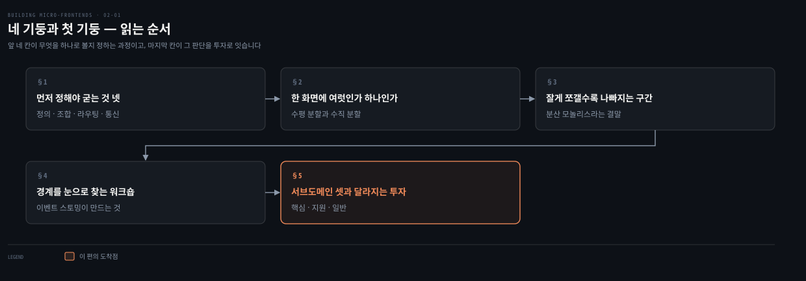
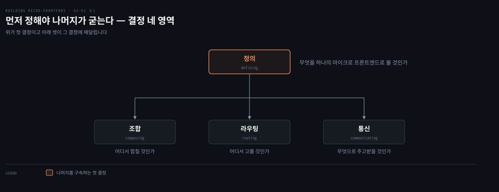
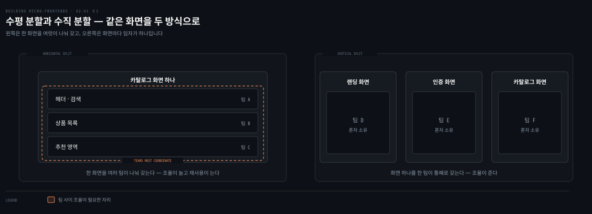

# 네 기둥과 첫 기둥 — 무엇을 하나로 볼 것인가

---

> 2장은 마이크로 프론트엔드를 시작할 때 먼저 내려야 할 결정 넷을 세우고 그중 첫 결정으로 들어갑니다. 무엇을 하나의 마이크로 프론트엔드로 볼 것인가가 나머지 셋을 모두 구속하기 때문입니다.

## 핵심 요약

> 이 편이 매달린 하나의 생각은 **마이크로 프론트엔드의 크기를 기술로 정하면 나머지 결정이 전부 그 선택에 끌려가므로, 크기는 비즈니스 서브도메인으로 정해야 한다**는 것입니다.

저자는 결정 프레임워크를 넷으로 세웁니다. 정의와 조합과 라우팅과 통신이며, 이 가운데 정의가 첫 결정이고 나머지에 큰 영향을 준다고 못 박습니다. 정의는 곧 분할 방식의 선택입니다. 한 화면 안에 여러 조각을 두는 수평 분할과 화면 하나를 한 팀이 통째로 갖는 수직 분할이 있고 둘은 배타적이지 않아 한 애플리케이션 안에서 섞어 쓸 수 있습니다.

잘게 쪼갤수록 좋아지지는 않습니다. 저자는 높은 세분화가 높은 결합으로 이어지고 분산 모놀리스를 만들 위험을 키운다고 경고합니다. 그래서 경계는 기술이 아니라 도메인에서 찾습니다. 이벤트 스토밍 같은 워크숍으로 서브도메인을 식별하고 그것을 핵심과 지원과 일반 셋으로 분류해 각각 다른 투자 전략을 붙입니다.

## 학습 목표

이 내용을 읽고 나면:

1. 마이크로 프론트엔드 결정 프레임워크의 네 영역을 이름과 질문으로 재현할 수 있습니다.
2. 수평 분할과 수직 분할이 각각 무엇을 주고 무엇을 요구하는지 설명할 수 있습니다.
3. 분산 모놀리스가 무엇이며 세분화와 어떻게 이어지는지 말할 수 있습니다.
4. 이벤트 스토밍이 서브도메인 식별에 쓰이는 이유를 워크숍의 성격으로 설명할 수 있습니다.
5. 서브도메인 세 종류를 구분하고 종류마다 투자 전략이 달라지는 이유를 댈 수 있습니다.

아래는 이 문서를 읽는 순서로 이은 지도입니다. 앞 네 칸이 무엇을 하나로 볼지 정하는 과정이고 색이 붙은 마지막 칸이 그 판단을 투자로 잇습니다.

## 1. 먼저 정해야 굳어 버리는 것 넷

> 저자가 선결 결정으로 꼽은 넷은 나란한 선택지가 아닙니다. 첫 결정이 나머지 셋의 선택지를 좁힙니다.

### 풀려는 문제

새 아키텍처를 시작할 때 가장 하기 쉬운 말이 "일단 만들어 보고 나중에 바꾸자"입니다. 프론트엔드에서는 이 말이 특히 그럴듯합니다. 화면은 다시 그리면 되고 컴포넌트는 옮기면 되니까요.

그런데 어떤 결정은 나중에 바꾸는 값이 처음에 정하는 값보다 훨씬 큽니다. 문제는 어느 결정이 그런 결정인지 착수 시점에 구분이 안 된다는 데 있습니다.

### 저자가 먼저 정하라는 넷

그래서 저자가 하는 일은 그 목록을 못 박는 것입니다. 그는 미리 내려야 하는 결정을 넷으로 세웁니다. 뒤따르는 결정을 이끌기 때문입니다.

| 영역 | 결정하는 것 |
|---|---|
| 정의 | 무엇을 하나의 마이크로 프론트엔드로 볼 것인가 |
| 조합 | 여러 조각을 어디서 합쳐 최종 화면을 만들 것인가 |
| 라우팅 | 어느 뷰를 보여 줄지 어디서 고를 것인가 |
| 통신 | 조각끼리 무엇으로 알리고 데이터를 나눌 것인가 |

이 넷을 고르는 기준도 저자가 함께 적습니다. 프로젝트 요구사항과 조직 구조와 개발자의 경험입니다. 기술적 우수성이 아니라 이 셋이 유형을 정합니다.

### 읽어내기 — 첫 결정이 나머지를 구속한다

저자는 정의를 "첫 번째 핵심 결정이며 나머지에 상당한 영향을 준다"고 적습니다. 위 도식이 넷을 나란히 놓지 않고 정의를 뿌리에 둔 이유입니다.

앞의 질문에 답이 생깁니다. **나중에 바꾸기 어려운 결정은 조각의 크기입니다.** 크기를 잘못 잡으면 조합도 라우팅도 통신도 그 크기에 맞춰 설계되고, 크기를 고치는 순간 셋이 함께 흔들립니다. 그래서 이 편의 나머지가 전부 첫 결정에만 매달립니다.

## 2. 한 화면에 여럿인가, 화면마다 하나인가

> 정의를 정하는 일은 실제로는 분할 방식을 고르는 일입니다. 두 방식은 팀 경계를 어디에 긋느냐로 갈립니다.

### 풀려는 문제

"마이크로 프론트엔드 하나"의 크기를 정하려면 기준이 있어야 합니다. 그런데 화면을 보고 있으면 어디를 잘라도 말이 됩니다. 헤더와 목록과 추천을 각각 하나로 볼 수도 있고, 카탈로그 화면 전체를 하나로 볼 수도 있습니다.

기준 없이 자르면 대개 눈에 보이는 컴포넌트 경계를 따라갑니다. 그러면 조각 수는 늘지만 팀 경계와는 무관한 선이 그어집니다.

### 수평 분할이 주는 것과 요구하는 것

저자는 선택지를 둘로 정리합니다. 첫째가 수평 분할입니다. 여러 마이크로 프론트엔드가 같은 화면에 놓입니다. 여러 팀이 한 화면의 서로 다른 부분을 맡고 서로 조율해야 합니다.

주는 것이 있습니다. 유연성입니다. 조각을 여러 화면에서 재사용할 수 있습니다.

요구하는 것도 있습니다. 저자는 규율과 거버넌스라고 적습니다. 그것이 없으면 한 프로젝트 안에 마이크로 프론트엔드가 수백 개가 됩니다.

### 수직 분할과 DDD

둘째가 수직 분할입니다. 팀마다 비즈니스 도메인 하나를 맡습니다. 저자가 든 예가 인증과 카탈로그 경험입니다.

여기서 도메인 주도 설계가 등장합니다. 저자는 프론트엔드 아키텍처에 DDD 원칙을 적용하는 일이 흔치는 않지만 이 경우에는 탐구할 만한 이유가 있다고 적습니다. DDD는 특정 도메인 안의 프로세스와 규칙을 풍부하게 이해한 도메인 모델을 프로그래밍하는 데 중심을 두는 개발 접근입니다.

다만 그대로 옮기지는 않습니다. 프론트엔드에 DDD를 적용하는 일은 백엔드와 조금 다릅니다. 어떤 개념은 적용되지 않고, 어떤 개념은 성공적인 마이크로 프론트엔드 아키텍처를 설계하는 데 근본이 됩니다.

### 읽어내기 — 둘은 배타적이지 않다

앞의 질문에 대한 저자의 답은 "하나를 고르라"가 아닙니다. **두 방식은 한 애플리케이션 안에서 배타적이지 않습니다.** 어떤 도메인은 특정 화면에서 여러 조각으로 나뉘고, 다른 도메인은 조각 하나로 표현될 수 있습니다.

그래서 기준은 화면의 생김새가 아니라 **그 부분을 누가 소유하느냐**로 옮겨 갑니다. 한 화면을 여러 팀이 나눠 가지면 수평이고, 화면 하나에 임자가 하나면 수직입니다. 위 도식의 색이 붙은 자리가 수평 분할이 요구하는 조율입니다.

## 3. 잘게 쪼갤수록 나빠지는 구간

> 세분화는 공짜가 아닙니다. 저자는 그 끝에 분산 모놀리스가 있다고 경고합니다.

### 풀려는 문제

앞 절의 기준을 받아들여도 남는 유혹이 있습니다. 더 잘게 나누면 더 독립적이지 않겠느냐는 것입니다. 마이크로서비스에서 넘어온 사람에게는 특히 자연스러운 생각입니다.

이 유혹이 위험한 이유는 초기에 증상이 안 보이기 때문입니다. 조각을 늘리는 동안에는 각 조각이 작아 보이고 관리하기 쉬워 보입니다.

### 분산 모놀리스

저자가 그 끝을 이름 붙여 둡니다. 분산 모놀리스입니다. 여러 서버나 노드에 흩어져 있는데도 모놀리식 아키텍처의 특성을 보이는 시스템입니다.

여기서 모놀리스가 가리키는 것은 **관심사 분리가 없는, 서로 얽힌 구성요소들의 단일하고 강하게 결합된 덩어리**입니다. 분산돼 있으니 서로 다른 위치에 흩어진 구성요소 사이의 통신이 복잡해지지만, 전체 구조는 설계와 상호 의존 면에서 여전히 모놀리스입니다.

저자가 짚는 결과는 구체적입니다. 이 상태는 마이크로 프론트엔드의 독립적인 성질을 가로막고, 외부 의존이 쌓여 그런 아키텍처를 만든 노력 자체를 무효로 만들 위험을 남깁니다.

### 읽어내기 — 세분화의 값

앞의 유혹에 대한 답은 이렇습니다. **높은 세분화는 자주 높은 결합으로 이어집니다.** 조각이 작아질수록 혼자서는 할 수 있는 일이 줄고, 줄어든 만큼 옆 조각을 부르게 됩니다.

1장에서 저자가 마이크로서비스의 함정으로 든 것과 같은 인과입니다. 혼자서 동작을 완결하지 못할 만큼 작게 자른 단위는 결합을 만들고, 결합은 배포를 묶습니다. 프론트엔드에서 그 결말에 붙은 이름이 분산 모놀리스입니다.

## 4. 경계를 눈으로 찾는 법

> 도메인 경계는 코드를 읽어서 나오지 않습니다. 저자는 여러 역할이 함께 만드는 워크숍을 권합니다.

### 풀려는 문제

경계를 도메인에서 찾으라는 말은 맞지만 실행 지침은 아닙니다. 도메인 경계가 어디인지를 아는 사람이 한 명도 없을 수 있기 때문입니다.

개발자는 코드 구조를 알고 제품 담당자는 사용자 여정을 알고 테스터는 실패 지점을 압니다. 각자 시스템의 일부만 보고 있어서, 혼자서는 어디가 독립적인 영역인지 판정하지 못합니다.

### 이벤트 스토밍이 하는 일

그래서 저자가 가장 좋아한다고 밝힌 기법이 이벤트 스토밍입니다. 워크숍 기반 방법이며, 같은 회사 안의 서로 다른 배경을 가진 사람들을 한자리에 모읍니다. 저자가 든 예가 제품 매니저와 테스터와 개발자입니다.

초점은 기술 세부가 아니라 비즈니스 관점에 둡니다. 서로 다른 역할이 한방에 모이면 시스템을 끝에서 끝까지 잇는 타임라인을 만들 수 있습니다. 그 세션에서 포착된 어휘와 상호작용을 살펴보면 시스템의 독립적일 수 있는 영역이 드러납니다.

이 워크숍은 프론트엔드에만 쓰는 것이 아니라 시스템 전체에 적용됩니다. 결과로 시스템 아키텍처를 눈으로 볼 수 있게 되고, 더 중요하게는 뚜렷한 구성요소를 알아보게 됩니다. DDD의 어휘로는 그것을 서브도메인이라 부릅니다.

서브도메인은 더 큰 비즈니스 도메인 안의 뚜렷하고 고립된 구성요소입니다. 각 서브도메인은 자기만의 책임과 비즈니스 로직과 모델을 가진 전문 영역입니다. 명확하고 응집된 경계로 구분되므로, 개별 비즈니스 관심사를 겨냥해 복잡한 시스템을 더 효과적으로 관리하고 개발하고 유지할 수 있게 합니다.

> 저자는 이벤트 스토밍을 더 파고드는 것은 이 책의 범위를 벗어난다고 밝히고, Vlad Khononov의 《Learning Domain-Driven Design》에서 해당 장을 읽기를 강하게 권합니다.

### 읽어내기 — 기술이 아니라 어휘를 본다

앞의 문제에 대한 답은 사람을 바꾸는 것이 아니라 **판을 바꾸는 것**입니다. 아무도 혼자서는 경계를 모르지만, 세 역할이 같은 타임라인을 함께 그리면 경계가 드러납니다.

경계를 찾는 재료가 코드가 아니라 어휘와 상호작용이라는 점도 눈여겨볼 만합니다. 같은 낱말을 다른 뜻으로 쓰는 자리, 한쪽에서만 쓰는 낱말이 있는 자리가 곧 경계 후보입니다.

## 5. 서브도메인 셋과 달라지는 투자

> 서브도메인을 분류하는 이유는 이름을 붙이기 위해서가 아니라 종류마다 다른 투자를 하기 위해서입니다.

### 풀려는 문제

서브도메인을 식별하고 나면 다음 질문이 옵니다. 이제 어디에 힘을 쓸까요.

모든 영역에 최고 인력과 최고 품질 기준을 두는 것은 불가능합니다. 그런데 무엇을 덜 해도 되는지 판정할 기준이 없으면, 결국 목소리 큰 쪽이나 마감이 급한 쪽에 힘이 쏠립니다.

### 세 종류

DDD는 서브도메인을 셋으로 나눕니다. 저자는 Netflix를 예로 들어 설명합니다.

| 종류 | 무엇인가 | 저자가 든 Netflix 예 |
|---|---|---|
| 핵심 서브도메인 | 애플리케이션이 존재하는 주된 이유. 가장 큰 가치를 내므로 조직에서 일급 시민으로 다뤄야 함 | 비디오 카탈로그 |
| 지원 서브도메인 | 핵심과 관련되지만 차별화 요소는 아님. 핵심을 뒷받침하되 사용자에게 실질 가치를 내는 데 필수는 아님 | 비디오 투표 시스템 |
| 일반 서브도메인 | 플랫폼을 완성하는 데 쓰임. 자기 도메인과 밀접하지 않아 기성품을 고르는 일이 잦음 | 결제 관리 |

> **원문 정오**: 저자는 일반 서브도메인의 Netflix 예로 산문에서 **결제 관리**를 듭니다. 그런데 바로 이어지는 Table 2-1은 "이 Netflix 예시를 분류로 나눈 것"이라고 소개해 놓고 일반 서브도메인 칸에 **Sign-in or sign-up**을 적습니다. 산문과 표가 서로 다른 예를 들고 있습니다. 둘 다 일반 서브도메인의 예가 될 수는 있으나, 표가 산문을 그대로 정리한 것이라는 소개와는 어긋납니다. 같은 표에서 지원 서브도메인을 산문의 `Supporting`이 아니라 `Supportive`로 적은 것도 함께 어긋납니다. 위 표는 산문 쪽을 따랐습니다.

### 읽어내기 — 분류가 곧 투자 배분

저자는 왜 분류하느냐는 질문을 스스로 던지고 답을 답니다. **분류가 서로 다른 특성과 전략을 각각에 적용할 수 있게 해 주기 때문입니다.**

핵심 도메인은 시스템 기능의 본질입니다. 그래서 개발자 시니어리티와 코드 품질과 빠른 피드백 루프에 투자하는 것이 가장 좋은 결과를 낼 가능성이 큽니다.

일반 도메인은 경쟁 우위가 없습니다. 그런 경우에는 기성 솔루션을 시스템에 통합하는 것으로 목적을 이룰 수 있습니다. 이 부분은 다른 영역만큼 자주 바뀌지 않고 코드를 쓰는 복잡도도 낮을 가능성이 큽니다. 그래서 다른 서브도메인과는 다른 방식으로 개발 팀을 꾸릴 수 있습니다.

앞의 질문에 답이 생깁니다. **어디에 힘을 쓸지는 취향이나 마감이 아니라 서브도메인 종류가 정합니다.** 저자가 DDD를 시스템을 서술하는 어휘 이상이라고 말하는 이유가 여기 있습니다. DDD는 조직을 올바른 방향으로 이끄는 휴리스틱과 기법을 주고, 기술과 조직 구조를 처음부터 정렬하도록 돕습니다.

## 심화 학습

> 아래는 저자가 직접 지목한 책 밖 자료입니다. 이 노트는 원문을 대조하지 않았으므로 저자의 권고만 옮깁니다.

이벤트 스토밍의 절차와 실제 진행 방식은 이 책의 범위 밖입니다. 저자는 Vlad Khononov의 《Learning Domain-Driven Design》에서 이벤트 스토밍을 다룬 장을 읽으라고 권합니다. 서브도메인 식별을 실제로 해 볼 계획이라면 그쪽이 1차 자료입니다.

## 적용 관점

> 아래는 백엔드 개발자가 이미 가진 판단 기준과 이 절을 잇는 노트의 읽기입니다. 책이 백엔드 독자를 향해 쓴 대목이 아닙니다.

서브도메인 세 종류와 이벤트 스토밍은 백엔드에서 이미 쓰는 어휘입니다. 새로운 것은 그 어휘를 **화면 분할의 근거**로 쓴다는 점입니다. 카탈로그가 핵심 서브도메인이면 카탈로그 화면이 하나의 마이크로 프론트엔드가 되고, 그 팀이 화면과 API를 함께 소유합니다.

분산 모놀리스 경고도 옮겨 읽을 수 있습니다. 서비스를 잘게 자를수록 좋다고 여겨 나노 서비스로 가다가 서비스 간 호출이 폭증하는 장면과 같은 인과입니다. 다만 프론트엔드에서는 그 결합이 배포뿐 아니라 **화면 한 장 안에서** 드러납니다. 조각 셋이 한 화면에 있고 서로를 부르면, 한 팀의 릴리스가 다른 팀의 화면을 깨뜨립니다.

세부 도메인을 식별하는 절차 자체의 판단 기준은 [도메인 책임 분리와 세부 도메인 식별](../../04_ddd/01-03.도메인%20책임%20분리와%20세부%20도메인%20식별.md)이 갖고 있습니다. 이 노트는 그 결과를 프론트엔드 분할에 쓰는 부분만 다룹니다.

## 면접 대비

### 한 줄 정의

마이크로 프론트엔드 결정 프레임워크란 정의·조합·라우팅·통신 네 가지 선결 결정을 말하며, 이 가운데 정의가 나머지 셋의 선택지를 구속합니다.

### 핵심 포인트 세 가지

1. 네 결정 가운데 정의가 첫 결정이고, 유형을 고르는 기준은 프로젝트 요구사항과 조직 구조와 개발자 경험입니다.
2. 수평 분할은 한 화면을 여러 팀이 나눠 가져 유연하지만 조율과 거버넌스를 요구하고, 수직 분할은 화면 하나를 한 팀이 통째로 갖습니다. 둘은 배타적이지 않습니다.
3. 높은 세분화는 높은 결합으로 이어져 분산 모놀리스를 만들 위험을 키웁니다.

### 자주 묻는 질문

Q: 수평 분할과 수직 분할 중 무엇을 골라야 하나요?
A: 저자는 하나를 고르라고 하지 않습니다. 둘은 배타적이지 않아 한 애플리케이션 안에서 섞어 쓸 수 있습니다. 어떤 도메인은 특정 화면에서 여러 조각으로 나뉘고 다른 도메인은 조각 하나로 표현될 수 있습니다.

Q: 분산 모놀리스가 무엇인가요?
A: 여러 서버나 노드에 흩어져 있는데도 모놀리식 아키텍처의 특성을 보이는 시스템입니다. 관심사 분리 없이 서로 얽힌 구성요소들이 강하게 결합돼 있어, 분산의 복잡도는 지되 독립성은 얻지 못합니다.

Q: 서브도메인을 왜 세 종류로 나누나요?
A: 종류마다 다른 특성과 전략을 적용하기 위해서입니다. 핵심 도메인에는 시니어리티와 코드 품질과 빠른 피드백 루프에 투자하고, 일반 도메인은 기성 솔루션 통합으로 목적을 이룰 수 있습니다.

## 핵심 개념 체크리스트

- [ ] 결정 프레임워크 네 영역을 이름과 질문으로 말할 수 있는가?
- [ ] 왜 정의가 첫 결정인지 나머지 셋과의 관계로 설명할 수 있는가?
- [ ] 수평 분할이 주는 것과 요구하는 것을 각각 댈 수 있는가?
- [ ] 세분화에서 분산 모놀리스로 가는 인과를 이어 말할 수 있는가?
- [ ] 이벤트 스토밍이 왜 여러 역할을 모으는지 설명할 수 있는가?
- [ ] 서브도메인 세 종류와 각각에 붙는 투자 전략을 짝지을 수 있는가?

## 관련 문서

- [경계를 어디에 긋고 어떻게 확인하는가](02-02.경계를%20어디에%20긋고%20어떻게%20확인하는가.md) — 이 편이 식별한 서브도메인을 바운디드 컨텍스트로 옮기는 다음 절
- [일곱 원칙과 프론트엔드로의 번역](01-02.일곱%20원칙과%20프론트엔드로의%20번역.md) — 이 편의 분할 판단이 지켜야 할 원칙
- [도메인 책임 분리와 세부 도메인 식별](../../04_ddd/01-03.도메인%20책임%20분리와%20세부%20도메인%20식별.md) — 서브도메인 식별 절차의 판단 기준
- [전략적 설계와 전술적 패턴](../../04_ddd/01-02.전략적%20설계와%20전술적%20패턴.md) — 핵심·지원·일반 분류의 DDD 쪽 근거
- [Building Micro-Frontends 정독 인덱스](README.md) — 장별 목표와 진행 상태

## 참고 자료

- 《Building Micro-Frontends, Second Edition》(Luca Mezzalira, O'Reilly, 2026) ISBN 978-1-098-17078-3
  - 다룬 범위: Chapter 2 도입부 · Micro-Frontend Decision Framework · Defining Micro-Frontends
- 《Learning Domain-Driven Design》(Vlad Khononov) — 저자가 이벤트 스토밍 참고서로 지목한 책
