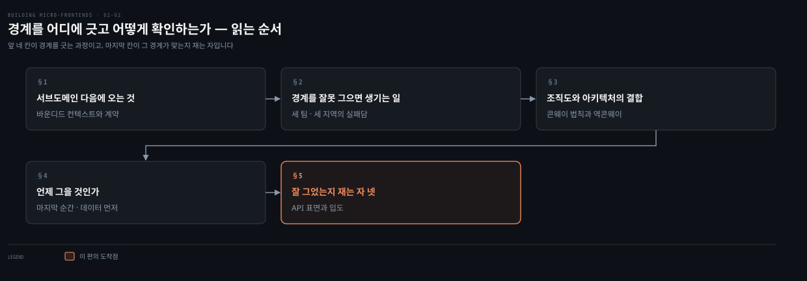
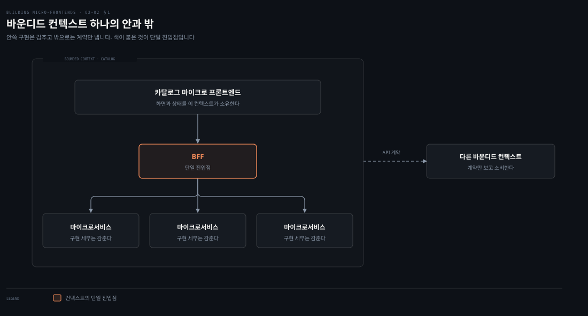
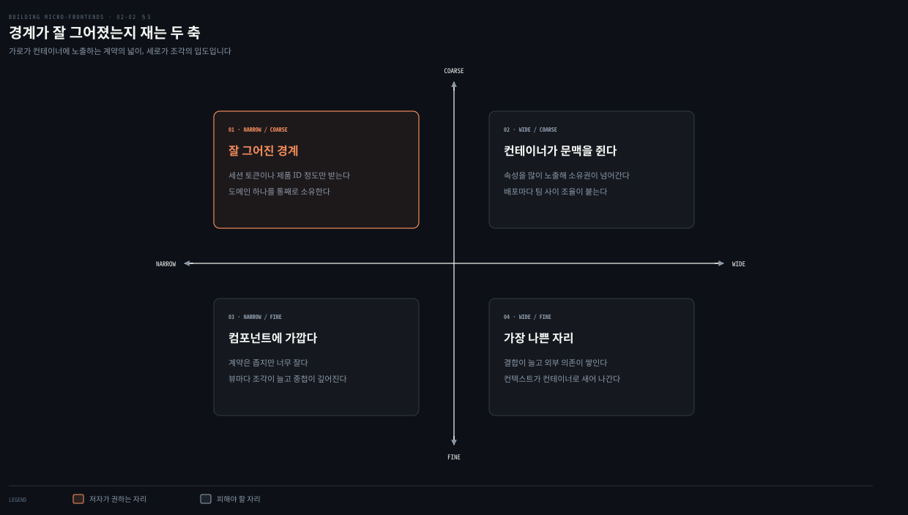

# 경계를 어디에 긋고 어떻게 확인하는가

---

> 서브도메인을 찾았다고 코드가 나뉘지는 않습니다. 2장 중반은 그 서브도메인을 바운디드 컨텍스트로 옮기는 방법과, 옮긴 경계가 제대로 그어졌는지 재는 자를 다룹니다.

## 핵심 요약

> 이 편 전체가 매달린 하나의 생각은 **경계는 기술을 고르기 전에 비즈니스에서 찾아야 하고, 찾은 뒤에는 그것이 계약으로 표현됐는지로 검증해야 한다**는 것입니다.
>
> 바운디드 컨텍스트가 그 옮김의 단위입니다. 구현 세부를 감추고 모델의 데이터를 소비할 API 계약만 노출하는 논리적 경계이며, 모델과 코드 구조와 팀을 함께 정합니다.
>
> 저자는 경계를 잘못 그었을 때를 실패담으로 보여 줍니다. 세 지역의 세 팀이 기술부터 고르자 같은 화면의 조각들이 서로 통신해야 했고, 한 팀이 조립을 떠맡아 조율과 디버깅에 시간을 썼습니다.
>
> 언제 그을지에도 답이 있습니다. 마지막 가능한 순간입니다. 다만 늦게 결정하되 재료는 미리 모읍니다. 데이터와 메트릭에서 시작하라는 것이 저자의 지침이고, 관측성이 없으면 그것부터 만들라고 합니다.
>
> 그은 뒤에는 검증합니다. 저자는 컨테이너에 노출한 API 표면과 조각의 입도라는 두 축으로 경계를 점검하는 멘탈 모델 넷을 줍니다.

## 학습 목표

이 내용을 읽고 나면:

1. 바운디드 컨텍스트가 서브도메인과 어떻게 다른지, 무엇을 함께 정하는지 설명할 수 있습니다.
2. 기술을 먼저 고른 팀이 겪는 실패의 인과를 저자의 시나리오로 재현할 수 있습니다.
3. 콘웨이 법칙과 역콘웨이 기동을 구분하고 저자의 입장을 말할 수 있습니다.
4. 바운디드 컨텍스트를 언제 결정해야 하는지와 그 판단에 쓰는 재료를 댈 수 있습니다.
5. 경계가 잘 그어졌는지 재는 네 가지 점검을 두 축으로 정리할 수 있습니다.

아래는 이 문서를 읽는 순서로 이은 지도입니다. 앞 네 칸이 경계를 긋는 과정이고 색이 붙은 마지막 칸이 그 경계가 맞는지 재는 자입니다.

## 1. 서브도메인 다음에 오는 것

> 서브도메인이 "무엇이 있는가"라면 바운디드 컨텍스트는 "어디까지가 내 것인가"입니다. 그 선을 계약이 긋습니다.

### 풀려는 문제

앞 편에서 서브도메인을 찾았습니다. 카탈로그가 핵심이고 투표가 지원이고 결제가 일반이라는 것까지 알았습니다.

그런데 그것만으로는 코드가 나뉘지 않습니다. 카탈로그 팀이 어디까지 고쳐도 되는지, 다른 팀이 카탈로그의 무엇에 기대도 되는지가 아직 정해지지 않았기 때문입니다. 이 선이 없으면 팀은 결국 같은 코드베이스를 함께 만지게 됩니다.

### 바운디드 컨텍스트가 하는 일

그 선을 긋는 것이 바운디드 컨텍스트입니다. 저자의 정의는 이렇습니다. 구현 세부를 감추고 모델에서 데이터를 소비할 API 계약을 노출하는 논리적 경계입니다.

하는 일이 셋입니다.

- 도메인과 서브도메인이 정의한 비즈니스 영역을 논리 영역으로 옮깁니다. 그 영역에서 모델과 코드 구조와 잠재적으로는 팀까지 정합니다.
- 서로 다른 컨텍스트가 어떻게 통신할지를 계약으로 정의합니다. 그 계약은 주로 API로 표현됩니다.
- 그 결과 팀들이 서로 다른 서브도메인에서 동시에 일하면서도 사전에 정한 계약을 지키게 됩니다.

신규 프로젝트에서는 서브도메인과 바운디드 컨텍스트가 자주 겹칩니다. 시스템을 가장 좋은 방식으로 설계할 자유가 있기 때문입니다. 레거시에서는 그 선이 더 흐릿합니다. 프로젝트 생애주기 동안 분석이 충분하지 않았던 탓입니다.

### 프론트엔드를 같은 경계 안에 넣기

위 도식이 저자가 Figure 2-3으로 보인 상태입니다. 바운디드 컨텍스트 안에 카탈로그 마이크로 프론트엔드가 있고, 그것이 백엔드 포 프론트엔드라는 단일 진입점을 통해 마이크로서비스 아키텍처의 API를 소비합니다. API 통합의 상세는 저자가 9장으로 미룹니다.

여기서 저자가 짚는 것이 하나 있습니다. **DDD는 프론트엔드를 명시적으로 다루지 않습니다.** 다만 수직 분할로 마이크로 프론트엔드를 쓰면 프론트엔드와 백엔드를 같은 바운디드 컨텍스트 안에 함께 매핑할 수 있습니다.

### 읽어내기 — 계약이 곧 경계다

앞의 질문에 답이 생깁니다. **"어디까지가 내 것인가"를 정하는 것은 폴더 구조가 아니라 계약입니다.** 계약 밖의 것은 전부 내부 구현이고, 팀은 그것을 마음대로 바꿉니다. 계약 안의 것은 바꾸려면 상대와 합의해야 합니다.

그래서 경계를 그었다는 말은 선을 그렸다는 뜻이 아니라 **무엇을 노출하고 무엇을 감출지 정했다는 뜻**입니다. 이 기준이 §5의 검증으로 그대로 이어집니다.

## 2. 경계를 잘못 그으면 생기는 일

> 저자는 실패담 하나로 순서의 값을 보입니다. 기술을 먼저 고르면 경계가 나중에 따라오고, 그때는 이미 늦습니다.

### 풀려는 문제

경계를 비즈니스에서 찾으라는 말은 앞에서 여러 번 나왔습니다. 그런데 실무에서는 반대로 갑니다. 회의에서 먼저 정해지는 것은 대개 "iframe으로 갈까 웹 컴포넌트로 갈까"입니다.

이 순서가 왜 나쁜지는 말로는 잘 와닿지 않습니다. 기술을 먼저 골라도 나중에 경계를 잘 그으면 되지 않느냐는 반문이 따라옵니다.

### 세 팀, 세 지역, 같은 코드베이스

그래서 저자가 시나리오를 하나 놓습니다. 세 팀이 세 지역에 흩어져 같은 코드베이스에서 일합니다. 이 팀들이 마이크로 프론트엔드를 위해 iframe이나 웹 컴포넌트를 쓰는 수평 분할을 고릅니다.

얼마 뒤 깨닫습니다. 같은 화면에 있는 마이크로 프론트엔드들이 어떻게든 통신해야 한다는 것입니다. 그러면 그중 한 팀이 화면 안의 여러 조각을 모으는 책임을 떠맡습니다. 그 팀은 조각을 조립하고 전부 제대로 도는지 디버깅하는 데 시간을 더 씁니다.

저자는 이것이 단순화한 그림이라고 덧붙입니다. 시차와 팀 간 교차 의존과 지식 공유와 분산된 팀 구조까지 넣으면 더 나빠집니다. 이런 어려움은 쉽게 커져서 납기 지연 위에 사기 저하와 좌절까지 얹습니다.

### 같은 시나리오를 다시 상상하면

저자는 같은 상황을 비즈니스 관점에서 다시 그립니다. 비즈니스 관점으로 접근하면 여러 서브도메인을 가로지르는 통신이 덜 필요한 독립적인 마이크로 프론트엔드를 만들 수 있습니다.

웹 컴포넌트나 iframe 대신 단일 페이지 애플리케이션으로 간다고 해 봅니다. 그러면 한 팀이 통째로 두 가지를 할 수 있습니다.

- 화면 하나를 구성하는 데 필요한 API를 전부 설계합니다.
- 트래픽에 맞춰 서비스를 확장할 인프라를 만듭니다.

마이크로아키텍처와 마이크로서비스와 마이크로 프론트엔드를 함께 쓰면 운영에 릴리스할 때 전체 시스템을 위태롭게 할 큰 위험 없이 독립적으로 배포할 수 있습니다.

### 읽어내기 — 순서를 바꾸면 결과가 바뀐다

두 시나리오의 차이는 기술이 아닙니다. iframe이 나쁘고 SPA가 좋아서가 아닙니다. **먼저 정한 것이 무엇이냐가 다릅니다.**

앞 시나리오는 조합 방식을 먼저 정했습니다. 그래서 조각의 크기가 그 방식에 맞춰졌습니다. 뒤 시나리오는 도메인을 먼저 정했습니다. 그래서 조각 하나가 화면 하나를 통째로 갖게 됐습니다. 02-01 §1에서 정의가 첫 결정이라고 한 말이 여기서 실패담으로 확인됩니다.

경계를 찾는 데 필요한 것도 저자가 덧붙입니다. 개발자와 테크 리드와 아키텍트가 제품 팀과 더 가까이 일해야 합니다. 시간을 함께 쓰고 고객 니즈를 이해해야 도메인과 서브도메인을 협업으로 식별할 수 있습니다. 여기서도 이벤트 스토밍이 자연스럽게 들어맞습니다.

## 3. 조직도와 아키텍처는 서로를 베낀다

> 팀 구조에 맞춰 시스템을 짜는 것도, 원하는 시스템에 맞춰 팀을 바꾸는 것도 가능합니다. 저자가 요구하는 것은 둘 사이의 결합을 인지하는 일입니다.

### 풀려는 문제

앞 절의 실패담에는 조직 이야기가 섞여 있었습니다. 세 지역의 세 팀이라는 조건이 기술 선택만큼이나 결과를 좌우했습니다.

그러면 반대로 물을 수 있습니다. 어차피 팀이 그렇게 나뉘어 있으니 시스템도 그 모양으로 짜면 되지 않을까요. 이 질문은 실무에서 자주 나오고, 답하기 애매합니다.

### 콘웨이 법칙과 역콘웨이 기동

저자는 회사들이 자기 팀 구조를 바탕으로 시스템을 설계하는 것을 자주 봤다고 적습니다. 그 관찰의 이름이 콘웨이 법칙이며, 저자가 각주에 원문을 답니다. 시스템을 설계하는 조직은 그 조직의 소통 구조를 베낀 설계를 만들어 낼 수밖에 없다는 것입니다.

저자의 권고는 그 반대 방향입니다. 팀 구조가 조직에 가능한 최선의 해법에 맞춰 바뀔 만큼 유연해야 한다는 것입니다. 그래야 마찰이 줄고 최종 목표에 빨리 다가갑니다. 저자가 말하는 최종 목표는 고객을 만족시키는 훌륭한 제품을 내놓는 일입니다. 이 방향에도 이름이 있습니다. 원하는 아키텍처를 촉진하도록 팀과 조직 구조를 진화시키라는 역콘웨이 기동입니다.

### 읽어내기 — 둘 다 되지만 알고 해야 한다

저자의 결론은 한쪽 편들기가 아닙니다. **팀을 짜는 방식과 시스템을 설계하는 방식 어느 쪽에서 출발해도 괜찮습니다.** 다만 조건이 하나 붙습니다. 조직 구조와 소프트웨어 아키텍처 사이의 결합을 인지하고 있어야 합니다.

인지해야 하는 이유도 구체적입니다. 두 영역 가운데 한쪽이 바뀌면 다른 쪽이 간접적으로 영향을 받는 일이 잦기 때문입니다. 팀을 합치면 그 팀들이 소유하던 경계가 흐려지고, 경계를 합치면 팀이 따라 움직입니다. 앞의 질문에 대한 답은 "된다, 다만 그 대가를 모른 채 하지는 말라"입니다.

## 4. 언제 그을 것인가

> 늦게 결정하되 재료는 미리 모읍니다. 저자의 재료는 감이 아니라 대시보드입니다.

### 풀려는 문제

경계를 어디에 그을지 알았다고 해도 시점이 남습니다. 지금 나눌지 나중에 나눌지입니다.

양쪽 다 그럴듯합니다. 지금 나누면 나중에 드는 리팩터 비용을 아낍니다. 나중에 나누면 더 많은 정보를 갖고 결정합니다. 기준이 없으면 이 선택은 그때그때 분위기로 정해집니다.

### 마지막 가능한 순간

저자의 답은 분명합니다. 조기 최적화는 늘 가까이 있고, 미래의 통합을 미리 수용하려고 바운디드 컨텍스트를 너무 일찍 쪼개도록 유혹합니다. 그 대신 충분한 정보를 얻어 근거 있는 결정을 내릴 수 있을 때까지 기다려야 합니다.

**조기 분해를 피하려면 마지막 가능한 순간에 결정합니다.** 그래야 어느 방향으로 가야 할지에 대한 정보와 명료함이 더 많아집니다.

기다린다고 아무것도 안 하는 것은 아닙니다. 서브도메인을 정의하는 동안 조직 안의 제품 팀이나 도메인 전문가와 미리 함께 움직여야 합니다. 그들이 시스템이 돌아가는 맥락을 줍니다.

바운디드 컨텍스트는 한 번 정하고 끝나지도 않습니다. 비즈니스가 시간에 따라 진화하므로 바운디드 컨텍스트와 서브도메인 종류에 대한 결정도 다시 검토해야 합니다. 큰 컨텍스트로 시작했다가 비즈니스가 진화하면서 관리하기 어렵거나 너무 복잡해지는 일이 있습니다. 그 시점에 쪼개기로 할 수 있습니다. 이 결정은 큰 코드 리팩터로 이어질 수 있지만 코드베이스를 극적으로 단순하게 만들어 앞으로의 기능 개발을 빠르게 할 수도 있습니다.

### 데이터에서 시작한다

기다리는 동안 모을 재료가 데이터와 메트릭입니다. 저자는 항상 여기서 시작하라고 적습니다. 사용자가 애플리케이션과 어떻게 상호작용하는지, 인증됐을 때와 아닐 때 사용자 여정이 어떻게 다른지를 쉽게 알아낼 수 있기 때문입니다.

데이터는 서브도메인을 식별할 때 강력한 명료함을 주고, 시스템이 나아지고 있는지 볼 수 있는 최초의 기준선을 만들어 줍니다. 시스템에 관측성이 별로 없다면 그것을 만드는 데 시간을 투자해야 합니다. 마이크로 프론트엔드를 식별하기 시작하는 순간 그 투자가 값을 합니다. 대시보드와 메트릭이 없으면 사용자가 애플리케이션 안에서 어떻게 움직이는지에 대해 눈이 먼 상태입니다.

저자가 든 예가 구체적입니다. 랜딩 페이지에 큰 트래픽이 있고 그 사용자의 70%가 인증 여정으로 넘어갑니다. 로그인과 가입과 결제 같은 것들입니다. 거기서 다시 40%만 서비스를 구독하거나 자격 증명으로 접근합니다.

이 관찰이 코드 분할의 근거가 됩니다. 랜딩 페이지와 관련된 코드만 내려받게 하면 사용자는 더 빠른 경험을 얻습니다. 애플리케이션 전체를 즉시 내려받지 않아도 되기 때문입니다.

> **원문 정오**: 저자는 이어지는 문장에서 "인증 영역으로 넘어가지 않는 사용자 40%"라고 적습니다. 그런데 바로 앞 문단이 랜딩 트래픽의 70%가 인증 여정으로 넘어간다고 했으므로 넘어가지 않는 쪽은 **30%**입니다. 40%는 인증 여정에 들어간 사람 가운데 구독까지 가는 비율이라 자리가 다릅니다. 이 노트는 위 본문에서 두 수치를 원문 그대로 옮기되, 뒤 문장의 40%는 30%로 읽어야 앞뒤가 맞는다고 봅니다.

이 접근으로 가장 크게 이득을 보는 것은 느린 연결의 모바일 기기입니다. 이유가 셋입니다.

- 내려받는 데이터가 줄어듭니다.
- 쓰는 메모리가 줄어듭니다.
- 파싱하고 실행하는 자바스크립트가 줄어듭니다.

그래서 페이지와의 첫 상호작용이 빨라집니다.

기억할 것이 하나 더 있습니다. 모든 사용자 세션이 플랫폼이 노출하는 모든 URL을 담지는 않습니다. 그래서 사전 조사가 더 나은 사용자 경험으로 이어집니다.

### 팀의 기술 수준도 변수다

수평 분할과 수직 분할 가운데 무엇을 고를지는 보통 만들려는 프로젝트의 종류에 달렸습니다. 저자는 이 주제를 3장에서 더 깊이 다루겠다고 미룹니다. 앞에서 말했듯 둘은 배타적이지 않아, 애플리케이션의 어떤 부분은 수직이 낫고 다른 부분은 수평이 나을 수 있습니다.

고려할 것이 하나 더 있습니다. 팀의 기술 수준입니다. 보통 **수직 분할이 마이크로 프론트엔드를 처음 하는 팀에 더 잘 맞습니다.** 수평 분할은 견고하고 빠른 개발 경험을 만드는 선행 투자를 요구하기 때문입니다. 팀이 자기 부분을 따로도, 전체 화면 안에서도 테스트할 수 있어야 합니다.

### 읽어내기 — 늦게 결정하되 재료는 미리 모은다

앞의 양자택일이 사라집니다. 저자의 답은 "지금"도 "나중"도 아닙니다. **결정은 마지막 순간으로 미루고, 그 순간에 쓸 재료는 처음부터 모읍니다.**

재료가 둘입니다. 제품 팀·도메인 전문가와의 협업이 하나이고, 대시보드와 메트릭이 다른 하나입니다. 관측성 투자를 먼저 하라는 말이 여기서 나옵니다. 미루기만 하고 재료를 안 모으면 마지막 순간에도 감으로 결정하게 됩니다.

## 5. 잘 그었는지 재는 자 넷

> 저자는 경계를 컴포넌트처럼 다루고 있는지 가려내는 멘탈 모델을 줍니다. 네 항목은 두 축으로 줄어듭니다.

### 풀려는 문제

저자는 마이크로 프론트엔드 아키텍처를 도입했다는 팀들과 회의를 자주 했다고 적습니다. 그런데 그중 상당수가 마이크로 프론트엔드를 **런타임에 로드되는 컴포넌트처럼** 다루고 있었습니다.

문제는 이 상태를 안에서는 알아채기 어렵다는 데 있습니다. 조각으로 나뉘어 있고 따로 배포도 되니 겉으로는 마이크로 프론트엔드입니다. 무엇을 보면 아닌 줄 알 수 있느냐가 질문입니다.

### 저자의 네 가지 점검

그래서 저자가 만든 멘탈 모델이 넷입니다.

- **컨테이너에 노출하는 API 표면을 줄입니다.** 마이크로 프론트엔드의 속성을 너무 많이 노출하면 결합 위험이 크게 올라갑니다. 컨테이너가 마이크로 프론트엔드 대신 컨텍스트의 소유권을 갖게 되기 때문입니다. 그 결과가 우발적 복잡도이며, 배포할 때와 팀 사이를 상시 조율할 때 드러납니다.
- **마이크로 프론트엔드는 본질적으로 컨텍스트를 압니다.** 제대로 동작하는 데 필요한 정보가 최소한입니다. 제품 ID를 넘기거나 API를 소비할 세션 토큰을 조회하게 하는 것이 수평 분할의 흔한 특성입니다. 컨테이너에서 공통 속성을 더 많이 공유하고 있다면 구현을 의심하고 API 계약이나 경계를 다시 봐야 합니다.
- **컴포넌트와 달리 확장성이 낮습니다.** 컴포넌트를 설계할 때는 높은 재사용성과 코드 추상화에 초점을 둡니다. 마이크로 프론트엔드는 독립성을 위해 설계합니다. 컨텍스트를 아는 성질 때문에 확장되거나 서로 통합될 가능성이 낮습니다. 잘못된 경계의 신호는 뷰마다 마이크로 프론트엔드가 증식하거나 조각끼리 깊게 중첩되는 것입니다.
- **컴포넌트보다 입도가 굵습니다.** 버튼 같은 고전적 컴포넌트는 작고 다른 컴포넌트와 조합하기에 유연합니다. 마이크로 프론트엔드는 기능이 고도로 특화돼 있습니다. 그 특화가 재사용성을 제한하고 더 큰 마이크로 프론트엔드로 결합하기 어렵게 만듭니다. 잘게 나눈 마이크로 프론트엔드는 피하는 편이 좋습니다. 결합을 늘리고 외부 의존을 만들며 컨테이너 쪽으로 컨텍스트를 흘리기 때문입니다.

### 읽어내기 — 두 축으로 줄이면

네 항목을 겹쳐 보면 축이 둘로 모입니다. 앞의 둘은 **컨테이너에 노출하는 계약의 넓이**를 말하고, 뒤의 둘은 **조각의 입도**를 말합니다.

위 도식이 그 두 축입니다. 저자가 권하는 자리는 계약이 좁고 입도가 굵은 칸입니다. 세션 토큰이나 제품 ID 정도만 받으면서 도메인 하나를 통째로 소유하는 상태입니다.

앞의 질문에 답이 생깁니다. **컴포넌트처럼 쓰고 있는지는 조각 수나 배포 방식이 아니라 계약의 넓이와 입도로 압니다.** 조각이 잘고 계약이 넓으면 그것은 이름만 마이크로 프론트엔드이고, 실제로는 런타임에 로드되는 컴포넌트입니다.

## 적용 관점

> 아래는 백엔드 개발자가 이미 가진 판단 기준과 이 절을 잇는 노트의 읽기입니다. 책이 백엔드 독자를 향해 쓴 대목이 아닙니다.

바운디드 컨텍스트와 콘웨이 법칙은 백엔드에서 이미 쓰는 어휘입니다. 새로운 것은 저자가 프론트엔드를 **같은 컨텍스트 안에 넣자**고 제안하는 대목입니다. 수직 분할이면 카탈로그 화면과 카탈로그 서비스와 그 저장소가 한 경계 안에 들어가고, 한 팀이 그 전부를 소유합니다.

"마지막 가능한 순간에 결정한다"도 옮겨 쓸 수 있습니다. 모듈러 모놀리스로 시작해 필요할 때 서비스를 떼는 판단과 같은 자리입니다. 다만 저자가 덧붙이는 조건이 실무에서 자주 빠집니다. 미루는 동안 관측성을 만들어 두라는 것입니다. 미루기만 하고 데이터를 안 모으면 마지막 순간에도 근거가 없습니다.

경계 점검 네 항목은 API 설계 리뷰 체크리스트로 그대로 옮겨집니다. 노출한 필드가 늘고 있는지, 호출자마다 옵션이 붙고 있는지, 서비스가 혼자서 유스케이스를 완결하는지를 보는 일입니다. 도메인 쪽 판단 기준은 [Bounded Context 와 Context Map](../../04_ddd/01-04.Bounded%20Context%20와%20Context%20Map.md)이 갖고 있습니다.

## 면접 대비

### 한 줄 정의

바운디드 컨텍스트란 구현 세부를 감추고 모델의 데이터를 소비할 API 계약만 노출하는 논리적 경계이며, 그 안에서 모델과 코드 구조와 팀을 함께 정합니다.

### 핵심 포인트 세 가지

1. 서브도메인이 "무엇이 있는가"라면 바운디드 컨텍스트는 "무엇을 노출하고 무엇을 감출 것인가"이며, 그 선을 긋는 것은 폴더 구조가 아니라 계약입니다.
2. 바운디드 컨텍스트 결정은 마지막 가능한 순간으로 미루되, 그 순간에 쓸 재료로 도메인 전문가와의 협업과 관측 데이터를 미리 모읍니다.
3. 경계가 잘 그어졌는지는 컨테이너에 노출한 API 표면의 넓이와 조각의 입도 두 축으로 잽니다.

### 자주 묻는 질문

Q: 팀 구조에 맞춰 시스템을 설계해도 되나요?
A: 저자는 두 방향 다 수용 가능하다고 봅니다. 조건은 조직 구조와 소프트웨어 아키텍처 사이의 결합을 인지하는 것입니다. 한쪽이 바뀌면 다른 쪽이 간접적으로 영향을 받는 일이 잦기 때문입니다.

Q: 마이크로 프론트엔드를 컴포넌트처럼 쓰고 있는지 어떻게 아나요?
A: 컨테이너에 넘기는 속성이 세션 토큰이나 제품 ID 수준을 넘어 계속 늘고 있다면 의심합니다. 뷰마다 조각이 증식하거나 조각끼리 깊게 중첩되는 것도 잘못된 경계의 신호입니다.

Q: 마이크로 프론트엔드가 처음인 팀은 어느 분할이 나은가요?
A: 수직 분할입니다. 수평 분할은 팀이 자기 부분을 따로도 전체 화면 안에서도 테스트할 수 있도록 견고하고 빠른 개발 경험을 만드는 선행 투자를 요구합니다.

## 핵심 개념 체크리스트

- [ ] 바운디드 컨텍스트의 정의를 "감추는 것"과 "노출하는 것"으로 말할 수 있는가?
- [ ] 신규 프로젝트와 레거시에서 서브도메인과 바운디드 컨텍스트의 관계가 어떻게 다른지 아는가?
- [ ] 기술을 먼저 고른 세 팀 시나리오의 실패 인과를 이어 말할 수 있는가?
- [ ] 콘웨이 법칙과 역콘웨이 기동을 구분하고 저자의 조건을 댈 수 있는가?
- [ ] "마지막 가능한 순간"에 결정하라는 말과 함께 붙는 조건을 아는가?
- [ ] 경계 점검 네 항목을 두 축으로 묶어 말할 수 있는가?

## 관련 문서

- [네 기둥과 첫 기둥 — 무엇을 하나로 볼 것인가](02-01.네%20기둥과%20첫%20기둥%20—%20무엇을%20하나로%20볼%20것인가.md) — 이 편이 이어받는 서브도메인 식별
- [합치고 잇고 주고받기](02-03.합치고%20잇고%20주고받기.md) — 경계를 정한 뒤 나머지 세 결정
- [Bounded Context 와 Context Map](../../04_ddd/01-04.Bounded%20Context%20와%20Context%20Map.md) — 컨텍스트 사이 통합 패턴의 판단 기준
- [일곱 원칙과 프론트엔드로의 번역](01-02.일곱%20원칙과%20프론트엔드로의%20번역.md) — 구현 은닉과 계약 우선이 원칙으로 나오는 자리
- [Building Micro-Frontends 정독 인덱스](README.md) — 장별 목표와 진행 상태

## 참고 자료

- 《Building Micro-Frontends, Second Edition》(Luca Mezzalira, O'Reilly, 2026) ISBN 978-1-098-17078-3
  - 다룬 범위: DDD with Micro-Frontends · How to Define a Bounded Context · Testing Your Micro-Frontend Boundaries
- 콘웨이 법칙과 역콘웨이 기동 — 저자가 본문 각주로 정의를 단 두 개념
