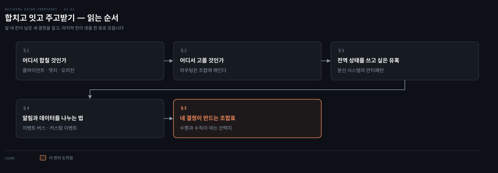
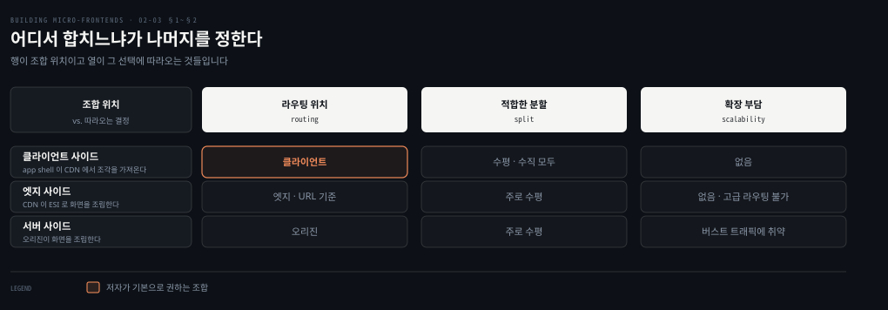
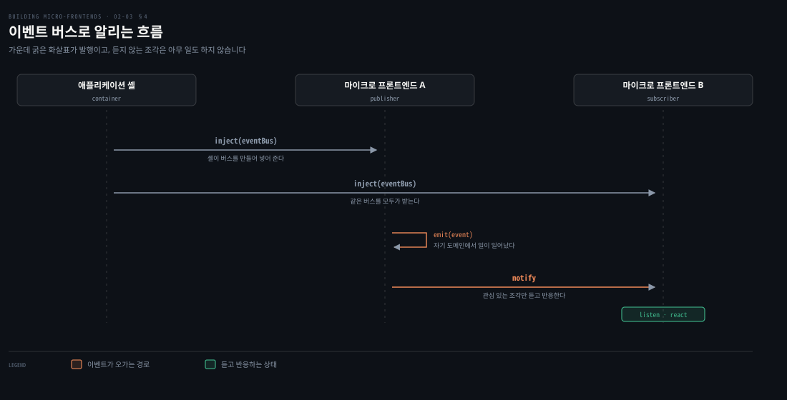

# 합치고 잇고 주고받기

---

> 경계를 정했다면 남은 결정은 셋입니다. 조각을 어디서 합칠지, 어느 화면을 보여 줄지 어디서 고를지, 조각끼리 무엇으로 주고받을지입니다. 2장 후반은 이 셋을 차례로 짚고 네 결정을 한 표로 모읍니다.

## 핵심 요약

> 이 편이 매달린 하나의 생각은 **조합을 어디서 하느냐가 라우팅과 확장 부담과 쓸 수 있는 통신 수단을 함께 정하므로, 이 세 결정은 따로 고를 수 없다**는 것입니다.

조합 자리는 셋입니다. 클라이언트와 엣지와 오리진이며, 저자는 이 가운데 엣지 사이드가 널리 채택되지 않았다고 밝히고 주로 클라이언트나 서버 쪽을 쓰라고 권합니다. 라우팅은 그 선택에 매입니다. 서버에서 합치면 라우팅도 오리진에서 일어나야 하고 엣지에서 합치면 URL 기준이라 고급 라우팅 여지가 적습니다. 클라이언트 라우팅만이 인증 상태나 지오로케이션 같은 정교한 조건을 다룹니다.

통신은 두 갈래입니다. 조각끼리 알리는 UI 이벤트와 토큰처럼 나눠 갖는 데이터입니다. 전역 상태 관리자는 쓰지 않습니다. 저자는 그것을 분산 시스템의 안티패턴이라고 못 박습니다. 마지막에 네 결정이 한 표로 모이는데, 수평 분할이 여는 선택지가 수직 분할보다 넓고 그만큼 정해야 할 것도 많습니다.


## 학습 목표

이 내용을 읽고 나면:

1. 조합의 세 자리를 들고 각각이 어디서 무엇을 조립하는지 설명할 수 있습니다.
2. 저자가 엣지 사이드를 기본으로 권하지 않는 이유를 댈 수 있습니다.
3. 조합 위치가 라우팅 위치를 어떻게 구속하는지 말할 수 있습니다.
4. 전역 상태 관리자가 왜 안티패턴인지, 대신 무엇을 쓰는지 설명할 수 있습니다.
5. 수평 분할과 수직 분할이 각각 여는 선택지의 차이를 조합표로 재현할 수 있습니다.

아래는 이 문서를 읽는 순서로 이은 지도입니다. 앞 네 칸이 남은 세 결정을 짚고 색이 붙은 마지막 칸이 넷을 한 표로 모읍니다.




## 1. 어디서 합칠 것인가

> 조합 자리를 고르는 일은 성능 선택처럼 보이지만 실제로는 라우팅과 확장 전략까지 함께 고르는 일입니다.



### 풀려는 문제

조각을 나눠 놓으면 다시 합쳐야 화면이 됩니다. 합치는 일은 브라우저에서도, CDN에서도, 서버에서도 할 수 있습니다.

셋 다 가능하다는 사실이 문제를 만듭니다. 어느 것이 맞는지 정하는 기준이 성능인지 비용인지 팀 역량인지가 안 보이면, 결국 익숙한 것을 고르게 됩니다.

### 세 자리

저자는 조합 방식을 셋으로 정리합니다. 원문 Figure 2-4가 왼쪽부터 오른쪽으로 그 셋을 늘어놓습니다.

- **클라이언트 사이드 조합** — 애플리케이션 셸이 여러 마이크로 프론트엔드를 CDN에서 직접 불러옵니다. 아직 CDN에 캐시되지 않았다면 오리진에서 가져옵니다. 수평 분할과 수직 분할 모두에 이롭습니다.
- **엣지 사이드 조합** — CDN 레벨에서 최종 화면을 조립합니다. 조각은 오리진에서 가져오고 결과만 클라이언트에 전달합니다.
- **서버 사이드 조합** — 오리진 레벨에서 조각을 화면 안에 조립하고, CDN에 캐시한 뒤 클라이언트에 서빙합니다.

저자가 덧붙이는 제약이 하나 있습니다. 엣지 사이드와 서버 사이드는 주로 수평 분할 방식을 씁니다.

### 클라이언트 사이드

애플리케이션 셸이 자기 안에 조각을 불러오는 경우입니다. 조각은 자바스크립트 파일이나 HTML 파일을 진입점으로 가져야 합니다. 셸이 DOM 노드를 동적으로 붙이거나, 자바스크립트 파일이나 ECMAScript 모듈로 애플리케이션을 초기화해야 하기 때문입니다.

초기에는 다른 수단도 함께 썼습니다. 조각마다 iframe을 쓰거나, 클라이언트 사이드 인클루드라는 기법으로 트랜스클루전을 했습니다. 이 기법은 컴포넌트를 지연 로딩하고 빈 자리표시자 태그를 복잡한 컴포넌트로 바꿔 넣는 방식으로 동작합니다. 예를 들어 `h-include` 라이브러리는 자리표시자 태그가 어떤 URL로 AJAX 요청을 만들고 그 응답으로 요소의 내부 HTML을 교체합니다.

2019년부터는 사정이 달라집니다. Module Federation이나 single-spa 같은 해법이 클라이언트 사이드 조합을 위해 더 널리 쓰이기 시작했습니다. 저자는 이 주제를 뒤 장에서 자세히 다루겠다고 미룹니다.

> 저자가 각주 격으로 붙인 트랜스클루전의 정의는 이렇습니다. 하이퍼텍스트 참조로 전자 문서의 일부나 전부를 다른 문서에 포함하는 것입니다. 참조하는 문서가 표시될 때 수행되며 보통 자동이고 최종 사용자에게는 투명합니다. 결과는 서로 다른 컴퓨터의 떨어진 곳에 저장됐을 수도 있는 부분들을 동적으로 조립한 단일 통합 문서입니다. HTML에서 이미지를 배치하는 것이 그 예입니다.

### 엣지 사이드

CDN 레벨에서 화면을 조립합니다. 많은 CDN 제공자가 Edge Side Includes라는 XML 기반 마크업 언어를 쓸 수 있게 해 줍니다.

ESI는 새 언어가 아닙니다. 2001년에 Akamai와 Oracle 등이 표준으로 제안했습니다. ESI는 웹 인프라가 CDN 네트워크가 전 세계에 두고 있는 다수의 접속 지점을 활용해 확장하도록 해 줍니다. 대부분의 소프트웨어가 호스팅되는 제한된 데이터센터 용량과 대비되는 지점입니다.

단점이 하나 있습니다. CDN 제공자마다 ESI를 같은 방식으로 구현하지 않습니다. 그래서 멀티 CDN 전략을 쓰거나 코드를 한 제공자에서 다른 제공자로 옮기면 많은 리팩터와 새로 구현할 로직이 생길 수 있습니다.

### 서버 사이드

마지막 가능성입니다. 오리진 서버가 여러 조각을 가져와 최종 페이지를 조립합니다. 페이지의 캐시 가능성이 높으면 CDN이 긴 TTL 정책으로 서빙합니다.

문제는 개인화입니다. 페이지가 사용자마다 개인화된다면 최종 해법의 확장성을 심각하게 고려해야 합니다. 여러 클라이언트에서 요청이 많이 올 때 특히 그렇습니다. 서버 사이드 조합을 쓰기로 했다면 애플리케이션 안의 유스케이스를 철저히 분석해야 하고, 런타임 조합을 구현하기로 했다면 사용자에게 다운타임을 주지 않도록 서버의 명확한 확장 전략을 갖춰야 합니다.

### 읽어내기 — 권고는 둘로 좁혀진다

앞의 질문에 저자가 답을 줍니다. 셋이 나란한 선택지가 아닙니다. **엣지 사이드는 전 세계 조직에서 널리 채택되지 않았고, 저자의 권고는 주로 클라이언트 사이드나 서버 사이드를 쓰라는 것입니다.**

그리고 고르는 기준도 성능이 아닙니다. 프로젝트와 팀의 지식에 가장 알맞은 기법을 고르라는 것이 저자의 문장입니다. 클라이언트 사이드와 서버 사이드를 함께 쓰는 아키텍처를 배포할 수도 있고, 프로젝트를 어떻게 구조화할지 이해하고 있다면 그것도 괜찮습니다.


## 2. 어디서 고를 것인가

> 라우팅은 독립적인 결정처럼 보이지만 앞 절의 선택이 이미 대부분을 정해 놓습니다.

### 풀려는 문제

조합 자리를 골랐으면 다음은 라우팅입니다. 사용자가 어느 화면을 볼지 누가 정하느냐는 문제입니다.

여기서 흔한 오해가 있습니다. 라우팅을 프론트엔드 프레임워크의 기능으로 여기는 것입니다. 그러면 조합을 서버에서 하기로 해 놓고 클라이언트 라우터를 쓰겠다는 설계가 나옵니다.

### 조합 위치가 라우팅을 정한다

저자는 이 결정이 조합 메커니즘과 밀접하게 묶여 있다고 못 박습니다. 페이지 요청은 서버 사이드나 엣지 사이드나 클라이언트 사이드에서 라우팅할 수 있습니다.

서버 사이드 조합을 쓰면 라우팅은 오리진에서 일어나야 합니다. 모든 애플리케이션 로직이 애플리케이션 서버에서 돌기 때문입니다. 여기에 따라오는 부담이 있습니다. 초당 요청 수가 많은 버스트 트래픽을 감당해야 할 때 이 인프라를 확장하기가 어렵습니다. 서버가 모든 요청을 따라잡고 아주 빠르게 수평 확장해야 하며, 각 애플리케이션 서버가 조립할 조각들을 가져와야 합니다.

CDN이 이 문제를 완화해 줍니다. 다만 주된 단점이 있습니다. 동적이거나 개인화된 데이터가 있으면 CDN에 크게 기대어 페이지를 서빙할 수 없습니다. 데이터가 낡았거나 개인화되지 않았을 수 있기 때문입니다.

엣지 사이드 조합을 쓰면 라우팅은 페이지 URL을 기준으로 하고, CDN이 엣지 레벨에서 트랜스클루전으로 조각을 조립해 페이지를 서빙합니다. 이 경우 고급 라우팅의 여지가 많지 않습니다. 저자는 이 아키텍처를 고를 때 유념해야 할 중요한 제약이라고 적습니다.

### 클라이언트 라우팅이 여는 것

마지막 선택지가 클라이언트 사이드 라우팅입니다. 사용자 상태에 따라 조각을 불러옵니다. 이미 인증된 사용자면 인증 영역을 불러오고, 처음 접근하는 사용자면 랜딩 페이지만 불러오는 식입니다.

애플리케이션 셸이 조각을 불러오는 구조라면 셸이 라우팅 로직을 소유합니다. 셸이 먼저 라우팅 설정을 가져오고 그다음 어느 조각을 불러올지 결정합니다.

이 방식은 복잡한 라우팅에 잘 맞습니다. 조각이 인증이나 지오로케이션 같은 정교한 로직에 따라 갈릴 때가 그렇습니다. 반대로 멀티 페이지 웹사이트라면 조각이 클라이언트 사이드 트랜스클루전으로 실릴 수 있습니다. 이런 아키텍처에는 적용할 라우팅 로직이 거의 없습니다. 클라이언트가 사용자가 브라우저에 입력한 URL이나 다른 페이지에서 고른 하이퍼링크에 전적으로 기대기 때문입니다. 엣지 사이드 인클루드 방식과 비슷하며, 두 경우 모두 확장성 문제가 없습니다.

### 읽어내기 — 배타적이지 않다

앞의 오해가 여기서 풀립니다. **조합을 서버에서 하기로 했다면 클라이언트 라우터를 얹는 설계는 성립하지 않습니다.** 모든 앱 로직이 서버에서 돌기 때문입니다.

다만 저자는 라우팅 접근도 배타적이지 않다고 덧붙입니다. 뒤에서 보겠지만 CDN과 오리진을 함께 쓰거나 클라이언트 사이드와 CDN을 함께 쓰는 식으로 조합할 수 있습니다. 중요한 것은 애플리케이션을 어떻게 라우팅할지 정하는 일이며, 이 근본적인 결정이 마이크로 프론트엔드 애플리케이션을 어떻게 개발할지를 좌우합니다.


## 3. 전역 상태를 쓰고 싶은 유혹

> 조각끼리 상태를 나눠야 할 때 가장 먼저 떠오르는 답이 가장 나쁜 답입니다.

### 풀려는 문제

같은 페이지에 여러 조각이 있으면 사용자에게 일관되고 앞뒤 맞는 인터페이스를 유지하기가 어려워집니다. 서로 다른 팀이 소유한 조각끼리 통신하게 하려 할 때도 마찬가지입니다.

이 문제를 만나면 답이 하나 자연스럽게 떠오릅니다. 전역 상태 관리자를 두는 것입니다. 모놀리스 코드베이스에서는 흔한 접근이고 잘 동작해 왔습니다.

### 왜 안티패턴인가

저자는 이것을 못 박아 막습니다. 이 패러다임을 처음 접하는 팀이 전역 상태 관리자로 조각 사이에 상태를 공유하려는 유혹을 받지만, **분산 시스템에서는 안티패턴**이라는 것입니다.

이유는 결과에 있습니다. 마이크로 프론트엔드에 전역 상태를 쓰면 팀 사이에 결합과 마찰이 생깁니다. 저자의 표현으로는 분산 프론트엔드 시스템에서 우리가 목표하는 것의 정반대입니다.

이 판정의 근거는 원칙에서 옵니다. 같은 페이지의 각 조각은 서로 결합이 없어야 합니다. 그렇지 않으면 독립 배포 원칙이 깨집니다.

### 읽어내기 — 원칙이 수단을 자른다

앞의 유혹에 대한 답은 성능이나 편의로 내려지지 않습니다. **1장에서 세운 독립 배포 원칙이 수단 하나를 잘라 냅니다.**

전역 상태를 쓰면 조각 A의 상태 모양이 바뀔 때 조각 B가 깨집니다. 그러면 둘은 함께 배포돼야 하고, 그 순간 마이크로 프론트엔드는 이름만 남습니다. 그래서 다음 절의 수단들은 전부 "결합 없이 알리는 법"을 푸는 도구입니다.


## 4. 알림과 데이터를 나누는 법

> 저자는 통신을 두 범주로 가릅니다. 알림과 데이터는 다른 문제이고 쓰는 수단도 다릅니다.



### 풀려는 문제

전역 상태를 못 쓴다면 조각끼리 어떻게 소통할까요.

여기서 한 덩어리로 뭉뚱그리기 쉬운 것이 있습니다. "통신"이라는 한 낱말 안에 서로 다른 두 요구가 들어 있다는 점입니다. 하나는 무슨 일이 일어났다고 알리는 일이고, 다른 하나는 토큰 같은 값을 실제로 건네는 일입니다.

### UI 이벤트 — 이벤트 버스와 커스텀 이벤트

저자는 통신을 두 범주로 가릅니다. UI 이벤트는 조각들이 결합을 유지한 채로 서로 알려야 하는 경우이고, 공유 데이터는 단명하거나 인증 토큰처럼 오래 사는 값입니다.

알림 쪽 첫 수단이 이벤트 버스입니다. 결합 없는 컴포넌트들이 이벤트로 통신하게 해 주는 메커니즘이며, 각 조각에 주입해 모든 조각에 알립니다. 발행된 이벤트에 관심 있는 조각만 듣고 반응합니다. 위 도식이 그 흐름입니다.

주입하려면 이벤트 버스를 만들어 페이지의 모든 조각에 넣어 줄 컨테이너가 필요합니다. 대안으로 애플리케이션 셸이 이 로직을 맡아 버스를 주입하거나 노출할 수 있습니다.

둘째 수단이 커스텀 이벤트입니다. 평범한 이벤트인데 본문을 커스텀할 수 있습니다. 이벤트를 식별하는 문자열과 선택적인 커스텀 객체를 정의합니다.

```javascript
new CustomEvent('myCustomEvent', {
  detail: {
    someData: 12345
  }
});
```

커스텀 이벤트는 모든 조각이 접근할 수 있는 객체로 디스패치해야 합니다. 브라우저의 창을 나타내는 `window` 객체 같은 것입니다. 조각을 iframe으로 구현하기로 했다면 이벤트 버스를 쓰는 편이 낫습니다. iframe마다 자기 `window` 객체를 갖기 때문에 안에서 어느 `window`를 쓸지 정하는 문제를 피할 수 있습니다.

저자가 커스텀 이벤트에 붙이는 경고가 하나 더 있습니다. 커스텀 이벤트는 DOM에 표현된 요소 트리를 타고 `window` 객체까지 전파됩니다. 어느 팀이 실수로 DOM에 닿기 전에 전파를 멈추는 장면을 떠올려 보라는 것입니다. 그래서 **권고는 이벤트 에미터를 첫 선택으로 삼으라는 것**입니다.

### 공유 데이터 — 웹 스토리지와 쿼리 스트링

값을 실제로 건네는 쪽은 수단이 다릅니다. 저자가 든 상황은 이렇습니다. 사용자를 로그인시키는 조각이 하나 있고 플랫폼에서 사용자를 인증하는 조각이 다른 하나 있습니다. 인증에 성공한 뒤 로그인 조각이 인증 영역으로 토큰을 넘겨야 합니다.

| 수단 | 언제 | 주의 |
|---|---|---|
| 웹 스토리지 (세션·로컬 스토리지·쿠키) | 토큰처럼 오래 사는 값 | 조각들이 같은 서브도메인에 사는 한 항상 접근 가능 |
| 쿼리 스트링 | 제품 ID처럼 단명하는 값 | 비밀번호나 사용자 ID 같은 민감 데이터에는 가장 안전한 방법이 아님 |

쿼리 스트링의 예로 저자가 든 것이 `www.acme.com/products/details?id=123`입니다. 물음표 뒤가 쿼리 스트링이며 여기서는 사용자가 고른 특정 제품의 ID입니다. 그 값으로 API를 불러 표시할 전체 상세를 가져옵니다.

### 읽어내기 — 알림과 데이터는 다른 문제다

앞의 뭉뚱그림이 여기서 풀립니다. **알림에는 이벤트 에미터를 쓰고 데이터에는 웹 스토리지나 쿼리 스트링을 씁니다.** 둘을 한 수단으로 풀려다가 전역 상태로 되돌아가는 것이 흔한 실패입니다.

수평이든 수직이든 뷰 사이에 데이터를 어떻게 넘길지는 정해야 합니다. 다만 수평 분할은 같은 화면 안의 알림까지 함께 풀어야 하므로 쓸 수단이 더 많아집니다. 다음 절의 조합표가 그 차이를 보입니다.


## 5. 네 결정이 만드는 조합표

> 저자는 네 결정을 한 표로 닫습니다. 첫 결정이 나머지의 선택지 수를 줄인다는 사실이 표에서 눈에 보입니다.

### 풀려는 문제

여기까지 네 결정을 하나씩 봤습니다. 그런데 실제 설계에서는 넷을 따로 고르지 않습니다. 하나를 정하면 나머지의 후보가 줄어듭니다.

문제는 얼마나 줄어드는지가 산문으로는 안 보인다는 점입니다.

### 조합표

원문 Table 2-2가 그것을 보여 줍니다. 마이크로 프론트엔드를 어떻게 정의하느냐에 따라 가능한 조합이 갈립니다.

| 정의 | 조합 | 라우팅 | 통신 |
|---|---|---|---|
| 수평 분할 | 클라이언트 사이드 · 서버 사이드 · 엣지 사이드 | 클라이언트 사이드 · 서버 사이드 · 엣지 사이드 | 이벤트 에미터 · 커스텀 이벤트 · 웹 스토리지 · 쿼리 스트링 |
| 수직 분할 | 클라이언트 사이드 · 서버 사이드 | 클라이언트 사이드 · 서버 사이드 · 엣지 사이드 | 웹 스토리지 · 쿼리 스트링 |

### 읽어내기 — 수직이 선택지를 줄인다

표를 세로로 읽으면 차이가 드러납니다. **수직 분할은 조합에서 엣지 사이드가 빠지고, 통신에서 이벤트 에미터와 커스텀 이벤트가 빠집니다.**

빠지는 이유가 앞 절들에 이미 있습니다. 엣지 사이드와 서버 사이드는 주로 수평 분할과 함께 쓰이고, 이벤트 기반 통신은 같은 화면에 여러 조각이 있을 때 필요한 수단입니다. 화면 하나를 한 팀이 통째로 가지면 알릴 상대가 같은 화면에 없습니다.

그래서 표는 선택지 목록이 아니라 **첫 결정의 값을 보여 주는 계산서**로 읽힙니다. 수평 분할은 유연성을 주는 대신 정해야 할 것을 늘리고, 수직 분할은 선택지를 줄이는 대신 결정을 단순하게 만듭니다. 02-02에서 저자가 마이크로 프론트엔드를 처음 하는 팀에 수직 분할을 권한 이유가 여기서 다시 보입니다.


## 적용 관점

> 아래는 백엔드 개발자가 이미 가진 판단 기준과 이 절을 잇는 노트의 읽기입니다. 책이 백엔드 독자를 향해 쓴 대목이 아닙니다.

조합 자리 셋은 백엔드의 응답 조립 위치와 같은 축입니다. 게이트웨이에서 여러 서비스 응답을 합칠지, 각 서비스가 조각을 내고 클라이언트가 합칠지를 정하는 문제와 구조가 같습니다. 저자가 서버 사이드 조합의 부담으로 든 것도 익숙합니다. 개인화 때문에 캐시가 안 듣고, 그래서 오리진이 버스트 트래픽을 그대로 받습니다.

전역 상태 안티패턴은 공유 데이터베이스 안티패턴과 같은 자리입니다. 여러 서비스가 한 테이블을 함께 쓰면 스키마 변경이 전부를 묶습니다. 여러 조각이 한 전역 스토어를 함께 쓰면 상태 모양 변경이 전부를 묶습니다. 처방도 같습니다. 공유 저장소 대신 계약과 이벤트를 씁니다.

이벤트 에미터와 커스텀 이벤트의 선택은 메시지 브로커와 인프로세스 이벤트의 선택과 닮았습니다. 전파 경로를 누가 소유하느냐가 판단 기준입니다. 커스텀 이벤트는 DOM 트리를 타고 올라가므로 중간의 누구든 멈출 수 있고, 이벤트 버스는 경로를 셸이 소유합니다. 경계를 넘는 통신 수단의 일반 판단 기준은 [서비스 간 연동 방식 비교](../../03_distributed/01-02.서비스%20간%20연동%20방식%20비교.md)가 갖고 있습니다.


## 면접 대비

### 한 줄 정의

마이크로 프론트엔드의 조합이란 나뉜 조각을 다시 하나의 화면으로 합치는 일이며, 클라이언트와 엣지와 오리진 가운데 어디서 하느냐가 라우팅과 확장 전략을 함께 정합니다.

### 핵심 포인트 세 가지

1. 조합 자리는 셋이지만 저자의 권고는 둘입니다. 엣지 사이드는 CDN마다 ESI 구현이 달라 이식 비용이 크고 널리 채택되지도 않았습니다.
2. 라우팅은 조합에 매입니다. 서버에서 합치면 라우팅도 오리진에서 일어나야 하고, 정교한 조건 분기는 클라이언트 라우팅만 다룹니다.
3. 전역 상태 관리자는 분산 시스템의 안티패턴입니다. 알림은 이벤트 에미터로, 데이터는 웹 스토리지나 쿼리 스트링으로 나눠 풉니다.

### 자주 묻는 질문

Q: 커스텀 이벤트 대신 이벤트 에미터를 권하는 이유가 무엇인가요?
A: 커스텀 이벤트는 DOM 요소 트리를 타고 `window` 객체까지 전파되는데, 어느 팀이 실수로 DOM에 닿기 전에 전파를 멈추면 문제가 생깁니다. 이벤트 에미터는 경로를 컨테이너나 애플리케이션 셸이 소유합니다.

Q: 엣지 사이드 조합은 언제 쓰나요?
A: 저자는 기본으로 권하지 않습니다. CDN 제공자마다 ESI 구현이 달라 멀티 CDN 전략이나 제공자 이전 시 많은 리팩터가 생기고, 조직에서 널리 채택되지도 않았기 때문입니다.

Q: 수직 분할이 수평 분할보다 결정이 단순한 이유는 무엇인가요?
A: 조합에서 엣지 사이드가 빠지고 통신에서 이벤트 기반 수단이 빠지기 때문입니다. 화면 하나를 한 팀이 통째로 가지면 같은 화면 안에 알릴 상대가 없습니다.


## 핵심 개념 체크리스트

- [ ] 조합의 세 자리와 각각이 어디서 무엇을 조립하는지 말할 수 있는가?
- [ ] ESI의 제안 시점과 주된 단점을 댈 수 있는가?
- [ ] 서버 사이드 조합에서 개인화가 왜 문제가 되는지 설명할 수 있는가?
- [ ] 조합 위치가 라우팅 위치를 어떻게 구속하는지 이어 말할 수 있는가?
- [ ] 전역 상태 관리자가 안티패턴인 이유를 독립 배포 원칙으로 설명할 수 있는가?
- [ ] 알림과 데이터에 각각 어떤 수단을 쓰는지 짝지을 수 있는가?
- [ ] 수직 분할에서 빠지는 선택지 둘과 그 이유를 댈 수 있는가?


## 관련 문서

- [경계를 어디에 긋고 어떻게 확인하는가](02-02.경계를%20어디에%20긋고%20어떻게%20확인하는가.md) — 이 편이 이어받는 첫 결정
- [여덟 회사가 고른 길](02-04.여덟%20회사가%20고른%20길.md) — 이 조합표를 실제로 고른 조직들
- [서비스 간 연동 방식 비교](../../03_distributed/01-02.서비스%20간%20연동%20방식%20비교.md) — 경계를 넘는 통신 수단의 일반 판단 기준
- [일곱 원칙과 프론트엔드로의 번역](01-02.일곱%20원칙과%20프론트엔드로의%20번역.md) — 전역 상태를 자르는 근거가 되는 독립 배포 원칙
- [Building Micro-Frontends 정독 인덱스](README.md) — 장별 목표와 진행 상태


## 참고 자료

- 《Building Micro-Frontends, Second Edition》(Luca Mezzalira, O'Reilly, 2026) ISBN 978-1-098-17078-3
  - 다룬 범위: Micro-Frontend Composition · Routing Micro-Frontends · Micro-Frontend Communication · Table 2-2
